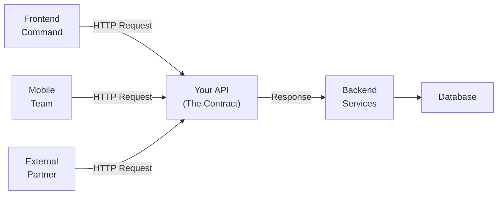
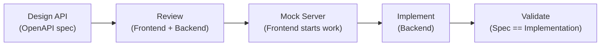

# Level 0: Introduction to API Design

## Introduction: API as a Contract Between Teams

Imagine you are building a house. The architect draws a plan — and everyone works from it: builders, electricians, plumbers. If the plan is clear — everyone understands each other. If the plan is vague — everyone does what they think is right, and the door ends up opening into a wall.

An API is exactly that architectural plan between teams. Frontend, mobile, third-party partners — they all build their "structures" on top of your API. When an API is well-designed, developers work from the plan. When it is poorly designed — "interpretations", bugs, and months of technical debt begin.

The key takeaway: **an API is a product for developers**. Not a technical detail, not an internal implementation, but an interface that real people will use. And like any product, it has UX.



---

## 1. Why Design an API in Advance

### The Cost of Changes Grows Over Time

Changing internal code is easy: find it, change it, deploy it. Changing a public API is painful: it already has clients. Renaming a field `user_id` → `userId` means breaking the mobile app for a million users.

```
Cost of change:
Before release:  [$]     — just edit the spec
After release:   [$$$]   — need deprecation + versioning
A year later:    [$$$$$] — migration guide + two versions in parallel
```

📌 This is exactly why the **API-first approach** exists: first design the API (describe it in OpenAPI), get agreement from all consumer teams — and only then write code.

### API-first: Design Before Code



While the backend implements the API, the frontend can work with a mock server based on the OpenAPI specification. Both teams work in parallel. Without API-first — the frontend waits for the backend.

---

## 2. Principles of a Good API

### Consistency

One style everywhere. If field naming in `/users` is camelCase, then `/orders` should also be camelCase. If errors return `{ "message": "..." }`, then everywhere — not `{ "error": "..." }` on some endpoints and `{ "msg": "..." }` on others.

```javascript
// ❌ Inconsistent: different endpoints, different styles
GET /users → { "userId": 1, "user_name": "John" }
GET /orders → { "order_id": 1, "orderStatus": "pending" }

// ✅ Consistent: one style everywhere
GET /users → { "id": 1, "name": "John" }
GET /orders → { "id": 1, "status": "pending" }
```

### Predictability

A developer should be able to "guess" the API by knowing its patterns. If `GET /users` returns a list of users, then `GET /users/{id}` returns a specific user. If `GET /users/{id}/posts` returns a user's posts, then `GET /posts/{id}/comments` returns comments on a post.

```
Pattern:
GET /resources              — list
GET /resources/{id}         — single item
POST /resources             — create
PATCH /resources/{id}       — update
DELETE /resources/{id}      — delete
GET /resources/{id}/related — related resource
```

💡 When a developer knows the pattern, they can write code even before reading the documentation. This saves hours.

### Simplicity and the Principle of Least Surprise

❌ Bad: different response formats depending on a flag in the request.
✅ Good: one predictable response format always.

```javascript
// ❌ Surprise: response format depends on a parameter
GET /users?format=v1 → { "user": { ... } }
GET /users?format=v2 → { "data": { "user": { ... } } }
GET /users           → [{ ... }]  // yet another format!

// ✅ Always one format
GET /users           → { "users": [...], "total": 42 }
GET /users/{id}      → { "id": 1, "name": "John", ... }
```

---

## 3. Richardson Maturity Model

In 2008, Leonard Richardson proposed a four-level REST API maturity model. It is an evaluation tool, not a strict standard.


### Level 0: XML Swamp / RPC over HTTP

HTTP is just a transport. One endpoint for everything, the action is described in the body.

```http
POST /api HTTP/1.1

{ "action": "getUser", "id": 5 }
```

This is not REST. This is RPC (Remote Procedure Call) with HTTP as a pipe. SOAP services worked exactly this way.

**Problems:** no caching, no idempotency, unreadable, cannot use HTTP infrastructure (CDNs, proxies).

### Level 1: Resources

Separate URLs for different resources appear. But methods are still not used correctly.

```http
POST /users      → { "action": "getAll" }
POST /users/5    → { "action": "update", "name": "John" }
POST /users/5    → { "action": "delete" }
```

Better already: at least different resources live at different URLs. But HTTP methods are ignored.

### Level 2: HTTP Verbs ✅ (de facto standard)

Correct methods + correct status codes. This is exactly what people mean when they say "REST API".

```http
GET    /users         → 200 + list
POST   /users         → 201 + created object + Location: /users/42
GET    /users/5       → 200 + object / 404 if not found
PATCH  /users/5       → 200 + updated object
DELETE /users/5       → 204 No Content
```

Why Level 2 is the gold standard:
- GET requests are **cached** by browsers and CDNs
- GET and DELETE are **idempotent**: can be repeated without side effects
- Status codes are a **universal language**: 404 is understood by any client
- HTTP infrastructure (nginx, CDN, WAF) understands methods

### Level 3: HATEOAS

Responses contain **links to available actions**. The client "discovers" the API by following links, like on the web.

```json
GET /orders/5

{
  "id": 5,
  "status": "pending",
  "total": 1500,
  "_links": {
    "self": { "href": "/orders/5" },
    "cancel": { "href": "/orders/5/cancel", "method": "POST" },
    "pay": { "href": "/orders/5/payment", "method": "POST" },
    "customer": { "href": "/users/42" }
  }
}
```

The client sees that the order can be cancelled or paid for — directly in the response. If the order is already paid, the `pay` link disappears.

**Reality:** Level 3 is beautiful in theory but rarely needed in practice for internal APIs. It complicates client code. Most companies (including GitHub, Stripe) operate at Level 2.

---

## 4. Examples of Good Public APIs

### GitHub REST API

One of the best examples of a consistent Level 2 REST API:

```http
GET  /repos/{owner}/{repo}
GET  /repos/{owner}/{repo}/issues
POST /repos/{owner}/{repo}/issues     → 201 Created
GET  /repos/{owner}/{repo}/issues/42
PATCH /repos/{owner}/{repo}/issues/42
```

What makes it good:
- Consistent snake_case in all responses
- Predictable URL hierarchy (owner → repo → resource)
- Precise status codes: 201 on creation, 304 on cache, 422 on validation
- Rate limiting with `X-RateLimit-*` headers in every response
- Official documentation with interactive examples
- SDKs (Octokit) for popular languages

### Stripe API

Stripe is the gold standard for payment APIs. Key decisions:

```http
POST /v1/charges         → create a payment
GET  /v1/charges/{id}    → get a payment
POST /v1/charges/{id}/refund → refund
```

What sets Stripe apart:
- **Idempotency via Idempotency-Key**: a repeated request does not create a duplicate
- **Expand pattern**: `?expand[]=customer` — load a related object in one request
- **Versioning via date** in a header: `Stripe-Version: 2023-10-16`
- Detailed errors with code, type, and a link to documentation

---

## 5. Typical Signs of a Bad API

### "Action Tunneling" via POST

```http
// ❌ All CRUD through a single endpoint with action in the query string
POST /api/users?action=create
POST /api/users?action=list
POST /api/users?action=delete&id=5
```

This cancels caching, idempotency, and HTTP infrastructure. The client cannot tell if a request is safe.

### Inconsistent Naming

```json
// ❌ Three styles in one response
{
  "userId": 5,
  "user_email": "john@example.com",
  "UserName": "John",
  "createdAt_timestamp": 1712345678
}
```

### HTTP 200 on Error

```json
// ❌ Server responds 200, but there is an error inside
HTTP/1.1 200 OK
{ "success": false, "error": "User not found" }
```

This breaks monitoring (Datadog sees 200 — all is well), CDNs cache the "successful" error response, the client must parse the body on every request.

---

## ⚠️ Common Beginner Mistakes

### 🐛 1. Verbs in URLs

```http
❌ POST /createUser
❌ GET  /getUserById?id=5
❌ POST /deleteOrder
```

**Why it's a problem:** A URL is a resource name (a noun), the method is the action (a verb). A verb in the URL is like writing "book to read" instead of "to read a book". It violates REST and duplicates the HTTP method.

```http
✅ POST   /users
✅ GET    /users/5
✅ DELETE /orders/{id}
```

### 🐛 2. Returning 200 on Error

```javascript
// ❌ Always 200, status in the body
app.get('/users/:id', (req, res) => {
  const user = db.find(req.params.id)
  res.status(200).json({
    success: user ? true : false,
    data: user || null,
    error: user ? null : 'Not found'
  })
})
```

**Why it's a problem:** monitoring won't see errors, CDNs cache the error response, the client must always parse the body — you cannot use status codes.

```javascript
// ✅ Correct status codes
app.get('/users/:id', (req, res) => {
  const user = db.find(req.params.id)
  if (!user) return res.status(404).json({ message: 'User not found' })
  res.json(user)
})
```

### 🐛 3. Different Error Formats

```javascript
// ❌ Each endpoint invents its own format
GET /users/999 → { "error": "not found" }
POST /users    → { "status": "error", "msg": "invalid email" }
DELETE /users/1 → { "ok": false, "reason": "forbidden" }
```

**Why it's a problem:** the client is forced to write different error-handling code for each endpoint. It is impossible to create a universal error handler.

```javascript
// ✅ Unified error format (RFC 7807)
{
  "type": "https://api.example.com/errors/not-found",
  "title": "Resource not found",
  "status": 404,
  "detail": "User with id=999 does not exist"
}
```

---

## Summary

- ✅ An API is a contract. Think of it as a product for developers
- ✅ A good API: predictable, consistent, simple
- ✅ REST Level 2 — de facto standard: resources + HTTP methods + status codes
- ✅ Richardson Maturity Model: 0 → 3, but Level 2 is enough for most tasks
- ✅ API-first: spec first, code later — saves time and frustration
- 📌 GitHub API and Stripe — good examples to emulate
- 📌 Verbs in URLs, HTTP 200 on errors, different error formats — the three top anti-patterns
