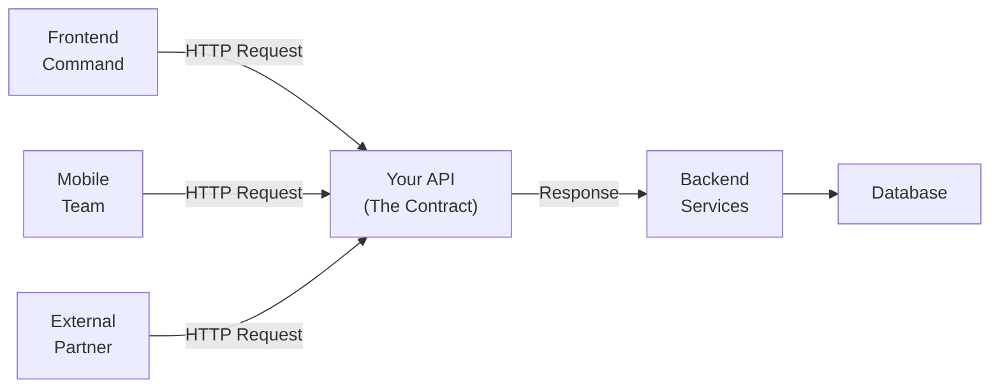
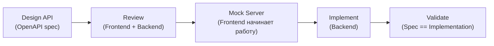
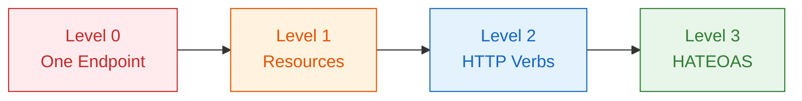

# Уровень 0: Введение в проектирование API

## Введение: API как контракт между командами

Представьте, что вы строите дом. Архитектор рисует план — и по этому плану работают все: строители, электрики, сантехники. Если план написан чётко — все понимают друг друга. Если план расплывчатый — каждый делает как понял, и в итоге дверь открывается в стену.

API — это тот самый архитектурный план между командами. Frontend, mobile, сторонние партнёры — все они строят своё "здание" поверх вашего API. Когда API хорошо спроектирован, разработчики работают по плану. Когда плохо — начинаются "интерпретации", баги и месяцы технического долга.

Ключевая мысль: **API — это продукт для разработчиков**. Не техническая деталь, не внутренняя реализация, а интерфейс, которым будут пользоваться живые люди. И как у любого продукта, у него есть UX.



---

## 1. Зачем проектировать API заранее

### Стоимость изменений растёт со временем

Изменить внутренний код — легко: нашли, поменяли, задеплоили. Изменить публичный API — больно: у него уже есть клиенты. Переименовать поле `user_id` → `userId` значит сломать мобильное приложение у миллиона пользователей.

```
Стоимость изменения:
До релиза:    [$]     — просто правим спеку
После релиза: [$$$]   — нужен deprecated + версионирование
Год спустя:   [$$$$$] — migration guide + две версии параллельно
```

📌 Именно поэтому существует **API-first подход**: сначала проектируем API (описываем в OpenAPI), получаем согласие от всех команд-потребителей — и только потом пишем код.

### API-first: проектирование до кода



Пока backend реализует API, frontend может работать с mock-сервером на основе OpenAPI-спецификации. Обе команды идут параллельно. Без API-first — frontend ждёт backend.

---

## 2. Принципы хорошего API

### Консистентность

Один стиль везде. Если именование полей в `/users` — camelCase, то и в `/orders` должен быть camelCase. Если ошибки возвращают `{ "message": "..." }`, то везде, а не `{ "error": "..." }` на одних endpoint-ах и `{ "msg": "..." }` на других.

```javascript
// ❌ Неконсистентно: разные endpoint-ы, разный стиль
GET /users → { "userId": 1, "user_name": "John" }
GET /orders → { "order_id": 1, "orderStatus": "pending" }

// ✅ Консистентно: единый стиль везде
GET /users → { "id": 1, "name": "John" }
GET /orders → { "id": 1, "status": "pending" }
```

### Предсказуемость

Разработчик должен уметь "угадывать" API, зная его паттерны. Если `GET /users` возвращает список пользователей, то `GET /users/{id}` — конкретного пользователя. Если `GET /users/{id}/posts` — посты пользователя, то `GET /posts/{id}/comments` — комментарии к посту.

```
Паттерн:
GET /resources              — список
GET /resources/{id}         — один элемент
POST /resources             — создание
PATCH /resources/{id}       — обновление
DELETE /resources/{id}      — удаление
GET /resources/{id}/related — связанный ресурс
```

💡 Когда разработчик знает паттерн, он может писать код ещё до того, как прочитал документацию. Это экономит часы.

### Простота и принцип минимального удивления

❌ Плохо: разный формат ответа в зависимости от флага в запросе.
✅ Хорошо: один предсказуемый формат ответа всегда.

```javascript
// ❌ Сюрприз: формат ответа зависит от параметра
GET /users?format=v1 → { "user": { ... } }
GET /users?format=v2 → { "data": { "user": { ... } } }
GET /users           → [{ ... }]  // ещё один формат!

// ✅ Всегда один формат
GET /users           → { "users": [...], "total": 42 }
GET /users/{id}      → { "id": 1, "name": "John", ... }
```

---

## 3. Richardson Maturity Model

В 2008 году Леонард Ричардсон предложил модель зрелости REST API из четырёх уровней. Это инструмент оценки, а не строгий стандарт.



### Level 0: Болото XML / RPC over HTTP

HTTP — просто транспорт. Один endpoint для всего, действие описывается в теле.

```http
POST /api HTTP/1.1

{ "action": "getUser", "id": 5 }
```

Это не REST. Это RPC (Remote Procedure Call) с HTTP в качестве трубы. SOAP-сервисы работали именно так.

**Проблемы:** нет кэширования, нет идемпотентности, нечитаемо, нельзя использовать HTTP-инфраструктуру (CDN, прокси).

### Level 1: Ресурсы

Появляются отдельные URL для разных ресурсов. Но методы всё ещё не используются правильно.

```http
POST /users      → { "action": "getAll" }
POST /users/5    → { "action": "update", "name": "John" }
POST /users/5    → { "action": "delete" }
```

Уже лучше: хотя бы разные ресурсы живут по разным URL. Но HTTP-методы игнорируются.

### Level 2: HTTP-глаголы ✅ (де-факто стандарт)

Правильные методы + правильные статус-коды. Именно этот уровень имеют в виду, когда говорят "REST API".

```http
GET    /users         → 200 + список
POST   /users         → 201 + созданный объект + Location: /users/42
GET    /users/5       → 200 + объект / 404 если нет
PATCH  /users/5       → 200 + обновлённый объект
DELETE /users/5       → 204 No Content
```

Почему Level 2 — золотой стандарт:
- GET-запросы **кэшируются** браузером и CDN
- GET и DELETE — **идемпотентны**: можно повторять без побочных эффектов
- Статус-коды — **стандартный язык**: 404 понимает любой клиент
- HTTP-инфраструктура (nginx, CDN, WAF) понимает методы

### Level 3: HATEOAS

Ответы содержат **ссылки на доступные действия**. Клиент "открывает" API, следуя ссылкам, как в вебе.

```json
GET /orders/5

{
  "id": 5,
  "status": "pending",
  "total": 1500,
  "_links": {
    "self": { "href": "/orders/5" },
    "cancel": { "href": "/orders/5/cancel", "method": "POST" },
    "pay": { "href": "/orders/5/payment", "method": "POST" },
    "customer": { "href": "/users/42" }
  }
}
```

Клиент видит, что заказ можно отменить или оплатить — прямо в ответе. Если заказ уже оплачен, ссылка `pay` исчезнет.

**Реальность:** Level 3 красив в теории, но редко нужен на практике для внутренних API. Усложняет клиентский код. Большинство компаний (включая GitHub, Stripe) работают на Level 2.

---

## 4. Примеры хороших публичных API

### GitHub REST API

Один из лучших примеров консистентного REST API Level 2:

```http
GET  /repos/{owner}/{repo}
GET  /repos/{owner}/{repo}/issues
POST /repos/{owner}/{repo}/issues     → 201 Created
GET  /repos/{owner}/{repo}/issues/42
PATCH /repos/{owner}/{repo}/issues/42
```

Что делает его хорошим:
- Единый snake_case во всех ответах
- Предсказуемая иерархия URL (owner → repo → resource)
- Точные статус-коды: 201 при создании, 304 при кэше, 422 при валидации
- Rate limiting с заголовками `X-RateLimit-*` в каждом ответе
- Официальная документация с интерактивными примерами
- SDK (Octokit) для популярных языков

### Stripe API

Stripe — эталон платёжных API. Ключевые решения:

```http
POST /v1/charges         → создание платежа
GET  /v1/charges/{id}    → получение платежа
POST /v1/charges/{id}/refund → возврат
```

Что выделяет Stripe:
- **Идемпотентность через Idempotency-Key**: повторный запрос не создаёт дубль
- **Expand pattern**: `?expand[]=customer` — загрузить связанный объект в одном запросе
- **Версионирование через дату** в заголовке: `Stripe-Version: 2023-10-16`
- Детальные ошибки с кодом, типом и ссылкой на документацию

---

## 5. Типичные признаки плохого API

### "Action tunneling" через POST

```http
// ❌ Весь CRUD через один endpoint с action в теле
POST /api/users?action=create
POST /api/users?action=list
POST /api/users?action=delete&id=5
```

Это отменяет кэширование, идемпотентность, HTTP-инфраструктуру. Клиент не знает, безопасен ли запрос.

### Непоследовательное именование

```json
// ❌ Три стиля в одном ответе
{
  "userId": 5,
  "user_email": "john@example.com",
  "UserName": "John",
  "createdAt_timestamp": 1712345678
}
```

### HTTP 200 при ошибке

```json
// ❌ Сервер отвечает 200, но внутри ошибка
HTTP/1.1 200 OK
{ "success": false, "error": "User not found" }
```

Это сломает мониторинг (Datadog видит 200 — всё окей), CDN кэширует "успешный" ответ с ошибкой, клиент должен парсить тело при каждом запросе.

---

## ⚠️ Частые ошибки новичков

### 🐛 1. Глаголы в URL

```http
❌ POST /createUser
❌ GET  /getUserById?id=5
❌ POST /deleteOrder
```

**Почему проблема:** URL — это имя ресурса (существительное), метод — действие (глагол). Глагол в URL — как написать "книга читать" вместо "читать книгу". Нарушает REST, дублирует HTTP-метод.

```http
✅ POST   /users
✅ GET    /users/5
✅ DELETE /orders/{id}
```

### 🐛 2. Возвращать 200 при ошибке

```javascript
// ❌ Всегда 200, статус в теле
app.get('/users/:id', (req, res) => {
  const user = db.find(req.params.id)
  res.status(200).json({
    success: user ? true : false,
    data: user || null,
    error: user ? null : 'Not found'
  })
})
```

**Почему проблема:** мониторинг не увидит ошибок, CDN кэширует ошибочный ответ, клиент обязан всегда парсить тело — нельзя использовать статус-код.

```javascript
// ✅ Правильные статус-коды
app.get('/users/:id', (req, res) => {
  const user = db.find(req.params.id)
  if (!user) return res.status(404).json({ message: 'User not found' })
  res.json(user)
})
```

### 🐛 3. Разные форматы ошибок

```javascript
// ❌ Каждый endpoint изобретает свой формат
GET /users/999 → { "error": "not found" }
POST /users    → { "status": "error", "msg": "invalid email" }
DELETE /users/1 → { "ok": false, "reason": "forbidden" }
```

**Почему проблема:** клиент вынужден писать разный код обработки для каждого endpoint. Невозможно создать универсальный error-handler.

```javascript
// ✅ Единый формат ошибки (RFC 7807)
{
  "type": "https://api.example.com/errors/not-found",
  "title": "Resource not found",
  "status": 404,
  "detail": "User with id=999 does not exist"
}
```

---

## Итоги

- ✅ API — это контракт. Думайте о нём как о продукте для разработчиков
- ✅ Хороший API: предсказуем, консистентен, прост
- ✅ REST Level 2 — де-факто стандарт: ресурсы + HTTP-методы + статус-коды
- ✅ Richardson Maturity Model: 0 → 3, но Level 2 достаточно для большинства задач
- ✅ API-first: сначала спека, потом код — экономит время и нервы
- 📌 GitHub API и Stripe — хорошие примеры для подражания
- 📌 Глаголы в URL, HTTP 200 при ошибках, разные форматы ошибок — три главных антипаттерна
