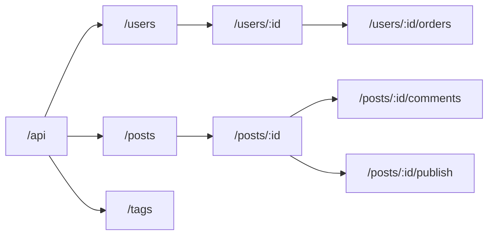
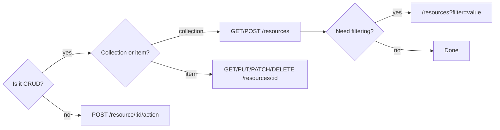

# REST — Resources and URL Design

## Resource as the Central Abstraction of REST

Imagine a library. Each book has an address on the shelf: hall → stack → shelf → slot. You don't tell the librarian "perform the action of getting": you give the **address** and ask them to bring, remove, or replace. REST works exactly the same way.

A **resource** is any named entity in your system: user, order, article, tag, image. A resource is described by a noun, and the HTTP method (GET, POST, PUT, DELETE) is the verb applied to it.

```
Resource address → /users/42
Action           → GET (read), DELETE (remove), PATCH (update)
```

📌 **Main rule:** The URL answers *"what?"*, the method answers *"what to do with it?"*

---

## URL Naming Rules

### Nouns, Not Verbs

The most common mistake is embedding the action into the URL:

```
❌ GET  /api/getUsers
❌ POST /api/createOrder
❌ GET  /api/fetchProductById?id=5

✅ GET  /api/users
✅ POST /api/orders
✅ GET  /api/products/5
```

When you have 30 endpoints, this turns into chaos: `/getUserById`, `/getUserByEmail`, `/getUsersByRole`, `/fetchActiveUsers`... Instead — one word `/users` and filters via query params.

### Plural for Collections

A collection is multiple objects of the same type, so name it in plural:

```
✅ /users       — collection of users
✅ /users/42    — a specific user

❌ /user        — unclear: one or a list?
```

### Lowercase and Hyphens

URLs are **case-insensitive** in theory, but `UserProfile` and `userprofile` will look different in logs and documentation. The convention — lowercase letters and hyphens for compound words:

```
❌ /blogPosts          (camelCase)
❌ /BlogPosts          (PascalCase)
❌ /blog_posts         (snake_case)

✅ /blog-posts         (kebab-case)
```

💡 **Analogy:** file names on disk are also conventionally hyphenated (`my-project.md`), not camelCase.

---

## Resource Hierarchy



When one resource **belongs to** another, show it through nesting:

```
/users/7/orders           → orders of user 7
/posts/3/comments         → comments on post 3
/posts/3/comments/15      → a specific comment
```

📌 **Nesting depth:** no more than 2–3 levels. Deeper — the URL becomes unreadable, and the resource is better made flat with a query param.

---

## Nesting vs Query Params

This is one of the most frequent questions when designing APIs. Here is the rule of choice:

| Situation | What to use | Example |
|---|---|---|
| Resource belongs to another resource | Nesting | `/users/7/orders` |
| Filtering a collection | Query params | `/orders?userId=7` |
| Search / sorting | Query params | `/products?q=phone&sort=price` |
| Pagination | Query params | `/posts?page=2&limit=20` |

```
# When nesting is the right choice:
GET /users/7/orders
# Meaning: "orders that belong to user 7"
# Without the user, this endpoint makes no sense

# When query params is the right choice:
GET /orders?userId=7
# Meaning: "all orders, filtered by userId"
# orders is an independent resource, userId is one of the filters
```

⚠️ Both options can be correct depending on the semantics of your system. The main thing is to be consistent.

---

## Collections vs Single Resources

```
GET /users          → array of all users
GET /users/42       → object of a single user
POST /users         → create new (ID assigned by server)
PUT /users/42       → replace entirely
PATCH /users/42     → partial update
DELETE /users/42    → delete
```

📌 Note: `POST` goes to the collection (`/users`), not to a specific resource. This is the standard: you are "adding to the collection".

---

## Anti-patterns

### 1. Actions in URLs

```
❌ GET  /users/42/getProfile
❌ POST /users/42/updateEmail
❌ GET  /users/42/deactivate
```

Why it's bad: no single pattern, the number of endpoints grows uncontrollably, HTTP methods lose meaning.

```
✅ GET   /users/42
✅ PATCH /users/42        { "email": "new@example.com" }
✅ POST  /users/42/deactivate   (if this is a complex operation)
```

### 2. Tunneling Through a Single Endpoint

```
❌ POST /api/rpc?method=getUsers
❌ POST /api/do?action=createOrder&userId=5
```

This is RPC-over-HTTP, not REST. Cacheability, idiomaticity, and readability are lost.

### 3. Numbers Instead of Resources

```
❌ /api/1/2/3
✅ /api/users/1/orders/2/items/3
```

---

## Exceptions: RPC-style for Actions

Sometimes an action cannot be expressed through standard CRUD operations:

- Publish a draft: `POST /posts/42/publish`
- Ban a user: `POST /users/7/ban`
- Confirm email: `POST /users/7/verify-email`
- Recalculate totals: `POST /orders/15/recalculate`

🔥 **Exception rule:** a verb in the URL is acceptable if it is a **single action**, not a CRUD operation, and if it **changes the resource state** in a non-trivial way.

```
✅ POST /posts/42/publish
  — Publishing may involve notifications, checks, status change.
  — PUT /posts/42 { "status": "published" } also works, but is less explicit.
```

---

## Final Decision Flowchart



---

## ⚠️ Common Beginner Mistakes

**❌ Mistake 1: Verb in URL**
```
GET /api/fetchUsers
```
Why it's a problem: the HTTP method GET already means "fetch". The word "fetch" is redundant and breaks consistency.
```
✅ GET /api/users
```

**❌ Mistake 2: Singular**
```
GET /api/user
```
Why it's a problem: unclear — is this a collection or a single object? The standard is plural for collections.
```
✅ GET /api/users
```

**❌ Mistake 3: camelCase or underscore**
```
GET /api/userProfiles
GET /api/user_profiles
```
Why it's a problem: a URL is not a variable. The web standard is kebab-case.
```
✅ GET /api/user-profiles
```

**❌ Mistake 4: Action via query param**
```
POST /api/users?action=ban&id=7
```
Why it's a problem: query params are for filtering, not for commands. Routing and documentation become confusing.
```
✅ POST /api/users/7/ban
```

**❌ Mistake 5: Too deep nesting**
```
GET /api/companies/1/departments/2/teams/3/members/4/tasks
```
Why it's a problem: hard to read, maintain, and cache. Better to make a flat resource with a filter.
```
✅ GET /api/tasks?memberId=4&teamId=3
```
