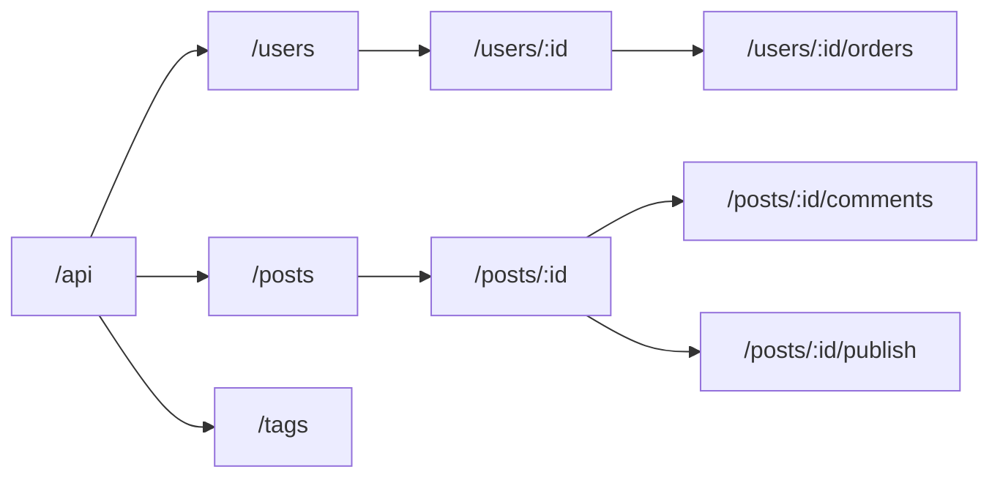
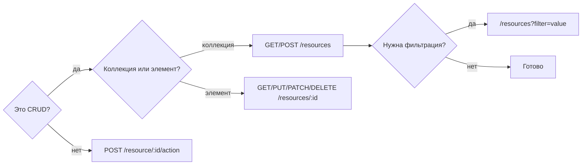

# REST — ресурсы и URL-дизайн

## Ресурс как центральная абстракция REST

Представьте библиотеку. У каждой книги есть адрес на полке: зал → стеллаж → полка → место. Вы не говорите библиотекарю «сделай действие получить»: вы называете **адрес** и просите принести, убрать или заменить. REST устроен точно так же.

**Ресурс** — это любая именованная сущность в вашей системе: пользователь, заказ, статья, тег, изображение. Ресурс описывается существительным, а HTTP-метод (GET, POST, PUT, DELETE) — это глагол, который к нему применяют.

```
Адрес ресурса → /users/42
Действие      → GET (прочитать), DELETE (удалить), PATCH (обновить)
```

📌 **Главное правило:** URL отвечает на вопрос *«что?»*, метод — на вопрос *«что с этим сделать?»*

---

## Правила именования URL

### Существительные, не глаголы

Самая распространённая ошибка — зашивать действие в URL:

```
❌ GET  /api/getUsers
❌ POST /api/createOrder
❌ GET  /api/fetchProductById?id=5

✅ GET  /api/users
✅ POST /api/orders
✅ GET  /api/products/5
```

Когда у вас 30 endpoints, это превращается в хаос: `/getUserById`, `/getUserByEmail`, `/getUsersByRole`, `/fetchActiveUsers`... Против этого — одно слово `/users` и фильтры через query params.

### Множественное число для коллекций

Коллекция — это несколько объектов одного типа, поэтому именуйте её во множественном числе:

```
✅ /users       — коллекция пользователей
✅ /users/42    — конкретный пользователь

❌ /user        — непонятно: один или список?
```

### Lowercase и дефисы

URL **нечувствительны к регистру** в теории, но `UserProfile` и `userprofile` будут неодинаково выглядеть в логах и документации. Договорённость — строчные буквы и дефисы для составных слов:

```
❌ /blogPosts          (camelCase)
❌ /BlogPosts          (PascalCase)
❌ /blog_posts         (snake_case)

✅ /blog-posts         (kebab-case)
```

💡 **Аналогия:** имя файла на диске тоже принято писать через дефис (`my-project.md`), не через верблюжий горб.

---

## Иерархия ресурсов



Когда один ресурс **принадлежит** другому, покажите это вложенностью:

```
/users/7/orders           → заказы пользователя 7
/posts/3/comments         → комментарии поста 3
/posts/3/comments/15      → конкретный комментарий
```

📌 **Глубина вложенности:** не больше 2–3 уровней. Глубже — URL становится нечитаемым, а ресурс лучше сделать плоским с query param.

---

## Вложенность vs query params

Это один из самых частых вопросов при проектировании. Вот правило выбора:

| Ситуация | Что использовать | Пример |
|---|---|---|
| Ресурс принадлежит другому ресурсу | Вложенность | `/users/7/orders` |
| Фильтрация коллекции | Query params | `/orders?userId=7` |
| Поиск / сортировка | Query params | `/products?q=phone&sort=price` |
| Пагинация | Query params | `/posts?page=2&limit=20` |

```
# Когда вложенность — правильный выбор:
GET /users/7/orders
# Смысл: "заказы, которые принадлежат пользователю 7"
# Без пользователя этот endpoint не имеет смысла

# Когда query params — правильный выбор:
GET /orders?userId=7
# Смысл: "все заказы, отфильтрованные по userId"
# orders — самостоятельный ресурс, userId — один из фильтров
```

⚠️ Оба варианта могут быть правильными в зависимости от семантики вашей системы. Главное — быть последовательным.

---

## Коллекции vs отдельные ресурсы

```
GET /users          → массив всех пользователей
GET /users/42       → объект одного пользователя
POST /users         → создать нового (ID назначает сервер)
PUT /users/42       → заменить целиком
PATCH /users/42     → частичное обновление
DELETE /users/42    → удалить
```

📌 Обратите внимание: `POST` идёт на коллекцию (`/users`), а не на конкретный ресурс. Это стандарт: вы «добавляете в коллекцию».

---

## Anti-patterns

### 1. Действия в URL

```
❌ GET  /users/42/getProfile
❌ POST /users/42/updateEmail
❌ GET  /users/42/deactivate
```

Зачем плохо: нет единого паттерна, количество endpoints растёт бесконтрольно, HTTP-методы теряют смысл.

```
✅ GET   /users/42
✅ PATCH /users/42        { "email": "new@example.com" }
✅ POST  /users/42/deactivate   (если это сложная операция)
```

### 2. Тоннелирование через один endpoint

```
❌ POST /api/rpc?method=getUsers
❌ POST /api/do?action=createOrder&userId=5
```

Это RPC-over-HTTP, не REST. Теряется кэшируемость, идиоматичность, читаемость.

### 3. Числа вместо ресурсов

```
❌ /api/1/2/3
✅ /api/users/1/orders/2/items/3
```

---

## Исключения: RPC-style для действий

Иногда действие нельзя выразить через стандартные CRUD-операции:

- Опубликовать черновик: `POST /posts/42/publish`
- Заблокировать пользователя: `POST /users/7/ban`
- Подтвердить email: `POST /users/7/verify-email`
- Пересчитать итоги: `POST /orders/15/recalculate`

🔥 **Правило исключения:** глагол в URL допустим, если это **одиночное действие**, а не CRUD-операция, и если оно **изменяет состояние ресурса** нетривиальным образом.

```
✅ POST /posts/42/publish
  — Публикация может включать уведомления, проверки, смену статуса.
  — PUT /posts/42 { "status": "published" } тоже работает, но менее явно.
```

---

## Итоговая схема принятия решений



---

## ⚠️ Частые ошибки новичков

**❌ Ошибка 1: Глагол в URL**
```
GET /api/fetchUsers
```
Почему проблема: HTTP-метод GET уже означает «получить». Слово fetch — избыточно и нарушает единообразие.
```
✅ GET /api/users
```

**❌ Ошибка 2: Единственное число**
```
GET /api/user
```
Почему проблема: непонятно — это коллекция или один объект? Стандарт — множественное число для коллекций.
```
✅ GET /api/users
```

**❌ Ошибка 3: camelCase или underscore**
```
GET /api/userProfiles
GET /api/user_profiles
```
Почему проблема: URL — это не переменная. Стандарт web — kebab-case.
```
✅ GET /api/user-profiles
```

**❌ Ошибка 4: Действие через query param**
```
POST /api/users?action=ban&id=7
```
Почему проблема: query params — для фильтрации, не для команд. Маршрутизация и документация становятся запутанными.
```
✅ POST /api/users/7/ban
```

**❌ Ошибка 5: Слишком глубокая вложенность**
```
GET /api/companies/1/departments/2/teams/3/members/4/tasks
```
Почему проблема: сложно читать, поддерживать и кэшировать. Лучше сделать плоский ресурс с фильтром.
```
✅ GET /api/tasks?memberId=4&teamId=3
```
