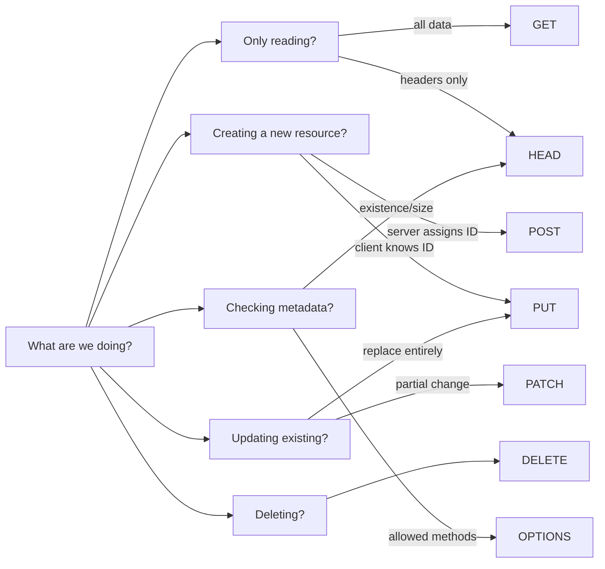

# HTTP Methods and Idempotency

## Why Methods Matter, Not Just URLs?

Imagine all letters in the world are written on identical envelopes without "Urgent", "Registered", or "Notice" markings. Postal workers don't know how to handle them. HTTP methods are exactly those markings: they tell the entire chain (browser, CDN, proxy, server) what to do with a request.

When you use GET to retrieve data, the browser understands: "can be cached". When DELETE — "do not cache, this is a mutation". Correct methods are not just a developer convention — they are a contract with HTTP infrastructure.

---

## GET — Get a Resource

The most used method. Reads data, does not change it.

```bash
# List of all tasks
curl -X GET https://api.example.com/tasks

# A specific task
curl -X GET https://api.example.com/tasks/42

# Filtering via query params
curl -X GET "https://api.example.com/tasks?status=active&priority=high"
```

📌 **Important:** GET must not have a request body. All parameters go in the URL.

---

## POST — Create a Resource

Sends data to create a new resource. The ID is assigned by the server — which is why the request goes to the collection.

```bash
curl -X POST https://api.example.com/tasks \
  -H "Content-Type: application/json" \
  -d '{"title": "Write report", "priority": "high"}'

# Response: 201 Created
# { "id": 42, "title": "Write report", ... }
```

⚠️ POST is **not idempotent**: two identical requests will create two tasks.

---

## PUT — Replace a Resource Entirely

Analogy: "re-stick a label". You bring a new label and replace the old one entirely. Whatever you don't include is erased.

```bash
# Complete task replacement
curl -X PUT https://api.example.com/tasks/42 \
  -H "Content-Type: application/json" \
  -d '{
    "title": "Write report — URGENT",
    "priority": "urgent",
    "status": "active",
    "dueDate": "2024-11-20"
  }'
```

```
❌ PUT danger:
If you send only { "title": "New title" },
the priority, status, and dueDate fields will be removed or set to null!
```

✅ PUT is idempotent: a repeated request with the same data — the same result.

---

## PATCH — Partially Update a Resource

Analogy: "write on the label". You add or fix only what's needed. The rest remains untouched.

```bash
# Change only the task status
curl -X PATCH https://api.example.com/tasks/42 \
  -H "Content-Type: application/json" \
  -d '{"status": "completed"}'

# The task will be updated: title, priority, dueDate remain the same
```

💡 **When PUT, and when PATCH?**

| Situation | Method |
|---|---|
| Edit form, the user fills in all fields | PUT |
| User changed one field (e.g., email) | PATCH |
| Client generates its own ID and wants upsert | PUT |
| Kanban board: dragged a task → status changed | PATCH |

---

## DELETE — Delete a Resource

```bash
curl -X DELETE https://api.example.com/tasks/42

# Response: 204 No Content (empty body)
```

✅ DELETE is idempotent: the first call removes the resource, all subsequent ones return 404 or 204 — but do not create a new state.

---

## HEAD — Metadata Without Body

HEAD is a GET that returns only headers. The response body is empty. Used for:

- Checking resource existence
- Getting file size before downloading
- Health checks without transferring unnecessary data

```bash
curl -I https://api.example.com/files/report.pdf

# HTTP/1.1 200 OK
# Content-Length: 1048576
# Content-Type: application/pdf
# Last-Modified: Mon, 15 Nov 2024 10:30:00 GMT
```

💡 Browsers use HEAD to determine whether a resource has changed since the last cache (`If-Modified-Since`).

---

## OPTIONS — Allowed Methods and CORS

OPTIONS answers the question: "what can be done with this endpoint?"

In modern development, OPTIONS is encountered most often in CORS preflight. When the browser is about to send a cross-origin POST with custom headers, it first "asks for permission":

```
OPTIONS /api/tasks HTTP/1.1
Origin: https://myapp.com
Access-Control-Request-Method: POST
Access-Control-Request-Headers: Content-Type, Authorization

← HTTP/1.1 204 No Content
← Access-Control-Allow-Origin: https://myapp.com
← Access-Control-Allow-Methods: GET, POST, PUT, PATCH, DELETE
← Access-Control-Allow-Headers: Content-Type, Authorization
```

📌 The frontend developer does not need to send OPTIONS manually — the browser does it automatically. But the server must handle this method correctly.

---

## Safety and Idempotency: Summary Table

```
Method   | Safe       | Idempotent
---------|------------|---------------
GET      |     ✅     |      ✅
HEAD     |     ✅     |      ✅
OPTIONS  |     ✅     |      ✅
DELETE   |     ❌     |      ✅
PUT      |     ❌     |      ✅
POST     |     ❌     |      ❌
PATCH    |     ❌     |      ❌ *
```

*PATCH can theoretically be idempotent if implemented via JSON Patch with a replace operation, but in the general case it is considered not idempotent.

**Safe** = does not change state. Can be called any number of times without consequences.

**Idempotent** = a repeated call with the same data does not change the result. Important for retry logic: if the network dropped, the client can safely repeat PUT or DELETE.

---

## Why POST Is Not Idempotent — And Why It Matters

Imagine: a user clicked "Place order", the network hung, the browser resent the request. If this is POST — two orders will be created. This is exactly why:

- Payment forms protect against double submission by disabling the button
- APIs use an idempotency key: the client adds a unique header `Idempotency-Key: uuid`, the server stores the result and returns it on a repeated request

```bash
curl -X POST https://api.example.com/payments \
  -H "Idempotency-Key: 550e8400-e29b-41d4-a716-446655440000" \
  -d '{"amount": 5000, "currency": "RUB"}'
```

---

## Decision Tree: Which Method to Choose?



---

## ⚠️ Common Beginner Mistakes

**❌ Mistake 1: GET with a request body**

```bash
# Don't do this:
GET /api/tasks
Content-Type: application/json
{ "filter": { "status": "active" } }
```

Why it's a problem: GET must not have a body. Some servers and proxies ignore the body of GET requests. Filters go in query params.

```bash
✅ GET /api/tasks?status=active
```

---

**❌ Mistake 2: POST for retrieving data**

```bash
# Sometimes done out of laziness or "complex filters":
POST /api/tasks/search
{ "status": "active", "priority": "high", "assignee": 42 }
```

Why it's a problem: POST is not cached, not idempotent, violates semantics. Browsers and CDNs will not be able to optimize these requests.

```bash
✅ GET /api/tasks?status=active&priority=high&assignee=42
```

Exception: if there are truly too many filters to fit in a URL — POST /search is used as a conscious compromise, with explicit documentation.

---

**❌ Mistake 3: DELETE with a body**

```bash
# Don't do this:
DELETE /api/tasks
{ "ids": [1, 2, 3] }
```

Why it's a problem: DELETE is intended for a single resource. The body in DELETE is ignored by many clients.

```bash
✅ DELETE /api/tasks/1
✅ DELETE /api/tasks/2
# Or a special endpoint for bulk deletion:
✅ POST /api/tasks/bulk-delete
{ "ids": [1, 2, 3] }
```

---

**❌ Mistake 4: PUT instead of PATCH for minor updates**

```js
// User changed email — frontend sends:
PUT /api/users/42
{ "email": "new@example.com" }  // only one field!
```

Why it's a problem: the server interprets PUT as "replace everything". The name, role, avatar fields will be removed or set to null.

```js
✅ PATCH /api/users/42
{ "email": "new@example.com" }
```

---

**❌ Mistake 5: Ignoring idempotency in retry logic**

```js
// Network dropped after sending POST /payments
// Client retries... and creates a second payment!
```

Why it's a problem: POST is not idempotent, a repeated request is a new action.

```js
✅ Add Idempotency-Key for critical POST requests
✅ Or use PUT with a client UUID instead of POST
```
