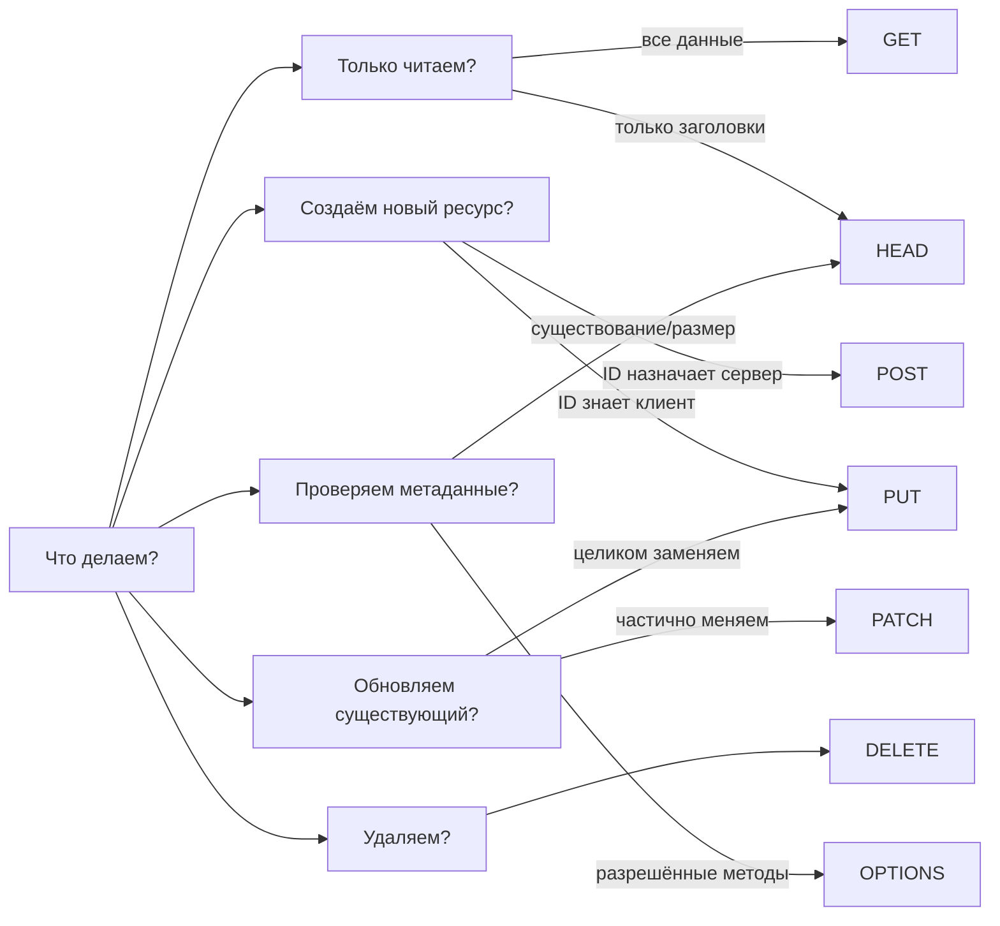

# HTTP-методы и идемпотентность

## Почему методы важны, а не только URL?

Представьте, что все письма в мире пишутся на одинаковых конвертах без пометки «Срочно», «Заказное», «Уведомление». Поштальоны не знают, как их обрабатывать. HTTP-методы — это именно такие пометки: они сообщают всей цепочке (браузер, CDN, прокси, сервер), что нужно сделать с запросом.

Когда вы используете GET для получения данных, браузер понимает: «можно кэшировать». Когда DELETE — «не кэшировать, это мутация». Правильные методы — это не просто соглашение разработчиков, это контракт с HTTP-инфраструктурой.

---

## GET — получить ресурс

Самый используемый метод. Читает данные, не изменяет их.

```bash
# Список всех задач
curl -X GET https://api.example.com/tasks

# Конкретная задача
curl -X GET https://api.example.com/tasks/42

# Фильтрация через query params
curl -X GET "https://api.example.com/tasks?status=active&priority=high"
```

📌 **Важно:** GET не должен иметь тела запроса. Все параметры — в URL.

---

## POST — создать ресурс

Отправляет данные для создания нового ресурса. ID назначает сервер — поэтому запрос идёт на коллекцию.

```bash
curl -X POST https://api.example.com/tasks \
  -H "Content-Type: application/json" \
  -d '{"title": "Написать отчёт", "priority": "high"}'

# Ответ: 201 Created
# { "id": 42, "title": "Написать отчёт", ... }
```

⚠️ POST **не идемпотентен**: два одинаковых запроса создадут две задачи.

---

## PUT — заменить ресурс целиком

Аналогия: «переклеить наклейку». Вы приносите новую наклейку и заменяете старую полностью. Что не указали — то стёрто.

```bash
# Полная замена задачи
curl -X PUT https://api.example.com/tasks/42 \
  -H "Content-Type: application/json" \
  -d '{
    "title": "Написать отчёт — СРОЧНО",
    "priority": "urgent",
    "status": "active",
    "dueDate": "2024-11-20"
  }'
```

```
❌ Опасность PUT:
Если вы отправите только { "title": "Новый заголовок" },
поля priority, status, dueDate будут удалены или сброшены в null!
```

✅ PUT идемпотентен: повторный запрос с теми же данными — тот же результат.

---

## PATCH — частично обновить ресурс

Аналогия: «дописать на наклейке». Вы добавляете или исправляете только то, что нужно. Остальное остаётся нетронутым.

```bash
# Изменить только статус задачи
curl -X PATCH https://api.example.com/tasks/42 \
  -H "Content-Type: application/json" \
  -d '{"status": "completed"}'

# Задача обновится: title, priority, dueDate останутся прежними
```

💡 **Когда PUT, а когда PATCH?**

| Ситуация | Метод |
|---|---|
| Форма редактирования, пользователь заполнил все поля | PUT |
| Пользователь изменил одно поле (например, email) | PATCH |
| Клиент сам генерирует ID и хочет upsert | PUT |
| Канбан-доска: перетащил задачу → сменился статус | PATCH |

---

## DELETE — удалить ресурс

```bash
curl -X DELETE https://api.example.com/tasks/42

# Ответ: 204 No Content (тело пустое)
```

✅ DELETE идемпотентен: первый вызов удаляет ресурс, все последующие возвращают 404 или 204 — но не создают новое состояние.

---

## HEAD — метаданные без тела

HEAD — это GET, который возвращает только заголовки. Тело ответа пустое. Используется для:

- Проверки существования ресурса
- Получения размера файла перед скачиванием
- Health checks без передачи лишних данных

```bash
curl -I https://api.example.com/files/report.pdf

# HTTP/1.1 200 OK
# Content-Length: 1048576
# Content-Type: application/pdf
# Last-Modified: Mon, 15 Nov 2024 10:30:00 GMT
```

💡 Браузеры используют HEAD, чтобы определить, изменился ли ресурс с момента последнего кэширования (`If-Modified-Since`).

---

## OPTIONS — разрешённые методы и CORS

OPTIONS отвечает на вопрос: «что можно делать с этим endpoint?»

В современной разработке OPTIONS встречается прежде всего в CORS preflight. Когда браузер собирается отправить cross-origin POST с кастомными заголовками, он сначала «спрашивает разрешения»:

```
OPTIONS /api/tasks HTTP/1.1
Origin: https://myapp.com
Access-Control-Request-Method: POST
Access-Control-Request-Headers: Content-Type, Authorization

← HTTP/1.1 204 No Content
← Access-Control-Allow-Origin: https://myapp.com
← Access-Control-Allow-Methods: GET, POST, PUT, PATCH, DELETE
← Access-Control-Allow-Headers: Content-Type, Authorization
```

📌 Разработчику фронтенда не нужно отправлять OPTIONS вручную — браузер делает это автоматически. Но сервер обязан обрабатывать этот метод корректно.

---

## Безопасность и идемпотентность: сводная таблица

```
Метод    | Безопасный | Идемпотентный
---------|------------|---------------
GET      |     ✅     |      ✅
HEAD     |     ✅     |      ✅
OPTIONS  |     ✅     |      ✅
DELETE   |     ❌     |      ✅
PUT      |     ❌     |      ✅
POST     |     ❌     |      ❌
PATCH    |     ❌     |      ❌ *
```

*PATCH теоретически может быть идемпотентным, если реализован через JSON Patch с операцией replace, но в общем случае считается не идемпотентным.

**Безопасный** = не меняет состояние. Можно вызывать сколько угодно раз без последствий.

**Идемпотентный** = повторный вызов с теми же данными не меняет результат. Важно для retry-логики: если сеть упала, клиент может смело повторить PUT или DELETE.

---

## Почему POST не идемпотентен — и это важно

Представьте: пользователь нажал «Оформить заказ», сеть подвисла, браузер отправил запрос повторно. Если это POST — создастся два заказа. Именно поэтому:

- Формы оплаты защищают от двойного сабмита через блокировку кнопки
- API используют idempotency key: клиент добавляет уникальный заголовок `Idempotency-Key: uuid`, сервер хранит результат и при повторном запросе возвращает его же

```bash
curl -X POST https://api.example.com/payments \
  -H "Idempotency-Key: 550e8400-e29b-41d4-a716-446655440000" \
  -d '{"amount": 5000, "currency": "RUB"}'
```

---

## Дерево решений: какой метод выбрать?



---

## ⚠️ Частые ошибки новичков

**❌ Ошибка 1: GET с телом запроса**

```bash
# Так делать нельзя:
GET /api/tasks
Content-Type: application/json
{ "filter": { "status": "active" } }
```

Почему проблема: GET не должен иметь тела. Некоторые серверы и прокси игнорируют тело GET-запросов. Фильтры — в query params.

```bash
✅ GET /api/tasks?status=active
```

---

**❌ Ошибка 2: POST для получения данных**

```bash
# Так иногда делают из-за лени или "сложных фильтров":
POST /api/tasks/search
{ "status": "active", "priority": "high", "assignee": 42 }
```

Почему проблема: POST не кэшируется, не идемпотентен, нарушает семантику. Браузеры и CDN не смогут оптимизировать эти запросы.

```bash
✅ GET /api/tasks?status=active&priority=high&assignee=42
```

Исключение: если фильтров действительно очень много и они не помещаются в URL — используют POST /search как осознанный компромисс, с явным документированием.

---

**❌ Ошибка 3: DELETE с телом**

```bash
# Не делайте так:
DELETE /api/tasks
{ "ids": [1, 2, 3] }
```

Почему проблема: DELETE предназначен для одного ресурса. Тело при DELETE игнорируется многими клиентами.

```bash
✅ DELETE /api/tasks/1
✅ DELETE /api/tasks/2
# Или специальный endpoint для массового удаления:
✅ POST /api/tasks/bulk-delete
{ "ids": [1, 2, 3] }
```

---

**❌ Ошибка 4: PUT вместо PATCH для мелких обновлений**

```js
// Пользователь изменил email — фронтенд отправляет:
PUT /api/users/42
{ "email": "new@example.com" }  // только одно поле!
```

Почему проблема: сервер воспринимает PUT как «замени всё». Поля name, role, avatar будут удалены или сброшены в null.

```js
✅ PATCH /api/users/42
{ "email": "new@example.com" }
```

---

**❌ Ошибка 5: Игнорирование идемпотентности при retry-логике**

```js
// Сеть упала после отправки POST /payments
// Клиент повторяет запрос... и создаёт второй платёж!
```

Почему проблема: POST не идемпотентен, повторный запрос — новое действие.

```js
✅ Добавьте Idempotency-Key для критичных POST-запросов
✅ Или используйте PUT с клиентским UUID вместо POST
```
