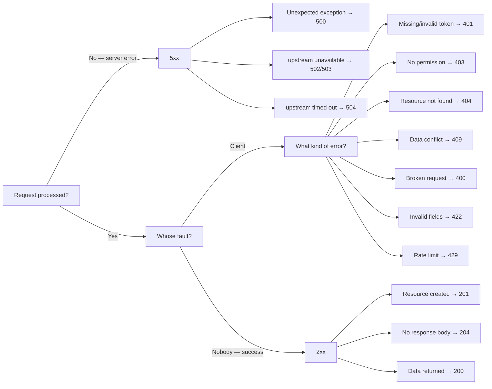

# Status Codes and Error Handling

## Why Correct Status Codes Matter

Imagine you come to a store and ask the clerk a question. He always answers the same way: "Okay, okay, everything's fine" — even when the item is out of stock, even when the store is closed, even when you asked a nonsensical question.

That's what an API that returns `200 OK` everywhere looks like.

An HTTP status is not just a number. It is a **signal to the entire infrastructure**: browser (should I cache?), CDN (should I pass it through?), monitoring (should I alert?), client code (should I show an error?). When you use the wrong code — this entire chain breaks.

---

## 1xx — Informational

Rarely encountered in everyday development. They signal an intermediate state.

**100 Continue** — the server received headers and is ready to accept the body. The browser uses this when uploading large files with the `Expect: 100-continue` header.

**101 Switching Protocols** — protocol switch. This is exactly what the server returns when establishing a WebSocket:

```
GET /chat HTTP/1.1
Upgrade: websocket
Connection: Upgrade

← HTTP/1.1 101 Switching Protocols
← Upgrade: websocket
```

---

## 2xx — Success

These are your main codes. The differences between them matter.

### 200 OK — Universal Success

The most common code. GET returned data, PATCH updated and returned the object, POST performed an action without creating a new resource.

```bash
GET /users/42
← 200 OK
← { "id": 42, "name": "Ivan", "email": "ivan@example.com" }
```

### 201 Created — A New Resource Was Created

📌 Only after POST (or PUT with upsert semantics). Required: a `Location` header with the new resource's URL.

```bash
POST /users
← 201 Created
← Location: /users/42
← { "id": 42, "name": "Ivan" }
```

Why not 200? Because 201 explicitly communicates: **a resource appeared in the system**. The client can save the Location in bookmarks. Monitoring can count creations.

### 204 No Content — Success Without Body

Used for DELETE and PUT/PATCH when there is no point in returning the updated object.

```bash
DELETE /users/42
← 204 No Content
← (empty body)
```

💡 Do not return `{}` or `{ "success": true }` with code 200 instead of 204 — it is semantically less precise.

### 206 Partial Content

For video streaming or resumable uploads. The browser requests a byte range:

```bash
GET /video.mp4
Range: bytes=0-1048575

← 206 Partial Content
← Content-Range: bytes 0-1048575/104857600
```

---

## 3xx — Redirects

### 301 Moved Permanently

The resource has permanently moved. Browsers and search engines update their records.

```bash
GET /api/v1/users
← 301 Moved Permanently
← Location: /api/v2/users
```

### 304 Not Modified

Conditional request: the client asks "has the resource changed since the last request?"

```bash
GET /logo.png
If-None-Match: "abc123"

← 304 Not Modified
← (no body — take from cache)
```

This is the basis of HTTP caching. It saves traffic and speeds up loading.

---

## 4xx — Client Errors

The client did something wrong. **Do not repeat the request** — fix it.

### 400 vs 422: Often Confused

| | 400 Bad Request | 422 Unprocessable Entity |
|---|---|---|
| JSON | Broken / not JSON | Valid |
| Data type | `"age": "not a number"` | `"age": -5` |
| Meaning | "Request is technically incorrect" | "Data is semantically wrong" |

```bash
# 400 — broken JSON
POST /users
Body: { "name": "Ivan", broken

# 422 — invalid values
POST /users
{ "email": "not-an-email", "password": "123" }
← 422 + list of field errors
```

### 401 vs 403: The Key Difference

```
401 Unauthorized = "Who are you?"
403 Forbidden    = "We know who you are, but you can't come in"
```

```bash
# 401 — no token or token is invalid
GET /profile
(no Authorization)
← 401 Unauthorized
← WWW-Authenticate: Bearer realm="api"

# 403 — token exists, but wrong role
GET /admin/users
Authorization: Bearer <user-token>
← 403 Forbidden
```

⚠️ Common mistake: returning 401 instead of 403 for authenticated users without permission.

### 409 Conflict — State Conflict

```bash
POST /users
{ "email": "john@example.com" }
← 409 Conflict
{
  "type": "...",
  "title": "Conflict",
  "detail": "User with email john@example.com already exists"
}
```

Also used in optimistic locking:

```bash
PATCH /articles/42
If-Match: "old-version-etag"
← 409 (version changed, retry with the current one)
```

### 429 Too Many Requests

Rate limit. Must include `Retry-After`:

```bash
← 429 Too Many Requests
← Retry-After: 60
← X-RateLimit-Limit: 100
← X-RateLimit-Remaining: 0
← X-RateLimit-Reset: 1709467200
```

---

## 5xx — Server Errors

The client did everything right. Something broke on our side.

| Code | Meaning |
|-----|-------|
| **500** | Unexpected error in server code |
| **502** | Gateway received an invalid response from upstream |
| **503** | Service temporarily unavailable (deploy, maintenance) |
| **504** | Gateway timed out waiting for upstream |

💡 **For the client, 5xx** = can and should be retried later. Unlike 4xx, where the request itself must be fixed.

---

## RFC 7807 — Problem Details

A standard for structured errors. Instead of `{ "error": "something went wrong" }`:

```json
{
  "type": "https://api.example.com/errors/validation-failed",
  "title": "Validation Failed",
  "status": 422,
  "detail": "One or more input fields failed validation.",
  "instance": "/api/users"
}
```

**Fields:**
- `type` — URI identifier of the error type. Documentation at this URL.
- `title` — brief, stable description (does not change between requests).
- `status` — HTTP code (duplicates the header for convenience).
- `detail` — specific details of this error occurrence.
- `instance` — URI of the specific request that caused the error.

Content-Type: **`application/problem+json`**

### Extension for Validation Errors

RFC 7807 allows adding custom fields. For validation errors, the standard extension is the `errors` array:

```json
{
  "type": "https://api.example.com/errors/validation-failed",
  "title": "Validation Failed",
  "status": 422,
  "detail": "One or more fields did not pass validation.",
  "instance": "/api/users",
  "errors": [
    {
      "field": "email",
      "message": "Must be a valid email address"
    },
    {
      "field": "password",
      "message": "Must be at least 8 characters long"
    }
  ]
}
```

The client can iterate over `errors` and show errors next to the corresponding form fields.

---

## Status Code Decision Tree



---

## ⚠️ Common Beginner Mistakes

**❌ Mistake 1: 200 OK on Error**

```json
HTTP 200 OK
{
  "success": false,
  "error": "User not found"
}
```

Why it's a problem: monitoring thinks everything is fine. The client must parse the body to understand — is it an error or not. A CDN may cache the response. Retry logic does not trigger.

```json
HTTP 404 Not Found
{
  "type": "...",
  "title": "Not Found",
  "status": 404,
  "detail": "User with id=42 does not exist"
}
```

---

**❌ Mistake 2: Generic "Something went wrong"**

```json
HTTP 500
{ "error": "Something went wrong" }
```

Why it's a problem: the client cannot handle the error meaningfully. The user sees a meaningless message. There is no machine-readable error type.

```json
HTTP 500
{
  "type": "https://api.example.com/errors/internal-error",
  "title": "Internal Server Error",
  "status": 500,
  "detail": "An unexpected error occurred. Our team has been notified.",
  "instance": "/api/orders/checkout"
}
```

---

**❌ Mistake 3: 400 Instead of 422 for Validation Errors**

```json
HTTP 400
{ "error": "Invalid email" }
```

Why it's a problem: the client doesn't know whether to fix the data or if this is a technical failure. 400 means "request is broken", 422 means "data failed validation".

```json
HTTP 422
{
  "type": "...",
  "title": "Validation Failed",
  "status": 422,
  "errors": [
    { "field": "email", "message": "Must be a valid email" }
  ]
}
```

---

**❌ Mistake 4: 401 Instead of 403 for an Authenticated User**

```json
// User is logged in, but tries to delete someone else's post
HTTP 401 Unauthorized
```

Why it's a problem: 401 tells the client "re-authorize". But the user is already authorized — re-authorization won't help. The client may enter an infinite redirect loop to the login page.

```json
HTTP 403 Forbidden
{
  "detail": "You cannot delete posts that belong to other users"
}
```

---

**❌ Mistake 5: 200 After Deletion with Empty Body**

```json
HTTP 200 OK
{}
```

Why it's a problem: redundant. 204 is semantically more precise — it explicitly says "no body".

```
HTTP 204 No Content
(no body)
```
