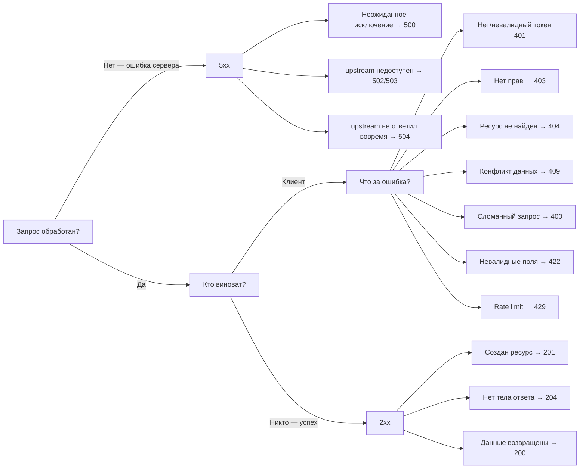

# Статус-коды и обработка ошибок

## Зачем нужны правильные статус-коды?

Представьте, что вы приходите в магазин и задаёте вопрос продавцу. Он всегда отвечает одинаково: «Окей, окей, всё хорошо» — даже когда товара нет, даже когда магазин закрыт, даже когда вы задали бессмысленный вопрос.

Вот так выглядит API, который везде возвращает `200 OK`.

HTTP-статус — это не просто число. Это **сигнал всей инфраструктуре**: браузеру (кэшировать ли?), CDN (прокидывать ли дальше?), мониторингу (алертить ли?), клиентскому коду (показывать ли ошибку?). Когда вы используете неправильный код — вся эта цепочка ломается.

---

## 1xx — Информационные

Редко встречаются в обычной разработке. Сигнализируют о промежуточном состоянии.

**100 Continue** — сервер получил заголовки и готов принять тело. Браузер использует это при загрузке больших файлов с заголовком `Expect: 100-continue`.

**101 Switching Protocols** — переключение протокола. Именно его сервер возвращает при установке WebSocket:

```
GET /chat HTTP/1.1
Upgrade: websocket
Connection: Upgrade

← HTTP/1.1 101 Switching Protocols
← Upgrade: websocket
```

---

## 2xx — Успех

Это ваши главные коды. Различия между ними важны.

### 200 OK — универсальный успех

Самый частый код. GET вернул данные, PATCH обновил и вернул объект, POST выполнил действие без создания нового ресурса.

```bash
GET /users/42
← 200 OK
← { "id": 42, "name": "Иван", "email": "ivan@example.com" }
```

### 201 Created — создан новый ресурс

📌 Только после POST (или PUT с upsert-семантикой). Обязательно: заголовок `Location` с URL нового ресурса.

```bash
POST /users
← 201 Created
← Location: /users/42
← { "id": 42, "name": "Иван" }
```

Почему не 200? Потому что 201 явно сообщает: **ресурс появился в системе**. Клиент может сохранить Location в закладки. Мониторинг может считать создания.

### 204 No Content — успех без тела

Используется для DELETE и PUT/PATCH, когда нет смысла возвращать обновлённый объект.

```bash
DELETE /users/42
← 204 No Content
← (тело пустое)
```

💡 Не возвращайте `{}` или `{ "success": true }` с кодом 200 вместо 204 — это семантически менее точно.

### 206 Partial Content

При стриминге видео или возобновляемых загрузках. Браузер запрашивает диапазон байт:

```bash
GET /video.mp4
Range: bytes=0-1048575

← 206 Partial Content
← Content-Range: bytes 0-1048575/104857600
```

---

## 3xx — Редиректы

### 301 Moved Permanently

Ресурс переехал навсегда. Браузер и поисковики обновляют свои записи.

```bash
GET /api/v1/users
← 301 Moved Permanently
← Location: /api/v2/users
```

### 304 Not Modified

Условный запрос: клиент спрашивает «изменился ли ресурс с момента последнего запроса?»

```bash
GET /logo.png
If-None-Match: "abc123"

← 304 Not Modified
← (тела нет — берём из кэша)
```

Это основа HTTP-кэширования. Экономит трафик и ускоряет загрузку.

---

## 4xx — Ошибки клиента

Клиент сделал что-то не так. **Не нужно повторять запрос** — исправьте его.

### 400 vs 422: часто путают

| | 400 Bad Request | 422 Unprocessable Entity |
|---|---|---|
| JSON | Сломан / не JSON | Валидный |
| Тип данных | `"age": "не число"` | `"age": -5` |
| Смысл | "Запрос технически некорректен" | "Данные семантически неверны" |

```bash
# 400 — сломанный JSON
POST /users
Body: { "name": "Иван", broken

# 422 — невалидные значения
POST /users
{ "email": "not-an-email", "password": "123" }
← 422 + список ошибок по полям
```

### 401 vs 403: главное различие

```
401 Unauthorized = "Кто ты?"
403 Forbidden    = "Ты известен, но тебе сюда нельзя"
```

```bash
# 401 — нет токена или токен невалиден
GET /profile
(без Authorization)
← 401 Unauthorized
← WWW-Authenticate: Bearer realm="api"

# 403 — токен есть, но роль не та
GET /admin/users
Authorization: Bearer <user-token>
← 403 Forbidden
```

⚠️ Распространённая ошибка: возвращать 401 вместо 403 для авторизованных пользователей без прав.

### 409 Conflict — конфликт состояния

```bash
POST /users
{ "email": "john@example.com" }
← 409 Conflict
{
  "type": "...",
  "title": "Conflict",
  "detail": "User with email john@example.com already exists"
}
```

Также используется при оптимистичной блокировке:

```bash
PATCH /articles/42
If-Match: "old-version-etag"
← 409 (версия изменилась, повторите с актуальной)
```

### 429 Too Many Requests

Rate limit. Обязательно включайте `Retry-After`:

```bash
← 429 Too Many Requests
← Retry-After: 60
← X-RateLimit-Limit: 100
← X-RateLimit-Remaining: 0
← X-RateLimit-Reset: 1709467200
```

---

## 5xx — Ошибки сервера

Клиент сделал всё правильно. Что-то сломалось на нашей стороне.

| Код | Смысл |
|-----|-------|
| **500** | Неожиданная ошибка в коде сервера |
| **502** | Шлюз получил невалидный ответ от upstream |
| **503** | Сервис временно недоступен (деплой, обслуживание) |
| **504** | Шлюз не дождался ответа от upstream (timeout) |

💡 **Для клиента 5xx** = можно и нужно повторить позже. В отличие от 4xx, где нужно исправить запрос.

---

## RFC 7807 — Problem Details

Стандарт для структурированных ошибок. Вместо `{ "error": "что-то пошло не так" }`:

```json
{
  "type": "https://api.example.com/errors/validation-failed",
  "title": "Validation Failed",
  "status": 422,
  "detail": "One or more input fields failed validation.",
  "instance": "/api/users"
}
```

**Поля:**
- `type` — URI-идентификатор типа ошибки. Документация по этому URL.
- `title` — краткое, стабильное описание (не меняется между запросами).
- `status` — HTTP-код (дублирует заголовок для удобства).
- `detail` — конкретные детали этого вхождения ошибки.
- `instance` — URI конкретного запроса, вызвавшего ошибку.

Content-Type: **`application/problem+json`**

### Расширение для validation errors

RFC 7807 позволяет добавлять кастомные поля. Для ошибок валидации стандартное расширение — массив `errors`:

```json
{
  "type": "https://api.example.com/errors/validation-failed",
  "title": "Validation Failed",
  "status": 422,
  "detail": "One or more fields did not pass validation.",
  "instance": "/api/users",
  "errors": [
    {
      "field": "email",
      "message": "Must be a valid email address"
    },
    {
      "field": "password",
      "message": "Must be at least 8 characters long"
    }
  ]
}
```

Клиент может итерироваться по `errors` и показывать ошибки рядом с соответствующими полями формы.

---

## Дерево выбора статус-кода



---

## ⚠️ Частые ошибки новичков

**❌ Ошибка 1: 200 OK при ошибке**

```json
HTTP 200 OK
{
  "success": false,
  "error": "User not found"
}
```

Почему проблема: мониторинг думает, что всё хорошо. Клиент должен парсить тело, чтобы понять — ошибка или нет. CDN может закэшировать ответ. Retry-логика не срабатывает.

```json
HTTP 404 Not Found
{
  "type": "...",
  "title": "Not Found",
  "status": 404,
  "detail": "User with id=42 does not exist"
}
```

---

**❌ Ошибка 2: generic "Something went wrong"**

```json
HTTP 500
{ "error": "Something went wrong" }
```

Почему проблема: клиент не может обработать ошибку осмысленно. Пользователь видит бессмысленное сообщение. Нет machine-readable типа ошибки.

```json
HTTP 500
{
  "type": "https://api.example.com/errors/internal-error",
  "title": "Internal Server Error",
  "status": 500,
  "detail": "An unexpected error occurred. Our team has been notified.",
  "instance": "/api/orders/checkout"
}
```

---

**❌ Ошибка 3: 400 вместо 422 для ошибок валидации**

```json
HTTP 400
{ "error": "Invalid email" }
```

Почему проблема: клиент не знает, исправить ли данные или это технический сбой. 400 означает «запрос сломан», 422 — «данные не прошли валидацию».

```json
HTTP 422
{
  "type": "...",
  "title": "Validation Failed",
  "status": 422,
  "errors": [
    { "field": "email", "message": "Must be a valid email" }
  ]
}
```

---

**❌ Ошибка 4: 401 вместо 403 для авторизованного пользователя**

```json
// Пользователь залогинен, но пытается удалить чужой пост
HTTP 401 Unauthorized
```

Почему проблема: 401 подсказывает клиенту «переавторизуйся». Но пользователь уже авторизован — переавторизация не поможет. Клиент может войти в бесконечный цикл редиректа на страницу входа.

```json
HTTP 403 Forbidden
{
  "detail": "You cannot delete posts that belong to other users"
}
```

---

**❌ Ошибка 5: 200 после удаления с пустым телом**

```json
HTTP 200 OK
{}
```

Почему проблема: избыточно. 204 семантически точнее — явно говорит «тела нет».

```
HTTP 204 No Content
(тело отсутствует)
```
