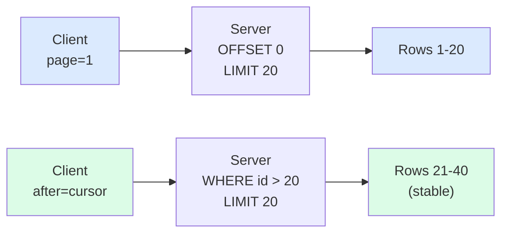
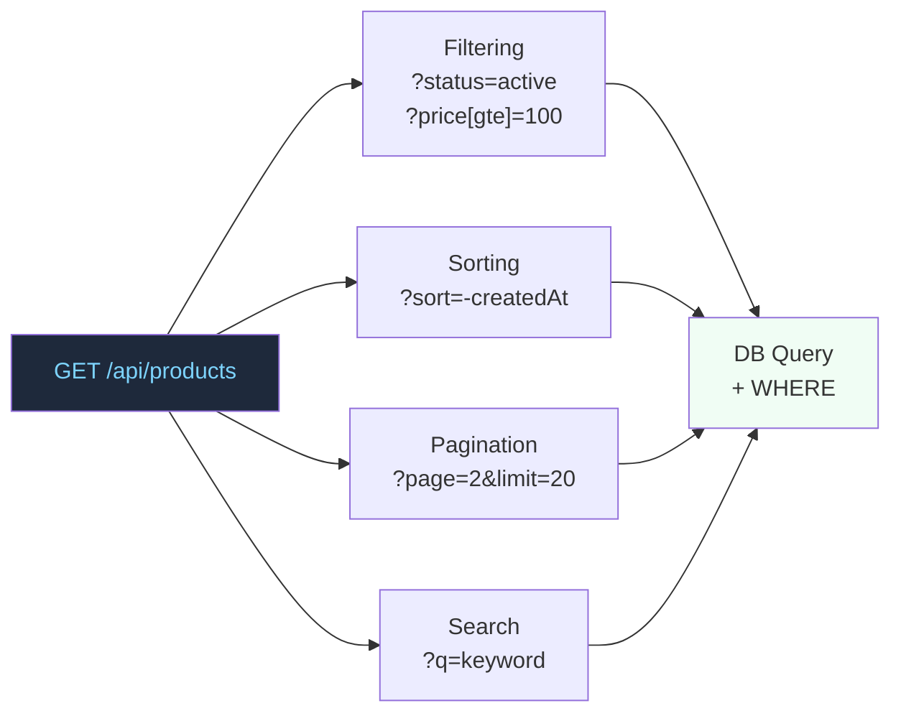
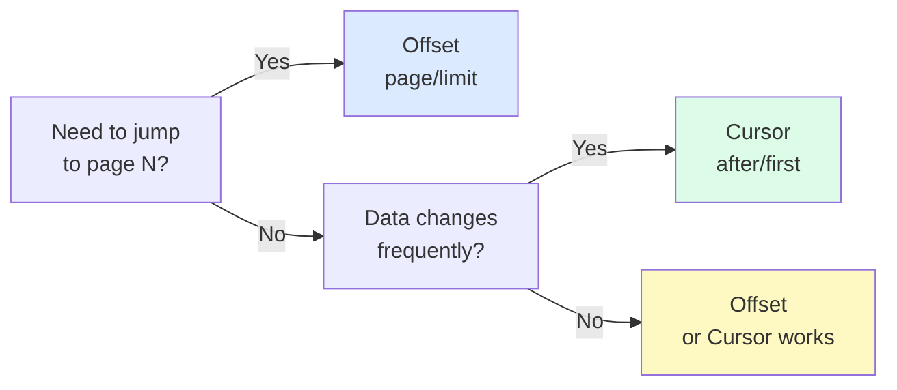

# Pagination and Filtering: Detailed Theory

## Analogy: Table of Contents vs Bookmark

Imagine a massive book with 10,000 pages.

**Offset pagination** is like a table of contents. You say "Go to page 350." This works if the book doesn't change. But if someone tears out pages 100–120 while you were reading — your "page 350" is now different.

**Cursor pagination** is like a bookmark. You remember the last chapter you read by its title, not its page number. Even if pages get rearranged — you'll find the continuation from the same spot.

---

## Offset Pagination: Simple, but with Limitations

### Two Parameter Variants

```
# Option 1: page + limit (for UI with page numbers)
GET /api/orders?page=3&limit=20

# Option 2: offset + limit (closer to SQL)
GET /api/orders?offset=40&limit=20
# offset = (page - 1) * limit = (3 - 1) * 20 = 40
```

### How It Works Under the Hood

```sql
SELECT * FROM orders
ORDER BY created_at DESC
LIMIT 20 OFFSET 40;
```

### Problem: Consistency When Data Changes

```
Step 1. Client loads page 1 (items 1–20).

Step 2. Someone adds a new item at the beginning of the list.
         Items shift: former item #20 is now #21.

Step 3. Client requests page 2 (offset=20).
         Receives items 21–40.
         Item #20 (now #21) was already on page 1!
         → DUPLICATE
```

```
Similarly, on deletion:
Step 1. Page 1 contains items 1–20.
Step 2. Item #5 is deleted.
Step 3. Page 2 starts with item #21 (formerly #22).
         Item #21 (formerly #20) is skipped!
         → SKIP
```

### Problem: Performance with Large Offsets

```sql
-- Fast
SELECT * FROM orders LIMIT 20 OFFSET 0;

-- Slow: the database must read 10,000 rows, discard 9,980
SELECT * FROM orders LIMIT 20 OFFSET 9980;
```

With millions of records, large offsets are a real problem. Cursors solve this.

---

## Cursor Pagination: Stable and Fast

### Principle: Remember the Value, Not the Position

Instead of "give me rows 41 through 60," say "give me 20 rows after this specific record."

```
GET /api/posts?after=cursor_abc123&first=20
```

A cursor is an opaque string, usually Base64 of the sort field value + ID:

```
cursor_abc123 → base64("2024-04-15T10:30:00Z:post_id_5678")
```

### How It Works Under the Hood

```sql
-- If the cursor decodes to (created_at='2024-04-15', id=5678):
SELECT * FROM posts
WHERE (created_at, id) < ('2024-04-15T10:30:00Z', 5678)
ORDER BY created_at DESC, id DESC
LIMIT 20;
```

This is **keyset pagination** — very fast when there's a composite index on (created_at, id).

### Response Structure (GraphQL Connections Style)

```json
{
  "posts": [
    { "id": "post_1", "title": "..." },
    "..."
  ],
  "pageInfo": {
    "hasNextPage": true,
    "hasPrevPage": false,
    "startCursor": "cursor_start_xyz",
    "endCursor": "cursor_end_abc"
  }
}
```

### Limitations of Cursor Pagination

- Cannot jump to an arbitrary page — only forward/backward
- Difficult to show "Page 5 of 23" — no total count
- Cursor depends on sort order — changing sorting invalidates cursors

---

## Pagination Metadata

### For Offset Pagination

```json
{
  "data": [...],
  "meta": {
    "totalCount": 1247,
    "page": 3,
    "limit": 20,
    "totalPages": 63,
    "hasNextPage": true,
    "hasPrevPage": true
  }
}
```

### For Cursor Pagination

```json
{
  "data": [...],
  "pageInfo": {
    "hasNextPage": true,
    "hasPrevPage": false,
    "startCursor": "eyJpZCI6MTAwfQ==",
    "endCursor": "eyJpZCI6MTIwfQ=="
  }
}
```

### Link Header (RFC 8288) — an Alternative

Instead of response body — an HTTP header:

```
Link: <https://api.example.com/posts?page=4&limit=20>; rel="next",
      <https://api.example.com/posts?page=1&limit=20>; rel="first",
      <https://api.example.com/posts?page=63&limit=20>; rel="last"
```

The GitHub API uses exactly this approach. Advantage: the response body contains only data, without a "wrapper."

---

## Filtering: From Simple Parameters to Operators

### Simple Filters

```
GET /api/products?status=active&category=electronics
```

Simple equality filters are sufficient for this. The problem arises with ranges.

### Operators via Bracket Notation

```
# Price from 100 to 5000
GET /api/products?price[gte]=100&price[lte]=5000

# Created after a date
GET /api/products?createdAt[gte]=2024-01-01

# IN operator (multiple values)
GET /api/products?status[in]=active,draft

# NOT operator
GET /api/products?status[ne]=archived
```

Operators: `eq` (=), `ne` (!=), `gt` (>), `gte` (>=), `lt` (<), `lte` (<=), `in`, `nin`, `like`.

### Alternatives to Operator Notation

```
# Lodash/Loopback style
?filter[where][price][gte]=100

# Google AIP style (filter expression)
?filter=price>=100 AND status="active"

# Simple minimalism (for simple APIs)
?priceMin=100&priceMax=5000
```

💡 Pick one approach and document it. Consistency is key.

---

## Sorting: Conventions

### Single Field

```
GET /api/products?sort=name        # ASC (default)
GET /api/products?sort=-name       # DESC (minus = reverse order)
```

### Multiple Fields

```
GET /api/products?sort=status,-createdAt
# = ORDER BY status ASC, created_at DESC
```

### Alternative: Explicit Parameters

```
GET /api/products?sortBy=createdAt&sortOrder=desc
```

Less compact, but more intuitive for simple cases.

---

## Search

```
# Simple keyword search
GET /api/products?q=apple

# Search by a specific field
GET /api/products?name[like]=apple

# Full-text search (if supported by the backend)
GET /api/products?search=organic+apple&searchFields=name,description
```

⚠️ `q` is a short alias for full-text search. Don't mix it with filters: `q=apple` searches everywhere, `name[like]=apple` searches only in the name.

---

## Diagrams

### Offset vs Cursor: How They Work



### Full Set of Query Parameters



### Choosing Pagination Type



---

## ⚠️ Common Beginner Mistakes

### ❌ Mistake 1: Returning Everything Without Pagination

```
GET /api/products → [{ ... }, { ... }, ... (100,000 items)]
```

Why it's bad: as data grows — timeouts, OOM, frozen browser.

```
✅ Always paginate collections, even if there's little data now:
GET /api/products?limit=20
```

### ❌ Mistake 2: Offset for Infinite Scroll

```
// User scrolls the feed — new posts are being added
GET /api/posts?page=2&limit=20  // ← duplicates are guaranteed
```

Why it's bad: offset is unstable when data changes.

```
✅ For infinite scroll, always use cursor:
GET /api/posts?after=last_post_cursor&first=20
```

### ❌ Mistake 3: No Metadata in Response

```json
// What is this? Last page? How many total records?
{ "products": [...] }
```

Why it's bad: the client can't build a paginator and doesn't know if there's more data.

```json
✅ Always include metadata:
{
  "products": [...],
  "meta": { "hasNextPage": true, "totalCount": 456 }
}
```

### ❌ Mistake 4: Mixing Filtering Operators Without Documentation

```
// Client doesn't know: is this a range or something else?
?price_from=100&price_to=500   // non-standard
?priceGte=100&priceLte=500     // another non-standard
?price[gte]=100&price[lte]=500 // standard notation
```

Why it's bad: inconsistency makes usage harder.

```
✅ Choose one notation for the entire API and document it.
```

---

## 📌 Choosing Pagination Type

| Scenario | Type | Why |
|----------|-----|-----|
| Admin panel with navigation | Offset | Need to jump to page N |
| News feed | Cursor | Data changes in real time |
| Infinite scroll | Cursor / Keyset | Stability + performance |
| Reports/export | Offset + large limit | Stable data, simplicity |
| Chat history | Cursor (before/after) | Bidirectional navigation
