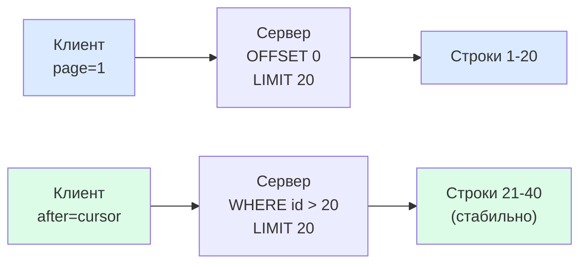
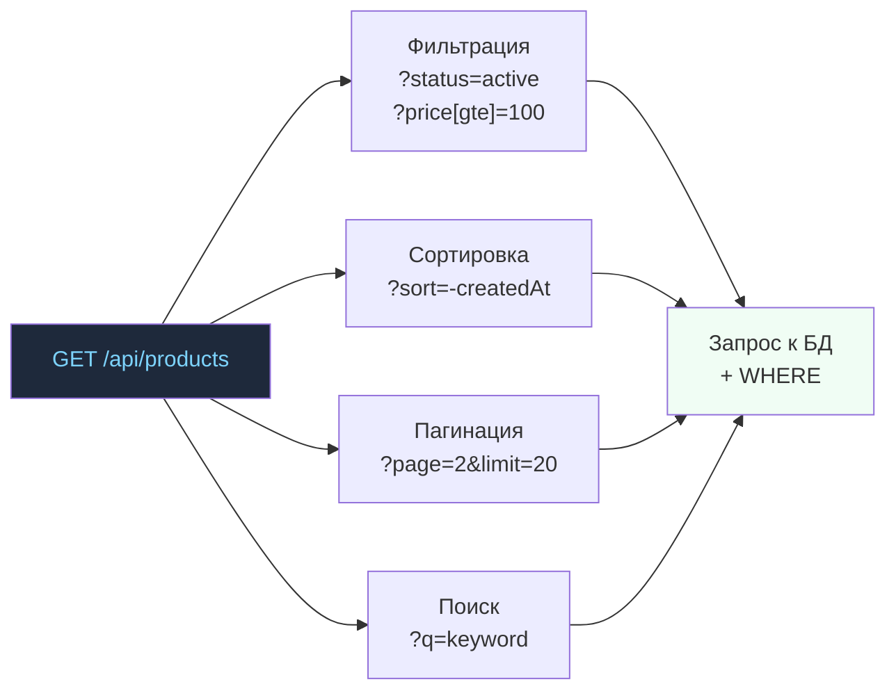
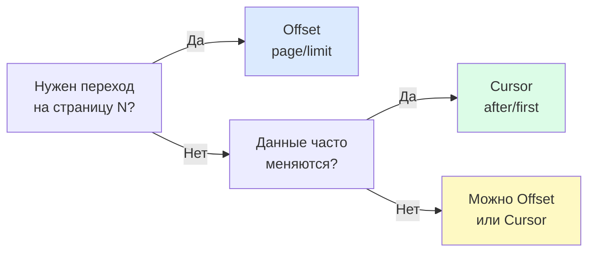

# Пагинация и фильтрация: подробная теория

## Аналогия: оглавление книги vs закладка

Представьте огромную книгу из 10 000 страниц.

**Offset-пагинация** — как оглавление. Вы говорите: «Перейти на страницу 350». Это работает, если книга не меняется. Но если кто-то вырвал страницы 100–120 пока вы читали — ваша «страница 350» теперь другая.

**Cursor-пагинация** — как закладка. Вы помните последнюю прочитанную главу по её названию, а не номеру страницы. Даже если страницы переставили — вы найдёте продолжение с того же места.

---

## Offset-пагинация: просто, но с ограничениями

### Два варианта параметров

```
# Вариант 1: page + limit (для UI с номерами страниц)
GET /api/orders?page=3&limit=20

# Вариант 2: offset + limit (ближе к SQL)
GET /api/orders?offset=40&limit=20
# offset = (page - 1) * limit = (3 - 1) * 20 = 40
```

### Как работает под капотом

```sql
SELECT * FROM orders
ORDER BY created_at DESC
LIMIT 20 OFFSET 40;
```

### Проблема: consistency при изменении данных

```
Шаг 1. Клиент загружает страницу 1 (items 1–20).

Шаг 2. Кто-то добавляет новый item в начало списка.
        items сдвигаются: бывший item #20 теперь #21.

Шаг 3. Клиент запрашивает страницу 2 (offset=20).
        Получает items 21–40.
        Item #20 (теперь #21) уже был на странице 1!
        → ДУБЛИКАТ
```

```
Аналогично при удалении:
Шаг 1. Страница 1 содержит items 1–20.
Шаг 2. Item #5 удалён.
Шаг 3. Страница 2 начинается с item #21 (бывший #22).
        Item #21 (бывший #20) пропущен!
        → ПРОПУСК
```

### Проблема: производительность при больших offset

```sql
-- Быстро
SELECT * FROM orders LIMIT 20 OFFSET 0;

-- Медленно: база вынуждена прочитать 10 000 строк, выбросить 9 980
SELECT * FROM orders LIMIT 20 OFFSET 9980;
```

При миллионах записей большой offset — реальная проблема. Курсор решает это.

---

## Cursor-пагинация: стабильно и быстро

### Принцип: помним не позицию, а значение

Вместо «дай мне строки с 41 по 60» говорим «дай мне 20 строк после этой конкретной записи».

```
GET /api/posts?after=cursor_abc123&first=20
```

Cursor — это непрозрачная строка, обычно Base64 от значения поля сортировки + ID:

```
cursor_abc123 → base64("2024-04-15T10:30:00Z:post_id_5678")
```

### Как работает под капотом

```sql
-- Если cursor декодируется в (created_at='2024-04-15', id=5678):
SELECT * FROM posts
WHERE (created_at, id) < ('2024-04-15T10:30:00Z', 5678)
ORDER BY created_at DESC, id DESC
LIMIT 20;
```

Это **keyset pagination** — очень быстро, если есть составной индекс по (created_at, id).

### Структура ответа (GraphQL Connections style)

```json
{
  "posts": [
    { "id": "post_1", "title": "..." },
    "..."
  ],
  "pageInfo": {
    "hasNextPage": true,
    "hasPrevPage": false,
    "startCursor": "cursor_start_xyz",
    "endCursor": "cursor_end_abc"
  }
}
```

### Ограничения cursor-пагинации

- Нельзя перейти на произвольную страницу — только вперёд/назад
- Сложно показать «Страница 5 из 23» — нет общего счётчика
- Курсор зависит от сортировки — смена сортировки инвалидирует курсоры

---

## Мета-данные пагинации

### Для offset-пагинации

```json
{
  "data": [...],
  "meta": {
    "totalCount": 1247,
    "page": 3,
    "limit": 20,
    "totalPages": 63,
    "hasNextPage": true,
    "hasPrevPage": true
  }
}
```

### Для cursor-пагинации

```json
{
  "data": [...],
  "pageInfo": {
    "hasNextPage": true,
    "hasPrevPage": false,
    "startCursor": "eyJpZCI6MTAwfQ==",
    "endCursor": "eyJpZCI6MTIwfQ=="
  }
}
```

### Link header (RFC 8288) — альтернатива

Вместо тела ответа — HTTP-заголовок:

```
Link: <https://api.example.com/posts?page=4&limit=20>; rel="next",
      <https://api.example.com/posts?page=1&limit=20>; rel="first",
      <https://api.example.com/posts?page=63&limit=20>; rel="last"
```

GitHub API использует именно этот подход. Преимущество: тело ответа содержит только данные, без «обёртки».

---

## Фильтрация: от простых параметров к операторам

### Простые фильтры

```
GET /api/products?status=active&category=electronics
```

Для простых равенств достаточно. Проблема возникает с диапазонами.

### Операторы через скобочную нотацию

```
# Цена от 100 до 5000
GET /api/products?price[gte]=100&price[lte]=5000

# Созданы после даты
GET /api/products?createdAt[gte]=2024-01-01

# Оператор IN (несколько значений)
GET /api/products?status[in]=active,draft

# Оператор NOT
GET /api/products?status[ne]=archived
```

Операторы: `eq` (=), `ne` (!=), `gt` (>), `gte` (>=), `lt` (<), `lte` (<=), `in`, `nin`, `like`.

### Альтернативы нотации операторов

```
# Lodash/Loopback style
?filter[where][price][gte]=100

# Google AIP style (filter expression)
?filter=price>=100 AND status="active"

# Простой минимализм (для несложных API)
?priceMin=100&priceMax=5000
```

💡 Выберите один подход и задокументируйте его. Главное — консистентность.

---

## Сортировка: конвенции

### Одно поле

```
GET /api/products?sort=name        # ASC (по умолчанию)
GET /api/products?sort=-name       # DESC (минус = обратный порядок)
```

### Несколько полей

```
GET /api/products?sort=status,-createdAt
# = ORDER BY status ASC, created_at DESC
```

### Альтернатива: явные параметры

```
GET /api/products?sortBy=createdAt&sortOrder=desc
```

Менее компактно, зато интуитивно для простых случаев.

---

## Поиск

```
# Простой поиск по ключевому слову
GET /api/products?q=apple

# Поиск по конкретному полю
GET /api/products?name[like]=apple

# Полнотекстовый поиск (если поддерживается бэкендом)
GET /api/products?search=organic+apple&searchFields=name,description
```

⚠️ `q` — краткий алиас для полнотекстового поиска. Не смешивайте его с фильтрами: `q=apple` ищет везде, `name[like]=apple` ищет только в имени.

---

## Диаграммы

### Offset vs Cursor: как работают



### Полный набор query-параметров



### Выбор типа пагинации



---

## ⚠️ Типичные ошибки начинающих

### ❌ Ошибка 1: возвращать всё без пагинации

```
GET /api/products → [{ ... }, { ... }, ... (100 000 штук)]
```

Почему плохо: при росте данных — таймаут, OOM, зависший браузер.

```
✅ Всегда пагинируйте коллекции, даже если сейчас данных мало:
GET /api/products?limit=20
```

### ❌ Ошибка 2: offset для бесконечного скролла

```
// Пользователь листает ленту — новые посты добавляются
GET /api/posts?page=2&limit=20  // ← дубли гарантированы
```

Почему плохо: offset нестабилен при изменении данных.

```
✅ Для бесконечного скролла всегда используйте cursor:
GET /api/posts?after=last_post_cursor&first=20
```

### ❌ Ошибка 3: нет мета-данных в ответе

```json
// Что это? Последняя страница? Сколько всего записей?
{ "products": [...] }
```

Почему плохо: клиент не может построить пагинатор и не знает, есть ли ещё данные.

```json
✅ Всегда включайте мета:
{
  "products": [...],
  "meta": { "hasNextPage": true, "totalCount": 456 }
}
```

### ❌ Ошибка 4: смешивать операторы фильтрации без документации

```
// Клиент не знает: это диапазон или что-то другое?
?price_from=100&price_to=500   // нестандартно
?priceGte=100&priceLte=500     // другая нестандартность
?price[gte]=100&price[lte]=500 // стандартная нотация
```

Почему плохо: непоследовательность усложняет использование.

```
✅ Выберите одну нотацию для всего API и задокументируйте её.
```

---

## 📌 Выбор типа пагинации

| Сценарий | Тип | Почему |
|----------|-----|--------|
| Админ-панель с навигацией | Offset | Нужен переход на страницу N |
| Лента новостей | Cursor | Данные меняются в реальном времени |
| Бесконечный скролл | Cursor / Keyset | Стабильность + производительность |
| Отчёты/экспорт | Offset + большой limit | Стабильные данные, простота |
| Чат-история | Cursor (before/after) | Навигация в обе стороны |
