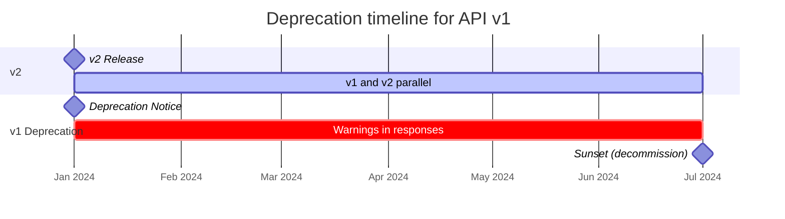
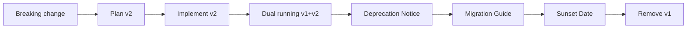

# API Versioning

## Analogy: API Versions as Car Models

Imagine you are a car manufacturer. In 2020, the "Volga 2020" model was released — and thousands of people bought it, learned to use it, and opened auto repair shops for it. In 2024, you release the "Volga 2024" with a new engine. But that doesn't mean the "Volga 2020" suddenly stops running! Both models coexist until the market transitions to the new one.

API versioning works the same way: **old clients keep working while you gradually migrate them to the new version**.

---

## Breaking vs Non-Breaking Changes

🎯 The golden rule: never introduce breaking changes without a version change.

### Non-Breaking (Safe, No New Version Required)

```json
// Before: GET /users/1
{ "id": 1, "name": "Alice" }

// After — added a field:
{ "id": 1, "name": "Alice", "email": "alice@example.com" }
```

A client that doesn't know about `email` will simply ignore it. Everything still works.

Safe changes:
- ✅ Adding a new field to a response
- ✅ Adding a new optional request parameter
- ✅ Adding a new endpoint
- ✅ Adding a new HTTP method to an existing endpoint
- ✅ Changing the order of fields in a response

### Breaking (Breaking Changes — New Version Required)

```json
// Before:
{ "id": 1, "userName": "alice", "phone": "79001234567" }

// After — renamed and changed type:
{ "id": 1, "username": "alice", "phone": { "country": "+7", "number": "9001234567" } }
```

The client accesses `response.userName` — gets `undefined`. It parses `phone` as a string — gets `[object Object]`. 🐛 Silent bugs are guaranteed.

Breaking changes:
- ❌ Removing a field from a response
- ❌ Renaming a field
- ❌ Changing a field type (`string` → `number`, `string` → `object`)
- ❌ Changing field semantics (the `status` field now returns different values)
- ❌ Removing an endpoint
- ❌ Changing the HTTP method (was POST, became PUT)

---

## Three Versioning Strategies

### 1. URL Versioning — Most Popular

The version is embedded in the path:

```
GET https://api.example.com/v1/users
GET https://api.example.com/v2/users
```

This is how GitHub (api.github.com/v3), Twitter (api.twitter.com/2), and historically Stripe (api.stripe.com/v1 — they never left v1, adding changes through other mechanisms) work.

**What it looks like in practice:**

```
# Old client — works as usual
GET /v1/users?page=1 HTTP/1.1

# New client — uses the improved API
GET /v2/users?cursor=eyJpZCI6MTAwfQ HTTP/1.1
```

✅ Advantages:
- Version is obvious without knowing the protocol — just look at the URL
- Easy to test: paste into browser / curl — done
- CDNs cache by path — /v1/ and /v2/ are independent
- Different versions can be deployed to different services
- Convenient for logs — immediately visible who uses what

❌ Disadvantages:
- Violates the "one resource — one URL" principle (REST purists frown)
- As versions grow, URLs become long: `/v3/api/products/123/reviews`
- Difficult to introduce more granular versioning (only major)

⚠️ Common mistake — versioning each endpoint individually:
```
❌ /v1/users + /v2/orders + /v1/products  — chaos
✅ /v1/users + /v1/orders + /v1/products  — consistent
```

### 2. Header Versioning — The "Cleanest"

The version is passed in an HTTP header:

```http
GET /api/users HTTP/1.1
Host: api.example.com
Accept: application/vnd.myapi.v2+json
```

The `vnd.<company>.<version>+json` format is the standard MIME type for versioned APIs (vnd = vendor).

GitHub switched to this approach: `X-GitHub-Api-Version: 2022-11-28` (date as a version — convenient for APIs that release without numbering).

✅ Advantages:
- Clean URLs — one endpoint for all versions
- Conforms to HTTP Content Negotiation (RFC 7231)
- Easy to support multiple versions on one server

❌ Disadvantages:
- Cannot open in a browser without a plugin
- New developers often forget about the header
- Caching requires `Vary: Accept` — otherwise the CDN will mix up versions
- Logs are less readable — version not in the URL

⚠️ Frequent caching mistake:
```http
❌ Without Vary: Accept — the CDN may return v1 to a client requesting v2

✅ Always add:
Vary: Accept
Cache-Control: private
```

### 3. Query Param Versioning — The Compromise

```
GET /api/users?version=2
GET /api/users?version=1&page=3&limit=20
```

AWS uses this approach: `?Action=DescribeInstances&Version=2016-11-15`.

✅ Advantages:
- Visible in the URL but doesn't change the resource path
- Easy to test from a browser
- Clients without the parameter get the default version

❌ Disadvantages:
- Version gets mixed with business parameters
- Some proxies ignore query strings when caching
- Less obvious at first glance

---

## Semantic Versioning for APIs

APIs typically use only the major version (v1, v2, v3). Why?

```
MAJOR.MINOR.PATCH
  v2   .  3  .  1
  ↑         ↑    ↑
Breaking   New  Bug
changes   fields fix
```

- **MAJOR** — in the URL: `/v1/`, `/v2/`
- **MINOR** — documented but not versioned in the URL: "added email field in v1.3"
- **PATCH** — transparent to clients

📌 Stripe uses dates instead of numbers: `Stripe-Version: 2023-10-16`. Each date is a snapshot of API behavior at that point in time. New accounts get the latest version; old ones are pinned to theirs.

---

## Deprecation Policy: RFC 8594

When it's time to disable an old version, use standard HTTP headers:

```http
HTTP/1.1 200 OK
Deprecation: Tue, 01 Jan 2025 00:00:00 GMT
Sunset: Tue, 01 Jul 2025 00:00:00 GMT
Link: <https://api.example.com/v2/users>; rel="successor-version",
      <https://api.example.com/docs/migration>; rel="deprecation"
```

- **Deprecation** — when the version was declared obsolete
- **Sunset** — when the version will be disabled (RFC 8594)
- **Link** — link to the new version and migration guide

Good practice: at least **6 months** between announcement and decommissioning for public APIs. Major players give a year to a year and a half.

---

## Backward Compatibility Strategies

### Additive Changes — Add, Don't Remove

```json
// v1 — never remove
{ "id": 1, "name": "Alice", "email": "alice@example.com" }

// v1 after "breaking" change — mark deprecated field but keep it
{
  "id": 1,
  "name": "Alice",           // deprecated, use full_name
  "full_name": "Alice Smith", // new
  "email": "alice@example.com"
}
```

### Optional Fields — New Fields Are Always Optional

```typescript
// The client must handle the absence of new fields:
const email = user.email ?? user.contact?.email ?? null
```

### Dual Running — Parallel Version Operation

```
v1 → Server A (legacy)
v2 → Server B (new)
     ↕ data synchronization
```

During the transition period, both servers run simultaneously. It's more expensive but safer.

---

## Timeline Diagram: Deprecation



---

## Real-World Examples

| Company | Strategy | Example |
|----------|-----------|--------|
| **GitHub** | URL + Header | `api.github.com/v3/` + `X-GitHub-Api-Version: 2022-11-28` |
| **Stripe** | URL + Header | `api.stripe.com/v1/` + `Stripe-Version: 2023-10-16` |
| **Twilio** | URL | `api.twilio.com/2010-04-01/` (date as version) |
| **AWS** | Query | `?Action=...&Version=2016-11-15` |
| **Salesforce** | URL | `/services/data/v58.0/` |

💡 Note: Twilio uses a date in the URL as a version — an approach where the version captures a snapshot of API behavior at a specific point in time. Convenient for APIs that update frequently.

---

## Mermaid: Versioning Process



---

## ⚠️ Common Beginner Mistakes

### Mistake 1: Versioning Each Endpoint Individually

```
❌ /v1/users + /v2/orders + /v3/products
```

The client doesn't understand which version of which endpoint to use. Version the API as a whole.

```
✅ /v1/users + /v1/orders + /v1/products
   /v2/users + /v2/orders + /v2/products
```

### Mistake 2: Abrupt Decommissioning Without Warning

```
❌ "We'll disable v1 in a week" (on a Friday evening)
✅ Deprecation headers 6+ months before Sunset
```

### Mistake 3: Breaking Changes in a Minor Version

```
❌ Removed a field in /v1/ without a version change — "it's just a fix"
✅ Any removal or type change → new major version
```

### Mistake 4: Ignoring Vary with Header Versioning

```http
❌ Accept: application/vnd.api.v2+json  — without Vary, the CDN will return cached v1
✅ Vary: Accept                          — CDN caches separately for each version
```
