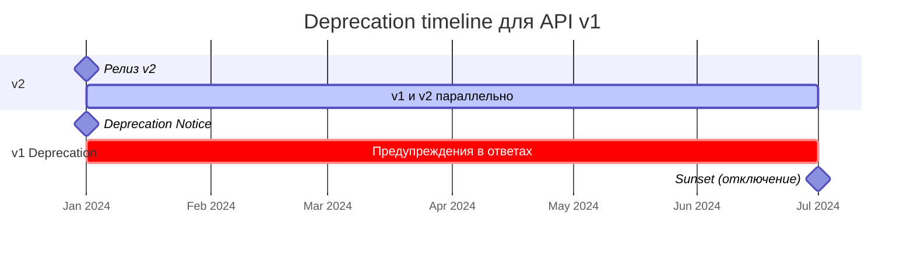
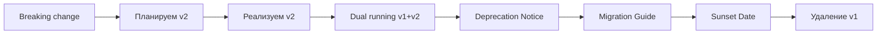

# Версионирование API

## Аналогия: версии API как модели автомобилей

Представьте, что вы производитель автомобилей. В 2020 году вышла модель «Волга-2020» — и тысячи
людей купили её, научились ей пользоваться, открыли на неё автосервисы. В 2024 году вы выпускаете
«Волгу-2024» с новым двигателем. Но это не значит, что «Волга-2020» внезапно перестаёт ездить!
Обе модели существуют параллельно, пока рынок не перейдёт на новую.

API-версионирование работает так же: **старые клиенты продолжают работать, пока вы плавно
переводите их на новую версию**.

---

## Breaking vs Non-breaking changes

🎯 Главное правило: никогда не вносите breaking changes без смены версии.

### Non-breaking (безопасно, не требует новой версии)

```json
// Было: GET /users/1
{ "id": 1, "name": "Alice" }

// Стало — добавили поле:
{ "id": 1, "name": "Alice", "email": "alice@example.com" }
```

Клиент, который не знает про `email`, просто его проигнорирует. Всё работает.

Безопасные изменения:
- ✅ Добавление нового поля в ответ
- ✅ Добавление нового необязательного параметра запроса
- ✅ Добавление нового endpoint
- ✅ Добавление нового метода HTTP к существующему endpoint
- ✅ Изменение порядка полей в ответе

### Breaking (ломающие изменения — нужна новая версия)

```json
// Было:
{ "id": 1, "userName": "alice", "phone": "79001234567" }

// Стало — переименовали и изменили тип:
{ "id": 1, "username": "alice", "phone": { "country": "+7", "number": "9001234567" } }
```

Клиент обращается к `response.userName` — получает `undefined`. Разбирает `phone` как строку —
получает `[object Object]`. 🐛 Тихие баги гарантированы.

Ломающие изменения:
- ❌ Удаление поля из ответа
- ❌ Переименование поля
- ❌ Изменение типа поля (`string` → `number`, `string` → `object`)
- ❌ Изменение семантики поля (поле `status` теперь возвращает другие значения)
- ❌ Удаление endpoint
- ❌ Изменение метода HTTP (был POST, стал PUT)

---

## Три стратегии версионирования

### 1. URL versioning — самый популярный

Версия встроена в путь:

```
GET https://api.example.com/v1/users
GET https://api.example.com/v2/users
```

Именно так работают GitHub (api.github.com/v3), Twitter (api.twitter.com/2), и исторически Stripe
(api.stripe.com/v1 — они так и не вышли из v1, добавляя изменения через другие механизмы).

**Как это выглядит на практике:**

```
# Старый клиент — работает как всегда
GET /v1/users?page=1 HTTP/1.1

# Новый клиент — использует улучшенный API
GET /v2/users?cursor=eyJpZCI6MTAwfQ HTTP/1.1
```

✅ Преимущества:
- Версия очевидна без знания протокола — просто смотришь на URL
- Легко тестировать: вставил в браузер / curl — и готово
- CDN кешируют по пути — /v1/ и /v2/ независимо
- Можно деплоить разные версии на разные сервисы
- Удобно для логов — сразу видно, кто чем пользуется

❌ Недостатки:
- Нарушает принцип "один ресурс — один URL" (REST-пуристы морщатся)
- При росте версий URL становятся длинными: `/v3/api/products/123/reviews`
- Трудно ввести более гранулярное версионирование (только major)

⚠️ Распространённая ошибка — версионировать каждый endpoint отдельно:
```
❌ /v1/users + /v2/orders + /v1/products  — хаос
✅ /v1/users + /v1/orders + /v1/products  — консистентно
```

### 2. Header versioning — самый "чистый"

Версия передаётся в HTTP-заголовке:

```http
GET /api/users HTTP/1.1
Host: api.example.com
Accept: application/vnd.myapi.v2+json
```

Формат `vnd.<company>.<version>+json` — стандартный MIME-тип для версионированных API
(vnd = vendor).

GitHub перешёл на этот подход: `X-GitHub-Api-Version: 2022-11-28` (дата как версия — удобно
для API, которые выходят без нумерации).

✅ Преимущества:
- Чистые URL — один endpoint для всех версий
- Соответствует HTTP Content Negotiation (RFC 7231)
- Легко поддерживать несколько версий на одном сервере

❌ Недостатки:
- Нельзя открыть в браузере без плагина
- Новые разработчики часто забывают про заголовок
- Кеширование требует `Vary: Accept` — иначе CDN перепутает версии
- Логи менее читаемые — версия не в URL

⚠️ Частая ошибка с кешированием:
```http
❌ Без Vary: Accept — CDN может вернуть v1 клиенту, запросившему v2

✅ Обязательно добавляйте:
Vary: Accept
Cache-Control: private
```

### 3. Query param versioning — компромисс

```
GET /api/users?version=2
GET /api/users?version=1&page=3&limit=20
```

AWS использует этот подход: `?Action=DescribeInstances&Version=2016-11-15`.

✅ Преимущества:
- Видно в URL, но не меняет путь к ресурсу
- Легко тестировать из браузера
- Клиенты без параметра получают дефолтную версию

❌ Недостатки:
- Версия смешивается с бизнес-параметрами
- Некоторые прокси игнорируют query при кешировании
- Менее очевидно при первом взгляде

---

## Semantic versioning для API

Обычно для API используют только major-версию (v1, v2, v3). Почему?

```
MAJOR.MINOR.PATCH
  v2   .  3  .  1
  ↑         ↑    ↑
Breaking   New  Bug
changes   fields fix
```

- **MAJOR** — в URL: `/v1/`, `/v2/`
- **MINOR** — документируется, но не версионируется URL: "добавлено поле email в v1.3"
- **PATCH** — прозрачно для клиентов

📌 Stripe использует дату вместо числа: `Stripe-Version: 2023-10-16`. Каждая дата — это снимок
поведения API на тот момент. Новые аккаунты получают последнюю версию, старые закреплены на своей.

---

## Deprecation policy: RFC 8594

Когда пора отключать старую версию, используйте стандартные HTTP-заголовки:

```http
HTTP/1.1 200 OK
Deprecation: Tue, 01 Jan 2025 00:00:00 GMT
Sunset: Tue, 01 Jul 2025 00:00:00 GMT
Link: <https://api.example.com/v2/users>; rel="successor-version",
      <https://api.example.com/docs/migration>; rel="deprecation"
```

- **Deprecation** — когда версия объявлена устаревшей
- **Sunset** — когда версия будет отключена (RFC 8594)
- **Link** — ссылка на новую версию и руководство по миграции

Правило хорошего тона: минимум **6 месяцев** между объявлением и отключением для публичных API.
Крупные игроки дают год-полтора.

---

## Стратегии обратной совместимости

### Additive changes — добавляй, не удаляй

```json
// v1 — никогда не удаляем
{ "id": 1, "name": "Alice", "email": "alice@example.com" }

// v1 after "breaking" change — устаревшее поле помечаем, но оставляем
{
  "id": 1,
  "name": "Alice",           // deprecated, use full_name
  "full_name": "Alice Smith", // new
  "email": "alice@example.com"
}
```

### Optional fields — новые поля всегда опциональные

```typescript
// Клиент должен обрабатывать отсутствие новых полей:
const email = user.email ?? user.contact?.email ?? null
```

### Dual running — параллельная работа версий

```
v1 → Сервер A (legacy)
v2 → Сервер B (new)
     ↕ синхронизация данных
```

Во время переходного периода оба сервера работают одновременно. Это дороже, но безопаснее.

---

## Timeline диаграмма deprecation



---

## Реальные примеры

| Компания | Стратегия | Пример |
|----------|-----------|--------|
| **GitHub** | URL + Header | `api.github.com/v3/` + `X-GitHub-Api-Version: 2022-11-28` |
| **Stripe** | URL + Header | `api.stripe.com/v1/` + `Stripe-Version: 2023-10-16` |
| **Twilio** | URL | `api.twilio.com/2010-04-01/` (дата как версия) |
| **AWS** | Query | `?Action=...&Version=2016-11-15` |
| **Salesforce** | URL | `/services/data/v58.0/` |

💡 Обратите внимание: Twilio использует дату в URL как версию — подход, при котором версия
фиксирует снимок поведения API на конкретный момент. Удобно для API, которые часто обновляются.

---

## Mermaid: процесс версионирования



---

## ⚠️ Типичные ошибки новичков

### Ошибка 1: Версионирование каждого endpoint отдельно

```
❌ /v1/users + /v2/orders + /v3/products
```

Клиент не понимает, какую версию какого endpoint использовать. Версионируйте API целиком.

```
✅ /v1/users + /v1/orders + /v1/products
   /v2/users + /v2/orders + /v2/products
```

### Ошибка 2: Резкое отключение без предупреждения

```
❌ "Мы отключим v1 через неделю" (в пятницу вечером)
✅ Deprecation-заголовки за 6+ месяцев до Sunset
```

### Ошибка 3: Breaking changes в minor-версии

```
❌ Удалили поле в /v1/ без смены версии — "это же просто исправление"
✅ Любое удаление или изменение типа → новая major-версия
```

### Ошибка 4: Игнорирование Vary при header versioning

```http
❌ Accept: application/vnd.api.v2+json  — без Vary CDN вернёт кешированный v1
✅ Vary: Accept                          — CDN кеширует отдельно для каждой версии
```
