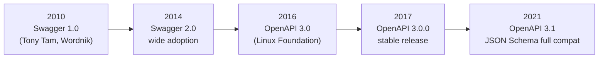
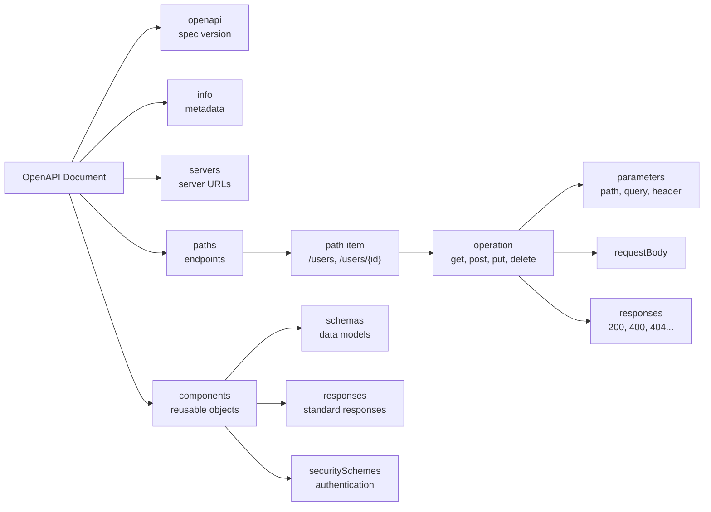
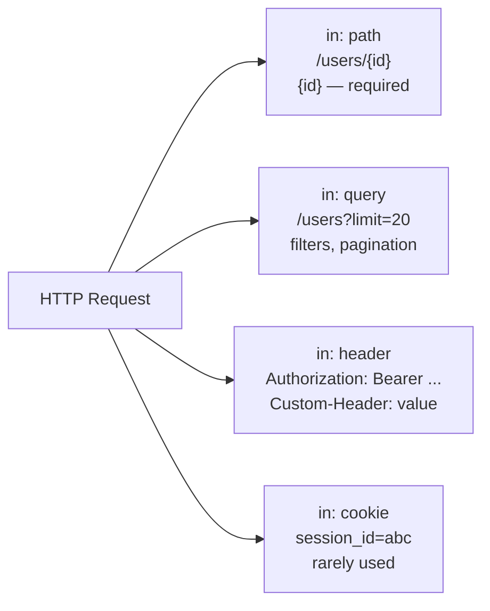

# Level 7: OpenAPI — Specification Basics

## Analogy: API as a Construction Blueprint

Imagine you're building a house. An architect draws up a blueprint — a precise document that specifies everything: room layout, door sizes, where pipes and wires run.

**All construction participants work from this blueprint simultaneously:**
- Builders (backend) lay walls and run utilities
- Interior designers (frontend) plan furniture placement
- Inspector (QA/tests) checks everything matches the project
- Client (product manager) sees exactly what will be built

**OpenAPI is the blueprint for your API.** While the backend is still writing code, the frontend already knows what data will arrive and in what format. Tests automatically verify conformance. Documentation generates itself.

---

## History: From Swagger to OpenAPI



**Swagger** was the original name of the format, created at Wordnik in 2010 for auto-generating documentation. In 2016, the project was handed over to the Linux Foundation under the name **OpenAPI Initiative**. Today, Swagger is the name of the tools (Swagger UI, Swagger Editor), not the format itself.

---

## Document Structure



### Required Sections

| Section  | Required | Description |
|---------|----------|-------------|
| openapi | ✅ yes   | Specification version |
| info    | ✅ yes   | API name, version, contacts |
| paths   | ✅ yes   | All endpoints |
| servers | no       | Base server URLs |
| components | no    | Reusable objects |

---

## The info Section

```yaml
info:
  title: Todo API                  # name (required)
  version: "1.0.0"                 # API version (required, not to be confused with openapi)
  description: |
    Multi-line API description.
    Supports Markdown.
  contact:
    name: API Support Team
    email: api@example.com
    url: https://example.com/support
  license:
    name: MIT
    url: https://opensource.org/licenses/MIT
```

⚠️ **Common mistake:** The `version` in the `info` section is **your API version** (v1, v2, 1.0.0), not the OpenAPI specification version. The spec version is the `openapi` field at the root of the document.

---

## The servers Section

```yaml
servers:
  - url: https://api.example.com/v1
    description: Production (main server)

  - url: https://staging-api.example.com/v1
    description: Staging (testing)

  - url: http://localhost:{port}/v1
    description: Local development
    variables:
      port:
        default: "3000"
        enum: ["3000", "8080"]
        description: Server port
```

💡 Swagger UI will show a dropdown of servers — the user can switch between Production and Staging right in the documentation.

---

## The paths Section: Describing Endpoints

Each key in `paths` is a URL template. The value is a **path item** with operations keyed by HTTP methods.

```yaml
paths:
  /tasks:               # path (without base URL from servers)
    get:                # HTTP method → operation object
      summary: List tasks              # short description
      description: Returns all user tasks  # expanded description
      operationId: listTasks             # unique ID (for code generation)
      tags: [Tasks]                      # grouping in documentation
      parameters: [...]
      responses:
        "200":
          description: Successful response
    post:
      summary: Create a task
      requestBody: {...}
      responses: {...}
```

---

## Parameters: Request Parameters

Parameters are everything that isn't in the request body. Four locations (`in`):



```yaml
parameters:
  # Path parameter — always required: true
  - name: id
    in: path
    required: true
    description: Task UUID
    schema:
      type: string
      format: uuid

  # Query parameter
  - name: limit
    in: query
    required: false
    description: Number per page
    schema:
      type: integer
      default: 20
      minimum: 1
      maximum: 100

  # Header parameter
  - name: X-Request-ID
    in: header
    required: false
    schema:
      type: string
      format: uuid
```

📌 **Rule**: Path parameters are **always** `required: true`. If a parameter is in the path (`{id}`), it must be provided — otherwise the URL is invalid.

---

## requestBody: Request Body

Used for POST, PUT, PATCH. Contains the body structure in different media types.

```yaml
requestBody:
  required: true
  description: New task data
  content:
    application/json:
      schema:
        type: object
        required: [title]
        properties:
          title:
            type: string
            minLength: 1
            maxLength: 255
          completed:
            type: boolean
            default: false
      # Example for documentation
      example:
        title: "Buy milk"
        completed: false
```

💡 One requestBody can describe multiple media types: `application/json`, `multipart/form-data`, `application/x-www-form-urlencoded`.

---

## Responses: Describing Responses

```yaml
responses:
  "200":
    description: Task found      # required field!
    headers:
      X-RateLimit-Remaining:
        schema:
          type: integer
    content:
      application/json:
        schema:
          $ref: "#/components/schemas/Task"

  "400":
    description: Invalid request
    content:
      application/json:
        schema:
          $ref: "#/components/schemas/Error"

  "404":
    description: Task not found
    content:
      application/json:
        schema:
          $ref: "#/components/schemas/Error"
```

⚠️ **Important**: Status codes in `responses` are **strings** in quotes: `"200"`, not `200`. This is an OpenAPI requirement — status can be a range (`2XX`).

---

## Data Types in Schemas

| Type      | Example Value      | format        | Application                   |
|-----------|--------------------|---------------|-------------------------------|
| `string`  | "hello"            | —             | Plain text                    |
| `string`  | "2024-01-15"       | `date`        | Date                          |
| `string`  | "2024-01-15T10:30Z"| `date-time`   | Date and time (ISO 8601)      |
| `string`  | "user@example.com" | `email`       | Email address                 |
| `string`  | "https://..."      | `uri`         | URL                           |
| `string`  | "550e8400-..."     | `uuid`        | UUID                          |
| `integer` | 42                 | `int32/int64` | Integers                      |
| `number`  | 3.14               | `float/double`| Floating point numbers        |
| `boolean` | true               | —             | Boolean value                 |
| `array`   | [1, 2, 3]          | —             | Array (needs `items`)         |
| `object`  | { "key": "val" }   | —             | Object (needs `properties`)   |

```yaml
# Example of a complex schema
Task:
  type: object
  required: [id, title, completed, createdAt]
  properties:
    id:
      type: string
      format: uuid
      readOnly: true              # only in responses, not accepted in requestBody
    title:
      type: string
      minLength: 1
      maxLength: 255
    tags:
      type: array
      items:
        type: string              # array of strings
      uniqueItems: true
    priority:
      type: string
      enum: [low, medium, high]   # enumeration of allowed values
```

---

## The components Section: Reuse

To avoid repeating the same schemas in every endpoint, move them to `components` and reference via `$ref`:

```yaml
components:
  schemas:
    Task: { ... }
    Error: { ... }

  responses:
    NotFound:
      description: Resource not found
      content:
        application/json:
          schema:
            $ref: "#/components/schemas/Error"

  parameters:
    PageLimit:
      name: limit
      in: query
      schema:
        type: integer
        default: 20

  securitySchemes:
    BearerAuth:
      type: http
      scheme: bearer
      bearerFormat: JWT
```

The reference `$ref: "#/components/schemas/Task"` means:
- `#` — current document
- `/components/schemas/Task` — path in the JSON/YAML structure

---

## Example: Complete Todo API Specification

```yaml
openapi: "3.0.3"
info:
  title: Todo API
  version: "1.0.0"

servers:
  - url: https://api.todo.example.com/v1

paths:
  /tasks:
    get:
      summary: List tasks
      parameters:
        - name: limit
          in: query
          schema:
            type: integer
            default: 20
      responses:
        "200":
          description: OK
          content:
            application/json:
              schema:
                type: array
                items:
                  $ref: "#/components/schemas/Task"

components:
  schemas:
    Task:
      type: object
      required: [id, title]
      properties:
        id:
          type: string
          format: uuid
        title:
          type: string
        completed:
          type: boolean
          default: false
```

---

## Tools

| Tool | What it does | Link |
|------------|-----------|--------|
| **Swagger Editor** | Online editor with documentation preview | editor.swagger.io |
| **Swagger UI** | Interactive documentation from spec | swagger.io/tools/swagger-ui |
| **Stoplight Studio** | Visual OpenAPI editor | stoplight.io/studio |
| **openapi-generator** | Client code generation | openapi-generator.tech |
| **Prism** | Mock server from OpenAPI spec | stoplight.io/open-source/prism |
| **Spectral** | Linter for OpenAPI documents | stoplight.io/open-source/spectral |

---

## ⚠️ Common Beginner Mistakes

### ❌ Confusing Versions

```yaml
# WRONG — what is this: OpenAPI version or API version?
info:
  version: "3.0.3"   # student copies from example, but this is the OpenAPI version!
openapi: "1.0.0"
```

```yaml
# CORRECT
openapi: "3.0.3"      # OpenAPI specification version
info:
  title: My API
  version: "1.0.0"    # version of YOUR API
```

### ❌ Missing Quotes Around Status Codes

```yaml
# WRONG
responses:
  200:             # unquoted — invalid YAML key of type integer
    description: OK
```

```yaml
# CORRECT
responses:
  "200":           # string
    description: OK
```

### ❌ Path Parameter Without required: true

```yaml
# WRONG
parameters:
  - name: id
    in: path
    # forgot required: true — invalid specification!
    schema:
      type: string
```

```yaml
# CORRECT
parameters:
  - name: id
    in: path
    required: true   # mandatory for path parameters!
    schema:
      type: string
```

### ❌ requestBody for GET Requests

```yaml
# WRONG — GET should not have a body
paths:
  /tasks:
    get:
      requestBody:    # violates HTTP semantics
        content:
          application/json:
            schema:
              type: object
```

```yaml
# CORRECT — filters via query parameters
paths:
  /tasks:
    get:
      parameters:
        - name: status
          in: query
          schema:
            type: string
```
