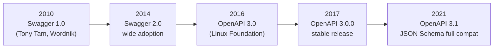
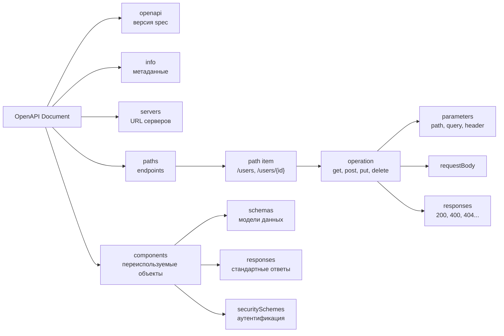
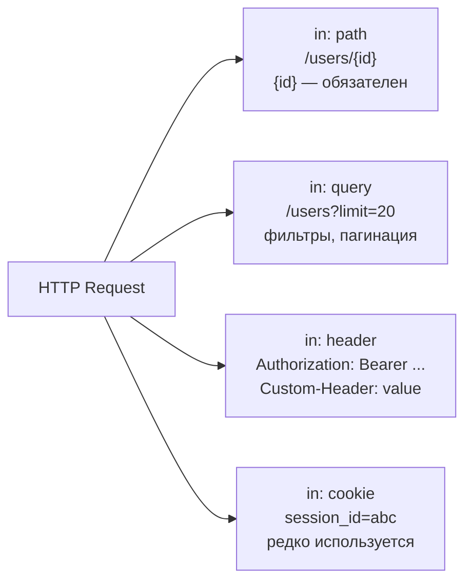

# Уровень 7: OpenAPI — основы спецификации

## Аналогия: API как строительный чертёж

Представьте, что вы строите дом. Архитектор рисует чертёж — точный документ, где указано всё:
расположение комнат, размеры дверей, где проходят трубы и провода.

По этому чертежу работают **все участники стройки одновременно**:
- Строители (backend) кладут стены и прокладывают коммуникации
- Дизайнеры интерьера (frontend) планируют расстановку мебели
- Инспектор (QA/тесты) проверяет, что всё соответствует проекту
- Заказчик (product manager) видит, что именно будет построено

**OpenAPI — это чертёж вашего API.** Пока бэкенд ещё пишет код, фронтенд уже знает,
какие данные придут и в каком формате. Тесты автоматически проверяют соответствие.
Документация генерируется сама.

---

## История: от Swagger к OpenAPI



**Swagger** — первоначальное название формата, созданного в Wordnik в 2010 году для автогенерации
документации. В 2016 году проект передали в Linux Foundation под названием **OpenAPI Initiative**.
Сегодня Swagger — это название инструментов (Swagger UI, Swagger Editor), а не самого формата.

---

## Структура документа



### Обязательные секции

| Секция  | Обязательна | Описание |
|---------|-------------|----------|
| openapi | ✅ да       | Версия спецификации |
| info    | ✅ да       | Название, версия API, контакты |
| paths   | ✅ да       | Все endpoints |
| servers | нет         | Базовые URL серверов |
| components | нет      | Переиспользуемые объекты |

---

## Секция info

```yaml
info:
  title: Todo API                  # название (обязательно)
  version: "1.0.0"                 # версия API (обязательно, не путать с openapi)
  description: |
    Многострочное описание API.
    Поддерживает Markdown.
  contact:
    name: API Support Team
    email: api@example.com
    url: https://example.com/support
  license:
    name: MIT
    url: https://opensource.org/licenses/MIT
```

⚠️ **Частая ошибка:** `version` в секции `info` — это **версия вашего API** (v1, v2, 1.0.0),
а не версия спецификации OpenAPI. Версия спецификации — это поле `openapi` в корне документа.

---

## Секция servers

```yaml
servers:
  - url: https://api.example.com/v1
    description: Production (основной сервер)

  - url: https://staging-api.example.com/v1
    description: Staging (тестирование)

  - url: http://localhost:{port}/v1
    description: Локальная разработка
    variables:
      port:
        default: "3000"
        enum: ["3000", "8080"]
        description: Порт сервера
```

💡 Swagger UI покажет выпадающий список серверов — пользователь сможет переключаться между
Production и Staging прямо в документации.

---

## Секция paths: описание endpoints

Каждый ключ в `paths` — это шаблон URL. Значение — **path item** с операциями по HTTP-методам.

```yaml
paths:
  /tasks:               # путь (без базового URL из servers)
    get:                # HTTP-метод → объект операции
      summary: Список задач              # краткое описание
      description: Возвращает все задачи пользователя  # развёрнутое
      operationId: listTasks             # уникальный ID (для генерации кода)
      tags: [Tasks]                      # группировка в документации
      parameters: [...]
      responses:
        "200":
          description: Успешный ответ
    post:
      summary: Создать задачу
      requestBody: {...}
      responses: {...}
```

---

## Parameters: параметры запроса

Параметры — всё, что не в теле запроса. Четыре места размещения (`in`):



```yaml
parameters:
  # Path parameter — всегда required: true
  - name: id
    in: path
    required: true
    description: UUID задачи
    schema:
      type: string
      format: uuid

  # Query parameter
  - name: limit
    in: query
    required: false
    description: Количество на странице
    schema:
      type: integer
      default: 20
      minimum: 1
      maximum: 100

  # Header parameter
  - name: X-Request-ID
    in: header
    required: false
    schema:
      type: string
      format: uuid
```

📌 **Правило**: Path-параметры **всегда** `required: true`. Если параметр в пути (`{id}`),
он должен быть передан — иначе URL некорректен.

---

## requestBody: тело запроса

Используется для POST, PUT, PATCH. Содержит структуру тела в разных media-типах.

```yaml
requestBody:
  required: true
  description: Данные новой задачи
  content:
    application/json:
      schema:
        type: object
        required: [title]
        properties:
          title:
            type: string
            minLength: 1
            maxLength: 255
          completed:
            type: boolean
            default: false
      # Пример для документации
      example:
        title: "Купить молоко"
        completed: false
```

💡 Один requestBody может описывать несколько media-типов: `application/json`,
`multipart/form-data`, `application/x-www-form-urlencoded`.

---

## Responses: описание ответов

```yaml
responses:
  "200":
    description: Задача найдена      # обязательное поле!
    headers:
      X-RateLimit-Remaining:
        schema:
          type: integer
    content:
      application/json:
        schema:
          $ref: "#/components/schemas/Task"

  "400":
    description: Неверный запрос
    content:
      application/json:
        schema:
          $ref: "#/components/schemas/Error"

  "404":
    description: Задача не найдена
    content:
      application/json:
        schema:
          $ref: "#/components/schemas/Error"
```

⚠️ **Важно**: Статус-коды в `responses` — **строки** в кавычках: `"200"`, не `200`.
Это требование OpenAPI — статус может быть диапазоном (`2XX`).

---

## Типы данных в схемах

| Тип       | Пример значения      | format        | Применение                    |
|-----------|----------------------|---------------|-------------------------------|
| `string`  | "hello"              | —             | Обычный текст                 |
| `string`  | "2024-01-15"         | `date`        | Дата                          |
| `string`  | "2024-01-15T10:30Z"  | `date-time`   | Дата и время (ISO 8601)       |
| `string`  | "user@example.com"   | `email`       | Email-адрес                   |
| `string`  | "https://..."        | `uri`         | URL                           |
| `string`  | "550e8400-..."       | `uuid`        | UUID                          |
| `integer` | 42                   | `int32/int64` | Целые числа                   |
| `number`  | 3.14                 | `float/double`| Числа с плавающей точкой      |
| `boolean` | true                 | —             | Булево значение               |
| `array`   | [1, 2, 3]            | —             | Массив (нужен `items`)        |
| `object`  | { "key": "val" }     | —             | Объект (нужны `properties`)   |

```yaml
# Пример сложной схемы
Task:
  type: object
  required: [id, title, completed, createdAt]
  properties:
    id:
      type: string
      format: uuid
      readOnly: true              # только в ответах, не принимается в requestBody
    title:
      type: string
      minLength: 1
      maxLength: 255
    tags:
      type: array
      items:
        type: string              # массив строк
      uniqueItems: true
    priority:
      type: string
      enum: [low, medium, high]   # перечисление допустимых значений
```

---

## Секция components: переиспользование

Чтобы не повторять одинаковые схемы в каждом endpoint, выносите их в `components`
и ссылайтесь через `$ref`:

```yaml
components:
  schemas:
    Task: { ... }
    Error: { ... }

  responses:
    NotFound:
      description: Ресурс не найден
      content:
        application/json:
          schema:
            $ref: "#/components/schemas/Error"

  parameters:
    PageLimit:
      name: limit
      in: query
      schema:
        type: integer
        default: 20

  securitySchemes:
    BearerAuth:
      type: http
      scheme: bearer
      bearerFormat: JWT
```

Ссылка `$ref: "#/components/schemas/Task"` означает:
- `#` — текущий документ
- `/components/schemas/Task` — путь в JSON/YAML-структуре

---

## Пример: полная спецификация Todo API

```yaml
openapi: "3.0.3"
info:
  title: Todo API
  version: "1.0.0"

servers:
  - url: https://api.todo.example.com/v1

paths:
  /tasks:
    get:
      summary: Список задач
      parameters:
        - name: limit
          in: query
          schema:
            type: integer
            default: 20
      responses:
        "200":
          description: OK
          content:
            application/json:
              schema:
                type: array
                items:
                  $ref: "#/components/schemas/Task"

components:
  schemas:
    Task:
      type: object
      required: [id, title]
      properties:
        id:
          type: string
          format: uuid
        title:
          type: string
        completed:
          type: boolean
          default: false
```

---

## Инструменты

| Инструмент | Что делает | Ссылка |
|------------|-----------|--------|
| **Swagger Editor** | Онлайн-редактор с превью документации | editor.swagger.io |
| **Swagger UI** | Интерактивная документация из spec | swagger.io/tools/swagger-ui |
| **Stoplight Studio** | Визуальный редактор OpenAPI | stoplight.io/studio |
| **openapi-generator** | Генерация клиентского кода | openapi-generator.tech |
| **Prism** | Mock-сервер из OpenAPI spec | stoplight.io/open-source/prism |
| **Spectral** | Линтер для OpenAPI документов | stoplight.io/open-source/spectral |

---

## ⚠️ Частые ошибки новичков

### ❌ Путаница версий

```yaml
# НЕПРАВИЛЬНО — что это: версия OpenAPI или API?
info:
  version: "3.0.3"   # студент копирует из примера, но это версия OpenAPI!
openapi: "1.0.0"
```

```yaml
# ПРАВИЛЬНО
openapi: "3.0.3"      # версия спецификации OpenAPI
info:
  title: My API
  version: "1.0.0"    # версия ВАШЕГО API
```

### ❌ Забытые кавычки у статус-кодов

```yaml
# НЕПРАВИЛЬНО
responses:
  200:             # без кавычек — невалидный YAML-ключ типа integer
    description: OK
```

```yaml
# ПРАВИЛЬНО
responses:
  "200":           # строка
    description: OK
```

### ❌ Path-параметр без required: true

```yaml
# НЕПРАВИЛЬНО
parameters:
  - name: id
    in: path
    # забыли required: true — невалидная спецификация!
    schema:
      type: string
```

```yaml
# ПРАВИЛЬНО
parameters:
  - name: id
    in: path
    required: true   # обязательно для path-параметров!
    schema:
      type: string
```

### ❌ requestBody для GET-запросов

```yaml
# НЕПРАВИЛЬНО — GET не должен иметь тело
paths:
  /tasks:
    get:
      requestBody:    # нарушение HTTP-семантики
        content:
          application/json:
            schema:
              type: object
```

```yaml
# ПРАВИЛЬНО — фильтры через query parameters
paths:
  /tasks:
    get:
      parameters:
        - name: status
          in: query
          schema:
            type: string
```
