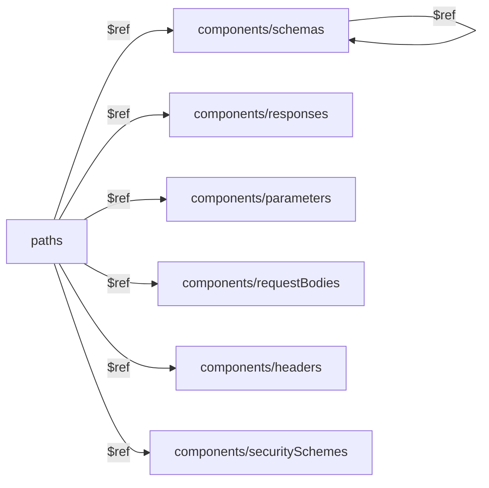

# OpenAPI — Schemas and Reuse: Detailed Theory

## $ref is Like Variables in Code

When you write JavaScript, you don't copy a function to every place where it's needed — you define it once and import it. `$ref` in OpenAPI does the same thing for data schemas.

```js
// In code: DRY through variables
const userSchema = { id: 'uuid', name: 'string', email: 'email' }
//                                                        ↑ single source of truth
function getUser() { return userSchema }
function createOrder() { return { user: userSchema } }
```

```yaml
# In OpenAPI: DRY through $ref
components:
  schemas:
    User:                            # single source of truth
      type: object
      properties:
        id: { type: string, format: uuid }
        name: { type: string }
        email: { type: string, format: email }

paths:
  /users/{id}:
    get:
      responses:
        "200":
          content:
            application/json:
              schema:
                $ref: "#/components/schemas/User"  # ← reuse

  /orders:
    get:
      responses:
        "200":
          content:
            application/json:
              schema:
                type: object
                properties:
                  user:
                    $ref: "#/components/schemas/User"  # ← reuse again
```

**The main principle:** any object in an OpenAPI document can be replaced with `$ref: "#/path/to/it"`.

---

## The components Section: Full Overview

`components` is a "warehouse" of everything reusable. Objects in `components` by themselves don't affect the API — they only work when referenced through `$ref`.



### schemas — Data Models

The most used subsection. Contains JSON Schema objects:

```yaml
components:
  schemas:
    User:
      type: object
      required: [id, name, email]
      properties:
        id:
          type: string
          format: uuid
          readOnly: true        # cannot be sent during creation
        name:
          type: string
          minLength: 2
          maxLength: 100
        email:
          type: string
          format: email
        role:
          type: string
          enum: [user, admin, moderator]
          default: user
        createdAt:
          type: string
          format: date-time
          readOnly: true
```

### responses — Standard Responses

Describe typical responses once — then reference them in any endpoint:

```yaml
components:
  responses:
    Unauthorized:
      description: Token is missing or invalid
      content:
        application/json:
          schema:
            $ref: "#/components/schemas/Error"
      headers:
        WWW-Authenticate:
          schema:
            type: string
            example: 'Bearer realm="api"'

    Forbidden:
      description: Insufficient permissions
      content:
        application/json:
          schema:
            $ref: "#/components/schemas/Error"

    NotFound:
      description: Resource not found
      content:
        application/json:
          schema:
            $ref: "#/components/schemas/Error"

    UnprocessableEntity:
      description: Validation error
      content:
        application/json:
          schema:
            $ref: "#/components/schemas/ValidationError"

    InternalServerError:
      description: Internal server error
      content:
        application/json:
          schema:
            $ref: "#/components/schemas/Error"
```

### parameters — Reusable Parameters

```yaml
components:
  parameters:
    # Path parameters
    UserId:
      name: userId
      in: path
      required: true
      description: User UUID
      schema:
        type: string
        format: uuid

    # Pagination
    Page:
      name: page
      in: query
      required: false
      schema:
        type: integer
        default: 1
        minimum: 1
      description: Page number (starting from 1)

    Limit:
      name: limit
      in: query
      required: false
      schema:
        type: integer
        default: 20
        minimum: 1
        maximum: 100
      description: Number of records per page

    # Sorting
    SortBy:
      name: sortBy
      in: query
      required: false
      schema:
        type: string
      description: Field to sort by

    SortOrder:
      name: sortOrder
      in: query
      required: false
      schema:
        type: string
        enum: [asc, desc]
        default: asc
```

### requestBodies — Request Bodies

```yaml
components:
  requestBodies:
    CreateUserBody:
      required: true
      content:
        application/json:
          schema:
            $ref: "#/components/schemas/UserCreate"
          example:
            name: "Ivan Petrov"
            email: "ivan@example.com"

# Usage:
paths:
  /users:
    post:
      requestBody:
        $ref: "#/components/requestBodies/CreateUserBody"
```

### headers — Response Headers

```yaml
components:
  headers:
    X-Rate-Limit-Remaining:
      description: Remaining number of requests
      schema:
        type: integer
    X-Rate-Limit-Reset:
      description: Unix timestamp of limit reset
      schema:
        type: integer
```

### securitySchemes — Authorization Schemes

```yaml
components:
  securitySchemes:
    BearerAuth:
      type: http
      scheme: bearer
      bearerFormat: JWT

    ApiKeyAuth:
      type: apiKey
      in: header
      name: X-API-Key

    OAuth2:
      type: oauth2
      flows:
        authorizationCode:
          authorizationUrl: https://auth.example.com/oauth/authorize
          tokenUrl: https://auth.example.com/oauth/token
          scopes:
            read: Read data
            write: Write data
```

---

## $ref Syntax

### Internal References (JSON Pointer)

```yaml
$ref: "#/components/schemas/User"
#  ^  ↑  ↑           ↑       ↑
#  |  |  |           |       object name
#  |  |  |           object type in components
#  |  |  document root (components)
#  |  # = current file
#  $ref key
```

Examples of internal references:
```yaml
$ref: "#/components/schemas/User"
$ref: "#/components/responses/NotFound"
$ref: "#/components/parameters/PageParam"
$ref: "#/components/requestBodies/CreateUser"
$ref: "#/components/headers/X-Rate-Limit"
$ref: "#/components/securitySchemes/BearerAuth"
```

### External References

```yaml
# Relative file path
$ref: "./schemas/user.yaml"
$ref: "../common/errors.yaml#/components/schemas/Error"

# Absolute URL
$ref: "https://api.example.com/openapi/schemas/common.yaml"
```

> 📌 External references are convenient for large APIs where schemas are in separate files.

---

## Schema Composition: allOf, oneOf, anyOf

### allOf — Union (Inheritance/Extension)

The resulting object must match **all** listed schemas. Used for:
- Extending a base schema with new fields
- The "base model + concrete implementation" pattern

```yaml
# Base timestamp
Timestamps:
  type: object
  properties:
    createdAt:
      type: string
      format: date-time
    updatedAt:
      type: string
      format: date-time

# Product inherits Timestamps + adds its own fields
Product:
  allOf:
    - $ref: "#/components/schemas/Timestamps"
    - type: object
      required: [id, name, price]
      properties:
        id:
          type: string
          format: uuid
        name:
          type: string
        price:
          type: number
```

### oneOf — Polymorphism (Exactly One Schema)

The object must match **exactly one** of the schemas. Always use `discriminator` to explicitly indicate the type:

```yaml
# Different notification types
Notification:
  oneOf:
    - $ref: "#/components/schemas/EmailNotification"
    - $ref: "#/components/schemas/SmsNotification"
    - $ref: "#/components/schemas/PushNotification"
  discriminator:
    propertyName: channel   # required marker field
    mapping:
      email: "#/components/schemas/EmailNotification"
      sms: "#/components/schemas/SmsNotification"
      push: "#/components/schemas/PushNotification"

EmailNotification:
  type: object
  required: [channel, to, subject, body]
  properties:
    channel:
      type: string
      enum: [email]
    to:
      type: string
      format: email
    subject:
      type: string
    body:
      type: string

SmsNotification:
  type: object
  required: [channel, phone, text]
  properties:
    channel:
      type: string
      enum: [sms]
    phone:
      type: string
    text:
      type: string
```

### anyOf — Flexible Matching (One or More)

The object must match **at least one** of the schemas:

```yaml
# Filtering can be by any combination of criteria
ProductFilter:
  anyOf:
    - $ref: "#/components/schemas/PriceRangeFilter"
    - $ref: "#/components/schemas/CategoryFilter"
    - $ref: "#/components/schemas/RatingFilter"
    - $ref: "#/components/schemas/InStockFilter"

PriceRangeFilter:
  type: object
  properties:
    minPrice: { type: number, minimum: 0 }
    maxPrice: { type: number, minimum: 0 }

CategoryFilter:
  type: object
  properties:
    categoryId: { type: string, format: uuid }

RatingFilter:
  type: object
  properties:
    minRating: { type: number, minimum: 0, maximum: 5 }
```

### Operator Comparison

| Operator | Condition | TypeScript Analogy |
|---|---|---|
| `allOf` | All schemas must match | `A & B & C` (type intersection) |
| `oneOf` | Exactly one schema matches | `A | B | C` (discriminated union) |
| `anyOf` | At least one schema matches | `Partial<A> | Partial<B>` (flexible union) |

---

## Practical Patterns

### Pattern: Base + Create + Update + Response

One of the main patterns in API design — separating schemas by purpose:

```yaml
components:
  schemas:
    # Fields for creation only (client → server)
    UserCreate:
      type: object
      required: [name, email, password]
      properties:
        name:
          type: string
          minLength: 2
          maxLength: 100
        email:
          type: string
          format: email
        password:
          type: string
          minLength: 8
          format: password

    # Modifiable fields only (PATCH)
    UserUpdate:
      type: object
      minProperties: 1         # at least one field must be provided
      properties:
        name:
          type: string
          minLength: 2
        email:
          type: string
          format: email

    # Full model (server → client)
    User:
      type: object
      required: [id, name, email, role, createdAt]
      properties:
        id:
          type: string
          format: uuid
          readOnly: true
        name:
          type: string
        email:
          type: string
          format: email
        role:
          type: string
          enum: [user, admin]
        createdAt:
          type: string
          format: date-time
          readOnly: true
```

### Pattern: PaginatedResponse — Generic via allOf

OpenAPI doesn't support generics (`Page<T>`), but they can be emulated:

```yaml
components:
  schemas:
    # Common pagination metadata
    PaginationMeta:
      type: object
      required: [total, page, limit, totalPages]
      properties:
        total:
          type: integer
          description: Total records in the database
        page:
          type: integer
          description: Current page (1-based)
        limit:
          type: integer
          description: Page size
        totalPages:
          type: integer
        hasNextPage:
          type: boolean
        hasPrevPage:
          type: boolean

    # Concrete implementation for each collection
    PaginatedUsers:
      allOf:
        - $ref: "#/components/schemas/PaginationMeta"
        - type: object
          required: [data]
          properties:
            data:
              type: array
              items:
                $ref: "#/components/schemas/User"

    PaginatedProducts:
      allOf:
        - $ref: "#/components/schemas/PaginationMeta"
        - type: object
          required: [data]
          properties:
            data:
              type: array
              items:
                $ref: "#/components/schemas/Product"
```

### Pattern: Standard Errors

```yaml
components:
  schemas:
    Error:
      type: object
      required: [code, message]
      properties:
        code:
          type: string
          description: Machine-readable error code
          example: "USER_NOT_FOUND"
        message:
          type: string
          description: Human-readable description
          example: "User with the specified ID was not found"
        details:
          type: object
          description: Additional error data

    ValidationError:
      allOf:
        - $ref: "#/components/schemas/Error"
        - type: object
          properties:
            fields:
              type: array
              items:
                type: object
                required: [field, message]
                properties:
                  field:
                    type: string
                    example: "email"
                  message:
                    type: string
                    example: "Invalid email format"
```

---

## discriminator — Explicit Polymorphism

`discriminator` works in conjunction with `oneOf`/`anyOf` and specifies which field determines the object type. This is important for code generators: they can create a proper discriminated TS union:

```yaml
Shape:
  oneOf:
    - $ref: "#/components/schemas/Circle"
    - $ref: "#/components/schemas/Rectangle"
    - $ref: "#/components/schemas/Triangle"
  discriminator:
    propertyName: shapeType
    mapping:
      circle: "#/components/schemas/Circle"
      rect: "#/components/schemas/Rectangle"
      tri: "#/components/schemas/Triangle"

Circle:
  type: object
  required: [shapeType, radius]
  properties:
    shapeType:
      type: string
      enum: [circle]
    radius:
      type: number

Rectangle:
  type: object
  required: [shapeType, width, height]
  properties:
    shapeType:
      type: string
      enum: [rect]
    width:
      type: number
    height:
      type: number
```

The generator will create this TypeScript:
```ts
type Shape =
  | { shapeType: 'circle'; radius: number }
  | { shapeType: 'rect'; width: number; height: number }
  | { shapeType: 'tri'; a: number; b: number; c: number }
```

---

## External Files

For large APIs, it's convenient to split the specification into multiple files:

```
api/
├── openapi.yaml          # main file
├── schemas/
│   ├── user.yaml
│   ├── product.yaml
│   └── order.yaml
└── paths/
    ├── users.yaml
    └── products.yaml
```

```yaml
# openapi.yaml
components:
  schemas:
    User:
      $ref: "./schemas/user.yaml"
    Product:
      $ref: "./schemas/product.yaml"

paths:
  /users:
    $ref: "./paths/users.yaml"
```

> ⚠️ Swagger UI and most tools support external `$ref`, but when deploying it's better to "bundle" the specification into a single file using `swagger-cli bundle`.

---

## Common Mistakes

### ❌ Mistake 1: $ref Alongside Other Keys

```yaml
# ❌ Other keys next to $ref are ignored!
schema:
  $ref: "#/components/schemas/User"
  description: "This field will be ignored"  # doesn't work

# ✅ Use allOf to add metadata
schema:
  allOf:
    - $ref: "#/components/schemas/User"
  description: "Now it works"
```

### ❌ Mistake 2: One Object for Everything

```yaml
# ❌ Bad: one schema for both requests and responses
User:
  properties:
    id: { type: string }        # not needed on creation
    name: { type: string }
    email: { type: string }
    password: { type: string }  # should not be returned in responses!
    createdAt: { type: string } # not needed on creation

# ✅ Good: separate schemas for different operations
UserCreate:   # only for POST /users
UserUpdate:   # only for PATCH /users/{id}
UserResponse: # only for server responses
```

### ❌ Mistake 3: Missing discriminator with oneOf

```yaml
# ❌ Bad: generators don't know how to choose the right schema
Notification:
  oneOf:
    - $ref: "#/components/schemas/EmailNotification"
    - $ref: "#/components/schemas/SmsNotification"

# ✅ Good: discriminator explicitly specified
Notification:
  oneOf:
    - $ref: "#/components/schemas/EmailNotification"
    - $ref: "#/components/schemas/SmsNotification"
  discriminator:
    propertyName: type
```

### ❌ Mistake 4: Duplicating Error Responses

```yaml
# ❌ Bad: 401/404/500 described in every endpoint
/products/{id}:
  get:
    responses:
      "401":
        description: Not authorized
        content:
          application/json:
            schema:
              type: object
              properties:
                code: { type: string }
                message: { type: string }

# ✅ Good: once in components/responses
/products/{id}:
  get:
    responses:
      "401":
        $ref: "#/components/responses/Unauthorized"
```

---

## Schema Quality Checklist

- All schemas in `components/schemas` are reused at least once
- A unified `Error` schema exists in components for errors
- Standard responses (401, 403, 404, 500) are moved to `components/responses`
- Pagination parameters are moved to `components/parameters`
- Separate `*Create`/`*Update` schemas exist for POST/PUT without server-side fields (id, createdAt)
- `oneOf`/`anyOf` use `discriminator` where applicable
- `readOnly: true` is set for fields the client cannot send
- No "monster objects" — schemas are atomic and reusable
