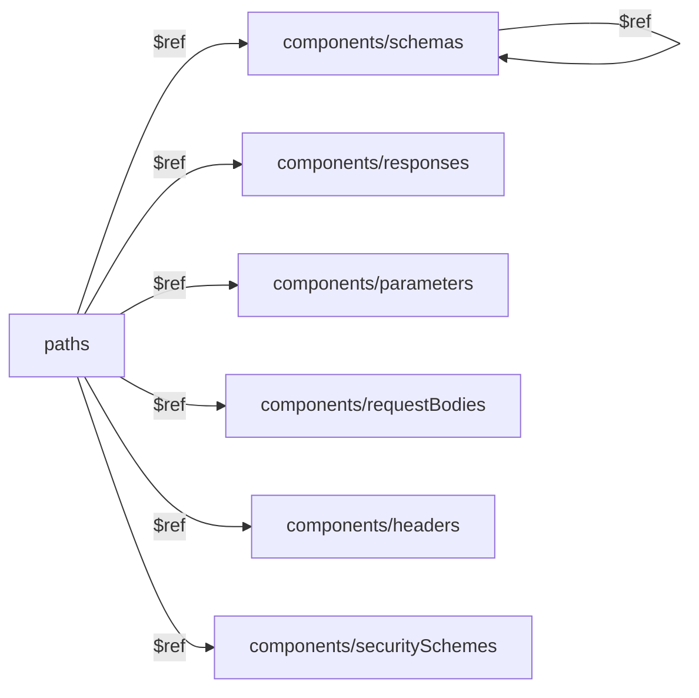

# OpenAPI — схемы и переиспользование: подробная теория

## $ref — это как переменные в коде

Когда вы пишете JavaScript, вы не копируете функцию в каждое место где она нужна — вы выносите её один раз и импортируете. `$ref` в OpenAPI делает то же самое для схем данных.

```js
// В коде: DRY через переменные
const userSchema = { id: 'uuid', name: 'string', email: 'email' }
//                                                        ↑ один источник истины
function getUser() { return userSchema }
function createOrder() { return { user: userSchema } }
```

```yaml
# В OpenAPI: DRY через $ref
components:
  schemas:
    User:                            # один источник истины
      type: object
      properties:
        id: { type: string, format: uuid }
        name: { type: string }
        email: { type: string, format: email }

paths:
  /users/{id}:
    get:
      responses:
        "200":
          content:
            application/json:
              schema:
                $ref: "#/components/schemas/User"  # ← переиспользование

  /orders:
    get:
      responses:
        "200":
          content:
            application/json:
              schema:
                type: object
                properties:
                  user:
                    $ref: "#/components/schemas/User"  # ← снова переиспользование
```

**Главный принцип:** любой объект в OpenAPI-документе можно заменить на `$ref: "#/path/to/it"`.

---

## Секция components: полный обзор

`components` — это "склад" всего переиспользуемого. Сами по себе объекты в `components` никак не влияют на API — они начинают работать только тогда, когда на них ссылаются через `$ref`.



### schemas — модели данных

Самая используемая подсекция. Здесь хранятся JSON Schema объекты:

```yaml
components:
  schemas:
    User:
      type: object
      required: [id, name, email]
      properties:
        id:
          type: string
          format: uuid
          readOnly: true        # нельзя отправить при создании
        name:
          type: string
          minLength: 2
          maxLength: 100
        email:
          type: string
          format: email
        role:
          type: string
          enum: [user, admin, moderator]
          default: user
        createdAt:
          type: string
          format: date-time
          readOnly: true
```

### responses — стандартные ответы

Опишите типовые ответы один раз — и ссылайтесь на них в любом endpoint:

```yaml
components:
  responses:
    Unauthorized:
      description: Токен отсутствует или недействителен
      content:
        application/json:
          schema:
            $ref: "#/components/schemas/Error"
      headers:
        WWW-Authenticate:
          schema:
            type: string
            example: 'Bearer realm="api"'

    Forbidden:
      description: Недостаточно прав
      content:
        application/json:
          schema:
            $ref: "#/components/schemas/Error"

    NotFound:
      description: Ресурс не найден
      content:
        application/json:
          schema:
            $ref: "#/components/schemas/Error"

    UnprocessableEntity:
      description: Ошибка валидации
      content:
        application/json:
          schema:
            $ref: "#/components/schemas/ValidationError"

    InternalServerError:
      description: Внутренняя ошибка сервера
      content:
        application/json:
          schema:
            $ref: "#/components/schemas/Error"
```

### parameters — переиспользуемые параметры

```yaml
components:
  parameters:
    # Path parameters
    UserId:
      name: userId
      in: path
      required: true
      description: UUID пользователя
      schema:
        type: string
        format: uuid

    # Pagination
    Page:
      name: page
      in: query
      required: false
      schema:
        type: integer
        default: 1
        minimum: 1
      description: Номер страницы (начиная с 1)

    Limit:
      name: limit
      in: query
      required: false
      schema:
        type: integer
        default: 20
        minimum: 1
        maximum: 100
      description: Количество записей на странице

    # Sorting
    SortBy:
      name: sortBy
      in: query
      required: false
      schema:
        type: string
      description: Поле для сортировки

    SortOrder:
      name: sortOrder
      in: query
      required: false
      schema:
        type: string
        enum: [asc, desc]
        default: asc
```

### requestBodies — тела запросов

```yaml
components:
  requestBodies:
    CreateUserBody:
      required: true
      content:
        application/json:
          schema:
            $ref: "#/components/schemas/UserCreate"
          example:
            name: "Иван Петров"
            email: "ivan@example.com"

# Использование:
paths:
  /users:
    post:
      requestBody:
        $ref: "#/components/requestBodies/CreateUserBody"
```

### headers — заголовки ответов

```yaml
components:
  headers:
    X-Rate-Limit-Remaining:
      description: Оставшееся количество запросов
      schema:
        type: integer
    X-Rate-Limit-Reset:
      description: Unix timestamp сброса лимита
      schema:
        type: integer
```

### securitySchemes — схемы авторизации

```yaml
components:
  securitySchemes:
    BearerAuth:
      type: http
      scheme: bearer
      bearerFormat: JWT

    ApiKeyAuth:
      type: apiKey
      in: header
      name: X-API-Key

    OAuth2:
      type: oauth2
      flows:
        authorizationCode:
          authorizationUrl: https://auth.example.com/oauth/authorize
          tokenUrl: https://auth.example.com/oauth/token
          scopes:
            read: Чтение данных
            write: Запись данных
```

---

## Синтаксис $ref

### Внутренние ссылки (JSON Pointer)

```yaml
$ref: "#/components/schemas/User"
#  ^  ↑  ↑           ↑       ↑
#  |  |  |           |       имя объекта
#  |  |  |           тип объекта в components
#  |  |  корень документа (components)
#  |  # = текущий файл
#  ключ $ref
```

Примеры внутренних ссылок:
```yaml
$ref: "#/components/schemas/User"
$ref: "#/components/responses/NotFound"
$ref: "#/components/parameters/PageParam"
$ref: "#/components/requestBodies/CreateUser"
$ref: "#/components/headers/X-Rate-Limit"
$ref: "#/components/securitySchemes/BearerAuth"
```

### Внешние ссылки

```yaml
# Относительный путь к файлу
$ref: "./schemas/user.yaml"
$ref: "../common/errors.yaml#/components/schemas/Error"

# Абсолютный URL
$ref: "https://api.example.com/openapi/schemas/common.yaml"
```

> 📌 Внешние ссылки удобны для больших API, где схемы вынесены в отдельные файлы.

---

## Композиция схем: allOf, oneOf, anyOf

### allOf — объединение (наследование/расширение)

Итоговый объект должен соответствовать **всем** перечисленным схемам. Используется для:
- Расширения базовой схемы новыми полями
- Паттерна "базовая модель + конкретная реализация"

```yaml
# Базовая временная метка
Timestamps:
  type: object
  properties:
    createdAt:
      type: string
      format: date-time
    updatedAt:
      type: string
      format: date-time

# Product наследует Timestamps + добавляет свои поля
Product:
  allOf:
    - $ref: "#/components/schemas/Timestamps"
    - type: object
      required: [id, name, price]
      properties:
        id:
          type: string
          format: uuid
        name:
          type: string
        price:
          type: number
```

### oneOf — полиморфизм (ровно одна схема)

Объект должен соответствовать **ровно одной** из схем. Обязательно используйте `discriminator` для явного указания типа:

```yaml
# Разные типы уведомлений
Notification:
  oneOf:
    - $ref: "#/components/schemas/EmailNotification"
    - $ref: "#/components/schemas/SmsNotification"
    - $ref: "#/components/schemas/PushNotification"
  discriminator:
    propertyName: channel   # обязательное поле-маркер
    mapping:
      email: "#/components/schemas/EmailNotification"
      sms: "#/components/schemas/SmsNotification"
      push: "#/components/schemas/PushNotification"

EmailNotification:
  type: object
  required: [channel, to, subject, body]
  properties:
    channel:
      type: string
      enum: [email]
    to:
      type: string
      format: email
    subject:
      type: string
    body:
      type: string

SmsNotification:
  type: object
  required: [channel, phone, text]
  properties:
    channel:
      type: string
      enum: [sms]
    phone:
      type: string
    text:
      type: string
```

### anyOf — гибкое соответствие (одна или несколько)

Объект должен соответствовать **хотя бы одной** из схем:

```yaml
# Фильтрация может быть по любой комбинации критериев
ProductFilter:
  anyOf:
    - $ref: "#/components/schemas/PriceRangeFilter"
    - $ref: "#/components/schemas/CategoryFilter"
    - $ref: "#/components/schemas/RatingFilter"
    - $ref: "#/components/schemas/InStockFilter"

PriceRangeFilter:
  type: object
  properties:
    minPrice: { type: number, minimum: 0 }
    maxPrice: { type: number, minimum: 0 }

CategoryFilter:
  type: object
  properties:
    categoryId: { type: string, format: uuid }

RatingFilter:
  type: object
  properties:
    minRating: { type: number, minimum: 0, maximum: 5 }
```

### Сравнение операторов

| Оператор | Условие | Аналогия в TypeScript |
|---|---|---|
| `allOf` | Все схемы должны совпасть | `A & B & C` (пересечение типов) |
| `oneOf` | Ровно одна схема совпадает | `A \| B \| C` (дискриминированное объединение) |
| `anyOf` | Хотя бы одна схема совпадает | `Partial<A> \| Partial<B>` (гибкое объединение) |

---

## Практические паттерны

### Паттерн: Base + Create + Update + Response

Один из главных паттернов в API-дизайне — разделение схем по назначению:

```yaml
components:
  schemas:
    # Только поля для создания (клиент → сервер)
    UserCreate:
      type: object
      required: [name, email, password]
      properties:
        name:
          type: string
          minLength: 2
          maxLength: 100
        email:
          type: string
          format: email
        password:
          type: string
          minLength: 8
          format: password

    # Только изменяемые поля (PATCH)
    UserUpdate:
      type: object
      minProperties: 1         # хотя бы одно поле должно быть указано
      properties:
        name:
          type: string
          minLength: 2
        email:
          type: string
          format: email

    # Полная модель (сервер → клиент)
    User:
      type: object
      required: [id, name, email, role, createdAt]
      properties:
        id:
          type: string
          format: uuid
          readOnly: true
        name:
          type: string
        email:
          type: string
          format: email
        role:
          type: string
          enum: [user, admin]
        createdAt:
          type: string
          format: date-time
          readOnly: true
```

### Паттерн: PaginatedResponse — generic через allOf

OpenAPI не поддерживает generics (`Page<T>`), но их можно имитировать:

```yaml
components:
  schemas:
    # Общая мета-информация пагинации
    PaginationMeta:
      type: object
      required: [total, page, limit, totalPages]
      properties:
        total:
          type: integer
          description: Всего записей в базе
        page:
          type: integer
          description: Текущая страница (1-based)
        limit:
          type: integer
          description: Размер страницы
        totalPages:
          type: integer
        hasNextPage:
          type: boolean
        hasPrevPage:
          type: boolean

    # Конкретная реализация для каждой коллекции
    PaginatedUsers:
      allOf:
        - $ref: "#/components/schemas/PaginationMeta"
        - type: object
          required: [data]
          properties:
            data:
              type: array
              items:
                $ref: "#/components/schemas/User"

    PaginatedProducts:
      allOf:
        - $ref: "#/components/schemas/PaginationMeta"
        - type: object
          required: [data]
          properties:
            data:
              type: array
              items:
                $ref: "#/components/schemas/Product"
```

### Паттерн: стандартные ошибки

```yaml
components:
  schemas:
    Error:
      type: object
      required: [code, message]
      properties:
        code:
          type: string
          description: Машиночитаемый код ошибки
          example: "USER_NOT_FOUND"
        message:
          type: string
          description: Человекочитаемое описание
          example: "Пользователь с указанным ID не найден"
        details:
          type: object
          description: Дополнительные данные об ошибке

    ValidationError:
      allOf:
        - $ref: "#/components/schemas/Error"
        - type: object
          properties:
            fields:
              type: array
              items:
                type: object
                required: [field, message]
                properties:
                  field:
                    type: string
                    example: "email"
                  message:
                    type: string
                    example: "Некорректный формат email"
```

---

## discriminator — явный полиморфизм

`discriminator` работает совместно с `oneOf`/`anyOf` и указывает, по какому полю определять тип объекта. Это важно для генераторов кода: они смогут создать правильную дискриминированную TS-union:

```yaml
Shape:
  oneOf:
    - $ref: "#/components/schemas/Circle"
    - $ref: "#/components/schemas/Rectangle"
    - $ref: "#/components/schemas/Triangle"
  discriminator:
    propertyName: shapeType
    mapping:
      circle: "#/components/schemas/Circle"
      rect: "#/components/schemas/Rectangle"
      tri: "#/components/schemas/Triangle"

Circle:
  type: object
  required: [shapeType, radius]
  properties:
    shapeType:
      type: string
      enum: [circle]
    radius:
      type: number

Rectangle:
  type: object
  required: [shapeType, width, height]
  properties:
    shapeType:
      type: string
      enum: [rect]
    width:
      type: number
    height:
      type: number
```

Генератор создаст такой TypeScript:
```ts
type Shape =
  | { shapeType: 'circle'; radius: number }
  | { shapeType: 'rect'; width: number; height: number }
  | { shapeType: 'tri'; a: number; b: number; c: number }
```

---

## Внешние файлы

Для крупных API удобно разбивать спецификацию на несколько файлов:

```
api/
├── openapi.yaml          # главный файл
├── schemas/
│   ├── user.yaml
│   ├── product.yaml
│   └── order.yaml
└── paths/
    ├── users.yaml
    └── products.yaml
```

```yaml
# openapi.yaml
components:
  schemas:
    User:
      $ref: "./schemas/user.yaml"
    Product:
      $ref: "./schemas/product.yaml"

paths:
  /users:
    $ref: "./paths/users.yaml"
```

> ⚠️ Swagger UI и большинство инструментов поддерживают внешние `$ref`, но при деплое лучше "собирать" спецификацию в один файл через `swagger-cli bundle`.

---

## Частые ошибки

### ❌ Ошибка 1: $ref рядом с другими ключами

```yaml
# ❌ Другие ключи при $ref игнорируются!
schema:
  $ref: "#/components/schemas/User"
  description: "Это поле будет проигнорировано"  # не работает

# ✅ Используйте allOf для добавления мета-информации
schema:
  allOf:
    - $ref: "#/components/schemas/User"
  description: "Теперь работает"
```

### ❌ Ошибка 2: Один объект "на все случаи"

```yaml
# ❌ Плохо: одна схема и для запросов, и для ответов
User:
  properties:
    id: { type: string }        # не нужен при создании
    name: { type: string }
    email: { type: string }
    password: { type: string }  # нельзя возвращать в ответе!
    createdAt: { type: string } # не нужен при создании

# ✅ Хорошо: разные схемы для разных операций
UserCreate:   # только для POST /users
UserUpdate:   # только для PATCH /users/{id}
UserResponse: # только для ответов сервера
```

### ❌ Ошибка 3: Отсутствие discriminator при oneOf

```yaml
# ❌ Плохо: генераторы не знают, как выбрать нужную схему
Notification:
  oneOf:
    - $ref: "#/components/schemas/EmailNotification"
    - $ref: "#/components/schemas/SmsNotification"

# ✅ Хорошо: явно указан discriminator
Notification:
  oneOf:
    - $ref: "#/components/schemas/EmailNotification"
    - $ref: "#/components/schemas/SmsNotification"
  discriminator:
    propertyName: type
```

### ❌ Ошибка 4: Дублирование ответов ошибок

```yaml
# ❌ Плохо: 401/404/500 описаны в каждом endpoint
/products/{id}:
  get:
    responses:
      "401":
        description: Не авторизован
        content:
          application/json:
            schema:
              type: object
              properties:
                code: { type: string }
                message: { type: string }

# ✅ Хорошо: один раз в components/responses
/products/{id}:
  get:
    responses:
      "401":
        $ref: "#/components/responses/Unauthorized"
```

---

## Чеклист качества схем

- Все схемы в `components/schemas` переиспользуются хотя бы один раз
- Для ошибок есть единая схема `Error` в components
- Стандартные ответы (401, 403, 404, 500) вынесены в `components/responses`
- Параметры пагинации вынесены в `components/parameters`
- Для POST/PUT есть отдельные `*Create`/`*Update` схемы без серверных полей (id, createdAt)
- `oneOf`/`anyOf` используют `discriminator` где применимо
- `readOnly: true` проставлено для полей, которые нельзя отправить клиенту
- Нет "монстр-объектов" — схемы атомарны и переиспользуемы
