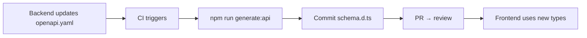

# Code and SDK Generation: Detailed Breakdown

## Analogy: Specification as a Casting Mold

Think of an OpenAPI specification as a **metal casting mold**. You create the exact mold once (the API contract), and from it you can cast anything: TypeScript types, a Python client, a Java SDK, documentation, test mocks. One mold — many products. If the mold changes — all products can be quickly recast, automatically matching the new contract.

Without a mold, everyone casts manually: the frontend developer writes interfaces, the mobile developer writes models, the QA engineer writes test schemas. They all do the same thing but synchronize it manually. When the mold (API) changes — everyone must find out on their own and update their copy.

## Contract-First vs Code-First

There are two approaches to what serves as the source of truth.

**Code-first** — the backend writes code, code generates documentation:

```
Java/Python code → annotations (@ApiOperation) → openapi.yaml → frontend
```

Pros: documentation is always current, no discrepancy. Cons: API design is dictated by implementation, not intent. Frontend only joins development when the backend is ready.

**Contract-first** — the specification is written first:

```
openapi.yaml (agreed by the team) → backend implements → frontend generates types
```

Pros: parallel development, well-thought-out API design, mocks for frontend while backend is not ready. Cons: requires discipline — the spec must stay current.

💡 For frontend developers, contract-first is especially valuable: you can start work on the day the specification is agreed upon, without waiting for the backend.

## Why Frontend Developers Need Generation

**Problem without generation:**

```typescript
// ❌ Written manually, may diverge from API
interface User {
  id: string
  name: string
  // Forgot the role field that the backend added
}

// On request, type is incorrect — error only at runtime
const user: User = await fetchUser(id)
console.log(user.role) // TypeScript doesn't know about this field
```

**With generation:**

```typescript
// ✅ Generated from openapi.yaml — always current
// src/api/schema.d.ts (auto-generated, do not edit!)
export interface User {
  id: string
  name: string
  role: 'admin' | 'user' | 'guest' // field appeared automatically
}

// TypeScript will immediately warn you if something changed
```

Three key benefits:

1. **Type safety** — TypeScript knows the exact type of every API response
2. **Autocomplete** — IDE suggests model fields without opening documentation
3. **Synchronization** — when the API changes, just re-run `npm run generate:api`

## openapi-generator: The Universal Tool

`openapi-generator` is the most feature-rich tool. Supports generation for 50+ languages: TypeScript, Java, Python, Go, Swift, and many others. This makes it ideal for teams that need a single tool for frontend, backend, and mobile.

```bash
npx @openapitools/openapi-generator-cli generate \
  -i openapi.yaml \
  -g typescript-fetch \
  -o src/api/generated \
  --additional-properties=typescriptThreePlus=true,supportsES6=true
```

Available generators for TypeScript/JS: `typescript-fetch`, `typescript-axios`, `typescript-angular`, `javascript`.

⚠️ The main drawback: requires Java Runtime (JRE) or Docker. On CI this is usually not a problem, but locally developers need to install Java. Workaround: use a Docker image or the npm wrapper `@openapitools/openapi-generator-cli`, which downloads Java automatically.

## openapi-typescript: Light and Fast

`openapi-typescript` is a minimalist tool that runs on pure Node.js. It generates only TypeScript types, no runtime code. This is its strength: you get a `.d.ts` file with types and can use any HTTP client of your choice.

```bash
npx openapi-typescript openapi.yaml -o src/api/schema.d.ts
```

The result is a strictly typed structure where every path and method has precise types for parameters, request body, and responses:

```typescript
// Type for GET /users/{id}
paths['/users/{id}']['get']['responses'][200]['content']['application/json']
// → User (automatically)
```

For convenient work with these types, there's `openapi-fetch` — a thin wrapper over the standard `fetch` that uses generated types for path, parameter, and response validation.

## orval: React Ecosystem Out of the Box

`orval` is oriented toward React developers. From a single specification, it generates a full set:

- Typed model interfaces
- React Query hooks (`useGetUser`, `useCreateUser`)
- SWR hooks (optional)
- MSW mocks for testing
- Zod/Yup validation schemas

```typescript
// orval.config.ts
export default defineConfig({
  api: {
    input: './openapi.yaml',
    output: {
      mode: 'tags-split',        // one file per tag
      target: 'src/api/generated',
      client: 'react-query',
      mock: true,                // generate MSW mocks
    },
  },
})
```

After `npx orval` you get ready-made hooks:

```typescript
// Generated automatically
function UserProfile({ id }: { id: string }) {
  const { data: user } = useGetUser(id)  // ← ready-made hook from the spec
  return <div>{user?.name}</div>
}
```

## MSW: Mocks from a Specification

Mock Service Worker (MSW) allows intercepting HTTP requests in the browser and returning test data. `orval` can generate MSW handlers directly from the specification:

```typescript
// Generated by orval
export const getUserMock = (): User => ({
  id: faker.string.uuid(),
  name: faker.person.fullName(),
  email: faker.internet.email(),
})

export const handlers = [
  http.get('/users/:id', () => {
    return HttpResponse.json(getUserMock())
  }),
]
```

Workflow with MSW:
1. Backend publishes an updated specification
2. Frontend runs `npm run generate:api`
3. Mocks update automatically
4. Development and testing continue without the real backend

## Setting Up in CI/CD

Standard team workflow:



Example GitHub Actions:

```yaml
on:
  push:
    paths:
      - 'openapi.yaml'  # only when the spec changes

jobs:
  generate:
    steps:
      - run: npm run generate:api
      - uses: stefanzweifel/git-auto-commit-action@v5
        with:
          commit_message: 'chore: regenerate API types'
```

## OpenAPI → TypeScript Types: Reference

| OpenAPI | TypeScript |
|---|---|
| `type: string` | `string` |
| `type: integer` / `type: number` | `number` |
| `type: boolean` | `boolean` |
| `type: array, items: T` | `T[]` |
| `enum: [a, b, c]` | `'a' \| 'b' \| 'c'` |
| `oneOf: [A, B]` | `A \| B` |
| `allOf: [A, B]` | `A & B` (or `interface C extends A, B`) |
| `anyOf: [A, B]` | `A \| B \| (A & B)` |
| field in `required` | required (`name: string`) |
| field outside `required` | optional (`name?: string`) |
| `format: date-time` | `string` (format only documents) |
| `format: uuid` | `string` |

⚠️ Common beginner misconceptions:

❌ "I'll edit the types manually — faster" → edits disappear on next regeneration
✅ Edit openapi.yaml, then regenerate

❌ "I generate types locally, only me" → colleagues have a different schema version
✅ Generation in CI, result committed to the repository

❌ "`format: uuid` gives type `UUID` in TypeScript" → no, it's just `string`
✅ Format is documentation only, not runtime validation

## Best Practices

📌 **Never edit generated files manually** — add a comment at the top of the file and a check in CI.

📌 **Keep `openapi.yaml` in the repository alongside the code** — version together with API changes.

📌 **Use `mode: 'tags-split'` in orval** — splitting by tags gives a clear file structure.

📌 **For monorepos** — create a `packages/api-types`, publish as an internal npm package, version together with the backend.
