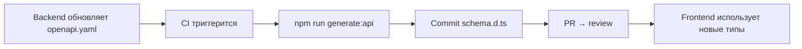

# Генерация кода и SDK: подробный разбор

## Аналогия: спецификация как форма для отливки

Представьте, что OpenAPI-спецификация — это **металлическая форма для отливки**. Один раз создаёте точную форму (контракт API), и дальше из неё можно отлить что угодно: TypeScript-типы, Python-клиент, Java-SDK, документацию, моки для тестов. Форма одна — изделий много. Если форма изменилась — все изделия можно быстро перелить заново, они автоматически соответствуют новому контракту.

Без формы каждый отливает вручную: frontend-разработчик пишет интерфейсы, мобильщик пишет модели, QA-инженер — схемы для тестов. Они все делают одно и то же, но синхронизируют это вручную. Когда форма (API) меняется — каждый должен сам об этом узнать и обновить свою копию.

## Contract-first vs Code-first

Есть два подхода к тому, что является источником истины.

**Code-first** — бэкенд пишет код, код генерирует документацию:

```
Java/Python код → аннотации (@ApiOperation) → openapi.yaml → frontend
```

Плюсы: документация всегда актуальна, нет расхождения. Минусы: дизайн API диктует реализация, а не намерение. Frontend включается в разработку только когда бэкенд готов.

**Contract-first** — спецификация пишется первой:

```
openapi.yaml (согласован командой) → backend реализует → frontend генерирует типы
```

Плюсы: параллельная разработка, продуманный дизайн API, моки для фронта пока бэкенд не готов. Минусы: требует дисциплины — спека должна оставаться актуальной.

💡 Для frontend-разработчиков contract-first особенно ценен: вы можете начать работу в день согласования спецификации, не ожидая бэкенд.

## Зачем frontend-разработчику генерация

**Проблема без генерации:**

```typescript
// ❌ Написано вручную, может расходиться с API
interface User {
  id: string
  name: string
  // Забыли поле role, которое добавил бэкенд
}

// При запросе тип неверный — ошибка только в runtime
const user: User = await fetchUser(id)
console.log(user.role) // TypeScript не знает об этом поле
```

**С генерацией:**

```typescript
// ✅ Сгенерировано из openapi.yaml — всегда актуально
// src/api/schema.d.ts (автогенерат, не редактировать!)
export interface User {
  id: string
  name: string
  role: 'admin' | 'user' | 'guest' // поле автоматически появилось
}

// TypeScript сразу предупредит если что-то изменилось
```

Три ключевые выгоды:

1. **Типобезопасность** — TypeScript знает точный тип каждого ответа API
2. **Автокомплит** — IDE подсказывает поля модели без открытия документации
3. **Синхронизация** — при изменении API достаточно перезапустить `npm run generate:api`

## openapi-generator: универсальный инструмент

`openapi-generator` — самый функциональный инструмент. Поддерживает генерацию для 50+ языков: TypeScript, Java, Python, Go, Swift и многих других. Это делает его идеальным для команд, где нужен единый инструмент для фронта, бэка и мобилки.

```bash
npx @openapitools/openapi-generator-cli generate \
  -i openapi.yaml \
  -g typescript-fetch \
  -o src/api/generated \
  --additional-properties=typescriptThreePlus=true,supportsES6=true
```

Доступные генераторы для TypeScript/JS: `typescript-fetch`, `typescript-axios`, `typescript-angular`, `javascript`.

⚠️ Главный минус: требует Java Runtime (JRE) или Docker. На CI это обычно не проблема, но локально разработчику нужно ставить Java. Обход — использовать Docker-образ или npm-обёртку `@openapitools/openapi-generator-cli`, которая скачает Java автоматически.

## openapi-typescript: лёгкий и быстрый

`openapi-typescript` — минималистичный инструмент, работает на чистом Node.js. Генерирует только TypeScript-типы, без runtime-кода. Это его сила: вы получаете файл `.d.ts` с типами и используете любой HTTP-клиент на своё усмотрение.

```bash
npx openapi-typescript openapi.yaml -o src/api/schema.d.ts
```

Результат — строго типизированная структура, где каждый путь и метод имеет точные типы для параметров, тела запроса и ответов:

```typescript
// Тип для GET /users/{id}
paths['/users/{id}']['get']['responses'][200]['content']['application/json']
// → User (автоматически)
```

Для удобства работы с этими типами есть `openapi-fetch` — тонкая обёртка над стандартным `fetch`, которая использует сгенерированные типы для проверки путей, параметров и ответов.

## orval: React-экосистема из коробки

`orval` ориентирован на React-разработчиков. Из одной спецификации он генерирует полный набор:

- Типизированные интерфейсы моделей
- React Query хуки (`useGetUser`, `useCreateUser`)
- SWR-хуки (по выбору)
- MSW-моки для тестирования
- Zod/Yup схемы валидации

```typescript
// orval.config.ts
export default defineConfig({
  api: {
    input: './openapi.yaml',
    output: {
      mode: 'tags-split',        // по одному файлу на тег
      target: 'src/api/generated',
      client: 'react-query',
      mock: true,                // генерировать MSW-моки
    },
  },
})
```

После `npx orval` вы получаете готовые хуки:

```typescript
// Сгенерировано автоматически
function UserProfile({ id }: { id: string }) {
  const { data: user } = useGetUser(id)  // ← готовый хук из спеки
  return <div>{user?.name}</div>
}
```

## MSW: моки из спецификации

Mock Service Worker (MSW) позволяет перехватывать HTTP-запросы в браузере и возвращать тестовые данные. `orval` умеет генерировать MSW-хэндлеры прямо из спецификации:

```typescript
// Сгенерировано orval
export const getUserMock = (): User => ({
  id: faker.string.uuid(),
  name: faker.person.fullName(),
  email: faker.internet.email(),
})

export const handlers = [
  http.get('/users/:id', () => {
    return HttpResponse.json(getUserMock())
  }),
]
```

Workflow с MSW:
1. Backend публикует обновлённую спецификацию
2. Frontend запускает `npm run generate:api`
3. Моки обновляются автоматически
4. Разработка и тесты продолжаются без реального бэкенда

## Настройка в CI/CD

Стандартный workflow для команд:



Пример GitHub Actions:

```yaml
on:
  push:
    paths:
      - 'openapi.yaml'  # только при изменении спеки

jobs:
  generate:
    steps:
      - run: npm run generate:api
      - uses: stefanzweifel/git-auto-commit-action@v5
        with:
          commit_message: 'chore: regenerate API types'
```

## Типы OpenAPI → TypeScript: справочник

| OpenAPI | TypeScript |
|---|---|
| `type: string` | `string` |
| `type: integer` / `type: number` | `number` |
| `type: boolean` | `boolean` |
| `type: array, items: T` | `T[]` |
| `enum: [a, b, c]` | `'a' \| 'b' \| 'c'` |
| `oneOf: [A, B]` | `A \| B` |
| `allOf: [A, B]` | `A & B` (или `interface C extends A, B`) |
| `anyOf: [A, B]` | `A \| B \| (A & B)` |
| поле в `required` | обязательное (`name: string`) |
| поле вне `required` | опциональное (`name?: string`) |
| `format: date-time` | `string` (формат только документирует) |
| `format: uuid` | `string` |

⚠️ Распространённые заблуждения начинающих:

❌ "Изменю типы вручную — быстрее" → при следующей регенерации правки исчезнут
✅ Правки в openapi.yaml, затем регенерация

❌ "Генерирую типы локально только я" → у коллег другая версия схемы
✅ Генерация в CI, результат коммитится в репозиторий

❌ "`format: uuid` даёт тип `UUID` в TypeScript" → нет, это просто `string`
✅ Формат — только документация, не runtime-валидация

## Лучшие практики

📌 **Никогда не редактируйте сгенерированные файлы вручную** — добавьте комментарий в начало файла и проверку в CI.

📌 **Держите `openapi.yaml` в репозитории рядом с кодом** — versioning вместе с API-изменениями.

📌 **Используйте `mode: 'tags-split'` в orval** — разбивка по тегам даёт понятную структуру файлов.

📌 **Для монорепо** — выделите `packages/api-types`, публикуйте как внутренний npm-пакет, версионируйте вместе с бэкендом.
