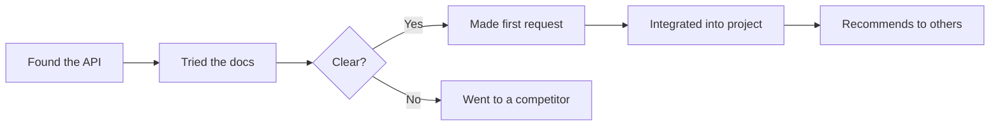
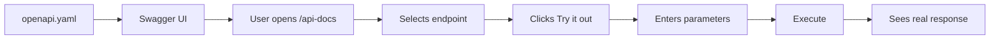
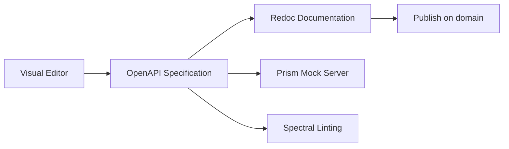

# API Documentation: From Reference to Developer Experience

## Analogy: API Documentation as a Restaurant Menu

Imagine walking into a restaurant. The menu is the documentation. A good menu: dish name, ingredients, photo, prep time, price, allergen notes. A bad menu: a list of 200 items with no description.

It's the same with an API. The developer is a hungry customer. They want to quickly understand what the API can do, choose the right endpoint, and get results. If the menu is confusing — they'll go to another restaurant.

```
Good menu (documentation):
  "Carbonara" — pasta, guanciale, egg, pecorino, black pepper
  Time: 20 min | Price: $12 | Photo ✓ | Recipe ✓

Bad menu:
  Dish #247: pasta_carbonara
  Parameters: type=pasta, sauce_id=42
  (what's inside — unknown)
```

API documentation is not a reference for yourself. It's a **product for developers**.

---

## Developer Experience (DX) — Why It Matters

**DX** is the total impression a developer gets when working with your API: from first contact to production integration.



📌 Stripe spent years on documentation — and it became their main competitive advantage. Developers choose Stripe not only for functionality, but because it's **pleasant to work with**.

**Metrics of good DX:**
- Time to First Hello World (TTFHW) — time to the first working request
- Time to Integration — time from discovery to production
- Number of support tickets (the fewer — the better the DX)

---

## Elements of Good Documentation

### Getting Started

The first thing a developer sees. The goal — a working request within **5 minutes**.

❌ Bad: documentation starts with a 10-page conceptual introduction.

✅ Good:
```markdown
## Quickstart (5 minutes)

1. Get an API key: https://dashboard.example.com/keys
2. Install the SDK: npm install @example/api
3. Make your first request:

const { ExampleAPI } = require('@example/api')
const api = new ExampleAPI('your_api_key')

const users = await api.users.list({ limit: 10 })
console.log(users.data) // [{ id: 'usr_1', name: 'Alice', ... }]
```

💡 Stripe is the best example. Their quickstart shows a real payment in 5 minutes, including an HTML form.

---

### Authentication

The developer needs to understand: how to get credentials, how to send them, what to do if they expire.

❌ Bad:
```
Authorization: Bearer <token>
```

✅ Good:
```markdown
## Authentication

All requests require an API key in the header:
Authorization: Bearer sk_live_xxxxx

Obtaining a key:
  1. Create an account at dashboard.example.com
  2. Go to Settings → API Keys
  3. Click "Create new key"

Key types:
  sk_live_xxx — production (keep secret!)
  sk_test_xxx — sandbox (for development and testing)

Key expired? → POST /auth/refresh
  { "refreshToken": "rt_xxx" }
```

---

### Reference (Endpoint Documentation)

A complete description of each endpoint: method, path, all parameters, request body, possible responses.

❌ Bad:
```
GET /users — returns list of users
POST /users — creates a user
```

✅ Good:
```markdown
## POST /users
Create a new user.

Request body (application/json):
  name        string   required   Display name (1-100 characters)
  email       string   required   Email (unique)
  role        string   optional   "admin" | "user" (default: "user")
  metadata    object   optional   Arbitrary key-value data

Response:
  201 Created — User object
  400 Bad Request — validation errors
  409 Conflict — email already taken

Example:
  curl -X POST https://api.example.com/users \
    -H "Authorization: Bearer sk_test_xxx" \
    -d '{"name":"Alice","email":"alice@example.com"}'
```

---

### Code Examples in Multiple Languages

Developers copy examples. A cURL example works everywhere. Examples in popular languages speed up integration manyfold.

```javascript
// JavaScript/TypeScript
const user = await api.users.create({
  name: 'Alice',
  email: 'alice@example.com',
})

# Python
user = api.users.create(
    name="Alice",
    email="alice@example.com"
)

// Go
user, err := client.Users.Create(ctx, &UserCreateParams{
    Name:  "Alice",
    Email: "alice@example.com",
})
```

💡 Stripe shows examples in 8 languages with a toggle right in the documentation. It has become the industry standard.

---

### Error Codes

Error handling is 30% of integration work. The developer needs to know every code.

❌ Bad:
```
Returns 400 if invalid, 500 on server error
```

✅ Good:
```markdown
## Error Codes

All error format:
{
  "error": {
    "code": "validation_error",
    "message": "Validation failed",
    "errors": [{ "field": "email", "message": "Invalid email format" }]
  }
}

Codes:
  400 validation_error    — invalid request data
      → Check the "errors" field in the response body

  401 unauthorized        — missing or invalid API key
      → Check the Authorization header

  403 forbidden           — insufficient permissions
      → Check your API key permissions

  404 not_found           — resource not found
      → Check the ID in the URL

  409 conflict            — conflict (e.g., email taken)
      → Use a different email

  429 rate_limit_exceeded — request limit exceeded
      → Wait X-RateLimit-Reset seconds

  500 server_error        — server error
      → Retry after 30 seconds
```

---

### Rate Limits

```markdown
## Request Limits

Free tier:  100 requests / minute
Pro tier:   1,000 requests / minute
Enterprise: No limits

Every response contains headers:
  X-RateLimit-Limit:     100
  X-RateLimit-Remaining: 87
  X-RateLimit-Reset:     1705315200  (Unix timestamp)

When exceeded:
  HTTP 429 Too Many Requests
  Retry-After: 42  (seconds until reset)
```

---

### Changelog and Versioning

Breaking changes without a changelog are a disaster for production integrations.

```markdown
## Changelog

### v2.3.0 — 2024-01-15
✨ Added:
  - Bulk user creation: POST /users/bulk
  - `metadata` field on User object

💥 Breaking changes:
  - /users pagination is now cursor-based (not offset)
    Replace: ?page=2&limit=10
    With:    ?cursor=cur_xxx&limit=10

🐛 Fixed:
  - Race condition fix during concurrent updates

### v2.2.0 — 2024-01-01
⚠️ Deprecated: role_id field (removed in v2.3)
   Use role: 'admin' | 'user'
```

---

## Swagger UI: Interactive Documentation

Swagger UI generates an interactive interface directly from an OpenAPI specification. The main feature — **Try it out**: execute a request to the real API right in the browser.



```javascript
// Integration in Express.js
import swaggerUi from 'swagger-ui-express'
import swaggerDoc from './openapi.json'

app.use('/api-docs', swaggerUi.serve, swaggerUi.setup(swaggerDoc, {
  swaggerOptions: {
    persistAuthorization: true,  // Don't reset token on navigation
  },
}))
```

⚠️ Swagger UI is a great tool for a development team, but **not ideal for a public developer portal**: the design is outdated, there's no good navigation.

---

## Redoc: Beautiful Static Documentation

Redoc creates a three-column layout with excellent typography. Ideal for external documentation.

```
┌────────────┬──────────────────────┬─────────────────────┐
│ Navigation │  Endpoint Description │  Code Examples      │
│            │                      │                     │
│ > Users    │  POST /users         │  curl -X POST \     │
│   List     │  Create a new user.  │    -d '{"name":...}'│
│   Create   │                      │                     │
│   Update   │  Parameters:         │  Response:          │
│   Delete   │    name: string      │  {                  │
│            │    email: string     │    "id": "usr_123"  │
│ > Orders   │                      │  }                  │
└────────────┴──────────────────────┴─────────────────────┘
```

```html
<!-- Simplest deployment — a single HTML file -->
<!DOCTYPE html>
<html>
  <body>
    <redoc spec-url="./openapi.yaml"></redoc>
    <script src="https://cdn.redoc.ly/redoc/latest/bundles/redoc.standalone.js"></script>
  </body>
</html>
```

💡 Redoc is the #1 choice for a public developer portal when there's no budget for Stoplight.

---

## Stoplight: Complete Platform

Stoplight is not just a documentation generator, but a complete platform for API work:



**Prism** — a mock server that reads OpenAPI and responds to requests with fake data:

```bash
# Start the mock server
npx @stoplight/prism-cli mock openapi.yaml

# Now you can make requests to localhost:4010
curl http://localhost:4010/users
# → [{"id": "usr_abc", "name": "...", "email": "..."}]  ← generated automatically!
```

🔥 A mock server lets the frontend team start development **before the backend is ready**.

---

## API Explorer / Playground — Why Interactivity Matters

Interactive documentation changes the integration process dramatically:

```
Without Try it out:          With Try it out:
1. Read documentation        1. Read and try immediately
2. Write curl in terminal    2. See real response
3. Copy into code            3. Understand data structure
4. Get error                 4. Copy ready-made example
5. Read documentation again
```

Stripe Dashboard lets you view **logs of all real requests** — it's the most powerful debugging tool for developers.

---

## Examples of Outstanding Documentation

### Stripe — The Gold Standard

- Examples in 8 languages with a toggle in every code block
- Quickstart with a real payment in 5 minutes
- Test cards with predictable behavior (4242... always succeeds)
- Interactive request logs in Dashboard
- Changelog with specific dates and migration examples

### Twilio

- "Send your first SMS in 5 minutes" — literally works
- Console Debugger — search for problems in real requests
- TwiML — domain-specific language documented exhaustively

### GitHub REST API

- Complete reference with examples for every endpoint
- First-class Octokit SDK
- GraphQL Explorer in the browser

---

## Auto-Generated vs Manual Documentation

| Approach | Pros | Cons |
|----------|------|------|
| Auto-generated from code | Always up to date | Dry, technical |
| Manual documentation | Living, with examples | Becomes outdated, requires effort |
| **Hybrid** | Balance | Requires discipline |

💡 Best approach: **OpenAPI as source of truth** (generated from code or written manually) + manual guides, tutorials, and examples on top.

```
openapi.yaml ──► Swagger UI (reference)
               ──► Redoc (public portal)
               ──► SDK generation
               ──► Mock server

Manual guides: Getting Started, Tutorials, Cookbook
```

---

## Documentation Versioning

When an API has multiple versions, the documentation must also be versioned:

```
docs.example.com/v1/  — deprecated, for existing users only
docs.example.com/v2/  — current (default)
docs.example.com/v3/  — beta, for early adopters

Each version contains:
  - Migration guide from v(n-1) to v(n)
  - List of deprecated endpoints
  - End-of-support date for the old version
```

⚠️ A common mistake: removing documentation for an old API version. Users who haven't migrated yet will be left without a reference.

---

## Summary: Good Documentation Checklist

- Getting Started — working example in 5 minutes
- Authentication — all credential options
- Reference — every endpoint fully described
- Examples in cURL + at least 2-3 languages
- All error codes with explanations
- Rate limits with response headers
- Sandbox environment with test data
- Official SDKs
- Changelog with breaking changes
- Interactive sandbox (Try it out)
- Search across all documentation
