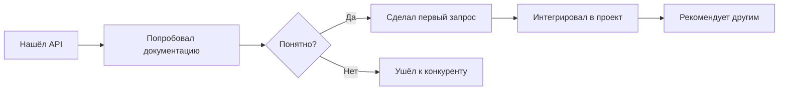
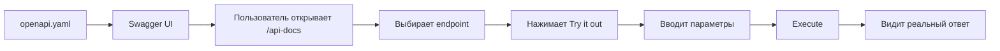
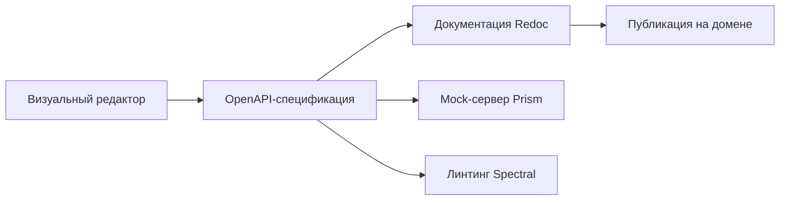

# Документация API: от справочника к Developer Experience

## Аналогия: документация API как меню ресторана

Представьте, что вы заходите в ресторан. Меню — это документация. Хорошее меню: название блюда, ингредиенты, фото, время приготовления, цена, пометки об аллергенах. Плохое меню: список из 200 позиций без описания.

С API то же самое. Разработчик — это голодный посетитель. Он хочет быстро понять, что API умеет делать, выбрать нужный endpoint и получить результат. Если меню непонятное — он уйдёт в другой ресторан.

```
Хорошее меню (документация):
  "Карбонара" — паста, гуанчале, яйцо, пекорино, чёрный перец
  Время: 20 мин | Цена: 850 руб | Фото ✓ | Рецепт ✓

Плохое меню:
  Блюдо #247: pasta_carbonara
  Параметры: type=pasta, sauce_id=42
  (что внутри — неизвестно)
```

Документация API — это не справочник для себя. Это **продукт для разработчиков**.

---

## Developer Experience (DX) — почему это важно

**DX** — это совокупность впечатлений разработчика при работе с вашим API: от первого знакомства до production-интеграции.



📌 Stripe потратил годы на документацию — и это стало их главным конкурентным преимуществом. Разработчики выбирают Stripe не только за функциональность, но за то, что с ним **приятно работать**.

**Метрики хорошего DX:**
- Time to First Hello World (TTFHW) — время до первого рабочего запроса
- Time to Integration — время от знакомства до production
- Количество обращений в поддержку (чем меньше — тем лучше DX)

---

## Элементы хорошей документации

### Getting Started / Быстрый старт

Первое, что видит разработчик. Цель — рабочий запрос за **5 минут**.

❌ Плохо: документация начинается с концептуального введения на 10 страниц.

✅ Хорошо:
```markdown
## Quickstart (5 минут)

1. Получите API-ключ: https://dashboard.example.com/keys
2. Установите SDK: npm install @example/api
3. Сделайте первый запрос:

const { ExampleAPI } = require('@example/api')
const api = new ExampleAPI('your_api_key')

const users = await api.users.list({ limit: 10 })
console.log(users.data) // [{ id: 'usr_1', name: 'Alice', ... }]
```

💡 Stripe — лучший пример. Их quickstart показывает реальный платёж за 5 минут, включая HTML-форму.

---

### Аутентификация

Разработчик должен понять: как получить credentials, как их передать, что делать если они истекли.

❌ Плохо:
```
Authorization: Bearer <token>
```

✅ Хорошо:
```markdown
## Аутентификация

Все запросы требуют API-ключ в заголовке:
Authorization: Bearer sk_live_xxxxx

Получение ключа:
  1. Создайте аккаунт на dashboard.example.com
  2. Перейдите в Settings → API Keys
  3. Нажмите "Create new key"

Типы ключей:
  sk_live_xxx — production (храните в секрете!)
  sk_test_xxx — sandbox (для разработки и тестов)

Ключ истёк? → POST /auth/refresh
  { "refreshToken": "rt_xxx" }
```

---

### Reference (справочник endpoints)

Полное описание каждого endpoint: метод, путь, все параметры, тело запроса, возможные ответы.

❌ Плохо:
```
GET /users — returns list of users
POST /users — creates a user
```

✅ Хорошо:
```markdown
## POST /users
Создание нового пользователя.

Request body (application/json):
  name        string   required   Отображаемое имя (1-100 символов)
  email       string   required   Email (уникальный)
  role        string   optional   "admin" | "user" (по умолчанию: "user")
  metadata    object   optional   Произвольные key-value данные

Response:
  201 Created — объект User
  400 Bad Request — ошибки валидации
  409 Conflict — email уже занят

Пример:
  curl -X POST https://api.example.com/users \
    -H "Authorization: Bearer sk_test_xxx" \
    -d '{"name":"Alice","email":"alice@example.com"}'
```

---

### Примеры кода на нескольких языках

Разработчики копируют примеры. Пример на cURL работает везде. Примеры на популярных языках ускоряют интеграцию в разы.

```javascript
// JavaScript/TypeScript
const user = await api.users.create({
  name: 'Alice',
  email: 'alice@example.com',
})

# Python
user = api.users.create(
    name="Alice",
    email="alice@example.com"
)

// Go
user, err := client.Users.Create(ctx, &UserCreateParams{
    Name:  "Alice",
    Email: "alice@example.com",
})
```

💡 Stripe показывает примеры на 8 языках с переключателем прямо в документации. Это стало стандартом отрасли.

---

### Коды ошибок

Обработка ошибок — 30% работы при интеграции. Разработчик должен знать каждый код.

❌ Плохо:
```
Returns 400 if invalid, 500 on server error
```

✅ Хорошо:
```markdown
## Коды ошибок

Формат всех ошибок:
{
  "error": {
    "code": "validation_error",
    "message": "Validation failed",
    "errors": [{ "field": "email", "message": "Invalid email format" }]
  }
}

Коды:
  400 validation_error    — невалидные данные в запросе
      → Проверьте поле "errors" в теле ответа

  401 unauthorized        — отсутствует или невалидный API-ключ
      → Проверьте заголовок Authorization

  403 forbidden           — недостаточно прав
      → Проверьте разрешения вашего API-ключа

  404 not_found           — ресурс не найден
      → Проверьте ID в URL

  409 conflict            — конфликт (например, email занят)
      → Используйте другой email

  429 rate_limit_exceeded — превышен лимит запросов
      → Подождите X-RateLimit-Reset секунд

  500 server_error        — ошибка сервера
      → Повторите запрос через 30 секунд
```

---

### Rate Limits

```markdown
## Лимиты запросов

Free tier:  100 запросов / минута
Pro tier:   1 000 запросов / минута
Enterprise: Без ограничений

Каждый ответ содержит заголовки:
  X-RateLimit-Limit:     100
  X-RateLimit-Remaining: 87
  X-RateLimit-Reset:     1705315200  (Unix timestamp)

При превышении:
  HTTP 429 Too Many Requests
  Retry-After: 42  (секунд до сброса)
```

---

### Changelog и версионирование

Breaking changes без changelog — катастрофа для production-интеграций.

```markdown
## Changelog

### v2.3.0 — 2024-01-15
✨ Добавлено:
  - Массовое создание пользователей: POST /users/bulk
  - Поле `metadata` в User объекте

💥 Breaking changes:
  - Пагинация /users теперь cursor-based (не offset)
    Замените: ?page=2&limit=10
    На:       ?cursor=cur_xxx&limit=10

🐛 Исправлено:
  - Фиксация race condition при одновременном обновлении

### v2.2.0 — 2024-01-01
⚠️ Deprecated: поле role_id (удалено в v2.3)
   Используйте role: 'admin' | 'user'
```

---

## Swagger UI: интерактивная документация

Swagger UI генерирует интерактивный интерфейс прямо из OpenAPI-спецификации. Главная фича — **Try it out**: выполнить запрос к реальному API прямо в браузере.



```javascript
// Интеграция в Express.js
import swaggerUi from 'swagger-ui-express'
import swaggerDoc from './openapi.json'

app.use('/api-docs', swaggerUi.serve, swaggerUi.setup(swaggerDoc, {
  swaggerOptions: {
    persistAuthorization: true,  // Не сбрасывать токен при навигации
  },
}))
```

⚠️ Swagger UI — отличный инструмент для команды разработчиков, но **не идеален для публичного developer portal**: дизайн устаревший, нет хорошей навигации.

---

## Redoc: красивая статическая документация

Redoc создаёт трёхколоночный layout с отличной типографикой. Идеален для внешней документации.

```
┌────────────┬──────────────────────┬─────────────────────┐
│ Навигация  │  Описание endpoint   │  Примеры кода       │
│            │                      │                     │
│ > Users    │  POST /users         │  curl -X POST \     │
│   List     │  Create a new user.  │    -d '{"name":...}'│
│   Create   │                      │                     │
│   Update   │  Parameters:         │  Response:          │
│   Delete   │    name: string      │  {                  │
│            │    email: string     │    "id": "usr_123"  │
│ > Orders   │                      │  }                  │
└────────────┴──────────────────────┴─────────────────────┘
```

```html
<!-- Самый простой деплой — один HTML файл -->
<!DOCTYPE html>
<html>
  <body>
    <redoc spec-url="./openapi.yaml"></redoc>
    <script src="https://cdn.redoc.ly/redoc/latest/bundles/redoc.standalone.js"></script>
  </body>
</html>
```

💡 Redoc — выбор №1 для публичного developer portal, когда нет бюджета на Stoplight.

---

## Stoplight: полная платформа

Stoplight — это не просто генератор документации, а полная платформа для работы с API:



**Prism** — mock-сервер, который читает OpenAPI и отвечает на запросы фиктивными данными:

```bash
# Запустить mock-сервер
npx @stoplight/prism-cli mock openapi.yaml

# Теперь можно делать запросы к localhost:4010
curl http://localhost:4010/users
# → [{"id": "usr_abc", "name": "...", "email": "..."}]  ← сгенерировано автоматически!
```

🔥 Mock-сервер позволяет frontend-команде начать разработку **до того, как backend готов**.

---

## API Explorer / Playground — почему интерактивность важна

Интерактивная документация меняет процесс интеграции кардинально:

```
Без Try it out:               С Try it out:
1. Читаю документацию         1. Читаю и сразу пробую
2. Пишу curl в терминале      2. Вижу реальный ответ
3. Копирую в код              3. Понимаю структуру данных
4. Получаю ошибку             4. Копирую готовый пример
5. Снова читаю документацию
```

Stripe Dashboard позволяет смотреть **логи всех реальных запросов** — это самый мощный debugging tool для разработчиков.

---

## Примеры выдающейся документации

### Stripe — золотой стандарт

- Примеры на 8 языках с переключателем в каждом блоке кода
- Quickstart с реальным платежом за 5 минут
- Тестовые карты с предсказуемым поведением (4242... всегда успешно)
- Интерактивные логи запросов в Dashboard
- Changelog с конкретными датами и примерами миграции

### Twilio

- "Send your first SMS in 5 minutes" — буквально работает
- Console Debugger — поиск проблем в реальных запросах
- TwiML — domain-specific язык описан исчерпывающе

### GitHub REST API

- Полный reference с примерами для каждого endpoint
- Octokit — первоклассный SDK
- GraphQL Explorer в браузере

---

## Автогенерация vs ручная документация

| Подход | Плюсы | Минусы |
|--------|-------|--------|
| Автогенерация из кода | Всегда актуальна | Сухая, технократичная |
| Ручная документация | Живая, с примерами | Устаревает, требует усилий |
| **Гибрид** | Баланс | Нужна дисциплина |

💡 Лучший подход: **OpenAPI как source of truth** (генерируется из кода или пишется вручную) + ручные гайды, tutorials и примеры поверх.

```
openapi.yaml ──► Swagger UI (reference)
               ──► Redoc (публичный portal)
               ──► SDK-генерация
               ──► Mock-сервер

Ручные гайды:  Getting Started, Tutorials, Cookbook
```

---

## Версионирование документации

Когда у API несколько версий, документация тоже должна версионироваться:

```
docs.example.com/v1/  — устаревшая, только для существующих пользователей
docs.example.com/v2/  — текущая (по умолчанию)
docs.example.com/v3/  — beta, для early adopters

Каждая версия содержит:
  - Migration guide с v(n-1) на v(n)
  - Список deprecated endpoints
  - Дату окончания поддержки старой версии
```

⚠️ Распространённая ошибка: удалить документацию для старой версии API. Пользователи, которые ещё не мигрировали, окажутся в ситуации без справочника.

---

## Итого: чеклист хорошей документации

- Getting Started — рабочий пример за 5 минут
- Аутентификация — все варианты credentials
- Reference — каждый endpoint полностью описан
- Примеры на cURL + минимум 2-3 языка
- Все коды ошибок с объяснением
- Rate limits с заголовками ответа
- Sandbox-среда с тестовыми данными
- Официальные SDK
- Changelog с breaking changes
- Интерактивная песочница (Try it out)
- Поиск по всей документации
