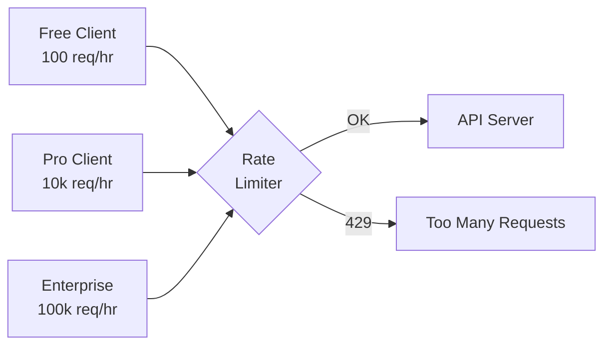
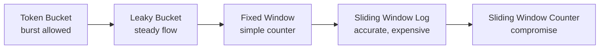
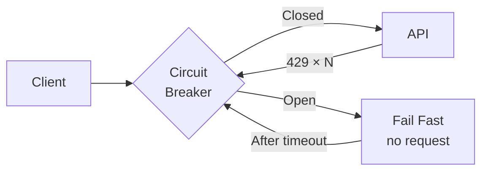
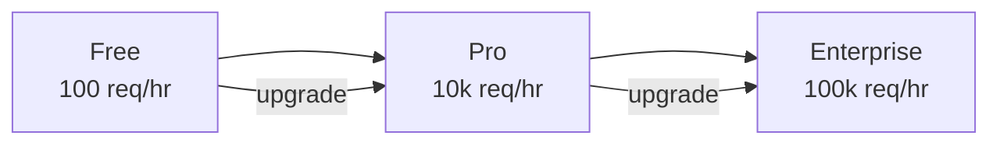
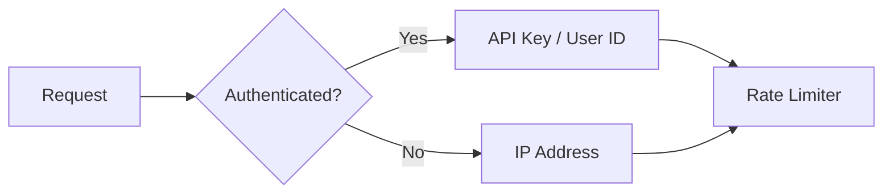

# Rate Limiting and Throttling: Complete Guide

## Analogy: Subway Turnstile

Imagine a turnstile during rush hour. It lets through exactly one person every 2 seconds — no faster. You can try to force your way through, but the turnstile will still block you. That's rate limiting.

Your API is the turnstile. Clients are the passengers. The limit is the throughput speed. Unlike the subway, though, you can have VIP passengers (paid tier) with a separate, faster entrance.



## Why Rate Limiting Is Needed

### 1. Abuse Protection

Without limits, an attacker can:
- Launch a DoS attack (millions of requests per second)
- Brute force passwords (thousands of login attempts)
- Scrape all your content in an hour

### 2. Fairness

One active client shouldn't "eat up" resources, leaving others with nothing. Limits ensure that 1,000 clients share the server evenly.

### 3. Cost Control

Every request costs money (CPU, DB, CDN). A free tier shouldn't consume like an enterprise plan.

### 4. SLA for Paid Clients

Guaranteeing an Enterprise client 99.9% availability? Rate limiting protects them from Free users crashing the server.

## Rate Limiting Algorithms



### Token Bucket

📌 **The most popular algorithm** — used by Stripe, GitHub, Twilio.

**Principle:** A bucket of `capacity` tokens. Each request takes 1 token. Tokens refill at `refillRate` per second. If the bucket is empty — 429.

✅ **Pros:**
- Allows burst (bucket full → 10 requests in a row)
- Simple to implement
- Intuitive for clients

❌ **Cons:**
- Two clients with full buckets cause a double spike

```
capacity=5, refillRate=1/sec

T=0: [●●●●●] → 5 requests → [○○○○○] — OK
T=0: [○○○○○] → request → 429, Retry-After: 1
T=1: [●○○○○] → 1 request → [○○○○○] — OK
```

### Leaky Bucket

**Principle:** Requests drip into a leaky bucket. It leaks at a constant rate (processed evenly). If the bucket overflows — 429.

✅ Guarantees even backend load
❌ Burst is not allowed at all — inconvenient for clients

### Fixed Window Counter

**Principle:** 1-minute window — count requests. Reset at :00 of each minute.

✅ Simple as a Redis table: `INCR "user:123:2024-01-01-12:34"`
❌ **Problem at window boundary:**

```
11:59:50 — 100 requests (exhausted limit)
12:00:10 — another 100 requests (new window!)
= 200 requests in 20 seconds with a limit of 100/min
```

### Sliding Window Log

**Principle:** Store the timestamp of each request. On a new request — delete entries older than the window, count the rest.

✅ Absolutely accurate — no boundary problem
❌ Expensive in memory (O(requests) per user)

Suitable for sensitive endpoints: /auth/login, /payments/charge.

### Sliding Window Counter

**Principle:** Compromise between Fixed and Log. Two adjacent fixed windows + weighted counter.

```
currentCount = prevWindow × (1 - elapsed/windowSize) + currWindow
```

✅ More accurate than Fixed Window, cheaper than Sliding Log
✅ Redis-friendly: only 2 keys per user

## Rate Limit HTTP Headers

### Standard (de facto)

```http
HTTP/1.1 200 OK
X-RateLimit-Limit: 1000
X-RateLimit-Remaining: 946
X-RateLimit-Reset: 1735689600
```

| Header | Meaning | Type |
|--------|---------|------|
| `X-RateLimit-Limit` | Max requests in window | number |
| `X-RateLimit-Remaining` | Remaining in current window | number |
| `X-RateLimit-Reset` | Reset Unix timestamp | epoch seconds |

### IETF Draft (new standard)

IETF proposes a unified format ([draft-ietf-httpapi-ratelimit-headers](https://datatracker.ietf.org/doc/draft-ietf-httpapi-ratelimit-headers/)):

```http
RateLimit-Policy: "default";r=1000;w=3600
RateLimit: "default";r=946;t=3214
```

Where `r` = remaining, `t` = time to reset, `w` = window size.

### 429 Too Many Requests

```http
HTTP/1.1 429 Too Many Requests
Content-Type: application/json
Retry-After: 30
X-RateLimit-Limit: 100
X-RateLimit-Remaining: 0
X-RateLimit-Reset: 1735689630

{
  "error": "rate_limit_exceeded",
  "message": "You have exceeded the 100 requests/hour limit.",
  "retryAfter": 30,
  "upgradeUrl": "https://api.example.com/pricing"
}
```

⚠️ **Common mistakes:**

❌ Returning 503 Service Unavailable instead of 429
```
Why it's bad: the client will think the server is down and retry aggressively
```

✅ Use 429 with Retry-After
```
The client knows: this is a limit, not a crash. Will wait exactly as long as needed.
```

❌ Not including Retry-After
```
The client doesn't know how long to wait. Will retry randomly.
```

✅ Always specify Retry-After (in seconds or HTTP-date)

## Client Strategies on 429

### Exponential Backoff

Each next attempt waits twice as long:

```typescript
// delay = min(maxDelay, baseDelay × 2^attempt)
function getDelay(attempt: number, base = 1000, max = 32000): number {
  return Math.min(max, base * Math.pow(2, attempt))
}
// attempt 0: 1000ms
// attempt 1: 2000ms
// attempt 2: 4000ms
// attempt 3: 8000ms
// attempt 4: 16000ms
// attempt 5: 32000ms (cap)
```

### Jitter (Random Shift)

❌ **Without jitter — thundering herd:**
```
429 at 12:00:00
1000 clients wait 1000ms
12:00:01 — 1000 clients attack simultaneously → 429 again
```

✅ **With jitter — dispersion:**
```typescript
const delay = getDelay(attempt) * (0.5 + Math.random() * 0.5)
// Clients wait 500ms, 750ms, 823ms, 612ms... — load is even
```

### Circuit Breaker

With systematic 429s — trip the circuit and fail fast:



## Pricing Tiers and Limits



Typical tier structure:

| Tier | Limit | Burst | Price |
|------|-------|-------|-------|
| Free | 100/hr | 10 | $0 |
| Pro | 10,000/hr | 100 | $49/mo |
| Business | 50,000/hr | 500 | $199/mo |
| Enterprise | 100,000/hr | 1,000 | custom |

💡 **Tip:** Add `X-RateLimit-Plan: pro` to the response — the client knows which tier is active.

## Client Identification

Key for the rate limit counter:



| Key | When to use | Risks |
|-----|-------------|-------|
| IP | Anonymous requests, /auth brute-force | NAT — 1 IP can be 1,000 users |
| API Key | Developers, B2B integrations | Key leak — problems for legitimate client |
| User ID | Authenticated users | Requires authorization |
| Tenant ID | Multi-tenant SaaS | One broken tenant doesn't affect others |

## Different Limits for Different Endpoints

Not all operations are equal:

```
GET  /products         → 1000 req/min (cheap, cached)
POST /orders           → 50 req/min   (expensive, writes to DB)
POST /auth/login       → 5 req/min    (brute-force protection)
POST /export/csv       → 2 req/min    (very heavy)
```

## Server-Side Implementation

For distributed systems, use **Redis** as a shared counter store:

```
SET user:123:counter 1 EX 3600 NX   # first request
INCR user:123:counter               # each subsequent
TTL user:123:counter                # when it resets
```

⚠️ **Beginner mistake:** storing counters in a single server's memory.
```
Why it's bad: with 3 replicas, each sees only its own counter.
Result: actual limit = limit × N replicas.
```

✅ Always use Redis (or similar) for rate limiting in production.
