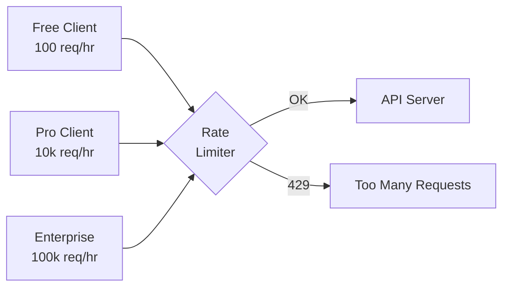
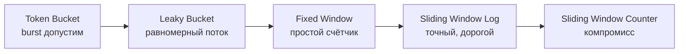
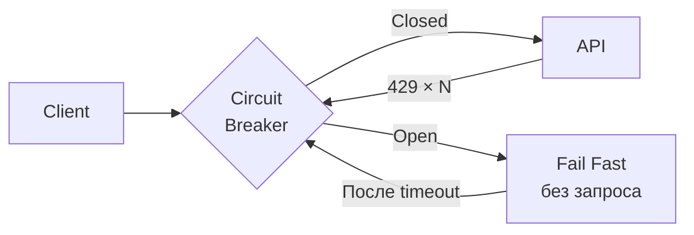
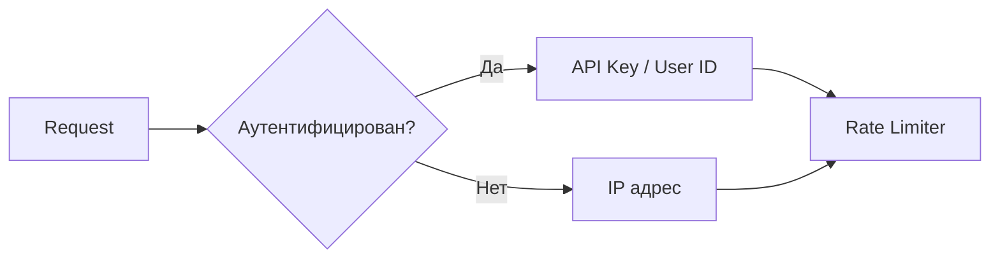

# Rate Limiting и Throttling: полное руководство

## Аналогия: турникет в метро

Представьте турникет в час пик. Он пропускает ровно одного человека каждые 2 секунды — не быстрее. Можно попробовать протолкнуться силой, но турникет всё равно заблокирует. Это и есть rate limiting.

Ваш API — турникет. Клиенты — пассажиры. Лимит — скорость пропуска. Только в отличие от метро, у вас могут быть VIP-пассажиры (платный тариф) с отдельным, более быстрым входом.



## Зачем нужен rate limiting

### 1. Защита от злоупотреблений

Без лимитов злоумышленник может:
- Устроить DoS атаку (миллионы запросов за секунду)
- Брутфорсить пароли (тысячи попыток входа)
- Скрейпить весь ваш контент за час

### 2. Fairness (справедливость)

Один активный клиент не должен «съедать» ресурсы, оставляя других ни с чем. Лимиты гарантируют, что 1000 клиентов делят сервер равномерно.

### 3. Cost control

Каждый запрос стоит денег (CPU, DB, CDN). Бесплатный тариф не должен потреблять как enterprise.

### 4. SLA для платных клиентов

Гарантируете Enterprise клиенту 99.9% availability? Rate limiting защищает их от того, что Free-пользователь обвалит сервер.

## Алгоритмы rate limiting



### Token Bucket

📌 **Самый популярный алгоритм** — используют Stripe, GitHub, Twilio.

**Принцип:** Ведро ёмкостью `capacity` токенов. Каждый запрос забирает 1 токен. Токены пополняются со скоростью `refillRate` в секунду. Если ведро пусто — 429.

✅ **Плюсы:**
- Допускает burst (ведро полное → 10 запросов подряд)
- Прост в реализации
- Интуитивен для клиентов

❌ **Минус:**
- Два клиента с полными вёдрами дадут двойной spike

```
capacity=5, refillRate=1/сек

T=0: [●●●●●] → 5 запросов → [○○○○○] — OK
T=0: [○○○○○] → запрос → 429, Retry-After: 1
T=1: [●○○○○] → 1 запрос → [○○○○○] — OK
```

### Leaky Bucket

**Принцип:** Запросы капают в дырявое ведро. Вытекает с постоянной скоростью (обрабатывается равномерно). Если ведро переполнено — 429.

✅ Гарантирует равномерную нагрузку на бэкенд
❌ Burst вообще не допускается — неудобно для клиентов

### Fixed Window Counter

**Принцип:** Окно 1 минута — считаем запросы. Сбрасываем в 00:00 каждой минуты.

✅ Прост как таблица в Redis: `INCR "user:123:2024-01-01-12:34"`
❌ **Проблема на границе окна:**

```
11:59:50 — 100 запросов (исчерпали лимит)
12:00:10 — ещё 100 запросов (новое окно!)
= 200 запросов за 20 секунд при лимите 100/мин
```

### Sliding Window Log

**Принцип:** Храним timestamp каждого запроса. При новом — удаляем старше window, считаем оставшиеся.

✅ Абсолютно точный — нет проблемы границы
❌ Дорогой по памяти (O(requests) на пользователя)

Подходит для чувствительных эндпоинтов: /auth/login, /payments/charge.

### Sliding Window Counter

**Принцип:** Компромисс между Fixed и Log. Две соседних фиксированных окна + взвешенный счётчик.

```
currentCount = prevWindow × (1 - elapsed/windowSize) + currWindow
```

✅ Точнее Fixed Window, дешевле Sliding Log
✅ Redis-friendly: всего 2 ключа на пользователя

## HTTP-заголовки rate limit

### Стандартные (де-факто)

```http
HTTP/1.1 200 OK
X-RateLimit-Limit: 1000
X-RateLimit-Remaining: 946
X-RateLimit-Reset: 1735689600
```

| Заголовок | Значение | Тип |
|-----------|----------|-----|
| `X-RateLimit-Limit` | Максимум запросов в окне | число |
| `X-RateLimit-Remaining` | Остаток в текущем окне | число |
| `X-RateLimit-Reset` | Unix timestamp сброса | epoch seconds |

### IETF Draft (новый стандарт)

IETF предлагает унифицированный формат ([draft-ietf-httpapi-ratelimit-headers](https://datatracker.ietf.org/doc/draft-ietf-httpapi-ratelimit-headers/)):

```http
RateLimit-Policy: "default";r=1000;w=3600
RateLimit: "default";r=946;t=3214
```

Где `r` = remaining, `t` = time to reset, `w` = window size.

### 429 Too Many Requests

```http
HTTP/1.1 429 Too Many Requests
Content-Type: application/json
Retry-After: 30
X-RateLimit-Limit: 100
X-RateLimit-Remaining: 0
X-RateLimit-Reset: 1735689630

{
  "error": "rate_limit_exceeded",
  "message": "You have exceeded the 100 requests/hour limit.",
  "retryAfter": 30,
  "upgradeUrl": "https://api.example.com/pricing"
}
```

⚠️ **Распространённые ошибки:**

❌ Возвращать 503 Service Unavailable вместо 429
```
Почему плохо: клиент решит, что сервер упал и будет агрессивно ретраиться
```

✅ Использовать 429 с Retry-After
```
Клиент знает: это ограничение, а не авария. Подождёт ровно столько, сколько нужно.
```

❌ Не включать Retry-After
```
Клиент не знает, сколько ждать. Будет ретраиться наугад.
```

✅ Всегда указывать Retry-After (в секундах или HTTP-date)

## Стратегии клиента при 429

### Exponential Backoff

Каждая следующая попытка ждёт вдвое дольше:

```typescript
// delay = min(maxDelay, baseDelay × 2^attempt)
function getDelay(attempt: number, base = 1000, max = 32000): number {
  return Math.min(max, base * Math.pow(2, attempt))
}
// attempt 0: 1000ms
// attempt 1: 2000ms
// attempt 2: 4000ms
// attempt 3: 8000ms
// attempt 4: 16000ms
// attempt 5: 32000ms (cap)
```

### Jitter (случайный сдвиг)

❌ **Без jitter — thundering herd:**
```
429 в 12:00:00
1000 клиентов ждут 1000мс
12:00:01 — 1000 клиентов атакуют одновременно → снова 429
```

✅ **С jitter — рассредоточение:**
```typescript
const delay = getDelay(attempt) * (0.5 + Math.random() * 0.5)
// Клиенты ждут 500мс, 750мс, 823мс, 612мс... — нагрузка равномерна
```

### Circuit Breaker

При систематических 429 — размыкаем цепь и отказываем быстро:



## Тарифные планы и лимиты


Типичная структура тарифов:

| Тариф | Лимит | Burst | Цена |
|-------|-------|-------|------|
| Free | 100/час | 10 | $0 |
| Pro | 10 000/час | 100 | $49/мес |
| Business | 50 000/час | 500 | $199/мес |
| Enterprise | 100 000/час | 1000 | договорная |

💡 **Совет:** Добавьте `X-RateLimit-Plan: pro` в ответ — клиент понимает, какой тариф активен.

## Идентификация клиента

Ключ для счётчика rate limit:



| Ключ | Когда использовать | Риски |
|------|-------------------|-------|
| IP | Анонимные запросы, /auth brute-force | NAT — за 1 IP могут быть 1000 юзеров |
| API Key | Разработчики, B2B интеграции | Утечка ключа — проблемы для легитимного клиента |
| User ID | Аутентифицированные пользователи | Нужна авторизация |
| Tenant ID | Мультитенантные SaaS | Один сломанный тенант не влияет на других |

## Разные лимиты для разных эндпоинтов

Не все операции равноценны:

```
GET  /products         → 1000 req/min (дёшево, кэшируется)
POST /orders           → 50 req/min   (дорого, пишет в DB)
POST /auth/login       → 5 req/min    (защита от брутфорса)
POST /export/csv       → 2 req/min    (очень тяжело)
```

## Реализация на сервере

Для распределённых систем используйте **Redis** как общее хранилище счётчиков:

```
SET user:123:counter 1 EX 3600 NX   # первый запрос
INCR user:123:counter               # каждый следующий
TTL user:123:counter                # когда сбросится
```

⚠️ **Ошибка новичков:** хранить счётчики в памяти одного сервера.
```
Почему плохо: при 3 репликах каждый видит только свой счётчик.
Итого: реальный лимит = limit × N реплик.
```

✅ Всегда Redis (или аналог) для rate limiting в production.
