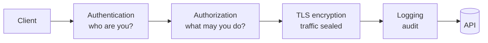

# Level 12: API Security

## Why REST is not secure on its own

The core REST constraints — client-server, stateless, cacheable, uniform interface — exist for **scalability**, not **security**. The very traits that make an API easy to integrate make it an easy target: predictable URLs, open methods, no server-side state.

Roy Fielding adds a fifth REST constraint — **layering**: intermediaries placed between client and application close the security gaps. Four such layers are the four topics of this level.

## Analogy: the airport

A flight passes through several security checkpoints — exactly like a request to a protected API:

| Airport | API | Topic |
|---|---|---|
| Show passport → get a boarding pass | Send login/password → get a token | **Authentication** |
| Boarding pass gets you to your gate, not the cockpit | A token grants access to some endpoints, not all | **Authorization** |
| A lock on your suitcase — contents unreadable in transit | TLS encrypts traffic — interception is useless | **Encryption** |
| Cameras record everything | Logs capture every request/response | **Logging** |



## 1. Authentication — "who are you?"

Authentication establishes identity. An anonymous request is a request without accountability: an attacker operates without a trace.

- **Basic** — `Authorization: Basic base64(user:pass)`. Base64 is **not encryption**, just encoding for transport compatibility. Safe only over TLS. Fine for internal/legacy systems.
- **Bearer (token)** — `Authorization: Bearer <token>`. The client logs in once, gets a token, and presents it on every request. The server keeps no session (stateless).
- **JWT (JSON Web Token)** — a self-contained Bearer token of three dot-separated parts: `header.payload.signature`. Each part is Base64URL.

```
eyJhbGciOiJIUzI1NiJ9 . eyJzdWIiOiI0MiIsImV4cCI6MTcwMH0 . dBjftJeZ4CV...
└──── header ────┘   └──────── payload (claims) ───────┘  └─ signature ─┘
```

Claims in the payload: `sub` (who), `iss` (who issued it), `exp` (when it expires), `scope`/`roles` (what is allowed). The **signature** prevents forgery — you cannot alter the payload without the server's secret. But the payload is **not encrypted** — never put passwords or secrets in it.

## 2. Authorization — "what may you do?"

Authentication passed — but that does not mean "anything goes." Authorization decides what exactly is accessible.

- **RBAC (Role-Based)** — rights via roles: `admin`, `editor`, `viewer`. Simple but coarse.
- **ABAC (Attribute-Based)** — rights via attributes (department, region, time of day, resource owner). Flexible but more complex.
- **OAuth 2.0 scopes** — the token carries a list of permissions: `orders:read`, `orders:write`. An endpoint requires a scope; if it's missing — `403`.

**401 vs 403** — the key distinction:

| Code | Meaning | When |
|---|---|---|
| **401** Unauthorized | "I don't know who you are" | no token / expired / invalid |
| **403** Forbidden | "I know who you are, but you may not" | token valid, but no rights/scope |

## 3. Encryption — TLS

**TLS (HTTPS) is mandatory.** Without it a Bearer token or Basic login travels the network in plain text — interception = full access. TLS provides three things: confidentiality (nobody reads it), integrity (nobody tampers with it), server authentication (the certificate proves it's the right host).

Rule: tokens live only over `https://`. `http://` in production for an API is unacceptable.

## 4. Logging — audit

Logs are the API's security cameras: incidents are investigated and anomalies caught through them (a spike of 401s, password brute-forcing).

**What to log:** method, path, status, time, user id (`sub`), request id.

**What to NEVER log:** passwords, full tokens, card numbers, personal data. A leaked log with tokens is leaked access. Mask sensitive fields (`Authorization: Bearer ***`).

## Four questions for an API designer

Before release, answer four questions — the whole level in a nutshell:

1. **Identity** — how do I verify who sent the request?
2. **Permissions** — how do I limit what they can reach?
3. **Trust** — is the channel protected (TLS) and the token un-forged?
4. **Observability** — will I see an attack in the logs?
