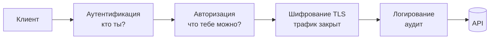

# Уровень 12: Безопасность API

## Почему REST сам по себе небезопасен

Базовые ограничения REST — клиент-сервер, stateless, кэшируемость, единый интерфейс — отвечают за **масштабируемость**, но ни одно из них не отвечает за **безопасность**. Те же свойства, которые делают API удобным для интеграции, делают его удобной мишенью: предсказуемые URL, открытые методы, отсутствие состояния.

Рой Филдинг добавляет к REST пятое ограничение — **layering (слоистость)**: между клиентом и приложением ставят промежуточные слои, которые закрывают бреши. Четыре таких слоя — это четыре темы уровня.

## Аналогия: аэропорт

Перелёт проходит через несколько рубежей безопасности — ровно как запрос к защищённому API:

| Аэропорт | API | Тема |
|---|---|---|
| Показал паспорт → получил посадочный | Прислал логин/пароль → получил токен | **Аутентификация** |
| Посадочный пускает к своему гейту, но не в кабину пилота | Токен даёт доступ к части эндпоинтов, не ко всем | **Авторизация** |
| Замок на чемодане — содержимое не прочитать в пути | TLS шифрует трафик — перехват бесполезен | **Шифрование** |
| Камеры пишут всё происходящее | Логи фиксируют каждый запрос/ответ | **Логирование** |



## 1. Аутентификация — «кто ты?»

Аутентификация устанавливает личность. Анонимный запрос = запрос без ответственности: злоумышленник действует без следа.

- **Basic** — `Authorization: Basic base64(user:pass)`. Base64 — это **не шифрование**, а лишь кодирование для совместимости. Безопасен только поверх TLS. Подходит для внутренних/legacy-систем.
- **Bearer (токен)** — `Authorization: Bearer <token>`. Клиент один раз логинится, получает токен и предъявляет его в каждом запросе. Сервер не хранит сессию (stateless).
- **JWT (JSON Web Token)** — самодостаточный Bearer-токен из трёх частей через точку: `header.payload.signature`. Каждая часть — Base64URL.

```
eyJhbGciOiJIUzI1NiJ9 . eyJzdWIiOiI0MiIsImV4cCI6MTcwMH0 . dBjftJeZ4CV...
└──── header ────┘   └──────── payload (claims) ───────┘  └─ signature ─┘
```

Claims в payload: `sub` (кто), `iss` (кто выдал), `exp` (когда истекает), `scope`/`roles` (что можно). **Подпись** защищает от подделки — изменить payload, не зная секрета сервера, нельзя. Но payload **не зашифрован** — не кладите туда пароли и секреты.

## 2. Авторизация — «что тебе можно?»

Аутентификация прошла — но это не значит «всё разрешено». Авторизация решает, к чему именно есть доступ.

- **RBAC (Role-Based)** — права через роли: `admin`, `editor`, `viewer`. Просто, но грубо.
- **ABAC (Attribute-Based)** — права через атрибуты (отдел, регион, время суток, владелец ресурса). Гибко, но сложнее.
- **OAuth 2.0 scopes** — токен несёт список разрешений: `orders:read`, `orders:write`. Эндпоинт требует scope; нет нужного — `403`.

**401 vs 403** — ключевое различие:

| Код | Смысл | Когда |
|---|---|---|
| **401** Unauthorized | «Я не знаю, кто ты» | токена нет / истёк / невалиден |
| **403** Forbidden | «Я знаю, кто ты, но тебе нельзя» | токен валиден, но нет прав/scope |

## 3. Шифрование — TLS

**TLS (HTTPS) обязателен.** Без него Bearer-токен и Basic-логин летят по сети открытым текстом — перехват = полный доступ. TLS обеспечивает три вещи: конфиденциальность (никто не прочитает), целостность (никто не подменит), аутентификацию сервера (сертификат подтверждает, что это нужный хост).

Правило: токены живут только поверх `https://`. `http://` в проде для API — недопустимо.

## 4. Логирование — аудит

Логи — это камеры наблюдения API: по ним расследуют инциденты и ловят аномалии (всплеск 401, перебор паролей).

**Что логировать:** метод, путь, статус, время, идентификатор пользователя (`sub`), request-id.

**Что НИКОГДА не логировать:** пароли, токены целиком, номера карт, персональные данные. Утёкший лог с токенами — это утёкшие доступы. Маскируйте чувствительные поля (`Authorization: Bearer ***`).

## Четыре вопроса дизайнера API

Перед релизом ответьте на четыре вопроса — это весь уровень в сжатом виде:

1. **Личность** — как я проверяю, кто прислал запрос?
2. **Права** — как ограничиваю, что ему доступно?
3. **Доверие** — защищён ли канал (TLS) и не подделан ли токен?
4. **Наблюдаемость** — увижу ли я атаку в логах?
