# Проектирование реального API: от идеи до релиза

Это финальный уровень курса. Здесь мы не учим ничего нового — мы собираем всё вместе. Проектирование API — это ремесло, которое невозможно освоить по одному принципу за раз. Нужно видеть всю картину целиком.

Представь, что ты архитектор. Ты можешь знать, как делать кирпичную кладку, как проводить электрику, как укладывать трубы. Но дом строится не из этих навыков по отдельности — а из их правильного сочетания с самого начала. API — такой же дом.

---

## Процесс проектирования API

```mermaid
graph LR
    A[Бизнес-требования] --> B[Идентификация ресурсов]
    B --> C[URL-структура]
    C --> D[Методы и статус-коды]
    D --> E[Модели данных]
    E --> F[Cross-cutting concerns]
    F --> G[Error handling]
    G --> H[OpenAPI спецификация]
    H --> I[Документация и SDK]
    I --> J[Review и релиз]
```



Каждый этап влияет на следующий. Если ошибиться на уровне ресурсов — URL будет неправильным. Если URL неправильный — клиентский код будет запутанным. Ошибки на ранних этапах дороже с каждым следующим шагом.

---

## Шаг 1: Определение бизнес-требований

Прежде чем рисовать какой-либо URL, нужно ответить на вопросы:

**Кто потребители API?**
- Мобильное приложение iOS/Android
- Фронтенд React-приложение
- Сторонние партнёры
- Внутренние сервисы

Разные потребители имеют разные потребности. Публичный API для партнёров требует строжайшего версионирования и стабильности. Внутренний API для микросервисов — скорости итераций.

**Какие операции нужны?**

Запиши все бизнес-операции простыми словами:
- «Пользователь добавляет товар в корзину»
- «Менеджер изменяет цену товара»
- «Система отправляет уведомление о доставке»

Это будущие POST/PATCH/webhook.

**Какие ограничения есть?**
- Частота запросов (rate limits)
- Аутентификация и авторизация
- Размеры payload (большие файлы — отдельный upload API)
- Требования к latency

---

## Шаг 2: Идентификация ресурсов

Ресурс — это любая сущность, которой можно присвоить URL. Правило: **существительное, не глагол**.

💡 Хороший способ — взять бизнес-требования и выписать все существительные:
«Пользователь добавляет **товар** в **корзину**, оформляет **заказ**, оставляет **отзыв**»

Получаем ресурсы: `products`, `cart`, `orders`, `reviews`.

### Самостоятельные vs вложенные ресурсы

```
# Самостоятельный ресурс — существует независимо
/products
/users
/orders

# Вложенный ресурс — жизненный цикл зависит от родителя
/products/{id}/images        # изображение без товара не имеет смысла
/orders/{id}/items           # позиция без заказа бессмысленна
/users/{id}/addresses        # адрес всегда принадлежит пользователю
```

⚠️ Ошибка начинающих: делать всё вложенным. Если ресурс часто запрашивается независимо — вынеси его на верхний уровень.

```
# Плохо: только вложенный доступ
GET /orders/{id}/items/{itemId}  # нельзя получить item без orderId

# Хорошо: и вложенный, и прямой
GET /orders/{id}/items           # все позиции заказа
GET /order-items/{id}            # прямой доступ к позиции
```

---

## Шаг 3: Проектирование URL-структуры

URL — это публичный интерфейс. Его меняют редко и с болью. Поэтому решения принимаются сразу правильно.

### Правила нейминга

```
✅ /products             # множественное число
✅ /reading-lists        # нижний регистр, дефисы
✅ /products/{id}        # идентификатор в пути
✅ /products?q=кофе      # фильтрация в query

❌ /getProducts          # глагол
❌ /Product              # единственное число, заглавная
❌ /productList          # camelCase в URL
❌ /product_list         # snake_case в URL
```

### Actions — когда нужен «глагол»

Иногда операция не вписывается в CRUD. Для таких случаев — action endpoint:

```
POST /orders/{id}/cancel         # отмена заказа
POST /orders/{id}/ship           # отправить заказ
POST /accounts/{id}/activate     # активировать аккаунт
POST /payments/{id}/refund       # возврат платежа
```

📌 Правило: action-эндпоинты — всегда POST. Они изменяют состояние, часто не идемпотентны.

---

## Шаг 4: Выбор методов и статус-кодов

### Матрица методов

| Метод | Семантика | Идемпотентный | Безопасный |
|-------|-----------|---------------|------------|
| GET | Чтение | Да | Да |
| POST | Создание/action | Нет | Нет |
| PUT | Полная замена | Да | Нет |
| PATCH | Частичное обновление | Условно | Нет |
| DELETE | Удаление | Да | Нет |

### Стандартная карта статус-кодов

```
Создание ресурса:
  POST /resources     → 201 Created + Location: /resources/{id}
  
Успешное чтение/обновление:
  GET/PUT/PATCH       → 200 OK (с телом)
  
Успешное удаление:
  DELETE              → 204 No Content (без тела)
  
Ошибки клиента:
  Невалидные данные   → 400 Bad Request
  Нет токена          → 401 Unauthorized
  Нет прав            → 403 Forbidden
  Не найдено          → 404 Not Found
  Конфликт состояния  → 409 Conflict
  Rate limit          → 429 Too Many Requests
  
Ошибки сервера:
  Внутренняя ошибка   → 500 Internal Server Error
  Сервис недоступен   → 503 Service Unavailable
```

🔥 Золотое правило: **никогда не возвращай 200 OK с `{ "error": true }` в теле**. HTTP-статус — это первый индикатор для клиента.

---

## Шаг 5: Проектирование моделей данных

### Единый envelope

```json
// Список ресурсов
{
  "data": [...],
  "meta": { "total": 100, "page": 1 }
}

// Один ресурс
{
  "data": { "id": "...", ... }
}

// Ошибка — единый формат везде
{
  "error": {
    "code": "PRODUCT_NOT_FOUND",
    "message": "Товар с указанным ID не найден",
    "details": { "productId": "prod_01HX" }
  }
}
```

### Соглашения по типам данных

```json
// Идентификаторы — строки (ULID, UUID), не числа
"id": "01HX4K2M9P"          // ✅ ULID
"id": "550e8400-e29b"        // ✅ UUID
"id": 42                     // ❌ число

// Деньги — объект с суммой и валютой
"price": { "amount": 850.00, "currency": "RUB" }   // ✅
"price": 850                                         // ❌ без валюты
"price": "850 руб"                                   // ❌ строка

// Даты — ISO 8601, UTC
"createdAt": "2024-01-15T10:30:00Z"    // ✅
"createdAt": "01.01.2024"              // ❌ неоднозначно
"createdAt": 1705311600                // ❌ timestamp (читаемость)

// Булевы значения
"isAvailable": true    // ✅ явный bool
"available": "yes"     // ❌ строка
"available": 1         // ❌ число
```

---

## Шаг 6: Cross-cutting concerns

Это аспекты, которые применяются ко всему API, а не к отдельным эндпоинтам.

### Пагинация

Правило: **все списочные эндпоинты должны иметь пагинацию**. Нет исключений.

```
GET /products?page=1&limit=20&sort=name&order=asc

Параметры:
  page    — номер страницы (с 1)
  limit   — размер страницы (default: 20, max: 100)
  sort    — поле сортировки
  order   — asc | desc

Ответ:
  meta.total      — всего записей
  meta.page       — текущая страница
  meta.perPage    — размер страницы
  meta.totalPages — всего страниц
  meta.hasNext    — есть ли следующая страница
  meta.hasPrev    — есть ли предыдущая
```

Cursor-based пагинация для лент и real-time данных:

```
GET /feed?cursor=eyJpZCI6IjAxSFgifQ&limit=20

Ответ:
  meta.nextCursor — курсор следующей страницы (null если конец)
  meta.hasMore    — есть ли ещё
```

### Фильтрация и поиск

```
# Точные фильтры
GET /products?category=coffee&available=true

# Диапазоны
GET /products?price_min=100&price_max=1000

# Полнотекстовый поиск
GET /products?q=арабика

# Несколько значений
GET /products?status=active&status=featured
```

### Сортировка

```
# Одно поле
GET /products?sort=price&order=asc

# Несколько полей (синтаксис зависит от реализации)
GET /products?sort=category,price&order=asc,desc
```

---

## Шаг 7: Error Handling Strategy

Ошибки — это половина твоего API. Плохо спроектированные ошибки — самая частая причина, по которой разработчики ненавидят API.

### Структура ошибки

```json
{
  "error": {
    "code": "VALIDATION_ERROR",        // машиночитаемый код
    "message": "Данные не прошли валидацию",  // человекочитаемое описание
    "details": {                        // опционально, детали
      "fields": [
        { "field": "email", "message": "Неверный формат" },
        { "field": "age", "message": "Должно быть больше 0" }
      ]
    },
    "requestId": "req_01HX4K2"         // для трассировки
  }
}
```

### Коды ошибок

Коды — строки, не числа. Числа ничего не говорят разработчику:

```
❌ "code": 1042
✅ "code": "PRODUCT_NOT_FOUND"
✅ "code": "INSUFFICIENT_STOCK"
✅ "code": "ORDER_ALREADY_CANCELLED"
```

Структура кода: `NOUN_VERB` или `NOUN_STATE`. Кричащий регистр (`SCREAMING_SNAKE_CASE`).

### Категории ошибок

```
Валидация входных данных:
  400 + VALIDATION_ERROR
  400 + INVALID_FORMAT

Аутентификация/авторизация:
  401 + AUTHENTICATION_REQUIRED
  401 + TOKEN_EXPIRED
  403 + INSUFFICIENT_PERMISSIONS

Бизнес-логика:
  409 + PRODUCT_OUT_OF_STOCK
  409 + ORDER_ALREADY_SHIPPED
  409 + EMAIL_ALREADY_TAKEN

Не найдено:
  404 + PRODUCT_NOT_FOUND
  404 + USER_NOT_FOUND
```

---

## Шаг 8: OpenAPI Спецификация

OpenAPI — единственный источник правды об API. Его пишут до реализации (design-first) или после (code-first), но он обязателен.

```yaml
openapi: 3.1.0
info:
  title: Shop API
  version: 1.0.0

paths:
  /v1/products:
    get:
      summary: Список товаров
      parameters:
        - name: page
          in: query
          schema: { type: integer, default: 1 }
        - name: limit
          in: query
          schema: { type: integer, default: 20, maximum: 100 }
      responses:
        '200':
          description: Список товаров
          content:
            application/json:
              schema:
                $ref: '#/components/schemas/ProductListResponse'
        '400':
          $ref: '#/components/responses/ValidationError'
```

📌 Правило: все компоненты (схемы, ответы, параметры) выносятся в `components` и переиспользуются через `$ref`.

---

## Шаг 9: Документация и SDK

### Хорошая документация содержит

1. **Быстрый старт** — первый запрос за 5 минут
2. **Аутентификация** — как получить и использовать токен
3. **Примеры** на реальных данных (не `foo`/`bar`)
4. **Changelog** — что изменилось, как мигрировать
5. **Sandbox** — среда для экспериментов

### SDK

Если API публичный — генерируй SDK из OpenAPI спецификации:

```bash
# TypeScript клиент через orval
npx orval --input ./api.yaml --output ./src/api

# Или openapi-typescript для только типов
npx openapi-typescript ./api.yaml -o ./src/api.d.ts
```

---

## API Design Review: финальный чеклист

Перед тем как объявить API готовым к релизу, пройди по этому списку:

### URL и ресурсы
- [ ] Ресурсы — существительные во множественном числе
- [ ] URL в нижнем регистре с дефисами
- [ ] Иерархия отражает отношения ресурсов
- [ ] Нет дублирующих URL

### HTTP-методы
- [ ] GET только читает (безопасен)
- [ ] POST создаёт / action (не идемпотентный)
- [ ] PUT/PATCH для обновлений
- [ ] DELETE возвращает 204

### Статус-коды
- [ ] 201 + Location после POST (создание)
- [ ] 204 после DELETE и PATCH без тела
- [ ] Нет 200 на ошибки
- [ ] Правильное разграничение 4xx/5xx

### Данные
- [ ] Единый envelope (data, meta, error)
- [ ] camelCase для полей JSON
- [ ] Даты ISO 8601 UTC
- [ ] Деньги с валютой
- [ ] ID — строки, не числа

### Пагинация
- [ ] Все списки пагинированы
- [ ] meta с total, page, hasNext
- [ ] Разумный default и максимальный limit

### Ошибки
- [ ] Единый формат { error: { code, message, details } }
- [ ] Коды ошибок — строки (SCREAMING_SNAKE_CASE)
- [ ] Валидационные ошибки с деталями по полям

### Безопасность
- [ ] Все приватные эндпоинты требуют auth
- [ ] Чувствительные данные не утекают в ответах
- [ ] Rate limiting настроен и задокументирован
- [ ] Заголовки X-RateLimit-*

### Документация
- [ ] OpenAPI спецификация актуальна
- [ ] Примеры запросов/ответов
- [ ] Changelog для изменений

---

## Governance: стайлгайд и автоматические проверки

На больших командах правила без автоматики не работают. Используй **Spectral** — линтер для OpenAPI.

```yaml
# .spectral.yaml
rules:
  # URL должен быть в нижнем регистре
  path-keys-no-trailing-slash: true
  
  # Все операции должны иметь operationId
  operation-operationId: true
  
  # Все ответы 2xx должны иметь content
  operation-success-response: true
  
  # Кастомные правила
  paths-plural-nouns:
    message: 'Path segments should be plural nouns'
    given: '$.paths'
    then:
      function: pattern
      functionOptions:
        match: '^\/[a-z][a-z-]*[s]'
```

```bash
npx @stoplight/spectral-cli lint ./api.yaml
```

Интегрируй в CI/CD — спецификация, не прошедшая линтинг, не деплоится.

---

## Итоги курса: что ты теперь умеешь

Прохождение этого курса — это не просто знания. Это новый способ думать о системах.

**Ты теперь умеешь:**
- Проектировать ресурсы и URL-структуру с нуля
- Правильно применять HTTP-методы и статус-коды
- Создавать консистентные модели данных
- Писать и читать OpenAPI спецификации
- Генерировать TypeScript-типы из спецификации
- Делать API Review и находить типичные ошибки
- Проектировать пагинацию, rate limiting, error handling

**Куда двигаться дальше:**
- **GraphQL** — альтернативный подход, особенно для сложных запросов
- **gRPC** — для высоконагруженных внутренних сервисов
- **AsyncAPI** — спецификация для событийных/WebSocket API
- **API Security** — OAuth 2.0, PKCE, token refresh, scope management
- **Hypermedia (HATEOAS)** — API, которые рассказывают о своих возможностях в ответах
- **API Gateway patterns** — BFF, aggregation, circuit breaker

Хороший API — это уважение к разработчику, который его использует. Каждое решение, которое ты принимаешь при проектировании, либо помогает ему, либо заставляет его страдать. Теперь ты знаешь, как делать первое.
