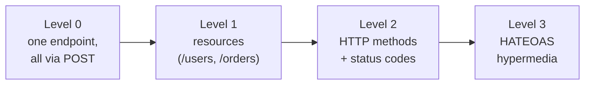
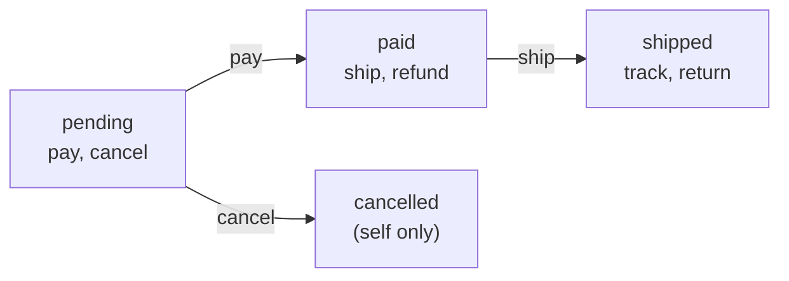

# HATEOAS and Resource State: A Complete Guide

## Analogy: a museum guide

Imagine you arrive at a large museum. There are two ways to tour it.

**The "paper map" way.** You're handed a full floor plan with every hall and passage. You must know in advance where to go. If the museum rebuilt a wing, your map lies and you hit a wall. This is the ordinary REST client with a hardcoded list of URLs.

**The "guide" way.** You simply enter through the main door. From there a guide at each step says: "from this hall you can go to the impressionists or to the sculpture" — and leads you, adapting the route. You don't need a full map: the front door and what the guide offers *here and now* is enough. This is HATEOAS: the server reports the available transitions at each step.

Fielding puts it strictly: a REST API must have a **single entry point** (like a bookmark), and all further application state transitions must be driven by the **client's choice among options the server provided** in resource representations. Not a single hardcoded URL except the entry one.

## Place in the Richardson Maturity Model



- **Level 2** — where most "good" APIs live: proper resources, methods, statuses.
- **Level 3** — adds hypermedia: responses carry links to the next actions. This is HATEOAS.

## What problem HATEOAS solves

The main pain is **tight coupling between client and server**. Without HATEOAS the client hardcodes:

1. All endpoint URLs (`/orders/{id}/payment`, `/orders/{id}/cancel`…).
2. Business rules: "an order can be cancelled only while it's `pending`."

Any server change (a moved URL, a new transition rule) breaks clients or requires updating them in lockstep. HATEOAS moves both addresses and transition rules **to the server**: the client doesn't build URLs itself and doesn't know the rules — it just reads which links the server put in the response.

## Anatomy of a hypermedia control

A hypermedia control describes one possible transition. The minimum is `rel` and `href`, but usually more:

```json
"pay": {
  "href": "/orders/123/payment",   // where
  "method": "POST",                // with which method
  "type": "application/json",      // expected Content-Type
  "title": "Pay for the order"     // human-readable name (for UI/docs)
}
```

- **rel (relation)** — the *meaning* of the link, its name in the `_links` object. This is the most important part: the client relies on `rel`, not on a specific `href`. The URL may change — `rel` is stable.
- **href** — the address. May be **templated**: `"/orders/{id}/items{?page}"` with a `"templated": true` flag — the client substitutes parameters.
- **method**, **type**, **title** — how and with what to call it, what to name it in the UI.

### Link relations

`rel` come in two kinds:
- **Standard (IANA)**: `self`, `next`, `prev`, `first`, `last`, `up`, `collection`. Their meaning is fixed, clients understand them out of the box.
- **Domain (custom)**: `pay`, `ship`, `cancel`. They're described in the API docs; sometimes formatted as a URI (`https://api.shop/rels/pay`) to avoid collisions.

## Semantics and metadata

The book separates two layers of information in a hypermedia response:

- **Semantics** — *what you can do*. This is the set of transition links: on `GET /orders/123` the client sees `ship` and `cancel` and understands the actions available for that state.
- **Metadata** — *the resource's context in time*: version (`version`), timestamps (`updatedAt`) that help the client understand the lifecycle and decide.

```json
{
  "orderId": 123,
  "status": "paid",
  "_links": {
    "self":   { "href": "/orders/123" },
    "ship":   { "href": "/orders/123/shipment", "method": "POST" },
    "refund": { "href": "/orders/123/refund", "method": "POST" }
  },
  "metadata": { "version": "2.0", "updatedAt": "2024-01-15T10:30:00Z" }
}
```

Together, semantics and metadata free the client from any assumptions about the API structure: it reacts only to what arrived in the response.

## Conditional links: state is the engine

The most practical HATEOAS technique: **the set of links is computed from the resource's state on the server**. This is the "State" in the name — the resource's state drives which transitions are offered.



The server implements this as a `state → links` function:

```
function linksFor(order) {
  const links = { self: { href: `/orders/${order.id}` } }
  if (order.status === 'pending') { links.pay = ...; links.cancel = ... }
  if (order.status === 'paid')    { links.ship = ...; links.refund = ... }
  if (order.status === 'shipped') { links.track = ...; links.return = ... }
  return links
}
```

The benefit for the client: instead of `if (order.status === 'pending' && user.isOwner && ...)` it writes `if (order._links.cancel)`. The business rule lives in one place — on the server.

## Hypermedia formats

There's no single mandatory standard, but there are established ones:

| Format | Where links live | Trait |
|---|---|---|
| **HAL** | `_links`, `_embedded` | The simplest and most popular; we use it in this course |
| **JSON:API** | `links`, `relationships` | A strict spec, includes relationships between resources |
| **Siren** | `links`, `actions` | Distinguishes navigation (links) from body-carrying actions |

The key is to **pick one and apply it consistently** (recall the predictability principle from level 0).

## Evolution and fallbacks

- **Versioning links.** A `rel` can be versioned semantically or carry a version in metadata — the client learns whether the transition's meaning changed.
- **Fallback.** If a client doesn't know a custom `rel`, it must ignore it gracefully, not crash. Unknown links are simply "doors this client doesn't use."
- **Gradual rollout.** Adding new `_links` is a **non-breaking change** (recall level 6): old clients ignore them, new ones use them.

## The cost of HATEOAS — honestly

- Responses are heavier: link blocks are added to the data.
- Clients need link-navigation logic instead of direct calls — harder to implement.
- Fewer ready-made tools and code generation than for Level 2.

So "pure" HATEOAS is rarer than Level 2. But **partial** use is nearly standard: `_links`/`pageInfo` for pagination and hypermedia transitions for resources with an explicit lifecycle (orders, payments, applications). Start there — it gives the main benefit at a moderate cost.

## Level checklist

- [ ] The API has one entry point, the rest is reachable via links.
- [ ] Responses contain `_links` with at least `self`.
- [ ] The set of links depends on the resource's state (conditional links).
- [ ] The client relies on `rel`, not on hardcoded URLs.
- [ ] One format is chosen (HAL/JSON:API/Siren) and applied everywhere.
- [ ] Unknown `rel` are ignored by the client, not crashing it.
