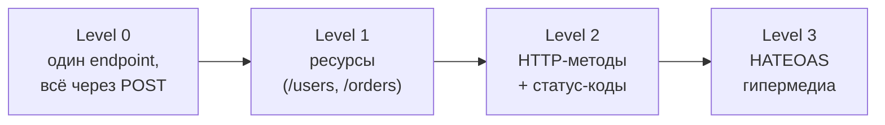
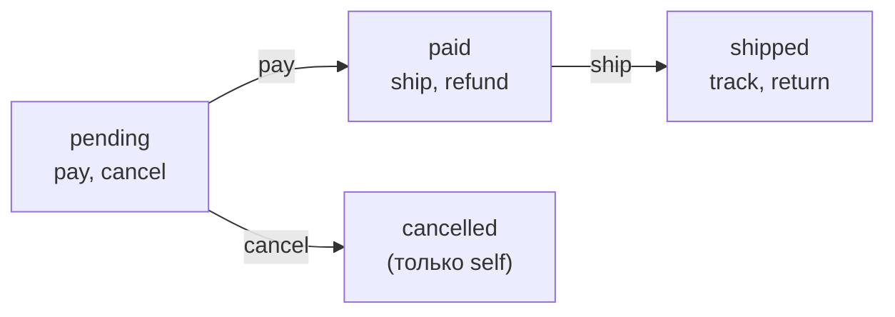

# HATEOAS и состояние ресурса: полное руководство

## Аналогия: экскурсовод в музее

Представьте, что вы пришли в большой музей. Есть два способа осмотреть его.

**Способ «бумажная карта».** Вам выдают полный план здания со всеми залами и переходами. Вы должны заранее знать, куда идти. Если музей перестроил крыло — ваша карта врёт, и вы упираетесь в стену. Это обычный REST-клиент с захардкоженным списком URL.

**Способ «экскурсовод».** Вы просто входите через главный вход. Дальше гид на каждом шаге говорит: «из этого зала можно пройти к импрессионистам или к скульптуре» — и ведёт вас, подстраиваясь под маршрут. Вам не нужна полная карта: достаточно входной двери и того, что гид предлагает *здесь и сейчас*. Это HATEOAS: сервер на каждом шаге сообщает доступные переходы.

Филдинг формулирует это строго: REST-API должен иметь **единственную точку входа** (как закладка), а все дальнейшие переходы состояния приложения должны определяться **выбором клиента из вариантов, предоставленных сервером** в представлениях ресурсов. Ни одного захардкоженного URL, кроме входного.

## Место в Richardson Maturity Model



- **Level 2** — где живёт большинство «хороших» API: правильные ресурсы, методы, статусы.
- **Level 3** — добавляет гипермедиа: ответы несут ссылки на следующие действия. Это и есть HATEOAS.

## Какую проблему решает HATEOAS

Главная боль — **жёсткая связанность клиента и сервера**. Без HATEOAS клиент зашивает у себя:

1. Все URL эндпоинтов (`/orders/{id}/payment`, `/orders/{id}/cancel`…).
2. Бизнес-правила: «отменить заказ можно, только пока он `pending`».

Любое изменение на сервере (переезд URL, новое правило перехода) ломает клиентов или требует их синхронного обновления. HATEOAS переносит и адреса, и правила переходов **на сервер**: клиент не строит URL сам и не знает правил — он просто читает, какие ссылки сервер положил в ответ.

## Анатомия гипермедиа-контрола

Гипермедиа-контрол — это описание одного возможного перехода. Минимум — `rel` и `href`, но обычно больше:

```json
"pay": {
  "href": "/orders/123/payment",   // куда
  "method": "POST",                // каким методом
  "type": "application/json",      // какой Content-Type ожидается
  "title": "Оплатить заказ"        // человекочитаемое имя (для UI/доков)
}
```

- **rel (relation)** — *смысл* ссылки, её имя в объекте `_links`. Это самое важное: клиент опирается на `rel`, а не на конкретный `href`. URL может меняться — `rel` стабилен.
- **href** — адрес. Может быть **шаблонным** (templated): `"/orders/{id}/items{?page}"` с флагом `"templated": true` — клиент подставляет параметры.
- **method**, **type**, **title** — как и чем вызывать, как назвать в интерфейсе.

### Имена связей (link relations)

`rel` бывают двух видов:
- **Стандартные (IANA)**: `self`, `next`, `prev`, `first`, `last`, `up`, `collection`. Их смысл зафиксирован, клиенты понимают их «из коробки».
- **Доменные (кастомные)**: `pay`, `ship`, `cancel`. Их описывают в документации API; иногда оформляют как URI (`https://api.shop/rels/pay`), чтобы избежать коллизий.

## Семантика и метаданные

Книга разделяет два слоя информации в гипермедиа-ответе:

- **Семантика** — *что можно сделать*. Это набор ссылок-переходов: получив `GET /orders/123`, клиент видит `ship` и `cancel` и понимает доступные действия по состоянию.
- **Метаданные** — *контекст ресурса во времени*: версия (`version`), временные метки (`updatedAt`), которые помогают клиенту понять жизненный цикл и принять решение.

```json
{
  "orderId": 123,
  "status": "paid",
  "_links": {
    "self":   { "href": "/orders/123" },
    "ship":   { "href": "/orders/123/shipment", "method": "POST" },
    "refund": { "href": "/orders/123/refund", "method": "POST" }
  },
  "metadata": { "version": "2.0", "updatedAt": "2024-01-15T10:30:00Z" }
}
```

Вместе семантика и метаданные освобождают клиента от любых предположений о структуре API: он реагирует только на то, что пришло в ответе.

## Условные ссылки: состояние — это движок

Самый практичный приём HATEOAS: **набор ссылок вычисляется из состояния ресурса на сервере**. Это и есть «State» в названии — состояние ресурса управляет тем, какие переходы предлагаются.



Сервер реализует это как функцию `state → links`:

```
function linksFor(order) {
  const links = { self: { href: `/orders/${order.id}` } }
  if (order.status === 'pending') { links.pay = ...; links.cancel = ... }
  if (order.status === 'paid')    { links.ship = ...; links.refund = ... }
  if (order.status === 'shipped') { links.track = ...; links.return = ... }
  return links
}
```

Выгода для клиента: вместо `if (order.status === 'pending' && user.isOwner && ...)` он пишет `if (order._links.cancel)`. Бизнес-правило живёт в одном месте — на сервере.

## Форматы гипермедиа

Единого обязательного стандарта нет, но есть устоявшиеся:

| Формат | Где ссылки | Особенность |
|---|---|---|
| **HAL** | `_links`, `_embedded` | Самый простой и популярный; используем его в курсе |
| **JSON:API** | `links`, `relationships` | Строгая спецификация, включает связи между ресурсами |
| **Siren** | `links`, `actions` | Различает навигацию (links) и действия с телом (actions) |

Главное — **выбрать один и применять консистентно** (вспомните принцип предсказуемости из уровня 0).

## Эволюция и запасные пути

- **Версионирование ссылок.** `rel` можно версионировать семантически или нести версию в метаданных — клиент понимает, изменился ли смысл перехода.
- **Fallback.** Если клиент не знает кастомный `rel`, он должен корректно его игнорировать, а не падать. Незнакомые ссылки — это просто «двери, в которые этот клиент не ходит».
- **Постепенное внедрение.** Добавление новых `_links` — это **non-breaking change** (вспомните уровень 6): старые клиенты их игнорируют, новые используют.

## Цена HATEOAS — честно

- Ответы тяжелее: к данным добавляются блоки ссылок.
- Клиентам нужна логика навигации по ссылкам, а не прямые вызовы — это сложнее в реализации.
- Меньше готовых инструментов и кодогенерации, чем для Level 2.

Поэтому «чистый» HATEOAS встречается реже, чем Level 2. Но **частичное** применение почти стандарт: `_links`/`pageInfo` для пагинации и гипермедиа-переходы для ресурсов с явным жизненным циклом (заказы, платежи, заявки). Начните с них — это даёт основную пользу при умеренной цене.

## Чеклист уровня

- [ ] У API есть одна точка входа, остальное доступно по ссылкам.
- [ ] Ответы содержат `_links` минимум с `self`.
- [ ] Набор ссылок зависит от состояния ресурса (условные ссылки).
- [ ] Клиент опирается на `rel`, а не на захардкоженные URL.
- [ ] Выбран один формат (HAL/JSON:API/Siren) и применяется везде.
- [ ] Незнакомые `rel` клиент игнорирует, а не падает.
