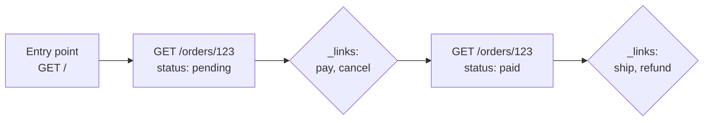

# Level 13: HATEOAS and Resource State

## What HATEOAS is

**HATEOAS** (Hypermedia as the Engine of Application State). The idea is from Roy Fielding's dissertation: an API response carries not only **data** but also **links to the next possible actions**. The client doesn't keep a list of endpoints — it follows the links the server puts in the response.

This is the peak of REST maturity — **Richardson Maturity Model, Level 3** (remember level 0?). Most APIs live at Level 2 (resources + methods + statuses); HATEOAS adds the final layer — self-description.

## Analogy: GPS instead of a paper map

The old way: the client has a "paper map" — a hardcoded list of all URLs. A resource's address changes → the map is outdated → the client breaks.

HATEOAS is a GPS navigator. You only know the entry point (like a browser bookmark). From there, at each step the server says: "from here you can turn here or here" — and recalculates the route based on the current state. The client doesn't need the full map up front.



## What a hypermedia response looks like

A `_links` block (the HAL convention) is added to the resource data — a map of available transitions:

```json
{
  "orderId": 123,
  "status": "pending",
  "totalAmount": 99.99,
  "_links": {
    "self":   { "href": "/orders/123" },
    "pay":    { "href": "/orders/123/payment", "method": "POST" },
    "cancel": { "href": "/orders/123", "method": "DELETE" }
  },
  "metadata": { "version": "1.2", "updatedAt": "2024-01-15T10:30:00Z" }
}
```

- **Semantics** — the `rel` (the link name: `self`, `pay`, `cancel`) tells the client the *meaning* of the transition, not just the address.
- **Metadata** — version, timestamps: the context of the resource's lifecycle.

## Conditional links: state determines actions

The key power of HATEOAS — **the set of links depends on the resource's state**. The server shows only what is allowed *right now*. The client doesn't need to hardcode business rules like "when an order can be cancelled" — it just checks whether a `cancel` link is present.

| Order state | Available `_links` |
|---|---|
| `pending` | `self`, `pay`, `cancel` |
| `paid` | `self`, `ship`, `refund` |
| `shipped` | `self`, `track`, `return` |
| `cancelled` | `self` |

A paid order won't show `pay`, a cancelled one — nothing but `self`. This removes a whole class of "client triggered an invalid action" errors.

## Why it's worth it

- **Loose coupling** — the client doesn't depend on specific URLs; the server can change addresses without breaking clients.
- **Discoverability** — the API is self-describing: by following links you can learn what's available.
- **Business rules on the server** — "what you can do next" is decided by the server, not scattered across clients.

## The cost and reality

HATEOAS isn't free: responses are heavier, clients need logic to work with links, and there are fewer tools than for plain REST. So in its pure form it's rarer than Level 2. But partial use (`_links` for pagination — remember `pageInfo`? — and for state transitions on orders/payments) is a common and useful practice.
