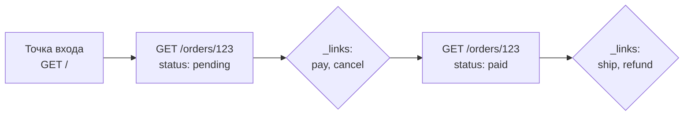

# Уровень 13: HATEOAS и состояние ресурса

## Что такое HATEOAS

**HATEOAS** (Hypermedia as the Engine of Application State) — «гипермедиа как движок состояния приложения». Идея из диссертации Роя Филдинга: ответ API содержит не только **данные**, но и **ссылки на следующие возможные действия**. Клиент не хранит у себя список эндпоинтов — он идёт по ссылкам, которые сервер кладёт в ответ.

Это вершина зрелости REST — **Richardson Maturity Model, Level 3** (помните уровень 0?). Большинство API живут на Level 2 (ресурсы + методы + статусы); HATEOAS добавляет последний слой — самоописание.

## Аналогия: GPS вместо бумажной карты

Старый способ: у клиента «бумажная карта» — захардкоженный список всех URL. Поменялся адрес ресурса — карта устарела, клиент сломался.

HATEOAS — это GPS-навигатор. Вы знаете только точку входа (как закладку в браузере). Дальше на каждом шаге сервер говорит: «отсюда можно повернуть сюда или сюда» — и пересчитывает маршрут в зависимости от текущего состояния. Клиенту не нужна полная карта заранее.



## Как выглядит гипермедиа-ответ

К данным ресурса добавляется блок `_links` (конвенция HAL) — карта доступных переходов:

```json
{
  "orderId": 123,
  "status": "pending",
  "totalAmount": 99.99,
  "_links": {
    "self":   { "href": "/orders/123" },
    "pay":    { "href": "/orders/123/payment", "method": "POST" },
    "cancel": { "href": "/orders/123", "method": "DELETE" }
  },
  "metadata": { "version": "1.2", "updatedAt": "2024-01-15T10:30:00Z" }
}
```

- **Семантика** — `rel` (имя ссылки: `self`, `pay`, `cancel`) говорит клиенту *смысл* перехода, а не только адрес.
- **Метаданные** — версия, временные метки: контекст жизненного цикла ресурса.

## Условные ссылки: состояние определяет действия

Ключевая сила HATEOAS — **набор ссылок зависит от состояния ресурса**. Сервер показывает только то, что *сейчас* допустимо. Клиенту не нужно зашивать бизнес-правила «когда можно отменить заказ» — он просто смотрит, есть ли ссылка `cancel`.

| Состояние заказа | Доступные `_links` |
|---|---|
| `pending` | `self`, `pay`, `cancel` |
| `paid` | `self`, `ship`, `refund` |
| `shipped` | `self`, `track`, `return` |
| `cancelled` | `self` |

Оплаченный заказ не покажет `pay`, отменённый — ничего, кроме `self`. Это убирает целый класс ошибок «клиент дёрнул недопустимое действие».

## Зачем это нужно

- **Слабая связанность** — клиент не зависит от конкретных URL; сервер может менять адреса, не ломая клиентов.
- **Обнаруживаемость** — API самоописателен: следуя ссылкам, можно понять, что доступно.
- **Бизнес-правила на сервере** — «что можно сделать дальше» решает сервер, а не размазано по клиентам.

## Цена и реальность

HATEOAS — не бесплатно: ответы тяжелее, клиентам нужна логика работы со ссылками, а инструментов меньше, чем для обычного REST. Поэтому в чистом виде он встречается реже Level 2. Но его частичное применение (`_links` для пагинации — помните `pageInfo`? — и для переходов состояний у заказов/платежей) — распространённая и полезная практика.
