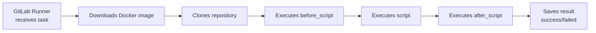
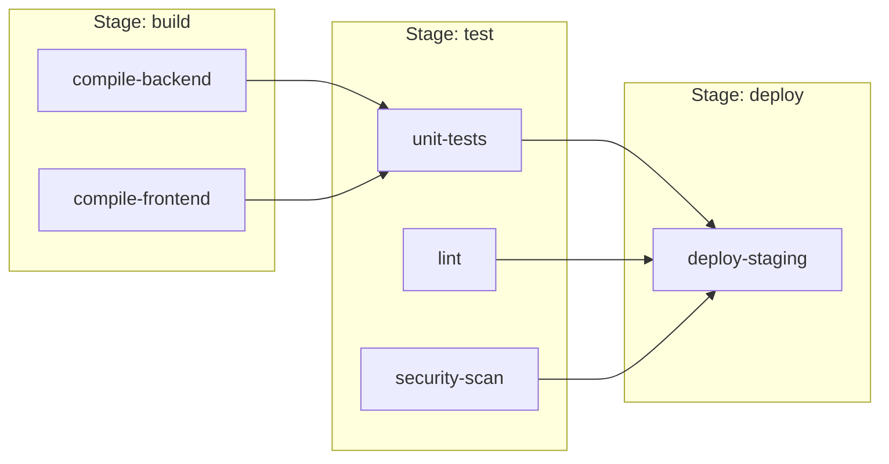
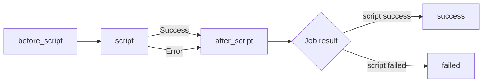
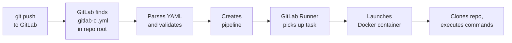
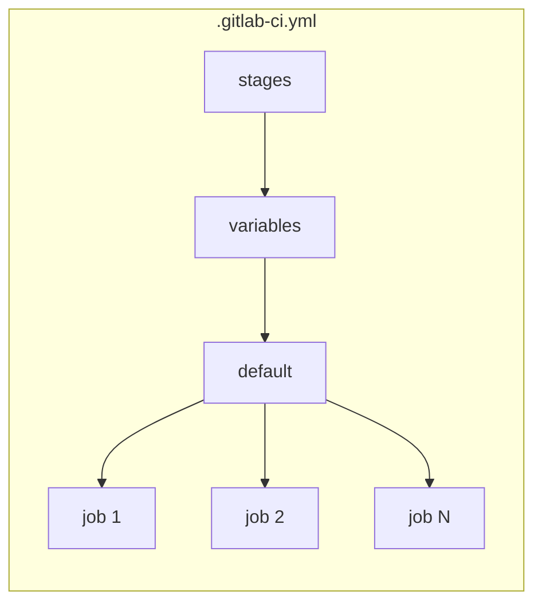

# Level 1: First .gitlab-ci.yml

## What is .gitlab-ci.yml and why you need it

Imagine you hired a new employee at a factory. But instead of verbally explaining what to do in each situation, you wrote them a detailed instruction: "When a new part arrives — first inspect it, then process it, then send it to the warehouse."

The `.gitlab-ci.yml` file is exactly such an instruction for GitLab. Every time you do a `git push`, GitLab reads this file and automatically executes everything written in it.

```
You write code  →  git push  →  GitLab reads .gitlab-ci.yml  →  Runs pipeline
```

📌 The `.gitlab-ci.yml` file must be in the **root** of the repository. GitLab looks for it there specifically.

---

## YAML — configuration language

`.gitlab-ci.yml` is written in YAML (Yet Another Markup Language). YAML is a format where data is described through indentation and colons.

### Basic YAML rules

**Key-value pairs:**
```yaml
name: my-project
version: "1.0"
enabled: true
```

**Nesting through indentation (strictly 2 spaces):**
```yaml
job:
  stage: test
  script:
    - npm test
```

**Lists with dashes:**
```yaml
stages:
  - build
  - test
  - deploy
```

⚠️ YAML is sensitive to indentation. Tabs are forbidden — only spaces. One wrong indent — and the pipeline won't start.

```yaml
# Correct
job:
  script:
    - echo "hello"

# Incorrect — Tab instead of spaces
job:
	script:        # <- error!
		- echo "hello"
```

---

## Job — atomic unit of the pipeline

If the pipeline is a factory conveyor belt, then a **job** is one worker on that belt. Each worker has their own task: one only paints, another only welds.

**A minimal job looks like this:**

```yaml
my-first-job:
  script:
    - echo "Hello, GitLab!"
    - echo "This is my first job"
```

Here:
- `my-first-job` — the job name. Any name you come up with.
- `script` — list of commands that will execute inside the job.

💡 The job name is just a string. Name it clearly: `run-tests`, `build-docker`, `deploy-staging`.

### What happens inside a job



---

## The stages keyword

**Stages** — a way to group jobs and set their execution order.

Analogy: on a car assembly line, you first weld the body, then paint it, then assemble the interior. You can't paint what hasn't been welded yet.

```yaml
stages:
  - build    # First
  - test     # Then
  - deploy   # Finally
```

**Rules for working with stages:**

1. Stages run **sequentially** — each next one starts only after the previous one completes successfully.
2. Jobs **within the same stage** run **in parallel**.
3. If at least one job fails — the next stage won't start.



### Default test stage

If you create a job but don't specify a stage — GitLab automatically assigns it to the `test` stage. This is convenient for simple configs:

```yaml
# No stages section needed — GitLab uses the default test stage
hello-world:
  script:
    - echo "I'm in the default test stage"
```

📌 The default stage is called `test`. But it's better to always explicitly specify stages — makes the config clearer.

---

## The stage keyword

Each job specifies which stage it belongs to via the `stage` keyword:

```yaml
stages:
  - build
  - test
  - deploy

build-app:
  stage: build          # Belongs to build stage
  script:
    - npm run build

run-tests:
  stage: test           # Belongs to test stage
  script:
    - npm test

deploy-to-server:
  stage: deploy         # Belongs to deploy stage
  script:
    - ./deploy.sh
```

⚠️ If you specify `stage: build` but don't declare `build` in the `stages` section — GitLab will throw an error.

---

## The image keyword

By default, GitLab runs jobs in Docker containers. The `image` keyword specifies which image to use.

Analogy: imagine you need different "workstations" for different tasks. For a Node.js project you need node and npm. For Python — python and pip. The `image` keyword is choosing the right workstation.

```yaml
# Use Node.js 20 image
build-node-app:
  image: node:20-alpine
  stage: build
  script:
    - npm ci
    - npm run build

# Use Python 3.11 image
run-python-tests:
  image: python:3.11-slim
  stage: test
  script:
    - pip install -r requirements.txt
    - pytest
```

### Popular images for CI

| Image | Includes | When to use |
|---|---|---|
| `node:20-alpine` | Node.js 20, npm, yarn | JavaScript/TypeScript projects |
| `python:3.11-slim` | Python 3.11, pip | Python projects |
| `golang:1.21-alpine` | Go 1.21, compiler | Go projects |
| `ruby:3.2-alpine` | Ruby 3.2, gem | Ruby/Rails projects |
| `alpine:3.18` | Minimal Linux (~5 MB) | Shell scripts, utilities |
| `ubuntu:22.04` | Full Ubuntu | Complex builds, many dependencies |
| `docker:24` | Docker CLI + daemon | Building Docker images |

💡 The `-alpine` suffix means Alpine Linux — a lightweight distribution. Images with it weigh much less and download faster. Use Alpine everywhere unless you have special requirements.

---

## before_script and after_script

Often multiple jobs need the same preparatory steps. Instead of duplicating commands — use `before_script`.

```yaml
default:
  before_script:
    - echo "Installing dependencies..."
    - npm ci

test-unit:
  stage: test
  script:
    - npm run test:unit

test-integration:
  stage: test
  script:
    - npm run test:integration
```

In this example, `npm ci` will run before **every** job.

### before_script and after_script at the job level

You can define `before_script` and `after_script` for a specific job:

```yaml
deploy-job:
  stage: deploy
  before_script:
    - echo "Checking server availability..."
    - ping -c 1 myserver.com
  script:
    - ./deploy.sh
  after_script:
    - echo "Deploy completed (successful or not)"
    - ./send-notification.sh
```

### Key difference of after_script

🔥 `after_script` runs **always** — even if `script` exited with an error. This is ideal for:
- Sending result notifications
- Cleaning up temporary files
- Closing connections



---

## First full pipeline

Let's put it all together. Here's a real config for a Node.js project:

```yaml
# .gitlab-ci.yml

# Declare stages and their order
stages:
  - install
  - test
  - build

# Variables available in all jobs
variables:
  NODE_ENV: test

# Default settings for all jobs
default:
  image: node:20-alpine
  before_script:
    - node --version
    - npm --version

# Job 1: Install dependencies
install-deps:
  stage: install
  script:
    - npm ci
  cache:
    key: ${CI_COMMIT_REF_SLUG}
    paths:
      - node_modules/

# Job 2: Linting (parallel with tests)
lint-code:
  stage: test
  script:
    - npm run lint

# Job 3: Tests (parallel with linting)
run-tests:
  stage: test
  script:
    - npm test -- --coverage
  after_script:
    - echo "Tests completed, coverage: $COVERAGE"

# Job 4: Build
build-app:
  stage: build
  script:
    - npm run build
  artifacts:
    paths:
      - dist/
    expire_in: 1 week
```

### How GitLab detects and runs the pipeline



GitLab Runner is a separate process (agent) that actually executes the jobs. GitLab.com provides shared runners for free. In corporate environments, specific runners are often set up.

---

## Minimal working config

The simplest `.gitlab-ci.yml` that will work:

```yaml
hello-world:
  script:
    - echo "CI is working!"
```

Just three lines. GitLab:
1. Creates a pipeline with one job
2. Assigns it to the default `test` stage
3. Executes the command `echo "CI is working!"`
4. Marks the pipeline as successful (or failed)

---

## Typical production config structure



| Block | Purpose |
|---|---|
| `stages` | Stage order |
| `variables` | Global variables |
| `default` | Default settings (image, before_script) |
| `job-name` | Description of a specific task |

---

## Common beginner mistakes

⚠️ **Mistake 1: Tabs instead of spaces**

```yaml
# Incorrect
job:
	script:
		- echo "hello"
```
```yaml
# Correct
job:
  script:
    - echo "hello"
```

Use an editor with YAML highlighting (VS Code, IntelliJ). They'll immediately show indentation problems.

---

⚠️ **Mistake 2: stage not declared in stages**

```yaml
# Incorrect — stage "build" not declared
stages:
  - test
  - deploy

build-app:
  stage: build    # Error! build is not in stages
  script:
    - npm run build
```

```yaml
# Correct
stages:
  - build
  - test
  - deploy

build-app:
  stage: build
  script:
    - npm run build
```

---

⚠️ **Mistake 3: Confusing before_script and script**

❌ Common mistake — putting in `script` what should be in `before_script`, and vice versa:

```yaml
# Incorrect — installing dependencies in script
run-tests:
  script:
    - npm ci          # This is preparation, not the "main task"
    - npm test
```

```yaml
# Correct — separating preparation from execution
run-tests:
  before_script:
    - npm ci
  script:
    - npm test
```

---

⚠️ **Mistake 4: Using heavy images where light ones suffice**

```yaml
# Incorrect — ubuntu:22.04 weighs ~70 MB
run-scripts:
  image: ubuntu:22.04
  script:
    - echo "Hello"
```

```yaml
# Correct — alpine:3.18 weighs ~5 MB, downloads instantly
run-scripts:
  image: alpine:3.18
  script:
    - echo "Hello"
```

---

⚠️ **Mistake 5: One giant job instead of multiple**

```yaml
# Incorrect — everything in one job
ci:
  script:
    - npm ci
    - npm run lint
    - npm test
    - npm run build
    - ./deploy.sh
```

If the linter fails — you won't know if tests passed. Split into separate jobs — each responsible for its own task.

```yaml
# Correct
stages:
  - validate
  - test
  - build
  - deploy

lint:
  stage: validate
  script:
    - npm run lint

test:
  stage: test
  script:
    - npm test

build:
  stage: build
  script:
    - npm run build

deploy:
  stage: deploy
  script:
    - ./deploy.sh
```

---

## Summary

The `.gitlab-ci.yml` file is the heart of GitLab CI/CD. Remember the key concepts:

- **Job** — atomic unit of work (one task)
- **Stage** — group of jobs running in parallel
- **stages** — stage order (sequential)
- **image** — Docker image for job execution
- **script** — list of job commands
- **before_script** — runs before script
- **after_script** — runs after script (always, even on error)

In the following levels we'll cover triggers (when to run the pipeline), environment variables, and working with artifacts.
