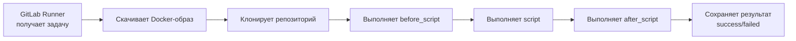
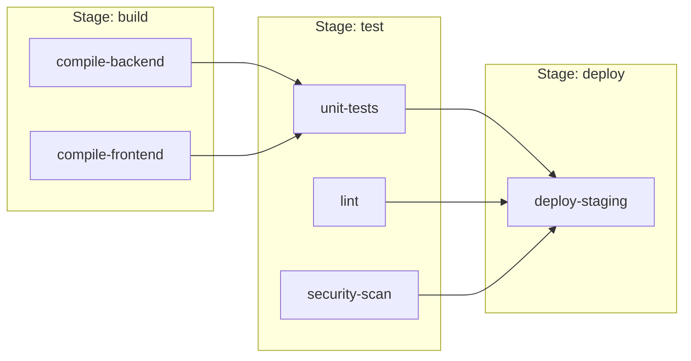
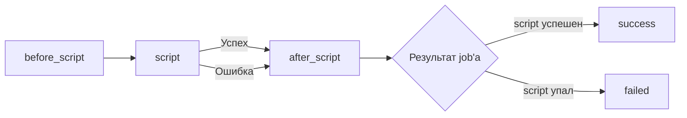
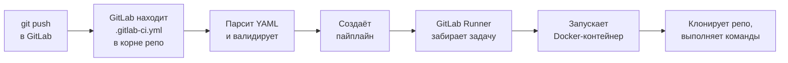
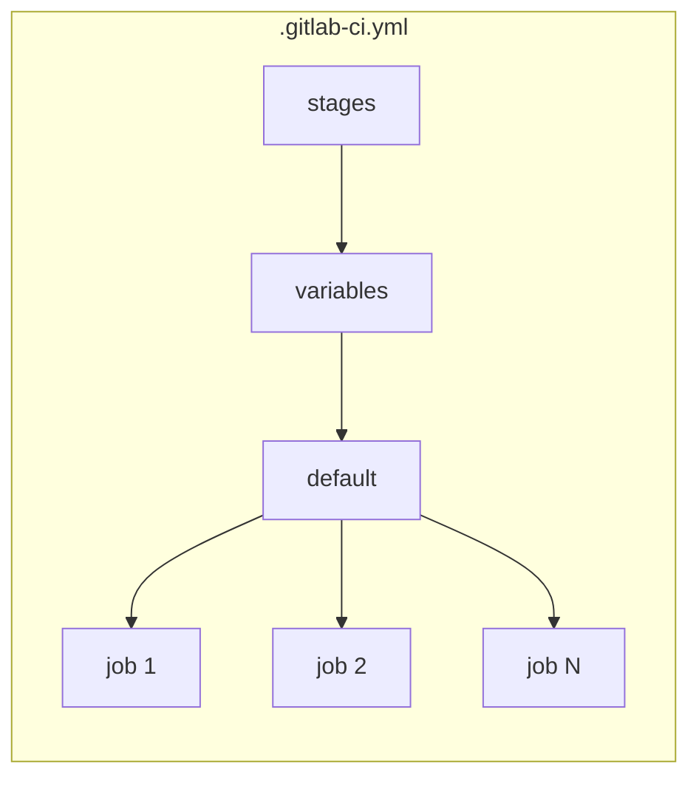

# Уровень 1: Первый .gitlab-ci.yml

## Что такое .gitlab-ci.yml и зачем он нужен

Представь, что ты нанял нового сотрудника на завод. Но вместо того чтобы объяснять ему устно что делать при каждой ситуации, ты написал ему подробную инструкцию: "Когда приходит новая деталь — сначала проверь её, потом обработай, потом отправь на склад."

Файл `.gitlab-ci.yml` — это именно такая инструкция для GitLab. Каждый раз, когда ты делаешь `git push`, GitLab читает этот файл и автоматически выполняет всё, что в нём написано.

```
Ты пишешь код  →  git push  →  GitLab читает .gitlab-ci.yml  →  Запускает пайплайн
```

📌 Файл `.gitlab-ci.yml` должен лежать в **корне** репозитория. GitLab ищет его именно там.

---

## YAML — язык конфигурации

`.gitlab-ci.yml` написан на языке YAML (Yet Another Markup Language). YAML — это формат, в котором данные описываются через отступы и двоеточия.

### Основные правила YAML

**Пары ключ-значение:**
```yaml
name: my-project
version: "1.0"
enabled: true
```

**Вложенность через отступы (строго 2 пробела):**
```yaml
job:
  stage: test
  script:
    - npm test
```

**Списки через дефис:**
```yaml
stages:
  - build
  - test
  - deploy
```

⚠️ YAML чувствителен к отступам. Табуляция запрещена — только пробелы. Один неверный отступ — и пайплайн не запустится.

```yaml
# Правильно
job:
  script:
    - echo "hello"

# Неправильно — Tab вместо пробелов
job:
	script:        # <- ошибка!
		- echo "hello"
```

---

## Job — атомарная единица пайплайна

Если пайплайн — это конвейер на заводе, то **job** — это один рабочий на этом конвейере. У каждого рабочего есть своя задача: один только красит, другой только сваривает.

**Минимальный job выглядит так:**

```yaml
my-first-job:
  script:
    - echo "Привет, GitLab!"
    - echo "Это мой первый job"
```

Здесь:
- `my-first-job` — имя job'а. Любое, которое ты придумаешь.
- `script` — список команд, которые выполнятся внутри job'а.

💡 Имя job'а — это просто строка. Называй понятно: `run-tests`, `build-docker`, `deploy-staging`.

### Что происходит внутри job'а



---

## Ключевое слово stages

**Stages** (стадии) — это способ сгруппировать job'ы и задать порядок их выполнения.

Аналогия: на конвейере машины сначала варят кузов, потом красят, потом собирают салон. Нельзя красить то, что ещё не сварили.

```yaml
stages:
  - build    # Сначала
  - test     # Потом
  - deploy   # В конце
```

**Правила работы со stages:**

1. Стадии выполняются **последовательно** — каждая следующая стартует только после успешного завершения предыдущей.
2. Job'ы **внутри одной стадии** выполняются **параллельно**.
3. Если хотя бы один job упал — следующая стадия не запустится.



### Дефолтная стадия test

Если ты создаёшь job, но не указываешь стадию — GitLab автоматически отнесёт его к стадии `test`. Это удобно для простых конфигов:

```yaml
# Секция stages не нужна — GitLab использует дефолтную стадию test
hello-world:
  script:
    - echo "Я в дефолтной стадии test"
```

📌 Дефолтная стадия называется `test`. Но лучше всегда явно указывать stages — так конфиг понятнее.

---

## Ключевое слово stage

Каждый job указывает, к какой стадии он принадлежит через ключевое слово `stage`:

```yaml
stages:
  - build
  - test
  - deploy

build-app:
  stage: build          # Принадлежит стадии build
  script:
    - npm run build

run-tests:
  stage: test           # Принадлежит стадии test
  script:
    - npm test

deploy-to-server:
  stage: deploy         # Принадлежит стадии deploy
  script:
    - ./deploy.sh
```

⚠️ Если указать `stage: build`, но не объявить `build` в секции `stages` — GitLab выдаст ошибку.

---

## Ключевое слово image

По умолчанию GitLab запускает job'ы в Docker-контейнерах. Ключевое слово `image` указывает, какой образ использовать.

Аналогия: представь, что для разных задач тебе нужны разные "рабочие места". Для Node.js проекта нужны node и npm. Для Python — python и pip. Ключевое слово `image` — это выбор нужного рабочего места.

```yaml
# Использовать образ Node.js 20
build-node-app:
  image: node:20-alpine
  stage: build
  script:
    - npm ci
    - npm run build

# Использовать образ Python 3.11
run-python-tests:
  image: python:3.11-slim
  stage: test
  script:
    - pip install -r requirements.txt
    - pytest
```

### Популярные образы для CI

| Образ | Что включает | Когда использовать |
|---|---|---|
| `node:20-alpine` | Node.js 20, npm, yarn | JavaScript/TypeScript проекты |
| `python:3.11-slim` | Python 3.11, pip | Python проекты |
| `golang:1.21-alpine` | Go 1.21, компилятор | Go проекты |
| `ruby:3.2-alpine` | Ruby 3.2, gem | Ruby/Rails проекты |
| `alpine:3.18` | Минимальный Linux (~5 МБ) | Shell-скрипты, утилиты |
| `ubuntu:22.04` | Полноценный Ubuntu | Сложные сборки, много зависимостей |
| `docker:24` | Docker CLI + daemon | Сборка Docker-образов |

💡 Суффикс `-alpine` означает Alpine Linux — лёгкий дистрибутив. Образы с ним весят намного меньше и скачиваются быстрее. Используй Alpine везде, где нет специальных требований.

---

## before_script и after_script

Часто нескольким job'ам нужны одинаковые подготовительные шаги. Вместо того чтобы дублировать команды — используй `before_script`.

```yaml
default:
  before_script:
    - echo "Устанавливаю зависимости..."
    - npm ci

test-unit:
  stage: test
  script:
    - npm run test:unit

test-integration:
  stage: test
  script:
    - npm run test:integration
```

В этом примере `npm ci` выполнится перед **каждым** job'ом.

### before_script и after_script на уровне job'а

Можно определить `before_script` и `after_script` для конкретного job'а:

```yaml
deploy-job:
  stage: deploy
  before_script:
    - echo "Проверяю доступность сервера..."
    - ping -c 1 myserver.com
  script:
    - ./deploy.sh
  after_script:
    - echo "Деплой завершён (успешно или нет)"
    - ./send-notification.sh
```

### Ключевое отличие after_script

🔥 `after_script` выполняется **всегда** — даже если `script` завершился с ошибкой. Это идеально для:
- Отправки уведомлений о результате
- Очистки временных файлов
- Закрытия соединений



---

## Первый полноценный пайплайн

Соберём всё вместе. Вот реальный конфиг для Node.js проекта:

```yaml
# .gitlab-ci.yml

# Объявляем стадии и их порядок
stages:
  - install
  - test
  - build

# Переменные доступны во всех job'ах
variables:
  NODE_ENV: test

# Настройки по умолчанию для всех job'ов
default:
  image: node:20-alpine
  before_script:
    - node --version
    - npm --version

# Job 1: Установка зависимостей
install-deps:
  stage: install
  script:
    - npm ci
  cache:
    key: ${CI_COMMIT_REF_SLUG}
    paths:
      - node_modules/

# Job 2: Линтинг (параллельно с тестами)
lint-code:
  stage: test
  script:
    - npm run lint

# Job 3: Тесты (параллельно с линтингом)
run-tests:
  stage: test
  script:
    - npm test -- --coverage
  after_script:
    - echo "Тесты завершены, покрытие: $COVERAGE"

# Job 4: Сборка
build-app:
  stage: build
  script:
    - npm run build
  artifacts:
    paths:
      - dist/
    expire_in: 1 week
```

### Как GitLab обнаруживает и запускает пайплайн



GitLab Runner — это отдельный процесс (агент), который и выполняет job'ы. GitLab.com предоставляет shared runners бесплатно. В корпоративных окружениях часто настраивают свои (specific runners).

---

## Минимальный рабочий конфиг

Самый простой `.gitlab-ci.yml`, который будет работать:

```yaml
hello-world:
  script:
    - echo "CI работает!"
```

Всего три строки. GitLab:
1. Создаст пайплайн с одним job'ом
2. Отнесёт его к дефолтной стадии `test`
3. Выполнит команду `echo "CI работает!"`
4. Пометит пайплайн как успешный (или упавший)

---

## Типичная структура production-конфига



| Блок | Назначение |
|---|---|
| `stages` | Порядок стадий |
| `variables` | Глобальные переменные |
| `default` | Настройки по умолчанию (image, before_script) |
| `job-name` | Описание конкретной задачи |

---

## Частые ошибки новичков

⚠️ **Ошибка 1: Табуляция вместо пробелов**

```yaml
# Неправильно
job:
	script:
		- echo "hello"
```
```yaml
# Правильно
job:
  script:
    - echo "hello"
```

Используй редактор с подсветкой YAML (VS Code, IntelliJ). Они сразу покажут проблемы с отступами.

---

⚠️ **Ошибка 2: stage не объявлен в stages**

```yaml
# Неправильно — стадия "build" не объявлена
stages:
  - test
  - deploy

build-app:
  stage: build    # Ошибка! build нет в stages
  script:
    - npm run build
```

```yaml
# Правильно
stages:
  - build
  - test
  - deploy

build-app:
  stage: build
  script:
    - npm run build
```

---

⚠️ **Ошибка 3: Путать before_script и script**

❌ Частая ошибка — положить в `script` то, что должно быть в `before_script`, и наоборот:

```yaml
# Неправильно — установка зависимостей в script
run-tests:
  script:
    - npm ci          # Это подготовка, а не "основная задача"
    - npm test
```

```yaml
# Правильно — разделяем подготовку и выполнение
run-tests:
  before_script:
    - npm ci
  script:
    - npm test
```

---

⚠️ **Ошибка 4: Использовать тяжёлые образы там, где хватит лёгких**

```yaml
# Неправильно — ubuntu:22.04 весит ~70 МБ
run-scripts:
  image: ubuntu:22.04
  script:
    - echo "Привет"
```

```yaml
# Правильно — alpine:3.18 весит ~5 МБ, скачивается мгновенно
run-scripts:
  image: alpine:3.18
  script:
    - echo "Привет"
```

---

⚠️ **Ошибка 5: Один гигантский job вместо нескольких**

```yaml
# Неправильно — всё в одном job'е
ci:
  script:
    - npm ci
    - npm run lint
    - npm test
    - npm run build
    - ./deploy.sh
```

Если упадёт линтер — не узнаешь, прошли ли тесты. Разбивай на отдельные job'ы — каждый за свою задачу.

```yaml
# Правильно
stages:
  - validate
  - test
  - build
  - deploy

lint:
  stage: validate
  script:
    - npm run lint

test:
  stage: test
  script:
    - npm test

build:
  stage: build
  script:
    - npm run build

deploy:
  stage: deploy
  script:
    - ./deploy.sh
```

---

## Итог

Файл `.gitlab-ci.yml` — это сердце GitLab CI/CD. Запомни ключевые понятия:

- **Job** — атомарная единица работы (одна задача)
- **Stage** — группа job'ов, выполняемых параллельно
- **stages** — порядок стадий (последовательный)
- **image** — Docker-образ для выполнения job'а
- **script** — список команд job'а
- **before_script** — выполняется до script
- **after_script** — выполняется после script (всегда, даже при ошибке)

В следующих уровнях мы разберём триггеры (когда запускать пайплайн), переменные окружения и работу с артефактами.
