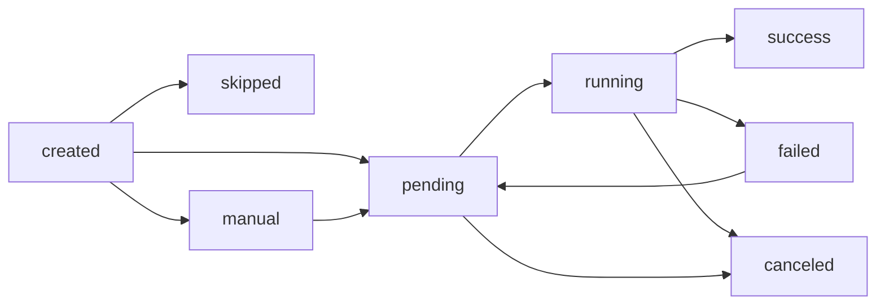
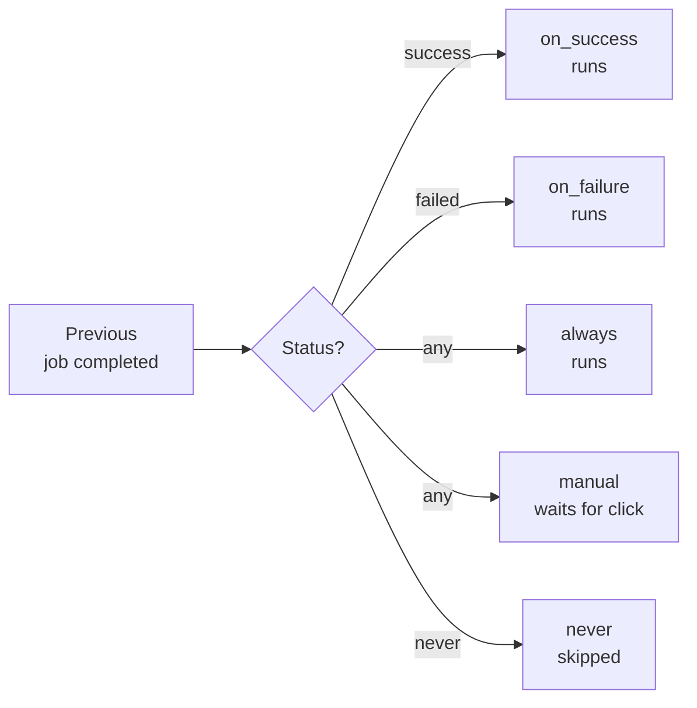
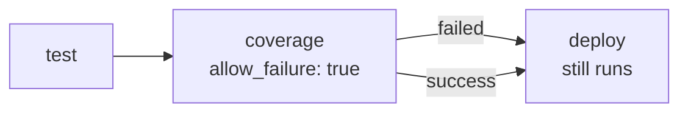
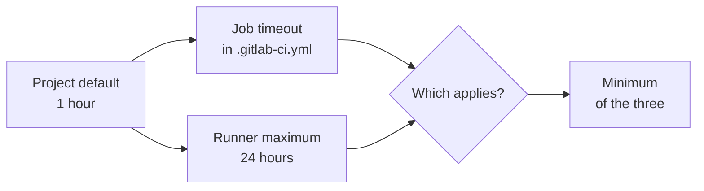

# Level 2: Job Lifecycle

## What is a Job and Why Know Its Lifecycle

Think of a job as a courier given a package. It has a clear path: received the task → drives → delivered (or not). At which point of this path is it right now? That's the **job state**.

Understanding the lifecycle is critical: states determine whether the next job runs, whether the entire pipeline stops, or whether an error is ignored.

---

## Job States

GitLab CI and GitHub Actions use a similar state model, although they name them slightly differently. Let's look at GitLab CI — the one with the richest set of states:

| State | Meaning | Icon |
|---|---|---|
| `pending` | Job created, waiting for a runner | 🕐 |
| `running` | Runner picked up the job | ▶️ |
| `success` | Completed with exit code 0 | ✅ |
| `failed` | Completed with non-zero exit code | ❌ |
| `canceled` | Canceled by user or system | 🚫 |
| `manual` | Waiting for manual trigger | 👆 |
| `skipped` | Skipped due to `when` condition | ⏭️ |
| `created` | Created, but condition not yet evaluated | 📋 |

### State Transition Diagram



💡 Note: from `failed` you can go back to `pending` — this is the `retry` mechanism.

---

## Why a Job Goes to pending Instead of Directly to running

A job doesn't start instantly. Between "created" and "running" there is a queue. Reasons:

1. **No free runner** — all are busy with other jobs
2. **No suitable runner** — the job has tag `docker`, but the only free runner has tag `shell`
3. **Concurrency limit** — limit on simultaneous jobs

```yaml
# GitLab CI: job will stay in pending until a runner with tag "docker" appears
build:
  tags:
    - docker
  script:
    - docker build -t myapp .
```

⚠️ If a job is "stuck" in `pending` longer than usual — most likely there's no suitable runner.

---

## `when` — Job Launch Condition

The `when` keyword determines **under what condition** the job will run. This is a fundamental pipeline flow control mechanism.

### `when` Values

**`on_success`** (default) — runs only if all previous jobs completed successfully:

```yaml
deploy:
  when: on_success  # this is default behavior, can omit
  script:
    - ./deploy.sh
```

**`on_failure`** — runs only if at least one previous job failed. Ideal for error notifications:

```yaml
notify-slack:
  when: on_failure
  script:
    - curl -X POST $SLACK_WEBHOOK -d '{"text": "Pipeline failed!"}'
```

**`always`** — runs regardless of previous job states. Use for cleanup:

```yaml
cleanup-resources:
  when: always
  script:
    - terraform destroy -auto-approve
```

**`manual`** — job is created but doesn't start automatically. Requires clicking a button in the UI:

```yaml
deploy-production:
  when: manual
  script:
    - ./deploy-prod.sh
```

**`delayed`** — runs after a specified delay once it becomes eligible:

```yaml
deploy-canary:
  when: delayed
  start_in: '30 minutes'
  script:
    - ./deploy-canary.sh
```

**`never`** — job never runs (used in `rules`):

```yaml
build:
  rules:
    - if: $CI_COMMIT_BRANCH == "main"
      when: always
    - when: never  # on other branches — never
```

### `when` Logic Diagram



---

## `allow_failure` — Soft and Hard Errors

By default, if a job fails — the entire pipeline is considered unsuccessful. But sometimes that's undesirable.

### Hard error (default)

```yaml
security-scan:
  script:
    - run-security-scanner
  # allow_failure: false — default
```

If `security-scan` fails — subsequent jobs won't run, the pipeline is red.

### Soft error (allow_failure: true)

```yaml
code-coverage:
  script:
    - run-coverage-check
  allow_failure: true  # job failed, but pipeline continues
```

The job appears in the UI with a special "warning" icon, not "error". The pipeline continues.



### When to Use `allow_failure: true`

✅ Linters still being configured
✅ Code coverage checks (informational, not a blocker)
✅ Experimental tests
✅ Vulnerability scanners in "awareness" mode

❌ Mandatory security tests
❌ API compatibility checks
❌ Anything that could break production

### `allow_failure` with `exit_codes`

You can be more precise — allow only specific exit codes:

```yaml
linter:
  script:
    - eslint .
  allow_failure:
    exit_codes: 1  # code 1 = warnings, allow
    # code 2 = parsing errors, do NOT allow
```

---

## `timeout` — How Long to Wait for a Job

Jobs can "hang". A test can enter an infinite loop, a script might wait for an unavailable service. Without a timeout, a job will occupy a runner forever.

### Configuring Timeout

```yaml
# GitLab CI
long-tests:
  timeout: 2 hours  # maximum execution time
  script:
    - pytest --timeout=7200

# GitHub Actions
jobs:
  test:
    timeout-minutes: 30  # maximum 30 minutes
    steps:
      - run: npm test
```

### Timeout Hierarchy in GitLab CI



📌 Final timeout = min(project default, runner max, job timeout). You can't set a timeout higher than what the runner allows.

### Practical Timeout Values

| Job Type | Recommended Timeout |
|---|---|
| Unit tests | 5–15 minutes |
| Integration tests | 15–30 minutes |
| E2E tests | 30–60 minutes |
| Docker image build | 15–30 minutes |
| Deploy | 10–20 minutes |

---

## `retry` — Automatic Restart

Not all errors are code bugs. Sometimes the runner is overloaded, the network flickered, or an external service is temporarily unavailable. `retry` handles these cases.

### Basic retry

```yaml
flaky-test:
  retry: 2  # retry up to 2 times on any error
  script:
    - npm test
```

📌 `retry: 2` means "try **2 more times**" (3 total attempts), not "try 2 times total".

### Smart retry — only for specific error types

```yaml
deploy:
  retry:
    max: 3
    when:
      - runner_system_failure     # the runner itself crashed
      - stuck_or_timeout_failure  # job hung or timeout exceeded
      - api_failure               # GitLab API error
      - scheduler_failure         # scheduler couldn't launch
```

### All error types for `retry.when`

| Type | When it triggers |
|---|---|
| `always` | On any error |
| `unknown_failure` | Cause is unknown |
| `script_failure` | Script exited with error |
| `api_failure` | GitLab API error |
| `stuck_or_timeout_failure` | Hung or exceeded timeout |
| `runner_system_failure` | Runner system error |
| `missing_dependency_failure` | Dependency artifacts not found |
| `runner_unsupported` | Runner doesn't support this job |
| `scheduler_failure` | Could not schedule the job |

### What NOT to Do with retry

❌ Setting `retry: 3` on all jobs — this masks real problems.

```yaml
# Bad: hiding test instability
tests:
  retry: 3
  script:
    - npm test  # flaky test "passes" on 2nd or 3rd attempt
```

✅ Retry is for infrastructure failures, not for flaky tests. Flaky tests need to be fixed.

---

## Exit Codes and Their Meaning

When a script finishes, it returns an **exit code** — a number from 0 to 255.

### Main Exit Codes

| Code | Meaning |
|---|---|
| `0` | Success — job will be `success` |
| `1` | General error |
| `2` | Command usage error (bash) |
| `126` | No permission to execute file |
| `127` | Command not found |
| `128+N` | Terminated by signal N (e.g., 137 = killed, 130 = Ctrl+C) |

### How CI/CD Interprets Exit Codes

```yaml
# If script returns 0 — success
# If anything else — failed
script:
  - npm test  # exit 0 = pass, exit 1 = fail
```

💡 You can intentionally modify the exit code to bypass or strengthen the check:

```yaml
# Ignore error, but preserve information
script:
  - npm audit || true  # always exit 0

# Check specific exit code
script:
  - eslint . ; if [ $? -eq 2 ]; then exit 1; fi  # error only on exit 2
```

---

## How to Read Job Logs

Job logs are the primary diagnostic tool. Knowing their structure saves hours of debugging.

### Anatomy of a Log

```
Running with gitlab-runner 16.8.0           ← runner version
  on my-runner abc123de                      ← runner name and token
Preparing the "docker" executor              ← executor type
Using Docker executor with image node:20    ← image
Pulling docker image node:20 ...            ← pulling image

$ npm ci                                    ← your script
added 847 packages in 12s                   ← command output

$ npm test                                  ← next command
PASS src/app.test.js (2.3s)
Tests: 47 passed                           ← result

Job succeeded                              ← job result
```

### What to Look for on Failure

1. **Find the first red line** — usually the start of the problem, not its end
2. **Check the exit code** — `exit code: 137` means OOM (killed), not a logical error
3. **Look for "ERROR" and "FATAL"** — but note some tools write them to stderr without actually failing
4. **Check "Uploading artifacts" sections** — if an artifact wasn't created, the next job will fail

---

## Common Beginner Mistakes

⚠️ **Mistake 1: allow_failure everywhere**

```yaml
# Bad: hiding all errors
tests:
  allow_failure: true  # now tests can fail — and nobody will notice
```

```yaml
# Good: allow_failure only where it's a conscious decision
coverage-check:
  allow_failure: true  # explicitly decided: this is an informational metric
```

⚠️ **Mistake 2: Not understanding the difference between when: on_failure and allow_failure**

```yaml
# These are DIFFERENT things:

# allow_failure: true — job failed, but PIPELINE continues
# (subsequent on_success jobs will still run)

# when: on_failure — job runs ONLY IF something failed
# (this is a launch condition, not permission to fail)
```

⚠️ **Mistake 3: retry masks flaky tests**

A flaky test is a bug, not a feature. Retry provides temporary relief, but the problem remains. Fix the root cause of instability.

⚠️ **Mistake 4: No timeout on long-running jobs**

Without a timeout, a single hung job can occupy a runner for hours. Always set a reasonable upper limit.

⚠️ **Mistake 5: Not using when: on_failure for notifications**

```yaml
# Good practice: always know about failures
notify-failure:
  when: on_failure
  script:
    - ./send-alert.sh "Pipeline failed in $CI_JOB_NAME"
```

---

## Summary

A job's lifecycle is not just about statuses. It's a tool for managing pipeline flow:

- **`when`** determines the launch condition — use `on_failure` for notifications, `manual` for production deploys
- **`allow_failure`** separates "informational" and "blocking" checks
- **`retry`** resolves infrastructure problems but doesn't mask code bugs
- **`timeout`** protects runners from hung jobs
- **Exit codes** are the language scripts use to communicate with the CI/CD system

In the next level, we'll look at how jobs are organized into stages and how to manage dependencies between them.
