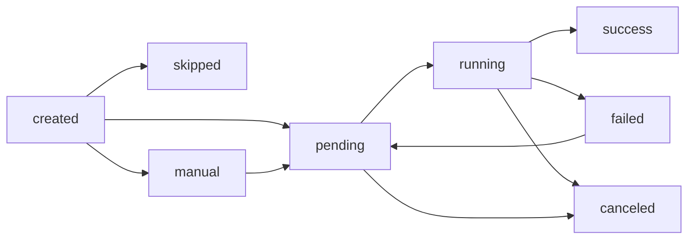
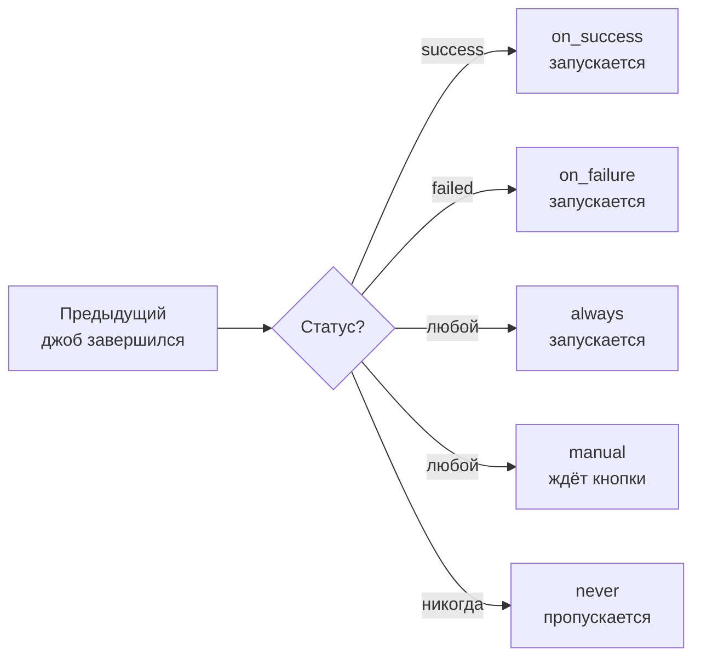
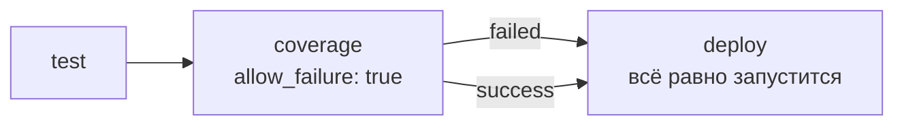
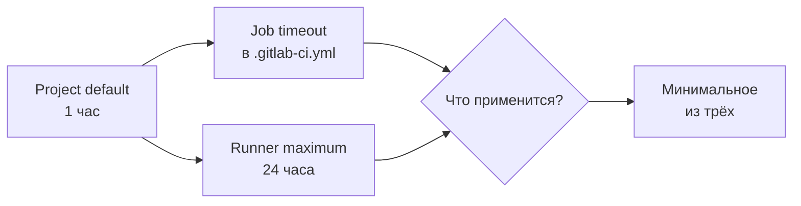

# Уровень 2: Жизненный цикл джоба

## Что такое джоб и зачем знать его жизненный цикл

Представь, что джоб — это курьер, которому дали посылку. У него есть чёткий путь: получил задание → едет → доставил (или нет). В какой точке этого пути он сейчас? Это и есть **состояние джоба**.

Понимание жизненного цикла критично: именно от состояний зависит, запустится ли следующий джоб, остановится ли весь пайплайн, или ошибка будет проигнорирована.

---

## Состояния джоба

GitLab CI и GitHub Actions используют схожую модель состояний, хотя называют их немного по-разному. Рассмотрим на примере GitLab CI — наиболее богатого состояниями:

| Состояние | Значение | Иконка |
|---|---|---|
| `pending` | Джоб создан, ждёт раннера | 🕐 |
| `running` | Раннер взял джоб в работу | ▶️ |
| `success` | Завершился с exit code 0 | ✅ |
| `failed` | Завершился с ненулевым exit code | ❌ |
| `canceled` | Отменён пользователем или системой | 🚫 |
| `manual` | Ждёт ручного запуска | 👆 |
| `skipped` | Пропущен по условию `when` | ⏭️ |
| `created` | Создан, но условие ещё не проверено | 📋 |

### Диаграмма переходов состояний



💡 Обрати внимание: из `failed` можно вернуться в `pending` — это и есть механизм `retry`.

---

## Почему джоб попадает в pending, а не сразу в running

Джоб не запускается мгновенно. Между "создан" и "выполняется" есть очередь. Причины:

1. **Нет свободного раннера** — все заняты другими джобами
2. **Нет подходящего раннера** — у джоба тег `docker`, а свободен только раннер с тегом `shell`
3. **Concurrency limit** — ограничение на количество одновременных джобов

```yaml
# GitLab CI: джоб попадёт в pending, пока не появится раннер с тегом "docker"
build:
  tags:
    - docker
  script:
    - docker build -t myapp .
```

⚠️ Если джоб "завис" в `pending` дольше обычного — скорее всего, нет подходящего раннера.

---

## `when` — условие запуска джоба

Ключевое слово `when` определяет, **при каком условии** джоб запустится. Это фундаментальный механизм управления потоком пайплайна.

### Значения `when`

**`on_success`** (по умолчанию) — запустится только если все предыдущие джобы завершились успешно:

```yaml
deploy:
  when: on_success  # это поведение по умолчанию, можно не писать
  script:
    - ./deploy.sh
```

**`on_failure`** — запустится только если хотя бы один предыдущий джоб упал. Идеально для нотификаций об ошибках:

```yaml
notify-slack:
  when: on_failure
  script:
    - curl -X POST $SLACK_WEBHOOK -d '{"text": "Pipeline failed!"}'
```

**`always`** — запустится всегда, независимо от состояния предыдущих джобов. Используй для cleanup:

```yaml
cleanup-resources:
  when: always
  script:
    - terraform destroy -auto-approve
```

**`manual`** — джоб создаётся, но не запускается автоматически. Требует нажатия кнопки в UI:

```yaml
deploy-production:
  when: manual
  script:
    - ./deploy-prod.sh
```

**`delayed`** — запустится через указанное время после того, как станет eligible:

```yaml
deploy-canary:
  when: delayed
  start_in: '30 minutes'
  script:
    - ./deploy-canary.sh
```

**`never`** — джоб никогда не запустится (используется в правилах `rules`):

```yaml
build:
  rules:
    - if: $CI_COMMIT_BRANCH == "main"
      when: always
    - when: never  # на других ветках — никогда
```

### Диаграмма логики `when`



---

## `allow_failure` — мягкие и жёсткие ошибки

По умолчанию, если джоб упал — весь пайплайн считается неуспешным. Но иногда это нежелательно.

### Жёсткая ошибка (по умолчанию)

```yaml
security-scan:
  script:
    - run-security-scanner
  # allow_failure: false — по умолчанию
```

Если `security-scan` упал — следующие джобы не запустятся, пайплайн красный.

### Мягкая ошибка (allow_failure: true)

```yaml
code-coverage:
  script:
    - run-coverage-check
  allow_failure: true  # джоб упал, но пайплайн продолжается
```

Джоб отображается в UI с особым значком "предупреждение", а не "ошибка". Пайплайн продолжается.



### Когда использовать `allow_failure: true`

✅ Линтеры, которые ещё в процессе настройки  
✅ Проверки покрытия кода (как информация, не блокер)  
✅ Экспериментальные тесты  
✅ Сканеры уязвимостей в режиме "awareness"  

❌ Обязательные тесты безопасности  
❌ Проверки совместимости API  
❌ Всё, что может сломать продакшн  

### `allow_failure` с `exit_codes`

Можно быть точнее — разрешать только конкретные exit codes:

```yaml
linter:
  script:
    - eslint .
  allow_failure:
    exit_codes: 1  # код 1 = предупреждения, разрешаем
    # код 2 = ошибки парсинга, НЕ разрешаем
```

---

## `timeout` — сколько ждать джоб

Джобы могут "зависнуть". Тест может попасть в бесконечный цикл, скрипт ждать недоступного сервиса. Без таймаута джоб будет занимать раннер вечно.

### Настройка таймаута

```yaml
# GitLab CI
long-tests:
  timeout: 2 hours  # максимальное время выполнения
  script:
    - pytest --timeout=7200

# GitHub Actions
jobs:
  test:
    timeout-minutes: 30  # максимум 30 минут
    steps:
      - run: npm test
```

### Иерархия таймаутов в GitLab CI



📌 Итоговый таймаут = min(project default, runner max, job timeout). Не удастся поставить таймаут больше, чем допускает раннер.

### Практические значения таймаутов

| Тип джоба | Рекомендуемый таймаут |
|---|---|
| Unit-тесты | 5–15 минут |
| Integration-тесты | 15–30 минут |
| E2E-тесты | 30–60 минут |
| Сборка Docker-образа | 15–30 минут |
| Деплой | 10–20 минут |

---

## `retry` — автоматический перезапуск

Не все ошибки — баги в коде. Иногда раннер перегружен, сеть мигнула, внешний сервис временно недоступен. Для таких случаев есть `retry`.

### Базовый retry

```yaml
flaky-test:
  retry: 2  # перезапустить до 2 раз при любой ошибке
  script:
    - npm test
```

📌 `retry: 2` означает "попробовать ещё **2 раза**" (итого 3 попытки), а не "попробовать 2 раза всего".

### Умный retry — только для конкретных типов ошибок

```yaml
deploy:
  retry:
    max: 3
    when:
      - runner_system_failure     # упал сам раннер
      - stuck_or_timeout_failure  # джоб завис или истёк таймаут
      - api_failure               # ошибка GitLab API
      - scheduler_failure         # планировщик не смог запустить
```

### Все типы ошибок для `retry.when`

| Тип | Когда срабатывает |
|---|---|
| `always` | При любой ошибке |
| `unknown_failure` | Причина неизвестна |
| `script_failure` | Скрипт завершился с ошибкой |
| `api_failure` | Ошибка GitLab API |
| `stuck_or_timeout_failure` | Завис или превысил таймаут |
| `runner_system_failure` | Системная ошибка раннера |
| `missing_dependency_failure` | Не найдены артефакты зависимостей |
| `runner_unsupported` | Раннер не поддерживает этот джоб |
| `scheduler_failure` | Не удалось запланировать джоб |

### Что НЕ стоит делать с retry

❌ Ставить `retry: 3` на все джобы — это маскирует реальные проблемы.

```yaml
# Плохо: скрываем нестабильность тестов
tests:
  retry: 3
  script:
    - npm test  # flaky тест "проходит" со 2-3 попытки
```

✅ Retry — для инфраструктурных сбоев, а не для нестабильных тестов. Flaky тесты надо чинить.

---

## Exit codes и их значение

Когда скрипт завершается, он возвращает **exit code** — число от 0 до 255.

### Основные exit codes

| Code | Значение |
|---|---|
| `0` | Успех — джоб будет `success` |
| `1` | Общая ошибка |
| `2` | Ошибка использования команды (bash) |
| `126` | Нет прав на выполнение файла |
| `127` | Команда не найдена |
| `128+N` | Завершён сигналом N (например, 137 = killed, 130 = Ctrl+C) |

### Как CI/CD интерпретирует exit codes

```yaml
# Если скрипт вернул 0 — success
# Если любой другой — failed
script:
  - npm test  # exit 0 = pass, exit 1 = fail
```

💡 Можно намеренно изменить exit code, чтобы обойти или усилить проверку:

```yaml
# Игнорируем ошибку, но сохраняем информацию
script:
  - npm audit || true  # всегда exit 0
  
# Проверяем конкретный exit code
script:
  - eslint . ; if [ $? -eq 2 ]; then exit 1; fi  # ошибка только при exit 2
```

---

## Как читать логи джоба

Лог джоба — главный инструмент диагностики. Знание его структуры экономит часы отладки.

### Анатомия лога

```
Running with gitlab-runner 16.8.0           ← версия раннера
  on my-runner abc123de                      ← имя и токен раннера
Preparing the "docker" executor              ← тип executor
Using Docker executor with image node:20    ← образ
Pulling docker image node:20 ...            ← скачивание образа

$ npm ci                                    ← ваш скрипт
added 847 packages in 12s                   ← вывод команды

$ npm test                                  ← следующая команда
PASS src/app.test.js (2.3s)
Tests: 47 passed                           ← результат

Job succeeded                              ← итог джоба
```

### Что искать при падении

1. **Найди первую красную строку** — обычно это начало проблемы, не её конец
2. **Смотри на exit code** — `exit code: 137` означает OOM (killed), а не логическую ошибку
3. **Ищи "ERROR" и "FATAL"** — но учти, что некоторые инструменты пишут их в stderr без реального падения
4. **Проверь секции "Uploading artifacts"** — если артефакт не создался, следующий джоб упадёт

---

## Частые ошибки новичков

⚠️ **Ошибка 1: allow_failure везде**

```yaml
# Плохо: скрываем все ошибки
tests:
  allow_failure: true  # теперь тесты могут падать — и никто не заметит
```

```yaml
# Хорошо: allow_failure только там, где это осознанное решение
coverage-check:
  allow_failure: true  # явно решили: это информационная метрика
```

⚠️ **Ошибка 2: Не понимать разницу between when: on_failure и allow_failure**

```yaml
# Это РАЗНЫЕ вещи:

# allow_failure: true — джоб упал, но ПАЙПЛАЙН продолжается
# (следующие on_success джобы всё равно запустятся)

# when: on_failure — джоб запускается ТОЛЬКО если что-то упало
# (это условие запуска, не разрешение на ошибку)
```

⚠️ **Ошибка 3: retry маскирует flaky tests**

Flaky test (нестабильный тест) — это баг, не особенность. Retry даёт временное облегчение, но проблема остаётся. Исправляй источник нестабильности.

⚠️ **Ошибка 4: Нет таймаута на долгие джобы**

Без таймаута один зависший джоб может занимать раннер часами. Всегда ставь разумный верхний предел.

⚠️ **Ошибка 5: Не использовать when: on_failure для нотификаций**

```yaml
# Хорошая практика: всегда знать о падениях
notify-failure:
  when: on_failure
  script:
    - ./send-alert.sh "Pipeline failed in $CI_JOB_NAME"
```

---

## Итог

Жизненный цикл джоба — это не просто статусы. Это инструмент управления потоком пайплайна:

- **`when`** определяет условие запуска — используй `on_failure` для нотификаций, `manual` для деплоев в прод
- **`allow_failure`** разделяет "информационные" и "блокирующие" проверки
- **`retry`** решает инфраструктурные проблемы, но не маскирует баги в коде
- **`timeout`** защищает раннеры от зависших джобов
- **Exit codes** — язык, на котором скрипты общаются с CI/CD системой

В следующем уровне разберём, как джобы организуются в стадии и как управлять зависимостями между ними.
