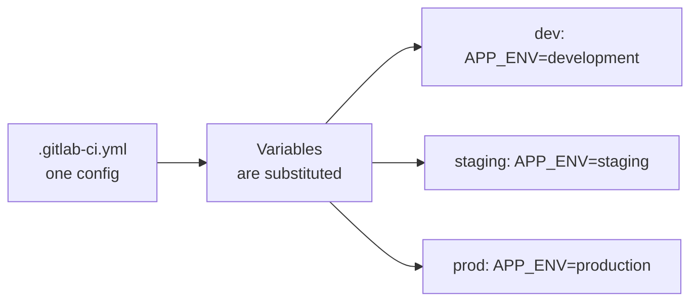
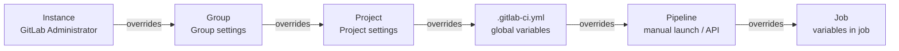
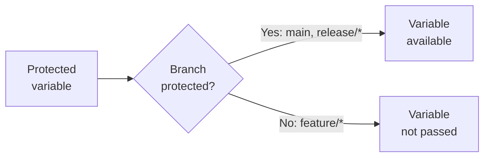

# Level 3: Variables in GitLab CI

## Why Variables Are Needed

Imagine you're writing a deploy script. It has a hardcoded server address, image name, and auth token. Everything works. Then you need to deploy the same thing to staging. You copy the script, change values manually... and now you have two files that diverge, and a bug that only reproduces in one environment.

Variables in CI/CD solve this problem. One config, different values — depending on environment, branch, or access level.



---

## Predefined Variables in GitLab CI

GitLab automatically passes dozens of variables into every job. Nothing needs to be declared — they just exist.

### Category: Commit

| Variable | Example Value | What It Means |
|---|---|---|
| `CI_COMMIT_SHA` | `a1b2c3d4e5f6...` | Full commit SHA (40 characters) |
| `CI_COMMIT_SHORT_SHA` | `a1b2c3d4` | Short SHA (8 characters) |
| `CI_COMMIT_REF_NAME` | `main` / `feature/login` | Branch or tag name |
| `CI_COMMIT_REF_SLUG` | `feature-login` | Branch name in "slug" format (hyphens instead of `/`) |
| `CI_COMMIT_MESSAGE` | `feat: add login` | Commit message |
| `CI_COMMIT_AUTHOR` | `Ivan Petrov <ivan@example.com>` | Commit author |
| `CI_COMMIT_TIMESTAMP` | `2024-01-15T10:30:00+03:00` | Commit time in ISO 8601 |
| `CI_COMMIT_TAG` | `v1.2.3` | Tag name (if triggered on a tag) |

```yaml
deploy-job:
  script:
    # Tag the Docker image with commit SHA — always can roll back
    - docker build -t myapp:$CI_COMMIT_SHORT_SHA .
    - echo "Deploying commit $CI_COMMIT_SHA from branch $CI_COMMIT_REF_NAME"
```

### Category: Pipeline

| Variable | Example Value | What It Means |
|---|---|---|
| `CI_PIPELINE_ID` | `12345` | Unique pipeline ID (globally) |
| `CI_PIPELINE_IID` | `42` | Pipeline ID within the project |
| `CI_PIPELINE_SOURCE` | `push` / `merge_request_event` | What triggered the pipeline |
| `CI_PIPELINE_URL` | `https://gitlab.com/...` | Link to the pipeline |

### Category: Job

| Variable | Example Value | What It Means |
|---|---|---|
| `CI_JOB_ID` | `98765` | Unique job ID |
| `CI_JOB_NAME` | `build-app` | Name of the current job |
| `CI_JOB_STAGE` | `build` | Stage of the current job |
| `CI_JOB_STATUS` | `running` | Job status |
| `CI_JOB_URL` | `https://gitlab.com/...` | Link to the job |
| `CI_JOB_TOKEN` | `glrt-xxxx` | Temporary token for authentication |

💡 `CI_JOB_TOKEN` is very useful for authenticating with Container Registry or Package Registry. No need to store a separate token.

### Category: Project

| Variable | Example Value | What It Means |
|---|---|---|
| `CI_PROJECT_ID` | `777` | Project ID |
| `CI_PROJECT_NAME` | `my-app` | Project name |
| `CI_PROJECT_PATH` | `mygroup/my-app` | Full path (group/project) |
| `CI_PROJECT_URL` | `https://gitlab.com/mygroup/my-app` | Project URL |
| `CI_PROJECT_DIR` | `/builds/mygroup/my-app` | Path to the code directory on the runner |
| `CI_REGISTRY` | `registry.gitlab.com` | Container Registry address |
| `CI_REGISTRY_IMAGE` | `registry.gitlab.com/mygroup/my-app` | Image address in Registry |

### Category: Runner

| Variable | Example Value | What It Means |
|---|---|---|
| `CI_RUNNER_ID` | `1234` | Runner ID |
| `CI_RUNNER_DESCRIPTION` | `shared-runner-linux` | Runner description |
| `CI_RUNNER_TAGS` | `docker,linux` | Runner tags |
| `GITLAB_CI` | `true` | Flag: we are inside GitLab CI |

### Category: Merge Request

| Variable | Example Value | What It Means |
|---|---|---|
| `CI_MERGE_REQUEST_IID` | `15` | Merge request ID |
| `CI_MERGE_REQUEST_TITLE` | `feat: add login` | MR title |
| `CI_MERGE_REQUEST_SOURCE_BRANCH_NAME` | `feature/login` | MR source branch |
| `CI_MERGE_REQUEST_TARGET_BRANCH_NAME` | `main` | MR target branch |
| `CI_MERGE_REQUEST_LABELS` | `backend,urgent` | MR labels |

📌 `CI_MERGE_REQUEST_*` variables are only available in pipelines triggered for MRs (`CI_PIPELINE_SOURCE == "merge_request_event"`).

---

## Custom Variables

You can declare your own variables at different levels.

### In .gitlab-ci.yml (global and in a job)

```yaml
# Global variables — available in all jobs
variables:
  NODE_VERSION: '20'
  DOCKER_REGISTRY: 'registry.example.com'
  APP_NAME: 'my-service'

build-job:
  stage: build
  # Job-level variable — overrides the global one
  variables:
    NODE_VERSION: '18'   # only in this job it will be 18
  script:
    - echo "Using Node $NODE_VERSION"
    - docker build -t $DOCKER_REGISTRY/$APP_NAME:latest .

test-job:
  stage: test
  script:
    - echo "Using Node $NODE_VERSION"   # back to 20 here
```

---

## Variable Levels and Priority

This is the most important concept. Variables can be set in six places, and each level overwrites the previous one.



🔥 Rule: **the closer to the job — the higher the priority.**

### Variable Conflict Example

Imagine `DATABASE_URL` is set at three levels:

| Level | Value |
|---|---|
| Project Settings | `postgres://prod-db/myapp` |
| global `variables:` | `postgres://localhost/myapp` |
| job `variables:` | `postgres://test-db/myapp` |

In the job where the local variable is defined, `postgres://test-db/myapp` wins. In other jobs — `postgres://localhost/myapp` (from global variables). In a project without .gitlab-ci.yml — `postgres://prod-db/myapp`.

### Variables on Manual Pipeline Launch

When launching a pipeline via UI or API, you can pass variables:

```bash
# Via API
curl -X POST \
  --header "PRIVATE-TOKEN: <token>" \
  --form "variables[DEPLOY_ENV]=staging" \
  "https://gitlab.com/api/v4/projects/42/pipeline"
```

These variables take priority over `variables:` in .gitlab-ci.yml, but lower than job-level variables.

---

## Variable Expansion — Value Substitution

### Syntax on Linux/Mac (shell)

```yaml
script:
  # Simple expansion
  - echo $CI_COMMIT_SHA
  - echo ${CI_COMMIT_SHA}

  # Default value (if variable is not set)
  - echo ${DEPLOY_ENV:-development}

  # Nested variable
  - echo ${CI_REGISTRY_IMAGE}:${CI_COMMIT_SHORT_SHA}

  # Usage in a string
  - docker tag myapp:latest $CI_REGISTRY_IMAGE:$CI_COMMIT_TAG
```

### Syntax on Windows (PowerShell)

```yaml
script:
  - echo $env:CI_COMMIT_SHA
  - echo "Branch: $env:CI_COMMIT_REF_NAME"
```

### Variable Expansion in Variable Values

GitLab supports variable expansion within variables themselves:

```yaml
variables:
  IMAGE_TAG: '$CI_REGISTRY_IMAGE:$CI_COMMIT_SHORT_SHA'
  # IMAGE_TAG will be resolved at runtime as:
  # registry.gitlab.com/mygroup/myapp:a1b2c3d4

deploy-job:
  script:
    - docker pull $IMAGE_TAG   # uses the already-resolved value
```

⚠️ Single quotes `'...'` in YAML mean expansion happens at runtime (during job execution). Double quotes `"..."` — value is substituted during YAML parsing.

---

## File-type Variables

A normal variable stores a string. A file-type variable writes the value to a temporary file and passes the path to that file.

```yaml
# A File-type variable set in project settings:
# Name: KUBECONFIG_FILE
# Value: <kubeconfig contents>
# Type: File

deploy-to-k8s:
  script:
    # $KUBECONFIG_FILE contains the path to the temp file
    - kubectl --kubeconfig=$KUBECONFIG_FILE get pods
    - helm upgrade myapp ./chart --kubeconfig=$KUBECONFIG_FILE
```

💡 File-type variables are ideal for certificates, SSH keys, kubeconfig, `.env` files — anything that needs to be a file rather than a string.

---

## Protected and Masked Variables (Overview)

📌 Detailed breakdown — in level 10. Here — basic understanding.

**Protected** — variable is available only in protected branches (main, release/*) and tags. Cannot be read from a feature/* branch.



**Masked** — value is hidden in logs. Instead of `secret123`, logs will show `[MASKED]`.

```yaml
# In job logs:
# $ echo $DB_PASSWORD
# [MASKED]              ← masked
```

⚠️ Masked variables have restrictions: value must be at least 8 characters, no line breaks, no special characters.

**Best practice:** all secrets (passwords, tokens, keys) should be simultaneously Protected + Masked + stored in project/group variables, not in .gitlab-ci.yml.

---

## How to View All Variables in a Job

```yaml
debug-variables:
  stage: .pre
  script:
    - env | grep CI_     # all GitLab CI variables
    - env | sort         # all environment variables
  # Never do this in prod! Secrets will appear in logs.
```

---

## Common Beginner Mistakes

⚠️ **Mistake 1: Storing secrets in .gitlab-ci.yml**

```yaml
# ❌ Bad — secret is visible to everyone who reads the file
variables:
  API_KEY: 'sk-prod-secret-token-12345'
```

```yaml
# ✅ Good — variable set in Settings → CI/CD → Variables
# In .gitlab-ci.yml just use the name
script:
  - curl -H "Authorization: $API_KEY" https://api.example.com
```

---

⚠️ **Mistake 2: Not understanding variable priority**

```yaml
# ❌ Developer expects prod to use the value from Settings
# But .gitlab-ci.yml has global variables: — which overwrites it!
variables:
  DATABASE_URL: 'postgres://localhost/dev'   # this overwrites Project Settings!
```

```yaml
# ✅ Use conditional variables or different config files
variables:
  DATABASE_URL: '${DATABASE_URL_OVERRIDE:-postgres://localhost/dev}'
```

---

⚠️ **Mistake 3: Using CI_MERGE_REQUEST_IID outside MR pipelines**

```yaml
# ❌ This variable will be empty in a regular push pipeline
script:
  - echo "MR #$CI_MERGE_REQUEST_IID"   # empty string if this is not an MR
```

```yaml
# ✅ Check the pipeline source
script:
  - |
    if [ "$CI_PIPELINE_SOURCE" = "merge_request_event" ]; then
      echo "MR #$CI_MERGE_REQUEST_IID"
    else
      echo "Not a MR pipeline"
    fi
```

---

⚠️ **Mistake 4: Confusing single and double quotes in YAML**

```yaml
variables:
  # ❌ Expansion happens during YAML parsing — at this point CI_REGISTRY_IMAGE is not yet available
  IMAGE: "$CI_REGISTRY_IMAGE:latest"

  # ✅ Single quotes — expansion at runtime during job execution
  IMAGE: '$CI_REGISTRY_IMAGE:latest'
```

---

⚠️ **Mistake 5: Forgetting to escape $ in passwords**

```yaml
variables:
  # ❌ If the password contains $, it will try to expand as a variable
  DB_PASS: 'my$ecret'   # GitLab will try to find the variable $ecret

  # ✅ Escape the dollar sign
  DB_PASS: 'my$$ecret'   # $$ → single $ in the value
```

---

## Summary

Variables in GitLab CI are layered: from global GitLab settings down to a specific job. Understanding priorities allows building flexible pipelines that behave differently in dev, staging, and prod without duplicating configs.

Key principles:
- Predefined variables are always available — use them instead of hardcoding
- Secrets — only in Protected + Masked project/group variables
- Priority: job > pipeline (manual) > global variables: > project > group > instance
- `CI_COMMIT_SHORT_SHA` — the best tag for Docker images
