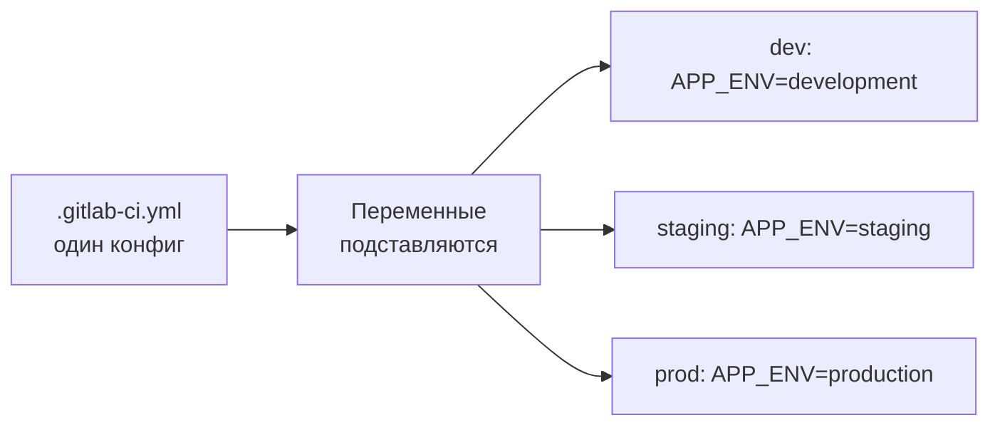
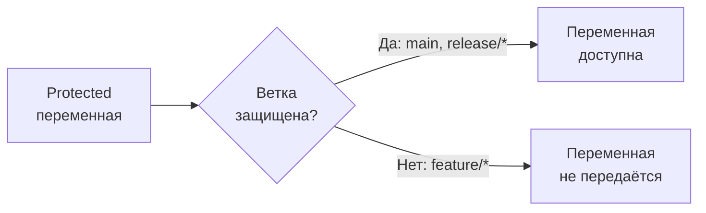

# Уровень 3: Переменные в GitLab CI

## Зачем нужны переменные

Представь, что ты пишешь скрипт деплоя. В нём жёстко прописаны адрес сервера, имя образа, токен авторизации. Всё работает. Потом тебе нужно задеплоить то же самое в staging. Ты копируешь скрипт, меняешь значения вручную... и вот уже два файла, которые расходятся, и баг, который воспроизводится только в одном окружении.

Переменные в CI/CD решают эту проблему. Один конфиг, разные значения — в зависимости от окружения, ветки, уровня доступа.



---

## Предопределённые переменные GitLab CI

GitLab автоматически передаёт в каждый job десятки переменных. Не нужно ничего объявлять — они просто есть.

### Категория: Commit

| Переменная | Пример значения | Что означает |
|---|---|---|
| `CI_COMMIT_SHA` | `a1b2c3d4e5f6...` | Полный SHA коммита (40 символов) |
| `CI_COMMIT_SHORT_SHA` | `a1b2c3d4` | Короткий SHA (8 символов) |
| `CI_COMMIT_REF_NAME` | `main` / `feature/login` | Имя ветки или тега |
| `CI_COMMIT_REF_SLUG` | `feature-login` | Имя ветки в "slug" формате (дефисы вместо `/`) |
| `CI_COMMIT_MESSAGE` | `feat: add login` | Сообщение коммита |
| `CI_COMMIT_AUTHOR` | `Ivan Petrov <ivan@example.com>` | Автор коммита |
| `CI_COMMIT_TIMESTAMP` | `2024-01-15T10:30:00+03:00` | Время коммита в ISO 8601 |
| `CI_COMMIT_TAG` | `v1.2.3` | Имя тега (если запущено на тег) |

```yaml
deploy-job:
  script:
    # Тегируем Docker-образ SHA коммита — всегда можно откатиться
    - docker build -t myapp:$CI_COMMIT_SHORT_SHA .
    - echo "Deploying commit $CI_COMMIT_SHA from branch $CI_COMMIT_REF_NAME"
```

### Категория: Pipeline

| Переменная | Пример значения | Что означает |
|---|---|---|
| `CI_PIPELINE_ID` | `12345` | Уникальный ID пайплайна (глобально) |
| `CI_PIPELINE_IID` | `42` | ID пайплайна внутри проекта |
| `CI_PIPELINE_SOURCE` | `push` / `merge_request_event` | Что запустило пайплайн |
| `CI_PIPELINE_URL` | `https://gitlab.com/...` | Ссылка на пайплайн |

### Категория: Job

| Переменная | Пример значения | Что означает |
|---|---|---|
| `CI_JOB_ID` | `98765` | Уникальный ID job'а |
| `CI_JOB_NAME` | `build-app` | Имя текущего job'а |
| `CI_JOB_STAGE` | `build` | Стадия текущего job'а |
| `CI_JOB_STATUS` | `running` | Статус job'а |
| `CI_JOB_URL` | `https://gitlab.com/...` | Ссылка на job |
| `CI_JOB_TOKEN` | `glrt-xxxx` | Временный токен для аутентификации |

💡 `CI_JOB_TOKEN` очень полезен для аутентификации в Container Registry или Package Registry. Не нужно хранить отдельный токен.

### Категория: Project

| Переменная | Пример значения | Что означает |
|---|---|---|
| `CI_PROJECT_ID` | `777` | ID проекта |
| `CI_PROJECT_NAME` | `my-app` | Имя проекта |
| `CI_PROJECT_PATH` | `mygroup/my-app` | Полный путь (group/project) |
| `CI_PROJECT_URL` | `https://gitlab.com/mygroup/my-app` | URL проекта |
| `CI_PROJECT_DIR` | `/builds/mygroup/my-app` | Путь к директории с кодом на runner'е |
| `CI_REGISTRY` | `registry.gitlab.com` | Адрес Container Registry |
| `CI_REGISTRY_IMAGE` | `registry.gitlab.com/mygroup/my-app` | Адрес образа в Registry |

### Категория: Runner

| Переменная | Пример значения | Что означает |
|---|---|---|
| `CI_RUNNER_ID` | `1234` | ID runner'а |
| `CI_RUNNER_DESCRIPTION` | `shared-runner-linux` | Описание runner'а |
| `CI_RUNNER_TAGS` | `docker,linux` | Теги runner'а |
| `GITLAB_CI` | `true` | Флаг: мы внутри GitLab CI |

### Категория: Merge Request

| Переменная | Пример значения | Что означает |
|---|---|---|
| `CI_MERGE_REQUEST_IID` | `15` | ID merge request'а |
| `CI_MERGE_REQUEST_TITLE` | `feat: add login` | Заголовок MR |
| `CI_MERGE_REQUEST_SOURCE_BRANCH_NAME` | `feature/login` | Исходная ветка MR |
| `CI_MERGE_REQUEST_TARGET_BRANCH_NAME` | `main` | Целевая ветка MR |
| `CI_MERGE_REQUEST_LABELS` | `backend,urgent` | Лейблы MR |

📌 Переменные `CI_MERGE_REQUEST_*` доступны только в пайплайнах, запущенных для MR (`CI_PIPELINE_SOURCE == "merge_request_event"`).

---

## Custom переменные

Ты можешь объявить свои переменные на разных уровнях.

### В .gitlab-ci.yml (глобально и в job'е)

```yaml
# Глобальные переменные — доступны во всех job'ах
variables:
  NODE_VERSION: '20'
  DOCKER_REGISTRY: 'registry.example.com'
  APP_NAME: 'my-service'

build-job:
  stage: build
  # Переменная на уровне job'а — перезаписывает глобальную
  variables:
    NODE_VERSION: '18'   # только в этом job'е будет 18
  script:
    - echo "Using Node $NODE_VERSION"
    - docker build -t $DOCKER_REGISTRY/$APP_NAME:latest .

test-job:
  stage: test
  script:
    - echo "Using Node $NODE_VERSION"   # здесь снова 20
```

---

## Уровни переменных и приоритет

Это самая важная концепция. Переменные можно задать в шести местах, и каждый следующий уровень перезаписывает предыдущий.


🔥 Правило: **чем ближе к job'у — тем выше приоритет.**

### Пример конфликта переменных

Представь, что `DATABASE_URL` задана на трёх уровнях:

| Уровень | Значение |
|---|---|
| Project Settings | `postgres://prod-db/myapp` |
| global `variables:` | `postgres://localhost/myapp` |
| job `variables:` | `postgres://test-db/myapp` |

В job'е, где задана локальная переменная, победит `postgres://test-db/myapp`. В других job'ах — `postgres://localhost/myapp` (из global variables). В проекте без .gitlab-ci.yml — `postgres://prod-db/myapp`.

### Переменные при ручном запуске пайплайна

При запуске пайплайна через UI или API можно передать переменные:

```bash
# Через API
curl -X POST \
  --header "PRIVATE-TOKEN: <token>" \
  --form "variables[DEPLOY_ENV]=staging" \
  "https://gitlab.com/api/v4/projects/42/pipeline"
```

Эти переменные имеют приоритет выше `variables:` в .gitlab-ci.yml, но ниже job-level переменных.

---

## Variable Expansion — подстановка значений

### Синтаксис в Linux/Mac (shell)

```yaml
script:
  # Простая подстановка
  - echo $CI_COMMIT_SHA
  - echo ${CI_COMMIT_SHA}

  # Значение по умолчанию (если переменная не задана)
  - echo ${DEPLOY_ENV:-development}

  # Вложенная переменная
  - echo ${CI_REGISTRY_IMAGE}:${CI_COMMIT_SHORT_SHA}

  # Использование в строке
  - docker tag myapp:latest $CI_REGISTRY_IMAGE:$CI_COMMIT_TAG
```

### Синтаксис Windows (PowerShell)

```yaml
script:
  - echo $env:CI_COMMIT_SHA
  - echo "Branch: $env:CI_COMMIT_REF_NAME"
```

### Variable expansion в значениях переменных

GitLab поддерживает подстановку переменных в самих переменных:

```yaml
variables:
  IMAGE_TAG: '$CI_REGISTRY_IMAGE:$CI_COMMIT_SHORT_SHA'
  # IMAGE_TAG раскроется в runtime как:
  # registry.gitlab.com/mygroup/myapp:a1b2c3d4

deploy-job:
  script:
    - docker pull $IMAGE_TAG   # использует уже раскрытое значение
```

⚠️ Одинарные кавычки `'...'` в YAML означают, что раскрытие произойдёт в runtime (при выполнении job'а). Двойные кавычки `"..."` — значение подставляется при парсинге YAML.

---

## File-type переменные

Обычная переменная хранит строку. File-type переменная записывает значение во временный файл и передаёт путь к этому файлу.

```yaml
# В настройках проекта задана переменная типа File:
# Имя: KUBECONFIG_FILE
# Значение: <содержимое kubeconfig>
# Тип: File

deploy-to-k8s:
  script:
    # $KUBECONFIG_FILE содержит путь к временному файлу
    - kubectl --kubeconfig=$KUBECONFIG_FILE get pods
    - helm upgrade myapp ./chart --kubeconfig=$KUBECONFIG_FILE
```

💡 File-type переменные идеальны для сертификатов, ключей SSH, kubeconfig, `.env` файлов — всего, что должно быть файлом, а не строкой.

---

## Protected и Masked переменные (обзор)

📌 Детальный разбор — в уровне 10. Здесь — базовое понимание.

**Protected** — переменная доступна только в защищённых ветках (main, release/*) и тегах. Нельзя прочитать из ветки feature/*.



**Masked** — значение скрывается в логах. Вместо `secret123` в логах будет `[MASKED]`.

```yaml
# В логах job'а:
# $ echo $DB_PASSWORD
# [MASKED]              ← замаскировано
```

⚠️ Masked-переменные имеют ограничения: значение должно быть от 8 символов, без переносов строк и специальных символов.

**Лучшая практика:** все секреты (пароли, токены, ключи) должны быть одновременно Protected + Masked + храниться в переменных проекта/группы, а не в .gitlab-ci.yml.

---

## Как посмотреть все переменные в job'е

```yaml
debug-variables:
  stage: .pre
  script:
    - env | grep CI_     # все переменные GitLab CI
    - env | sort         # все переменные окружения
  # Никогда не делай это в prod! Секреты попадут в логи.
```

---

## Частые ошибки новичков

⚠️ **Ошибка 1: Хранить секреты в .gitlab-ci.yml**

```yaml
# ❌ Плохо — секрет виден всем, кто читает файл
variables:
  API_KEY: 'sk-prod-secret-token-12345'
```

```yaml
# ✅ Хорошо — переменная задана в Settings → CI/CD → Variables
# В .gitlab-ci.yml просто используем имя
script:
  - curl -H "Authorization: $API_KEY" https://api.example.com
```

---

⚠️ **Ошибка 2: Не понимать приоритет переменных**

```yaml
# ❌ Разработчик ждёт, что prod будет использовать значение из Settings
# Но в .gitlab-ci.yml есть глобальная variables: — она перезаписывает!
variables:
  DATABASE_URL: 'postgres://localhost/dev'   # это перезапишет Project Settings!
```

```yaml
# ✅ Используй условные переменные или разные файлы конфигурации
variables:
  DATABASE_URL: '${DATABASE_URL_OVERRIDE:-postgres://localhost/dev}'
```

---

⚠️ **Ошибка 3: Использовать CI_MERGE_REQUEST_IID вне MR-пайплайна**

```yaml
# ❌ Эта переменная будет пустой в обычном push-пайплайне
script:
  - echo "MR #$CI_MERGE_REQUEST_IID"   # пустая строка если это не MR
```

```yaml
# ✅ Проверяй источник пайплайна
script:
  - |
    if [ "$CI_PIPELINE_SOURCE" = "merge_request_event" ]; then
      echo "MR #$CI_MERGE_REQUEST_IID"
    else
      echo "Not a MR pipeline"
    fi
```

---

⚠️ **Ошибка 4: Путать одинарные и двойные кавычки в YAML**

```yaml
variables:
  # ❌ Раскрытие произойдёт при парсинге YAML — в этот момент CI_REGISTRY_IMAGE ещё не доступна
  IMAGE: "$CI_REGISTRY_IMAGE:latest"

  # ✅ Одинарные кавычки — раскрытие в runtime при выполнении job'а
  IMAGE: '$CI_REGISTRY_IMAGE:latest'
```

---

⚠️ **Ошибка 5: Забыть экранировать $ в паролях**

```yaml
variables:
  # ❌ Если пароль содержит $, он попытается раскрыться как переменная
  DB_PASS: 'my$ecret'   # GitLab попытается найти переменную $ecret

  # ✅ Экранируй знак доллара
  DB_PASS: 'my$$ecret'   # $$ → один $ в значении
```

---

## Итог

Переменные в GitLab CI — это слои: от глобальных настроек GitLab до конкретного job'а. Понимание приоритетов позволяет строить гибкие пайплайны, которые работают по-разному в dev, staging и prod без дублирования конфига.

Ключевые принципы:
- Предопределённые переменные всегда доступны — используй их вместо хардкода
- Секреты — только в Protected + Masked переменных проекта/группы
- Приоритет: job > pipeline (manual) > global variables: > project > group > instance
- `CI_COMMIT_SHORT_SHA` — лучший тег для Docker-образов
