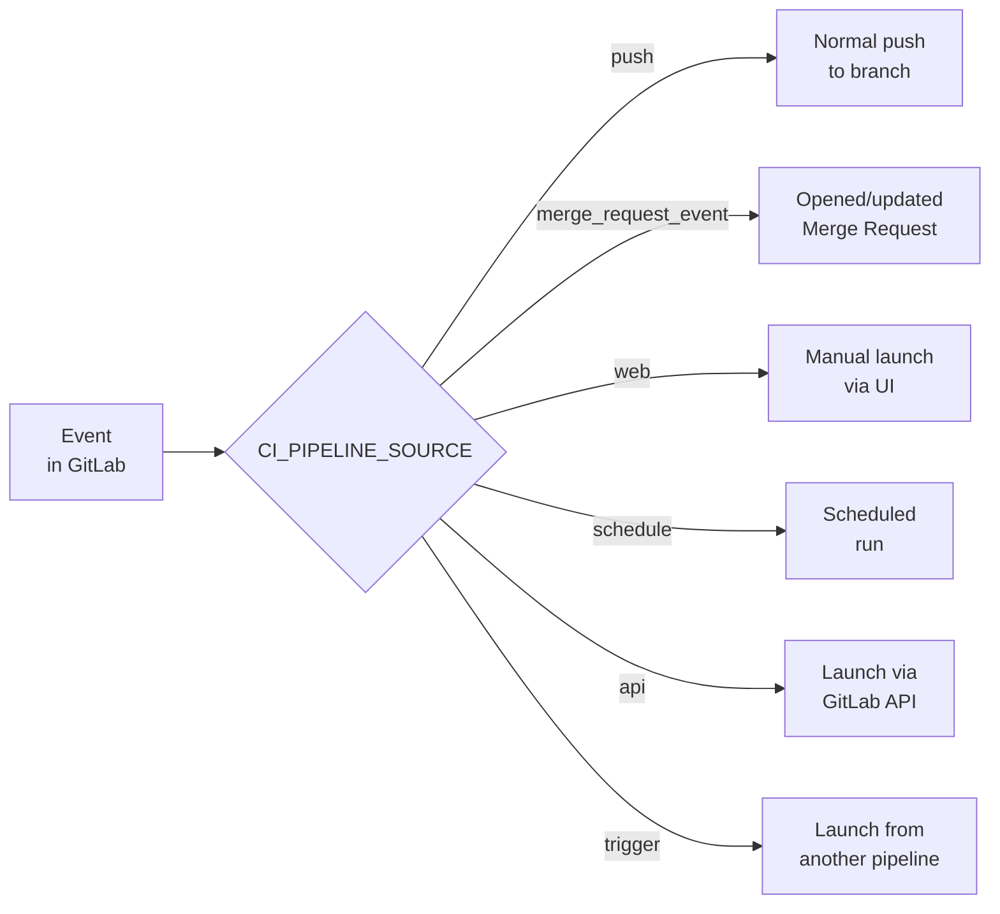
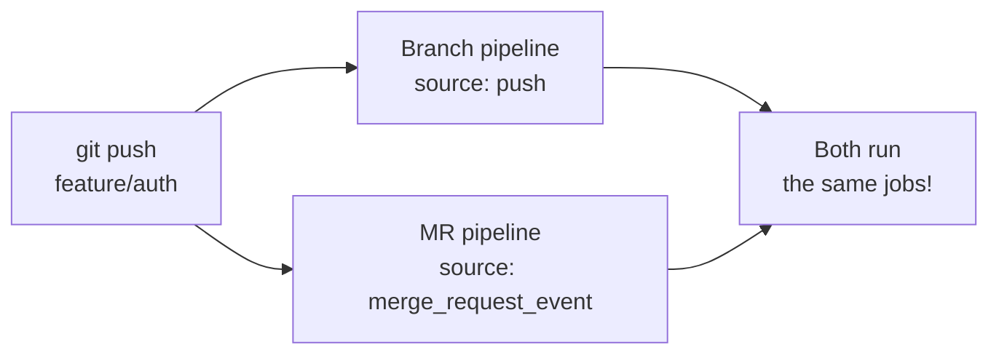
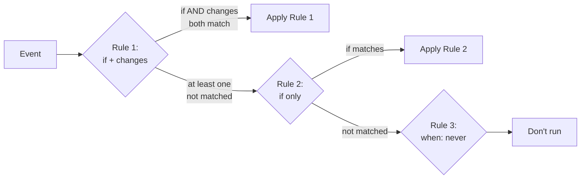

# Level 4: Rules and Conditional Launch

## Why Conditions in Pipelines Are Needed

Imagine you have a monorepo: frontend, backend, and documentation. Every time any commit is made, a full pipeline runs — frontend tests, backend tests, Docker image builds, deployment. But a developer just fixed a typo in the README — and waits 20 minutes for an idle run.

`rules` is a GitLab CI mechanism that allows jobs to "decide" whether to run at all. This saves time, money on runners, and team nerves.

📌 **Main idea:** don't "forbid" a job, but describe the conditions under which it *should* run.

---

## `only/except` vs `rules` — Why the Former Is Deprecated

Before `rules`, people used `only` and `except`. They worked but were inflexible:

```yaml
# ❌ Old approach — only/except
deploy:
  script: ./deploy.sh
  only:
    - main
  except:
    - schedules
```

Problem: `only` and `except` didn't support **variable-based conditions**. You couldn't write "run only if the DEPLOY_ENV variable equals production". Hence `rules` was invented.

```yaml
# ✅ Modern approach — rules
deploy:
  script: ./deploy.sh
  rules:
    - if: $CI_COMMIT_BRANCH == "main" && $CI_PIPELINE_SOURCE != "schedule"
      when: on_success
```

⚠️ `only/except` and `rules` are **incompatible** — you can't use both keys in the same job. GitLab will throw an error.

---

## `rules:if` — Variable-Based Conditions

The syntax resembles a ternary operator: if the condition is met — apply the rule.

```yaml
test:
  script: npm test
  rules:
    - if: $CI_COMMIT_BRANCH == "main"
      when: on_success
    - if: $CI_PIPELINE_SOURCE == "merge_request_event"
      when: on_success
    - when: never  # all other cases — don't run
```

### Key Variables for Conditions



| Variable | What It Contains | Example |
|---|---|---|
| `$CI_COMMIT_BRANCH` | Branch name (not for MR) | `main`, `feature/auth` |
| `$CI_COMMIT_TAG` | Tag name (tags only) | `v1.2.3` |
| `$CI_PIPELINE_SOURCE` | Pipeline trigger source | `push`, `merge_request_event` |
| `$CI_MERGE_REQUEST_IID` | Merge request ID (MR only) | `42` |
| `$CI_MERGE_REQUEST_TARGET_BRANCH_NAME` | MR target branch | `main` |

### Condition Operators

```yaml
rules:
  # String comparison
  - if: $CI_COMMIT_BRANCH == "main"

  # Not equal
  - if: $CI_PIPELINE_SOURCE != "schedule"

  # Logical AND — both conditions must be true
  - if: $CI_COMMIT_BRANCH == "main" && $CI_PIPELINE_SOURCE == "push"

  # Logical OR — at least one condition
  - if: $CI_COMMIT_BRANCH == "main" || $CI_COMMIT_BRANCH == "develop"

  # Variable presence check (non-empty)
  - if: $CUSTOM_VARIABLE

  # Regular expression
  - if: $CI_COMMIT_BRANCH =~ /^feature\/.+/
```

---

## `rules:when` — What to Do When a Rule Matches

Each rule can specify how to launch the job:

| `when` | Behavior |
|---|---|
| `on_success` | Run if previous stages are successful (default) |
| `always` | Always run, even if something failed |
| `never` | Do not run |
| `manual` | Wait for manual button click in the UI |
| `delayed` | Run with a delay (requires `start_in`) |

```yaml
deploy-prod:
  script: ./deploy-prod.sh
  rules:
    # On main — manual launch (need to press the button)
    - if: $CI_COMMIT_BRANCH == "main"
      when: manual
    # Cleanup after a failed pipeline — always run
    - if: $CI_PIPELINE_SOURCE == "schedule"
      when: always
    # Everything else — don't run
    - when: never

notify-delayed:
  script: ./notify.sh
  rules:
    - if: $CI_COMMIT_BRANCH == "main"
      when: delayed
      start_in: '30 minutes'
```

---

## `rules:changes` — Launch on File Changes

A job runs only if certain files have changed. Ideal for monorepos.

```yaml
frontend-tests:
  script: npm test
  rules:
    - changes:
        - frontend/**/*
        - package.json
        - package-lock.json

backend-tests:
  script: go test ./...
  rules:
    - changes:
        - backend/**/*.go
        - go.mod
        - go.sum

docs-build:
  script: mkdocs build
  rules:
    - changes:
        - docs/**/*
        - mkdocs.yml
```

### Glob Patterns for `changes`

| Pattern | Matches |
|---|---|
| `frontend/**/*` | All files in frontend/ recursively |
| `*.yml` | YAML files in project root |
| `**/*.ts` | All TypeScript files in the project |
| `src/{auth,users}/**` | auth and users folders inside src |
| `Dockerfile*` | Dockerfile, Dockerfile.prod, etc. |

⚠️ **Important:** `rules:changes` compares against the **previous commit**. On the first push to a branch, GitLab considers all files as changed — the job will always run.

💡 Combine `if` and `changes` for precise control:

```yaml
frontend-tests:
  script: npm test
  rules:
    # On MR — only if frontend changed
    - if: $CI_PIPELINE_SOURCE == "merge_request_event"
      changes:
        - frontend/**/*
    # On main — always (ignore changes)
    - if: $CI_COMMIT_BRANCH == "main"
      when: on_success
```

---

## `rules:exists` — Check for File Presence

A job runs only if a specific file exists in the repository:

```yaml
docker-build:
  script: docker build .
  rules:
    - exists:
        - Dockerfile

helm-deploy:
  script: helm upgrade .
  rules:
    - exists:
        - helm/Chart.yaml

terraform-plan:
  script: terraform plan
  rules:
    - exists:
        - '**/*.tf'
```

This is useful for **project type detection**: if there's a `package.json` — it's a Node project, if there's a `go.mod` — a Go project.

---

## `workflow:rules` — Managing the Entire Pipeline

`workflow:rules` works at the pipeline level, not individual jobs. If the condition isn't met — the pipeline isn't created at all.

```yaml
workflow:
  rules:
    # Run for MRs
    - if: $CI_PIPELINE_SOURCE == "merge_request_event"
    # Run for main
    - if: $CI_COMMIT_BRANCH == "main"
    # Run for tags
    - if: $CI_COMMIT_TAG
    # Everything else — don't create a pipeline
    - when: never
```

### Duplicate Pipeline Problem

This is one of GitLab CI's most painful issues. When you open an MR, **two** pipelines can launch:



This wastes resources. The solution — `workflow:rules` with deduplication:

```yaml
workflow:
  rules:
    # Run MR pipeline (only when there's an MR)
    - if: $CI_MERGE_REQUEST_IID
    # Run branch pipeline ONLY if there's no open MR
    - if: $CI_COMMIT_BRANCH && $CI_OPEN_MERGE_REQUESTS
      when: never
    # Run normal branch pipeline
    - if: $CI_COMMIT_BRANCH
```

💡 `$CI_OPEN_MERGE_REQUESTS` — a variable containing the IIDs of open MRs for the current branch. If it's non-empty — an MR pipeline will already be created for this push.

---

## OR vs AND Logic in rules

This is the most common source of confusion. Remember the rule:

```
rules — is a list of rules applied by OR
within a single rule — conditions are applied by AND
```



```yaml
deploy:
  script: ./deploy.sh
  rules:
    # Rule 1: if AND changes (both must match)
    - if: $CI_PIPELINE_SOURCE == "merge_request_event"
      changes:
        - src/**/*
      when: on_success

    # Rule 2: if only (no changes)
    - if: $CI_COMMIT_BRANCH == "main"
      when: manual

    # Rule 3: always never (final fallback)
    - when: never
```

The first matching rule **wins**. Others are not checked.

---

## Typical Patterns

### Run only on MR

```yaml
code-review-job:
  script: npm run review
  rules:
    - if: $CI_PIPELINE_SOURCE == "merge_request_event"
```

### Run only on tags (release)

```yaml
publish-npm:
  script: npm publish
  rules:
    - if: $CI_COMMIT_TAG =~ /^v\d+\.\d+\.\d+$/
```

### Run only on main

```yaml
deploy-prod:
  script: ./deploy.sh production
  rules:
    - if: $CI_COMMIT_BRANCH == "main" && $CI_PIPELINE_SOURCE == "push"
```

### Skip by commit message

```yaml
expensive-job:
  script: ./heavy-analysis.sh
  rules:
    - if: $CI_COMMIT_MESSAGE =~ /\[skip-heavy\]/
      when: never
    - when: on_success
```

---

## Common Beginner Mistakes

⚠️ **Mistake 1: Forgetting the final `when: never`**

```yaml
# ❌ Job will run on feature branches too
test:
  script: npm test
  rules:
    - if: $CI_COMMIT_BRANCH == "main"
      when: on_success
    # No fallback here — GitLab adds when: on_success by default!

# ✅ Explicitly disallow all other cases
test:
  script: npm test
  rules:
    - if: $CI_COMMIT_BRANCH == "main"
      when: on_success
    - when: never
```

⚠️ **Mistake 2: Mixing `only/except` and `rules`**

```yaml
# ❌ Configuration error, pipeline won't start
job:
  script: ./run.sh
  only:
    - main
  rules:
    - if: $CI_COMMIT_BRANCH == "main"
```

⚠️ **Mistake 3: Not understanding that `changes` always triggers on a new branch**

```yaml
# ⚠️ On first push to a branch — all files are considered changed
frontend-build:
  rules:
    - changes:
        - frontend/**/*
# Solution: combine with if for MR pipelines
frontend-build:
  rules:
    - if: $CI_PIPELINE_SOURCE == "merge_request_event"
      changes:
        - frontend/**/*
```

⚠️ **Mistake 4: Duplicate pipelines without `workflow:rules`**

```yaml
# ❌ On push + open MR, two pipelines will start
job:
  script: npm test
  rules:
    - if: $CI_COMMIT_BRANCH
    - if: $CI_PIPELINE_SOURCE == "merge_request_event"

# ✅ Add workflow:rules for deduplication
workflow:
  rules:
    - if: $CI_MERGE_REQUEST_IID
    - if: $CI_COMMIT_BRANCH && $CI_OPEN_MERGE_REQUESTS
      when: never
    - if: $CI_COMMIT_BRANCH
```

⚠️ **Mistake 5: Misunderstanding rule order**

```yaml
# ❌ Second rule will never fire — first rule catches everything
job:
  rules:
    - when: always    # catches everything!
    - if: $CI_COMMIT_BRANCH == "main"
      when: manual

# ✅ Specific rules first, general ones last
job:
  rules:
    - if: $CI_COMMIT_BRANCH == "main"
      when: manual
    - when: always
```

---

## Summary

`rules` is a powerful pipeline management tool. Three key condition types:

- **`if`** — based on environment variable values
- **`changes`** — based on changed files
- **`exists`** — based on file presence in the repo

`workflow:rules` manages pipeline creation as a whole — use it for branch + MR pipeline deduplication.

Rule order is critical: the first match wins. Always end the list with `when: never` or `when: always` as an explicit fallback.
