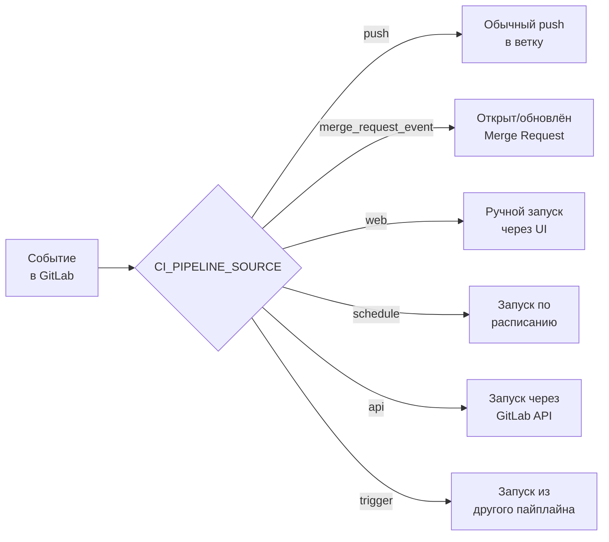
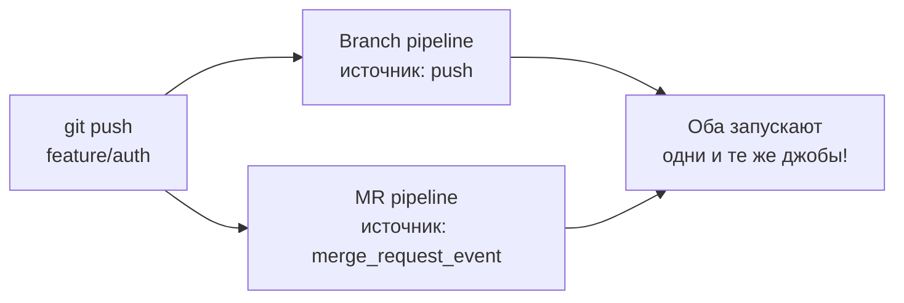
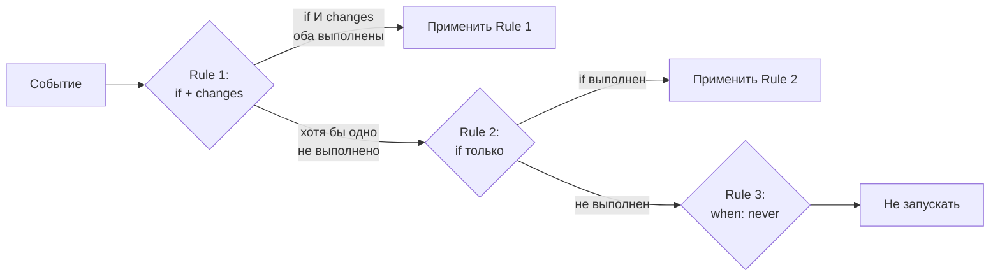

# Уровень 4: Rules и условный запуск

## Зачем нужны условия в пайплайне

Представь, что у тебя есть монорепо: фронтенд, бэкенд и документация. Каждый раз при любом коммите запускается полный пайплайн — тесты фронтенда, тесты бэкенда, сборка Docker-образов, деплой. Но разработчик исправил опечатку в README — и ждёт 20 минут холостого прогона.

`rules` — это механизм GitLab CI, который позволяет джобам "решать", запускаться ли им вообще. Это экономит время, деньги на runners и нервы команды.

📌 **Главная идея:** не "запрещать" джоб, а описывать условия, при которых он *должен* запуститься.

---

## `only/except` vs `rules` — почему устарело первое

До появления `rules` использовали `only` и `except`. Они работали, но были негибкими:

```yaml
# ❌ Старый подход — only/except
deploy:
  script: ./deploy.sh
  only:
    - main
  except:
    - schedules
```

Проблема: `only` и `except` не поддерживали **условия по переменным**. Нельзя было написать "запускай только если переменная DEPLOY_ENV равна production". Пришлось изобретать `rules`.

```yaml
# ✅ Современный подход — rules
deploy:
  script: ./deploy.sh
  rules:
    - if: $CI_COMMIT_BRANCH == "main" && $CI_PIPELINE_SOURCE != "schedule"
      when: on_success
```

⚠️ `only/except` и `rules` **несовместимы** — нельзя использовать оба ключа в одном джобе. GitLab выдаст ошибку.

---

## `rules:if` — условия по переменным

Синтаксис напоминает тернарный оператор: если условие выполнено — применяем правило.

```yaml
test:
  script: npm test
  rules:
    - if: $CI_COMMIT_BRANCH == "main"
      when: on_success
    - if: $CI_PIPELINE_SOURCE == "merge_request_event"
      when: on_success
    - when: never  # все остальные случаи — не запускать
```

### Ключевые переменные для условий



| Переменная | Что содержит | Пример |
|---|---|---|
| `$CI_COMMIT_BRANCH` | Имя ветки (не для MR) | `main`, `feature/auth` |
| `$CI_COMMIT_TAG` | Имя тега (только для тегов) | `v1.2.3` |
| `$CI_PIPELINE_SOURCE` | Источник запуска пайплайна | `push`, `merge_request_event` |
| `$CI_MERGE_REQUEST_IID` | ID merge request (только для MR) | `42` |
| `$CI_MERGE_REQUEST_TARGET_BRANCH_NAME` | Целевая ветка MR | `main` |

### Операторы в условиях

```yaml
rules:
  # Сравнение строк
  - if: $CI_COMMIT_BRANCH == "main"

  # Не равно
  - if: $CI_PIPELINE_SOURCE != "schedule"

  # Логическое И — оба условия должны быть истинны
  - if: $CI_COMMIT_BRANCH == "main" && $CI_PIPELINE_SOURCE == "push"

  # Логическое ИЛИ — хотя бы одно условие
  - if: $CI_COMMIT_BRANCH == "main" || $CI_COMMIT_BRANCH == "develop"

  # Проверка наличия переменной (не пустая)
  - if: $CUSTOM_VARIABLE

  # Регулярное выражение
  - if: $CI_COMMIT_BRANCH =~ /^feature\/.+/
```

---

## `rules:when` — что делать при срабатывании правила

Каждое правило может указать, как запустить джоб:

| `when` | Поведение |
|---|---|
| `on_success` | Запустить, если предыдущие стадии успешны (по умолчанию) |
| `always` | Запустить всегда, даже если что-то упало |
| `never` | Не запускать |
| `manual` | Ждать ручного нажатия кнопки в UI |
| `delayed` | Запустить с задержкой (нужен `start_in`) |

```yaml
deploy-prod:
  script: ./deploy-prod.sh
  rules:
    # На main — ручной запуск (нужно нажать кнопку)
    - if: $CI_COMMIT_BRANCH == "main"
      when: manual
    # Уборка после упавшего пайплайна — запускать всегда
    - if: $CI_PIPELINE_SOURCE == "schedule"
      when: always
    # Всё остальное — не запускать
    - when: never

notify-delayed:
  script: ./notify.sh
  rules:
    - if: $CI_COMMIT_BRANCH == "main"
      when: delayed
      start_in: '30 minutes'
```

---

## `rules:changes` — запуск при изменении файлов

Джоб запускается только если изменились определённые файлы. Идеально для монорепо.

```yaml
frontend-tests:
  script: npm test
  rules:
    - changes:
        - frontend/**/*
        - package.json
        - package-lock.json

backend-tests:
  script: go test ./...
  rules:
    - changes:
        - backend/**/*.go
        - go.mod
        - go.sum

docs-build:
  script: mkdocs build
  rules:
    - changes:
        - docs/**/*
        - mkdocs.yml
```

### Glob-паттерны для `changes`

| Паттерн | Что совпадает |
|---|---|
| `frontend/**/*` | Все файлы в frontend/ рекурсивно |
| `*.yml` | YAML-файлы в корне проекта |
| `**/*.ts` | Все TypeScript-файлы в проекте |
| `src/{auth,users}/**` | Папки auth и users внутри src |
| `Dockerfile*` | Dockerfile, Dockerfile.prod и т.д. |

⚠️ **Важно:** `rules:changes` сравнивает с **предыдущим коммитом**. При первом push в ветку GitLab считает все файлы изменёнными — джоб запустится всегда.

💡 Комбинируй `if` и `changes` для точного контроля:

```yaml
frontend-tests:
  script: npm test
  rules:
    # На MR — только если изменился фронтенд
    - if: $CI_PIPELINE_SOURCE == "merge_request_event"
      changes:
        - frontend/**/*
    # На main — всегда (игнорируем changes)
    - if: $CI_COMMIT_BRANCH == "main"
      when: on_success
```

---

## `rules:exists` — проверка наличия файлов

Джоб запускается только если определённый файл существует в репозитории:

```yaml
docker-build:
  script: docker build .
  rules:
    - exists:
        - Dockerfile

helm-deploy:
  script: helm upgrade .
  rules:
    - exists:
        - helm/Chart.yaml

terraform-plan:
  script: terraform plan
  rules:
    - exists:
        - '**/*.tf'
```

Это удобно для **детектирования типа проекта**: если есть `package.json` — это Node-проект, если есть `go.mod` — Go-проект.

---

## `workflow:rules` — управление всем пайплайном

`workflow:rules` работает на уровне всего пайплайна, а не отдельных джобов. Если условие не выполнено — пайплайн вообще не создаётся.

```yaml
workflow:
  rules:
    # Запускать для MR
    - if: $CI_PIPELINE_SOURCE == "merge_request_event"
    # Запускать для main
    - if: $CI_COMMIT_BRANCH == "main"
    # Запускать для тегов
    - if: $CI_COMMIT_TAG
    # Всё остальное — не создавать пайплайн
    - when: never
```

### Проблема дублирования пайплайнов

Это одна из самых болезненных проблем GitLab CI. Когда ты открываешь MR, могут запуститься **два** пайплайна:



Это тратит ресурсы впустую. Решение — `workflow:rules` с дедупликацией:

```yaml
workflow:
  rules:
    # Запускать MR-пайплайн (только когда есть MR)
    - if: $CI_MERGE_REQUEST_IID
    # Запускать branch-пайплайн ТОЛЬКО если нет открытого MR
    - if: $CI_COMMIT_BRANCH && $CI_OPEN_MERGE_REQUESTS
      when: never
    # Запускать обычный branch-пайплайн
    - if: $CI_COMMIT_BRANCH
```

💡 `$CI_OPEN_MERGE_REQUESTS` — переменная, которая содержит IID открытых MR для текущей ветки. Если она не пустая — значит, для этого push уже создастся MR-пайплайн.

---

## OR vs AND логика в rules

Это самый частый источник путаницы. Запомни правило:

```
rules — это список правил, применяемых по OR (ИЛИ)
внутри одного правила — условия применяются по AND (И)
```



```yaml
deploy:
  script: ./deploy.sh
  rules:
    # Rule 1: if AND changes (оба должны сработать)
    - if: $CI_PIPELINE_SOURCE == "merge_request_event"
      changes:
        - src/**/*
      when: on_success

    # Rule 2: только if (без changes)
    - if: $CI_COMMIT_BRANCH == "main"
      when: manual

    # Rule 3: всегда never (итоговый fallback)
    - when: never
```

Первое сработавшее правило **побеждает**. Остальные не проверяются.

---

## Типичные паттерны

### Запуск только на MR

```yaml
code-review-job:
  script: npm run review
  rules:
    - if: $CI_PIPELINE_SOURCE == "merge_request_event"
```

### Запуск только на тегах (релиз)

```yaml
publish-npm:
  script: npm publish
  rules:
    - if: $CI_COMMIT_TAG =~ /^v\d+\.\d+\.\d+$/
```

### Запуск только на main

```yaml
deploy-prod:
  script: ./deploy.sh production
  rules:
    - if: $CI_COMMIT_BRANCH == "main" && $CI_PIPELINE_SOURCE == "push"
```

### Пропуск по коммит-сообщению

```yaml
expensive-job:
  script: ./heavy-analysis.sh
  rules:
    - if: $CI_COMMIT_MESSAGE =~ /\[skip-heavy\]/
      when: never
    - when: on_success
```

---

## Частые ошибки новичков

⚠️ **Ошибка 1: Забыть финальный `when: never`**

```yaml
# ❌ Джоб запустится даже на feature-ветках
test:
  script: npm test
  rules:
    - if: $CI_COMMIT_BRANCH == "main"
      when: on_success
    # Здесь нет fallback — GitLab добавит when: on_success по умолчанию!

# ✅ Явно запрещаем все остальные случаи
test:
  script: npm test
  rules:
    - if: $CI_COMMIT_BRANCH == "main"
      when: on_success
    - when: never
```

⚠️ **Ошибка 2: Смешивать `only/except` и `rules`**

```yaml
# ❌ Ошибка конфигурации, пайплайн не запустится
job:
  script: ./run.sh
  only:
    - main
  rules:
    - if: $CI_COMMIT_BRANCH == "main"
```

⚠️ **Ошибка 3: Не понимать, что `changes` срабатывает всегда на новой ветке**

```yaml
# ⚠️ При первом push в ветку — all files считаются изменёнными
frontend-build:
  rules:
    - changes:
        - frontend/**/*
# Решение: комбинировать с if для MR-пайплайнов
frontend-build:
  rules:
    - if: $CI_PIPELINE_SOURCE == "merge_request_event"
      changes:
        - frontend/**/*
```

⚠️ **Ошибка 4: Дублирование пайплайнов без `workflow:rules`**

```yaml
# ❌ При push + открытом MR запустятся два пайплайна
job:
  script: npm test
  rules:
    - if: $CI_COMMIT_BRANCH
    - if: $CI_PIPELINE_SOURCE == "merge_request_event"

# ✅ Добавь workflow:rules для дедупликации
workflow:
  rules:
    - if: $CI_MERGE_REQUEST_IID
    - if: $CI_COMMIT_BRANCH && $CI_OPEN_MERGE_REQUESTS
      when: never
    - if: $CI_COMMIT_BRANCH
```

⚠️ **Ошибка 5: Неправильное понимание порядка правил**

```yaml
# ❌ Второе правило никогда не сработает — первое always перехватит всё
job:
  rules:
    - when: always    # перехватывает всё!
    - if: $CI_COMMIT_BRANCH == "main"
      when: manual

# ✅ Специфичные правила — выше, общие — ниже
job:
  rules:
    - if: $CI_COMMIT_BRANCH == "main"
      when: manual
    - when: always
```

---

## Итог

`rules` — мощный инструмент управления пайплайном. Три ключевых условия:

- **`if`** — по значению переменных окружения
- **`changes`** — по изменённым файлам
- **`exists`** — по наличию файлов в репо

`workflow:rules` управляет созданием пайплайна целиком — используй для дедупликации branch+MR пайплайнов.

Порядок правил критичен: первое сработавшее побеждает. Всегда заканчивай список на `when: never` или `when: always` как явный fallback.
