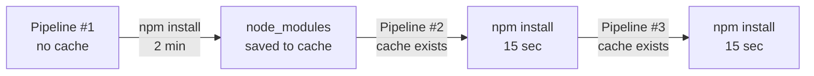
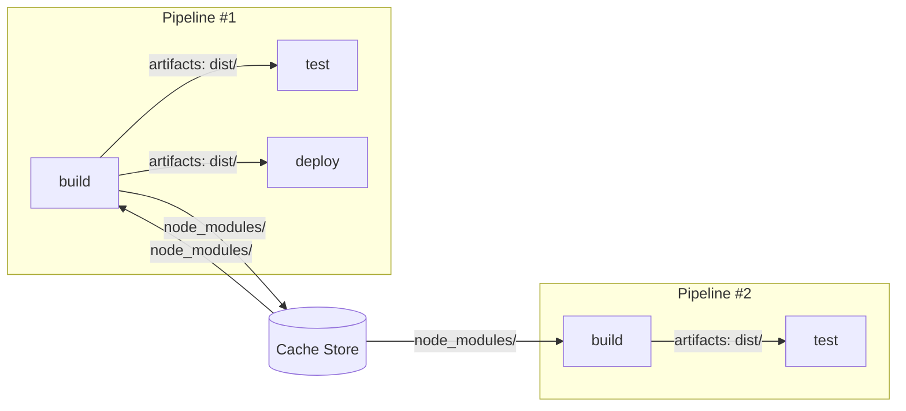

# Level 5: Caching and Artifacts

## Why Two Different Mechanisms?

Imagine you're a head chef in a restaurant. You have two types of storage:

1. **Pantry** (cache) — contains prepped ingredients: chopped vegetables, base sauces. You prepare these in advance so you don't have to cut from scratch every time. Preps can get slightly outdated, that's not critical.
2. **Pass** (artifacts) — contains finished dishes that need to be handed to waiters in a strictly defined form. The waiter gets exactly the dish that was ordered, not something similar.

In CI/CD:
- **Cache** = pantry. Speeds up repeated runs (node_modules, pip packages, Maven jars).
- **Artifacts** = pass. Passes results from one job to another (built binary, test report).

---

## Artifacts — Passing Data Between Jobs

Each job in GitLab CI runs in a **clean environment**. This means: files created in the `build` job are not available in the `test` job by default. Artifacts solve this problem.


### Basic Syntax

```yaml
build:
  stage: build
  script:
    - npm run build
  artifacts:
    paths:
      - dist/
      - public/index.html
    expire_in: 1 week
```

### artifacts:paths

Specifies which files and directories to save after job execution.

```yaml
artifacts:
  paths:
    - dist/           # entire directory
    - build/*.jar     # glob pattern
    - reports/        # reports
```

📌 Paths are relative to the repository root. Glob patterns are supported (`*.jar`, `**/*.xml`).

### artifacts:expire_in

How long artifacts are stored on the GitLab server.

```yaml
artifacts:
  expire_in: 1 hour     # for debugging only
  expire_in: 1 day      # typical for PRs
  expire_in: 1 week     # good default
  expire_in: never      # for release artifacts
```

⚠️ Don't store artifacts forever without a reason — they take up server space and cost money.

### artifacts:when

When to save artifacts:

```yaml
artifacts:
  when: on_success    # (default) only if job succeeds
  when: on_failure    # only if job failed — useful for logs
  when: always        # always — for coverage and test reports
```

💡 Pattern: save error logs with `when: on_failure`, test reports with `when: always`.

```yaml
test:
  script:
    - npm test
  artifacts:
    when: always          # save even on failure
    paths:
      - test-results/
    reports:
      junit: test-results/junit.xml
```

### artifacts:reports

A special type of artifacts — GitLab can parse them and display them in the UI.

```yaml
artifacts:
  reports:
    junit: test-results/junit.xml          # test results in MR
    coverage_report:
      coverage_format: cobertura
      path: coverage/cobertura-coverage.xml  # code coverage
    sast: gl-sast-report.json              # security scan
    dependency_scanning: gl-dependency-scanning-report.json
```

✅ Reports are displayed directly in the Merge Request — testers can see failed tests without going to CI.

---

## dependencies — Selective Artifact Download

By default, each job downloads **all** artifacts from previous stages. This can be slow.

```yaml
stages:
  - build
  - test
  - deploy

build-frontend:
  stage: build
  artifacts:
    paths: [dist/]

build-backend:
  stage: build
  artifacts:
    paths: [app.jar]

test-frontend:
  stage: test
  dependencies:
    - build-frontend   # downloads only dist/, not app.jar
  script:
    - npm run e2e

deploy:
  stage: deploy
  dependencies:
    - build-frontend
    - build-backend    # needs both
  script:
    - deploy.sh
```

💡 `dependencies: []` — an empty list means "don't download any artifacts". Useful for fast linters.

```yaml
lint:
  stage: test
  dependencies: []    # don't waste time downloading dist/ and app.jar
  script:
    - npm run lint
```

---

## Cache — Speeding Up Repeated Runs

Cache is files that GitLab Runner saves between pipeline runs. The goal is to avoid re-downloading what already exists.



### Basic Syntax

```yaml
build:
  stage: build
  cache:
    key: node-modules-cache
    paths:
      - node_modules/
  script:
    - npm ci
    - npm run build
```

### cache:key

The cache key determines which cache to load and where to save.

```yaml
# Static key — one cache for everyone
cache:
  key: 'my-project-deps'
  paths:
    - node_modules/
```

```yaml
# Branch-based key — each branch has its own cache
cache:
  key: '$CI_COMMIT_REF_SLUG'
  paths:
    - node_modules/
```

```yaml
# Lock-file-based key — cache invalidates when dependencies change
cache:
  key:
    files:
      - package-lock.json
  paths:
    - node_modules/
```

📌 `cache:key:files` — the smartest option. If `package-lock.json` hasn't changed, the cache is used. If it changed — the cache is automatically rebuilt.

### cache:policy

Determines what to do with the cache: read only, write only, or both.

```yaml
# pull-push (default): download cache → execute → save cache
cache:
  policy: pull-push

# pull: download only, don't save (faster, for read-only jobs)
cache:
  policy: pull

# push: save only, don't download (for the job that builds the cache)
cache:
  policy: push
```

💡 Pattern: one job builds the cache (`push`), others read (`pull`). This way the cache isn't overwritten by parallel jobs.

```yaml
install-deps:
  stage: .pre
  cache:
    key: { files: [package-lock.json] }
    paths: [node_modules/]
    policy: push           # build the cache
  script:
    - npm ci

build:
  stage: build
  cache:
    key: { files: [package-lock.json] }
    paths: [node_modules/]
    policy: pull           # read only
  script:
    - npm run build

test:
  stage: test
  cache:
    key: { files: [package-lock.json] }
    paths: [node_modules/]
    policy: pull           # read only
  script:
    - npm test
```

---

## Fundamental Difference: Cache vs Artifacts

This is the most important conceptual point of the level.

| Characteristic | Cache | Artifacts |
|---|---|---|
| **Purpose** | Speed up execution | Pass data |
| **Guaranteed presence** | No (can expire, miss) | Yes (if job executed) |
| **Direction** | Between runs of the same job | Between jobs within a pipeline |
| **Consistency** | Can be partial | Complete |
| **What to store** | Dependencies, tools | Build output, test reports |
| **Cost of error** | Slower (will reinstall) | Broken pipeline |



⚠️ **Key rule**: if a job **must** receive a file — use artifacts. If a file helps work faster but you can do without it — use cache.

---

## Practical Patterns

### Node.js / npm

```yaml
variables:
  NPM_CACHE: '$CI_PROJECT_DIR/.npm'

build:
  cache:
    key:
      files:
        - package-lock.json
    paths:
      - .npm/
  script:
    - npm ci --cache .npm --prefer-offline
    - npm run build
  artifacts:
    paths:
      - dist/
    expire_in: 1 week
```

### Python / pip

```yaml
variables:
  PIP_CACHE_DIR: '$CI_PROJECT_DIR/.cache/pip'

test:
  cache:
    key:
      files:
        - requirements.txt
    paths:
      - .cache/pip/
      - venv/
  script:
    - python -m venv venv
    - source venv/bin/activate
    - pip install -r requirements.txt
    - pytest --junitxml=report.xml
  artifacts:
    reports:
      junit: report.xml
    when: always
```

### Maven (Java)

```yaml
build:
  cache:
    key:
      files:
        - pom.xml
    paths:
      - .m2/repository/
  script:
    - mvn -Dmaven.repo.local=.m2/repository package -DskipTests
  artifacts:
    paths:
      - target/*.jar
    expire_in: 1 week

test:
  cache:
    key:
      files:
        - pom.xml
    paths:
      - .m2/repository/
    policy: pull
  dependencies:
    - build
  script:
    - mvn -Dmaven.repo.local=.m2/repository test
  artifacts:
    reports:
      junit:
        - target/surefire-reports/*.xml
    when: always
```

---

## Distributed Cache with S3/GCS

By default, the cache is stored locally on the Runner. With multiple Runners, the cache isn't shared between them.

```toml
# GitLab Runner config.toml
[runners.cache]
  Type = "s3"
  Shared = true

  [runners.cache.s3]
    ServerAddress = "s3.amazonaws.com"
    BucketName = "my-gitlab-cache"
    BucketLocation = "eu-west-1"
    AuthenticationType = "iam"
```

💡 For teams with multiple Runners, distributed cache is critical — otherwise each Runner builds the cache from scratch.

---

## Common Beginner Mistakes

⚠️ **Mistake 1: Storing build results in cache instead of artifacts**

```yaml
# ❌ Wrong: dist/ in cache — no guarantee that test will receive the current build
build:
  cache:
    paths:
      - dist/
  script:
    - npm run build

test:
  cache:
    paths:
      - dist/        # might get dist/ from a previous pipeline!
  script:
    - npm test
```

```yaml
# ✅ Correct: dist/ in artifacts — guaranteed delivery
build:
  script:
    - npm run build
  artifacts:
    paths:
      - dist/

test:
  dependencies:
    - build          # guaranteed to get dist/ from THIS pipeline
  script:
    - npm test
```

⚠️ **Mistake 2: One huge cache key for the entire project**

```yaml
# ❌ Cache never invalidates, accumulates outdated dependencies
cache:
  key: 'my-project'
  paths:
    - node_modules/
    - .pip/
    - .m2/
```

```yaml
# ✅ Separate key for each lock file
cache:
  key:
    files:
      - package-lock.json
  paths:
    - node_modules/
```

⚠️ **Mistake 3: Caching node_modules without a lock file in the key**

```yaml
# ❌ Cache doesn't invalidate when dependencies are updated
cache:
  key: '$CI_COMMIT_REF_SLUG'
  paths:
    - node_modules/
```

```yaml
# ✅ Use files — cache invalidates automatically
cache:
  key:
    files:
      - package-lock.json
    prefix: '$CI_COMMIT_REF_SLUG'  # optional: different caches for branches
  paths:
    - node_modules/
```

⚠️ **Mistake 4: Forgetting dependencies: [] for fast jobs**

```yaml
# ❌ Linter downloads 500MB of artifacts it doesn't need
lint:
  stage: test
  script:
    - npm run lint
```

```yaml
# ✅ Explicitly refuse artifacts — job starts instantly
lint:
  stage: test
  dependencies: []
  script:
    - npm run lint
```

---

## Summary

- **Artifacts** — guaranteed file transfer between jobs. Use for build output, test reports, binaries.
- **Cache** — speedup by reusing data between pipelines. Use for dependencies.
- `cache:key:files` — always tie the cache to a lock file so it invalidates automatically.
- `dependencies: []` — free jobs from unnecessary artifacts.
- `artifacts:reports` — use for nice reports directly in Merge Requests.
