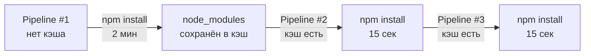
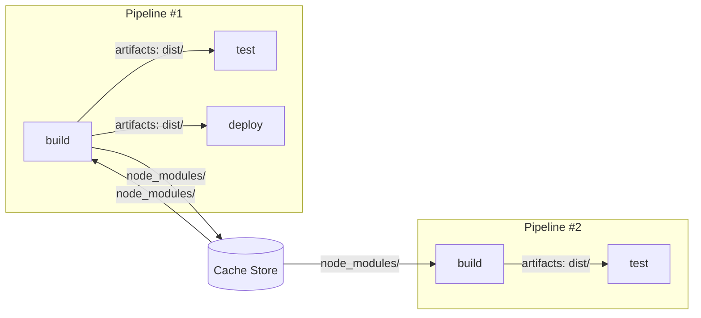

# Уровень 5: Кэширование и артефакты

## Зачем нужны два разных механизма?

Представь, что ты шеф-повар в ресторане. У тебя есть два вида хранилищ:

1. **Кладовая** (cache) — там лежат заготовки: нарезанные овощи, базовые соусы. Их ты готовишь заранее, чтобы каждый раз не резать с нуля. Заготовки могут слегка устареть, это некритично.
2. **Раздача** (artifacts) — там лежат готовые блюда, которые нужно передать официантам в строго определённом виде. Официант получает именно то блюдо, которое заказали, не что-то похожее.

В CI/CD:
- **Cache** = кладовая. Ускоряет повторные запуски (node_modules, pip packages, Maven jar).
- **Artifacts** = раздача. Передаёт результаты одного джоба другому (собранный бинарник, отчёт о тестах).

---

## Artifacts — передача данных между джобами

Каждый джоб в GitLab CI запускается в **чистом окружении**. Это означает: файлы, созданные в джобе `build`, по умолчанию недоступны в джобе `test`. Artifacts решают эту проблему.


### Базовый синтаксис

```yaml
build:
  stage: build
  script:
    - npm run build
  artifacts:
    paths:
      - dist/
      - public/index.html
    expire_in: 1 week
```

### artifacts:paths

Указывает, какие файлы и директории нужно сохранить после выполнения джоба.

```yaml
artifacts:
  paths:
    - dist/           # вся директория
    - build/*.jar     # glob-паттерн
    - reports/        # отчёты
```

📌 Пути указываются относительно корня репозитория. Поддерживаются glob-паттерны (`*.jar`, `**/*.xml`).

### artifacts:expire_in

Как долго артефакты хранятся на сервере GitLab.

```yaml
artifacts:
  expire_in: 1 hour     # только для отладки
  expire_in: 1 day      # типично для PR
  expire_in: 1 week     # хороший default
  expire_in: never      # для релизных артефактов
```

⚠️ Не хранить артефакты вечно без причины — они занимают место на сервере и стоят денег.

### artifacts:when

Когда сохранять артефакты:

```yaml
artifacts:
  when: on_success    # (default) только если джоб успешен
  when: on_failure    # только если джоб упал — полезно для логов
  when: always        # всегда — для coverage и test reports
```

💡 Паттерн: логи ошибок сохранять при `when: on_failure`, отчёты о тестах — `when: always`.

```yaml
test:
  script:
    - npm test
  artifacts:
    when: always          # сохранить и при провале
    paths:
      - test-results/
    reports:
      junit: test-results/junit.xml
```

### artifacts:reports

Специальный тип артефактов — GitLab умеет их парсить и отображать в UI.

```yaml
artifacts:
  reports:
    junit: test-results/junit.xml          # результаты тестов в MR
    coverage_report:
      coverage_format: cobertura
      path: coverage/cobertura-coverage.xml  # покрытие кода
    sast: gl-sast-report.json              # security scan
    dependency_scanning: gl-dependency-scanning-report.json
```

✅ Reports отображаются прямо в Merge Request — тестировщик видит упавшие тесты без захода в CI.

---

## dependencies — выборочная загрузка артефактов

По умолчанию каждый джоб загружает **все** артефакты предыдущих стадий. Это может быть медленно.

```yaml
stages:
  - build
  - test
  - deploy

build-frontend:
  stage: build
  artifacts:
    paths: [dist/]

build-backend:
  stage: build
  artifacts:
    paths: [app.jar]

test-frontend:
  stage: test
  dependencies:
    - build-frontend   # загружаем только dist/, не app.jar
  script:
    - npm run e2e

deploy:
  stage: deploy
  dependencies:
    - build-frontend
    - build-backend    # нужны оба
  script:
    - deploy.sh
```

💡 `dependencies: []` — пустой список означает "не загружать никаких артефактов". Полезно для быстрых линтеров.

```yaml
lint:
  stage: test
  dependencies: []    # не тратим время на загрузку dist/ и app.jar
  script:
    - npm run lint
```

---

## Cache — ускорение повторных запусков

Cache — это файлы, которые GitLab Runner сохраняет между запусками пайплайна. Цель — не скачивать заново то, что уже есть.



### Базовый синтаксис

```yaml
build:
  stage: build
  cache:
    key: node-modules-cache
    paths:
      - node_modules/
  script:
    - npm ci
    - npm run build
```

### cache:key

Ключ кэша определяет, какой кэш загружать и куда сохранять.

```yaml
# Статический ключ — один кэш на всех
cache:
  key: 'my-project-deps'
  paths:
    - node_modules/
```

```yaml
# Ключ на основе ветки — у каждой ветки свой кэш
cache:
  key: '$CI_COMMIT_REF_SLUG'
  paths:
    - node_modules/
```

```yaml
# Ключ на основе lock-файла — кэш инвалидируется при изменении зависимостей
cache:
  key:
    files:
      - package-lock.json
  paths:
    - node_modules/
```

📌 `cache:key:files` — самый умный вариант. Если `package-lock.json` не изменился, кэш используется. Изменился — кэш пересоздаётся автоматически.

### cache:policy

Определяет, что делать с кэшем: только читать, только писать, или и то и другое.

```yaml
# pull-push (default): загрузить кэш → выполнить → сохранить кэш
cache:
  policy: pull-push

# pull: только загрузить, не сохранять (быстрее, для read-only джобов)
cache:
  policy: pull

# push: только сохранить, не загружать (для джоба, который строит кэш)
cache:
  policy: push
```

💡 Паттерн: один джоб строит кэш (`push`), остальные читают (`pull`). Так кэш не перезаписывается параллельными джобами.

```yaml
install-deps:
  stage: .pre
  cache:
    key: { files: [package-lock.json] }
    paths: [node_modules/]
    policy: push           # строим кэш
  script:
    - npm ci

build:
  stage: build
  cache:
    key: { files: [package-lock.json] }
    paths: [node_modules/]
    policy: pull           # только читаем
  script:
    - npm run build

test:
  stage: test
  cache:
    key: { files: [package-lock.json] }
    paths: [node_modules/]
    policy: pull           # только читаем
  script:
    - npm test
```

---

## Фундаментальная разница: Cache vs Artifacts

Это самый важный концептуальный момент уровня.

| Характеристика | Cache | Artifacts |
|---|---|---|
| **Цель** | Ускорить выполнение | Передать данные |
| **Гарантия наличия** | Нет (может протухнуть, промахнуться) | Да (если джоб выполнился) |
| **Направление** | Между запусками одного джоба | Между джобами внутри пайплайна |
| **Консистентность** | Может быть частичной | Полная |
| **Что хранить** | Зависимости, инструменты | Build output, test reports |
| **Стоимость ошибки** | Медленнее (переустановится) | Сломанный пайплайн |



⚠️ **Ключевое правило**: если джоб **обязан** получить файл — используй artifacts. Если файл помогает работать быстрее, но без него тоже можно — используй cache.

---

## Практические паттерны

### Node.js / npm

```yaml
variables:
  NPM_CACHE: '$CI_PROJECT_DIR/.npm'

build:
  cache:
    key:
      files:
        - package-lock.json
    paths:
      - .npm/
  script:
    - npm ci --cache .npm --prefer-offline
    - npm run build
  artifacts:
    paths:
      - dist/
    expire_in: 1 week
```

### Python / pip

```yaml
variables:
  PIP_CACHE_DIR: '$CI_PROJECT_DIR/.cache/pip'

test:
  cache:
    key:
      files:
        - requirements.txt
    paths:
      - .cache/pip/
      - venv/
  script:
    - python -m venv venv
    - source venv/bin/activate
    - pip install -r requirements.txt
    - pytest --junitxml=report.xml
  artifacts:
    reports:
      junit: report.xml
    when: always
```

### Maven (Java)

```yaml
build:
  cache:
    key:
      files:
        - pom.xml
    paths:
      - .m2/repository/
  script:
    - mvn -Dmaven.repo.local=.m2/repository package -DskipTests
  artifacts:
    paths:
      - target/*.jar
    expire_in: 1 week

test:
  cache:
    key:
      files:
        - pom.xml
    paths:
      - .m2/repository/
    policy: pull
  dependencies:
    - build
  script:
    - mvn -Dmaven.repo.local=.m2/repository test
  artifacts:
    reports:
      junit:
        - target/surefire-reports/*.xml
    when: always
```

---

## Distributed Cache с S3/GCS

По умолчанию кэш хранится локально на Runner. При нескольких Runner-ах кэш не шарится между ними.

```toml
# config.toml GitLab Runner
[runners.cache]
  Type = "s3"
  Shared = true

  [runners.cache.s3]
    ServerAddress = "s3.amazonaws.com"
    BucketName = "my-gitlab-cache"
    BucketLocation = "eu-west-1"
    AuthenticationType = "iam"
```

💡 Для команд с несколькими Runner-ами distributed cache критически важен — иначе каждый Runner строит кэш с нуля.

---

## Частые ошибки новичков

⚠️ **Ошибка 1: Хранить результаты сборки в cache вместо artifacts**

```yaml
# ❌ Неправильно: dist/ в кэше — нет гарантии, что test получит актуальный билд
build:
  cache:
    paths:
      - dist/
  script:
    - npm run build

test:
  cache:
    paths:
      - dist/        # может получить dist/ от предыдущего пайплайна!
  script:
    - npm test
```

```yaml
# ✅ Правильно: dist/ в artifacts — гарантированная передача
build:
  script:
    - npm run build
  artifacts:
    paths:
      - dist/

test:
  dependencies:
    - build          # гарантированно получит dist/ из ЭТОГО пайплайна
  script:
    - npm test
```

⚠️ **Ошибка 2: Один огромный cache key для всего проекта**

```yaml
# ❌ Кэш никогда не инвалидируется, копятся устаревшие зависимости
cache:
  key: 'my-project'
  paths:
    - node_modules/
    - .pip/
    - .m2/
```

```yaml
# ✅ Отдельный ключ для каждого lock-файла
cache:
  key:
    files:
      - package-lock.json
  paths:
    - node_modules/
```

⚠️ **Ошибка 3: Кэшировать node_modules без lock-файла в ключе**

```yaml
# ❌ Кэш не инвалидируется при обновлении зависимостей
cache:
  key: '$CI_COMMIT_REF_SLUG'
  paths:
    - node_modules/
```

```yaml
# ✅ Используй files — кэш инвалидируется автоматически
cache:
  key:
    files:
      - package-lock.json
    prefix: '$CI_COMMIT_REF_SLUG'  # опционально: разные кэши для веток
  paths:
    - node_modules/
```

⚠️ **Ошибка 4: Забыть dependencies: [] для быстрых джобов**

```yaml
# ❌ Линтер загружает 500MB артефактов, хотя они ему не нужны
lint:
  stage: test
  script:
    - npm run lint
```

```yaml
# ✅ Явно отказываемся от артефактов — джоб стартует мгновенно
lint:
  stage: test
  dependencies: []
  script:
    - npm run lint
```

---

## Итог

- **Artifacts** — гарантированная передача файлов между джобами. Используй для build output, test reports, бинарников.
- **Cache** — ускорение за счёт переиспользования данных между пайплайнами. Используй для зависимостей.
- `cache:key:files` — всегда привязывай кэш к lock-файлу, чтобы он инвалидировался автоматически.
- `dependencies: []` — освобождай джобы от ненужных артефактов.
- `artifacts:reports` — используй для красивых отчётов прямо в Merge Request.
