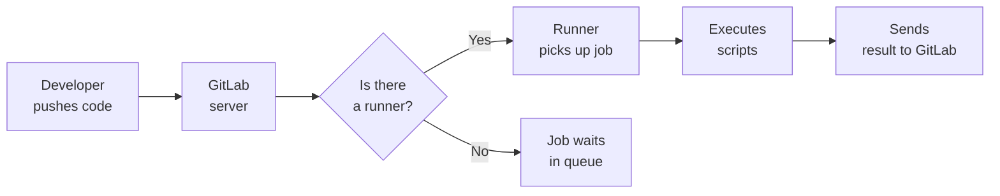
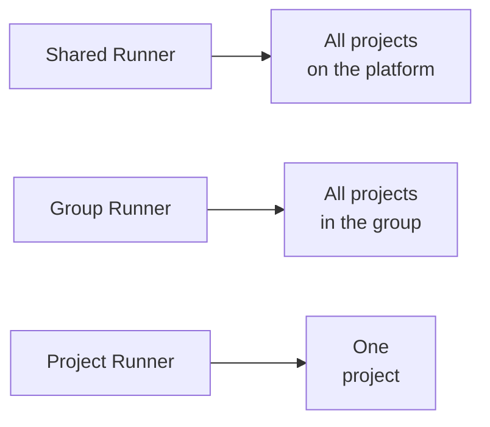
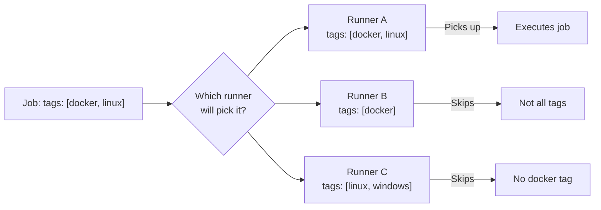
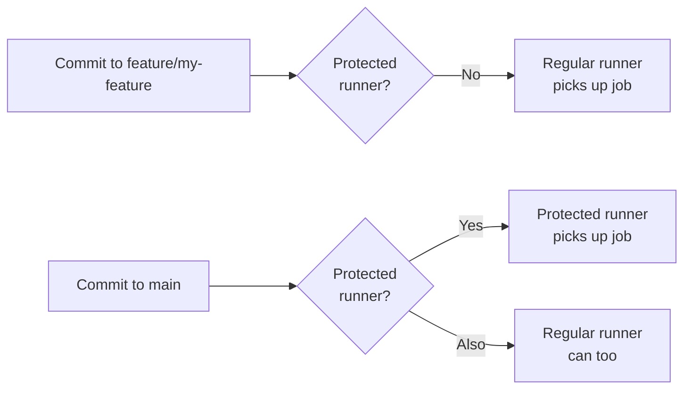

# Level 6: GitLab Runners

## What is a GitLab Runner

Imagine GitLab CI as a factory manager. It knows what needs to be done (described in `.gitlab-ci.yml`), but doesn't do anything with its own hands. For that, it needs **workers** — and they are called **GitLab Runners**.

**GitLab Runner** is an agent that receives tasks from GitLab and executes them on the machine where it's installed. Without a runner, the pipeline simply sits in the queue and never starts.



GitLab Runner is a separate program written in Go. It can be installed on any machine: laptop, server, virtual machine, or in the cloud. After registration, the runner appears in the GitLab interface and starts picking up jobs.

---

## Runner Types

Runners differ by **scope** — which projects they are available to.

### Shared runners

Provided by GitLab itself (or the instance administrator). Available to all projects on the platform.

```yaml
# Any job without tags will automatically go to a shared runner
build-job:
  stage: build
  script:
    - npm ci
    - npm run build
```

✅ Pros: no setup needed, always available, free within GitLab.com limits
❌ Cons: slower (queue), no resource guarantees, limited CI minutes.

### Group runners

Available to all projects within a single GitLab group. Ideal for teams with shared infrastructure.

```yaml
# Runner registered for the "my-team" group
# Available to projects: my-team/frontend, my-team/backend, my-team/infra
test-job:
  stage: test
  tags:
    - group-runner
  script:
    - pytest
```

✅ Pros: faster than shared, shared configuration for the team, can be customized for group needs.

### Project runners

Tied to a specific project. Used for sensitive data or specific environments.

```yaml
# Runner only for the "payment-service" project
deploy-prod:
  stage: deploy
  tags:
    - payment-prod-runner
  script:
    - ./deploy.sh production
```

✅ Pros: full isolation, access only for project members, can grant specific permissions.



---

## Executors — How a Runner Executes Jobs

**Executor** is the mechanism a runner uses to launch scripts. This is the most important decision when setting up a runner.

### Docker executor

Each job runs in a fresh Docker container. The most popular choice.

```yaml
# .gitlab-ci.yml
test-node:
  image: node:20-alpine        # image for this job
  script:
    - npm ci
    - npm test

test-python:
  image: python:3.12-slim      # different image for a different job
  script:
    - pip install -r requirements.txt
    - pytest
```

```toml
# Runner config.toml with Docker executor
[[runners]]
  name = "docker-runner"
  executor = "docker"
  [runners.docker]
    image = "alpine:latest"    # default image
    privileged = false
    volumes = ["/cache"]
```

✅ Clean environment on every run
✅ Isolation between jobs
✅ Any image from Docker Hub or private registry
❌ Requires Docker on the runner machine
❌ Slower than Shell due to container startup

### Shell executor

Job runs directly in the host machine's shell where the runner is installed. No isolation.

```yaml
# .gitlab-ci.yml — will execute on the host machine
build-native:
  tags:
    - shell-runner
  script:
    - make build
    - ./run-tests.sh
```

```toml
[[runners]]
  name = "shell-runner"
  executor = "shell"
```

✅ Maximum speed (no Docker overhead)
✅ Access to host resources (GPU, special hardware)
❌ No isolation — jobs can affect each other
❌ Need to manually maintain dependencies on the host
⚠️ Security: a malicious job could damage the system

### Kubernetes executor

Job runs in a Pod inside a Kubernetes cluster. Ideal for scalable environments.

```toml
[[runners]]
  name = "k8s-runner"
  executor = "kubernetes"
  [runners.kubernetes]
    namespace = "gitlab-runners"
    image = "alpine:latest"
    cpu_request = "100m"
    memory_request = "128Mi"
    cpu_limit = "1"
    memory_limit = "1Gi"
```

```yaml
# .gitlab-ci.yml — each job = a separate Pod in k8s
heavy-test:
  tags:
    - kubernetes
  script:
    - npm run test:e2e
```

✅ Auto-scaling out of the box
✅ Full isolation via Pod
✅ Resource management (CPU/memory limits)
❌ Requires a configured Kubernetes cluster
❌ Harder to debug
❌ Longer startup (Pod creation)

### Docker Machine executor (autoscaling)

The runner automatically creates new VMs under load and removes them after idle time. Being deprecated in favor of Kubernetes, but still widely used.

```toml
[[runners]]
  name = "autoscale-runner"
  executor = "docker+machine"
  [runners.machine]
    IdleCount = 1
    IdleTime = 1800
    MaxBuilds = 100
    MachineDriver = "google"
    MachineName = "gitlab-runner-%s"
    MachineOptions = [
      "google-project=my-gcp-project",
      "google-zone=us-central1-a",
      "google-machine-type=n1-standard-2",
    ]
```

✅ Pay only for actual usage
✅ No limit on simultaneous jobs
❌ Cold start (VM creation takes ~30 sec)
❌ Complex configuration

---

## Tags — Routing Jobs to Runners

**Tags** are the mechanism for matching jobs to runners. A runner picks up a job only if its tags **fully match** the job's tags (or if the job has no tags and the runner allows untagged jobs).



📌 Important: the runner must have **all** of the job's tags. Having additional tags on the runner is not a problem.

```yaml
# Examples of tag usage
build-linux:
  stage: build
  tags:
    - docker
    - linux
  script:
    - make build-linux

build-windows:
  stage: build
  tags:
    - windows
    - shell
  script:
    - .\build.ps1

deploy-prod:
  stage: deploy
  tags:
    - production
    - aws
  script:
    - ./deploy.sh

# Job without tags — any runner with untagged permission will pick it up
lint:
  stage: lint
  script:
    - npm run lint
```

### Untagged jobs

By default, a runner may or may not pick up jobs without tags. This is configured during registration.

```toml
[[runners]]
  name = "shared-docker"
  run_untagged = true    # picks up jobs without tags
  tags = ["docker"]
```

⚠️ Common mistake: a job doesn't start, stuck in "pending" status. The reason — no runner matches the tags. Always check runner tags in Settings > CI/CD > Runners.

---

## Registering a Runner

Registration is the process of linking an installed runner to a GitLab instance.

### Step 1: Installation

```bash
# Debian/Ubuntu
curl -L "https://packages.gitlab.com/install/repositories/runner/gitlab-runner/script.deb.sh" | sudo bash
sudo apt-get install gitlab-runner

# macOS
brew install gitlab-runner

# Docker
docker run -d --name gitlab-runner \
  --restart always \
  -v /srv/gitlab-runner/config:/etc/gitlab-runner \
  -v /var/run/docker.sock:/var/run/docker.sock \
  gitlab/gitlab-runner:latest
```

### Step 2: Get the Token

In GitLab: Settings > CI/CD > Runners > Registration token

### Step 3: Registration

```bash
sudo gitlab-runner register

# Interactive:
# Enter the GitLab instance URL: https://gitlab.com
# Enter the registration token: glrt-xxxxxxxxxxxx
# Enter a description for the runner: my-docker-runner
# Enter tags for the runner (comma-separated): docker,linux
# Enter optional maintenance note:
# Executor: docker
# Default Docker image: alpine:latest

# Or non-interactively:
sudo gitlab-runner register \
  --non-interactive \
  --url "https://gitlab.com" \
  --registration-token "glrt-xxxxxxxxxxxx" \
  --executor "docker" \
  --docker-image "alpine:latest" \
  --description "my-docker-runner" \
  --tag-list "docker,linux" \
  --run-untagged="false" \
  --locked="false"
```

---

## config.toml — The Main Runner Config

After registration, GitLab Runner creates the file `/etc/gitlab-runner/config.toml`. This is the main runner configuration.

```toml
# /etc/gitlab-runner/config.toml
concurrent = 4           # max 4 jobs simultaneously
check_interval = 3       # poll GitLab every 3 seconds
shutdown_timeout = 0

[session_server]
  session_timeout = 1800

[[runners]]
  name = "production-docker-runner"
  url = "https://gitlab.com"
  token = "glrt-xxxxxxxxxxxx"
  executor = "docker"
  tags = ["docker", "linux", "production"]
  run_untagged = false

  [runners.cache]
    Type = "s3"
    Shared = true
    [runners.cache.s3]
      ServerAddress = "s3.amazonaws.com"
      BucketName = "gitlab-runner-cache"
      BucketLocation = "us-east-1"

  [runners.docker]
    tls_verify = false
    image = "alpine:latest"
    privileged = false
    disable_entrypoint_overwrite = false
    oom_kill_disable = false
    disable_cache = false
    volumes = ["/cache", "/var/run/docker.sock:/var/run/docker.sock"]
    shm_size = 0
    network_mode = "bridge"
```

💡 Key parameters:
- `concurrent` — how many jobs the runner executes simultaneously
- `check_interval` — how often the runner polls GitLab for new jobs
- `run_untagged` — whether to pick up jobs without tags
- `privileged` — access to Docker-in-Docker (use with caution)

---

## Protected runners

**Protected runners** pick up jobs only from **protected branches** (usually `main`, `master`, `release/*`). This protects against running malicious code from feature branches.



📌 When to use protected runners:
- Production deployment — only from `main`
- Access to production secrets
- Artifact signing (code signing)

In GitLab: Settings > CI/CD > Runners > Edit runner > Protected

---

## Self-hosted vs Shared: When to Choose What

| Criteria | Shared runners | Self-hosted runners |
|---|---|---|
| **Setup** | None | Required |
| **Cost** | CI minutes (expensive with intensive use) | Infrastructure cost |
| **Performance** | Unpredictable | Predictable |
| **Security** | Shared environment | Full control |
| **Customization** | Limited | Full |
| **Specialized software** | Difficult | Easy |
| **Scaling** | Automatic | Manual or k8s |

**Choose Shared runners if:**
- Small team, infrequent pipelines
- Startup without DevOps resources
- Pipelines without sensitive data

**Choose Self-hosted if:**
- Over 1000 CI minutes per month (more cost-effective)
- Need access to internal infrastructure (databases, VPN)
- Specialized hardware (GPU, ARM, Windows)
- Strict security and isolation requirements

---

## Runner Security

### Isolation between jobs

```toml
# Docker executor — each job in its own container
[runners.docker]
  privileged = false      # ❌ don't grant privileged without a reason
  disable_cache = false   # cache is shared, don't store secrets in cache
```

### Access to Secrets

```yaml
# ❌ Bad: secret in plain text
deploy:
  script:
    - export DB_PASS=supersecret123
    - ./deploy.sh

# ✅ Good: secret via CI/CD Variables
deploy:
  script:
    - ./deploy.sh          # reads $DB_PASSWORD from environment
  environment:
    name: production
```

### Restricting Jobs by Runners

```yaml
# ✅ Deploy only on a special runner with the right permissions
deploy-production:
  stage: deploy
  tags:
    - production           # only a runner with this tag
  only:
    - main                 # only from main branch
  script:
    - ./deploy-prod.sh
```

### Principle of Least Privilege

📌 Runner security rules:
1. Don't grant `privileged: true` without a clear need (only for Docker-in-Docker)
2. Use protected runners for production deploys
3. Don't store secrets in `config.toml` — use CI/CD Variables
4. Isolate runners by environment: separate runner for staging, separate for prod
5. Regularly rotate runner tokens

---

## Common Beginner Mistakes

⚠️ **Mistake 1: Job stuck in pending indefinitely**

❌ Problem:
```yaml
build:
  tags:
    - linux
    - docker
    - gpu          # no runner has this tag
  script:
    - make build
```

✅ Solution: check Settings > CI/CD > Runners, make sure tags match.

---

⚠️ **Mistake 2: privileged = true everywhere**

❌ Insecure:
```toml
[runners.docker]
  privileged = true    # full access to the host system
```

✅ Correct:
```toml
[runners.docker]
  privileged = false   # only if Docker-in-Docker is explicitly needed
```

---

⚠️ **Mistake 3: Shell executor with different dependencies in jobs**

❌ Problem: one job installs Node 18, another — Node 20. They conflict on the same host.

✅ Solution: use Docker executor — each job gets a clean container with the required image.

---

⚠️ **Mistake 4: One runner with concurrent = 1 for everything**

❌ Problem: jobs queue up, pipeline is slow.

✅ Solution:
```toml
concurrent = 8    # run up to 8 jobs in parallel
```
Or use multiple runners.

---

⚠️ **Mistake 5: Manual runner registration with auto-scaling**

❌ Problem: when a new VM is created, the runner isn't registered.

✅ Solution: automatic registration via cloud-init or Terraform when creating VMs.

---

## Summary

GitLab Runner is the foundation of pipeline execution. The right choice of runner type and executor affects CI/CD speed, security, and cost.

Key decisions:
- **Shared** for simple cases, **self-hosted** for production
- **Docker executor** — the gold standard (isolation + flexibility)
- **Tags** — precise control over where each job executes
- **Protected runners** — mandatory for production deploys
- Never grant `privileged = true` without a clear need
