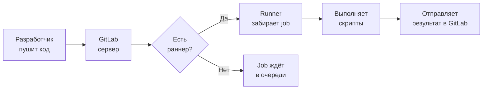
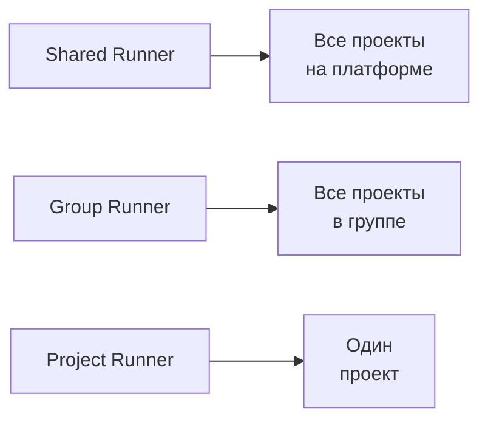
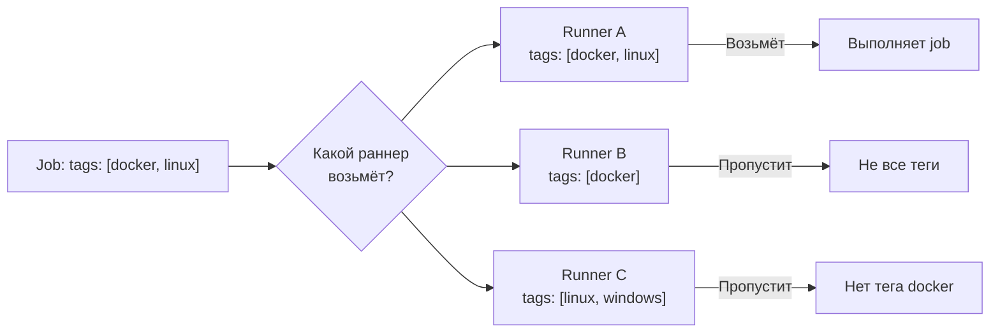
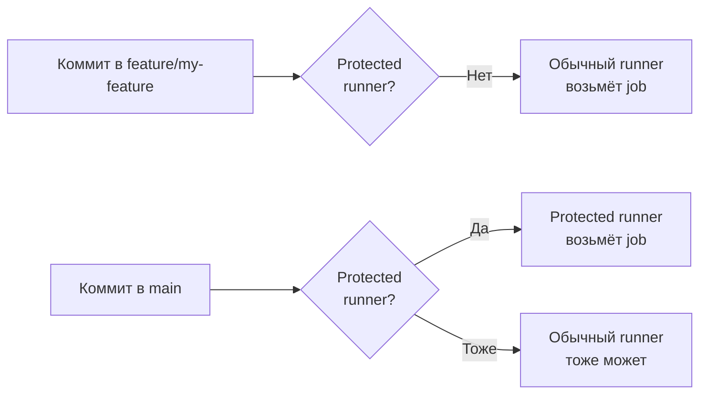

# Уровень 6: GitLab Runners

## Что такое GitLab Runner

Представь, что GitLab CI — это менеджер на заводе. Он знает, что нужно сделать (описано в `.gitlab-ci.yml`), но сам руками ничего не делает. Для этого ему нужны **рабочие** — и вот они называются **GitLab Runners**.

**GitLab Runner** — это агент, который получает задания от GitLab и выполняет их на машине, где установлен. Без раннера пайплайн просто висит в очереди и никогда не запустится.



GitLab Runner — это отдельная программа, написанная на Go. Она устанавливается на любой машине: ноутбуке, сервере, виртуалке, в облаке. После регистрации раннер появляется в интерфейсе GitLab и начинает брать задания.

---

## Типы раннеров

Раннеры различаются по **области видимости** — каким проектам они доступны.

### Shared runners — общие раннеры

Предоставляются самим GitLab (или администратором инстанса). Доступны всем проектам на платформе.

```yaml
# Любой job без тегов автоматически попадёт на shared runner
build-job:
  stage: build
  script:
    - npm ci
    - npm run build
```

✅ Плюсы: не нужно ничего настраивать, всегда доступны, бесплатно в лимитах GitLab.com  
❌ Минусы: медленнее (очередь), нет гарантий по ресурсам, ограниченное время CI minutes.

### Group runners — раннеры группы

Доступны всем проектам внутри одной группы GitLab. Идеальны для команд с общей инфраструктурой.

```yaml
# Раннер зарегистрирован для группы "my-team"
# Доступен проектам: my-team/frontend, my-team/backend, my-team/infra
test-job:
  stage: test
  tags:
    - group-runner
  script:
    - pytest
```

✅ Плюсы: быстрее shared, общая конфигурация для команды, можно настроить под нужды группы.

### Project runners — раннеры проекта

Привязаны к конкретному проекту. Используются для чувствительных данных или специфического окружения.

```yaml
# Раннер только для проекта "payment-service"
deploy-prod:
  stage: deploy
  tags:
    - payment-prod-runner
  script:
    - ./deploy.sh production
```

✅ Плюсы: полная изоляция, доступ только у членов проекта, можно дать специфические права.



---

## Executors — как раннер выполняет задания

**Executor** — это механизм, который раннер использует для запуска скриптов. Это самое важное решение при настройке раннера.

### Docker executor

Каждый job запускается в свежем Docker-контейнере. Самый популярный выбор.

```yaml
# .gitlab-ci.yml
test-node:
  image: node:20-alpine        # образ для этого job
  script:
    - npm ci
    - npm test

test-python:
  image: python:3.12-slim      # другой образ для другого job
  script:
    - pip install -r requirements.txt
    - pytest
```

```toml
# config.toml раннера с Docker executor
[[runners]]
  name = "docker-runner"
  executor = "docker"
  [runners.docker]
    image = "alpine:latest"    # образ по умолчанию
    privileged = false
    volumes = ["/cache"]
```

✅ Чистая среда при каждом запуске  
✅ Изоляция между джобами  
✅ Любой образ из Docker Hub или приватного реестра  
❌ Нужен Docker на машине раннера  
❌ Медленнее Shell из-за запуска контейнера

### Shell executor

Job запускается напрямую в оболочке машины, где установлен раннер. Без изоляции.

```yaml
# .gitlab-ci.yml — будет выполняться на хост-машине
build-native:
  tags:
    - shell-runner
  script:
    - make build
    - ./run-tests.sh
```

```toml
[[runners]]
  name = "shell-runner"
  executor = "shell"
```

✅ Максимальная скорость (нет оверхеда Docker)  
✅ Доступ к ресурсам хоста (GPU, специальное оборудование)  
❌ Нет изоляции — jobs могут влиять друг на друга  
❌ Нужно вручную поддерживать зависимости на хост-машине  
⚠️ Безопасность: вредоносный job может повредить систему

### Kubernetes executor

Job запускается в Pod внутри Kubernetes-кластера. Идеал для масштабируемых окружений.

```toml
[[runners]]
  name = "k8s-runner"
  executor = "kubernetes"
  [runners.kubernetes]
    namespace = "gitlab-runners"
    image = "alpine:latest"
    cpu_request = "100m"
    memory_request = "128Mi"
    cpu_limit = "1"
    memory_limit = "1Gi"
```

```yaml
# .gitlab-ci.yml — каждый job = отдельный Pod в k8s
heavy-test:
  tags:
    - kubernetes
  script:
    - npm run test:e2e
```

✅ Автомасштабирование из коробки  
✅ Полная изоляция через Pod  
✅ Управление ресурсами (CPU/memory limits)  
❌ Требует настроенный Kubernetes кластер  
❌ Сложнее в отладке  
❌ Дольше старт (создание Pod)

### Docker Machine executor (autoscaling)

Раннер автоматически создаёт новые виртуальные машины при нагрузке и удаляет их после простоя. Устаревает в пользу Kubernetes, но ещё активно используется.

```toml
[[runners]]
  name = "autoscale-runner"
  executor = "docker+machine"
  [runners.machine]
    IdleCount = 1
    IdleTime = 1800
    MaxBuilds = 100
    MachineDriver = "google"
    MachineName = "gitlab-runner-%s"
    MachineOptions = [
      "google-project=my-gcp-project",
      "google-zone=us-central1-a",
      "google-machine-type=n1-standard-2",
    ]
```

✅ Платишь только за реальное использование  
✅ Нет ограничений на количество параллельных джобов  
❌ Холодный старт (создание VM занимает ~30 сек)  
❌ Сложная конфигурация

---

## Tags — маршрутизация джобов к раннерам

**Tags** — это механизм сопоставления джобов и раннеров. Раннер берёт джоб только если его теги **полностью совпадают** с тегами джоба (или если у джоба нет тегов и раннер разрешает untagged jobs).



📌 Важно: раннер должен иметь **все** теги джоба. Наличие дополнительных тегов у раннера — не проблема.

```yaml
# Примеры использования тегов
build-linux:
  stage: build
  tags:
    - docker
    - linux
  script:
    - make build-linux

build-windows:
  stage: build
  tags:
    - windows
    - shell
  script:
    - .\build.ps1

deploy-prod:
  stage: deploy
  tags:
    - production
    - aws
  script:
    - ./deploy.sh

# Job без тегов — возьмёт любой раннер с разрешением untagged
lint:
  stage: lint
  script:
    - npm run lint
```

### Untagged jobs

По умолчанию раннер может брать или не брать джобы без тегов. Это настраивается при регистрации.

```toml
[[runners]]
  name = "shared-docker"
  run_untagged = true    # берёт джобы без тегов
  tags = ["docker"]
```

⚠️ Типичная ошибка: джоб не запускается, висит в статусе "pending". Причина — ни один раннер не подходит по тегам. Всегда проверяй теги раннеров в Settings > CI/CD > Runners.

---

## Регистрация раннера

Регистрация — это процесс привязки установленного раннера к GitLab-инстансу.

### Шаг 1: Установка

```bash
# Debian/Ubuntu
curl -L "https://packages.gitlab.com/install/repositories/runner/gitlab-runner/script.deb.sh" | sudo bash
sudo apt-get install gitlab-runner

# macOS
brew install gitlab-runner

# Docker
docker run -d --name gitlab-runner \
  --restart always \
  -v /srv/gitlab-runner/config:/etc/gitlab-runner \
  -v /var/run/docker.sock:/var/run/docker.sock \
  gitlab/gitlab-runner:latest
```

### Шаг 2: Получение токена

В GitLab: Settings > CI/CD > Runners > Registration token

### Шаг 3: Регистрация

```bash
sudo gitlab-runner register

# Интерактивно:
# Enter the GitLab instance URL: https://gitlab.com
# Enter the registration token: glrt-xxxxxxxxxxxx
# Enter a description for the runner: my-docker-runner
# Enter tags for the runner (comma-separated): docker,linux
# Enter optional maintenance note: 
# Executor: docker
# Default Docker image: alpine:latest

# Или одной командой (non-interactive):
sudo gitlab-runner register \
  --non-interactive \
  --url "https://gitlab.com" \
  --registration-token "glrt-xxxxxxxxxxxx" \
  --executor "docker" \
  --docker-image "alpine:latest" \
  --description "my-docker-runner" \
  --tag-list "docker,linux" \
  --run-untagged="false" \
  --locked="false"
```

---

## config.toml — главный конфиг раннера

После регистрации GitLab Runner создаёт файл `/etc/gitlab-runner/config.toml`. Это главный конфиг раннера.

```toml
# /etc/gitlab-runner/config.toml
concurrent = 4           # максимум 4 джоба одновременно
check_interval = 3       # опрос GitLab каждые 3 секунды
shutdown_timeout = 0

[session_server]
  session_timeout = 1800

[[runners]]
  name = "production-docker-runner"
  url = "https://gitlab.com"
  token = "glrt-xxxxxxxxxxxx"
  executor = "docker"
  tags = ["docker", "linux", "production"]
  run_untagged = false

  [runners.cache]
    Type = "s3"
    Shared = true
    [runners.cache.s3]
      ServerAddress = "s3.amazonaws.com"
      BucketName = "gitlab-runner-cache"
      BucketLocation = "us-east-1"

  [runners.docker]
    tls_verify = false
    image = "alpine:latest"
    privileged = false
    disable_entrypoint_overwrite = false
    oom_kill_disable = false
    disable_cache = false
    volumes = ["/cache", "/var/run/docker.sock:/var/run/docker.sock"]
    shm_size = 0
    network_mode = "bridge"
```

💡 Ключевые параметры:
- `concurrent` — сколько джобов раннер выполняет одновременно
- `check_interval` — как часто раннер спрашивает GitLab о новых заданиях
- `run_untagged` — брать ли джобы без тегов
- `privileged` — доступ к Docker-in-Docker (нужен с осторожностью)

---

## Protected runners

**Protected runners** берут джобы только из **protected branches** (обычно `main`, `master`, `release/*`). Это защита от выполнения вредоносного кода из feature-веток.



📌 Когда использовать protected runners:
- Деплой в production — только из `main`
- Доступ к production-секретам
- Подпись артефактов (code signing)

В GitLab: Settings > CI/CD > Runners > Edit runner > Protected

---

## Self-hosted vs Shared: когда что выбрать

| Критерий | Shared runners | Self-hosted runners |
|---|---|---|
| **Настройка** | Нет | Нужна |
| **Стоимость** | CI minutes (дорого при интенсивном использовании) | Стоимость инфраструктуры |
| **Производительность** | Непредсказуема | Предсказуема |
| **Безопасность** | Shared окружение | Полный контроль |
| **Кастомизация** | Ограничена | Полная |
| **Специфическое ПО** | Сложно | Легко |
| **Масштабирование** | Автоматически | Вручную или k8s |

**Выбирай Shared runners если:**
- Небольшая команда, нечастые пайплайны
- Стартап без DevOps-ресурсов
- Пайплайны без секретных данных

**Выбирай Self-hosted если:**
- Более 1000 минут CI в месяц (экономически выгоднее)
- Нужен доступ к внутренней инфраструктуре (базы, VPN)
- Специфическое железо (GPU, ARM, Windows)
- Строгие требования к безопасности и изоляции

---

## Безопасность раннеров

### Изоляция между джобами

```toml
# Docker executor — каждый job в своём контейнере
[runners.docker]
  privileged = false      # ❌ не давай privileged без причины
  disable_cache = false   # кэш общий, не храни секреты в кэше
```

### Доступ к секретам

```yaml
# ❌ Плохо: секрет в открытом виде
deploy:
  script:
    - export DB_PASS=supersecret123
    - ./deploy.sh

# ✅ Хорошо: секрет через CI/CD Variables
deploy:
  script:
    - ./deploy.sh          # читает $DB_PASSWORD из окружения
  environment:
    name: production
```

### Ограничение джобов по раннерам

```yaml
# ✅ Деплой только на специальном раннере с нужными правами
deploy-production:
  stage: deploy
  tags:
    - production           # только раннер с этим тегом
  only:
    - main                 # только из main ветки
  script:
    - ./deploy-prod.sh
```

### Принцип минимальных прав

📌 Правила безопасности раннеров:
1. Не давай `privileged: true` без явной необходимости (только для Docker-in-Docker)
2. Используй protected runners для production-деплоев
3. Не храни секреты в `config.toml` — используй CI/CD Variables
4. Изолируй раннеры по окружениям: отдельный раннер для staging, отдельный для prod
5. Регулярно ротируй токены раннеров

---

## Частые ошибки новичков

⚠️ **Ошибка 1: Job висит в pending бесконечно**

❌ Проблема:
```yaml
build:
  tags:
    - linux
    - docker
    - gpu          # такого тега ни у одного раннера нет
  script:
    - make build
```

✅ Решение: проверь Settings > CI/CD > Runners, убедись что теги совпадают.

---

⚠️ **Ошибка 2: privileged = true везде**

❌ Небезопасно:
```toml
[runners.docker]
  privileged = true    # полный доступ к хост-системе
```

✅ Правильно:
```toml
[runners.docker]
  privileged = false   # только если явно не нужен Docker-in-Docker
```

---

⚠️ **Ошибка 3: Shell executor с разными зависимостями в джобах**

❌ Проблема: один джоб ставит Node 18, другой — Node 20. Они конфликтуют на одном хосте.

✅ Решение: используй Docker executor — каждый джоб получает чистый контейнер с нужным образом.

---

⚠️ **Ошибка 4: Один раннер с concurrent = 1 для всего**

❌ Проблема: джобы выстраиваются в очередь, пайплайн медленный.

✅ Решение:
```toml
concurrent = 8    # запускай до 8 джобов параллельно
```
Или используй несколько раннеров.

---

⚠️ **Ошибка 5: Регистрация раннера вручную при автомасштабировании**

❌ Проблема: при создании новой VM раннер не зарегистрирован.

✅ Решение: автоматическая регистрация через cloud-init или Terraform при создании VM.

---

## Итог

GitLab Runner — фундамент выполнения пайплайнов. Правильный выбор типа раннера и executor-а влияет на скорость, безопасность и стоимость CI/CD.

Ключевые решения:
- **Shared** для простых случаев, **self-hosted** для продакшна
- **Docker executor** — золотой стандарт (изоляция + гибкость)
- **Tags** — точный контроль над тем, где выполняется каждый джоб
- **Protected runners** — обязательно для деплоя в production
- Никогда не давай `privileged = true` без явной нужды
