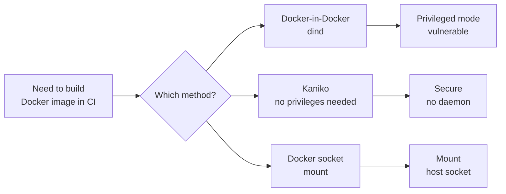
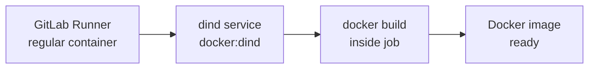
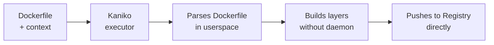
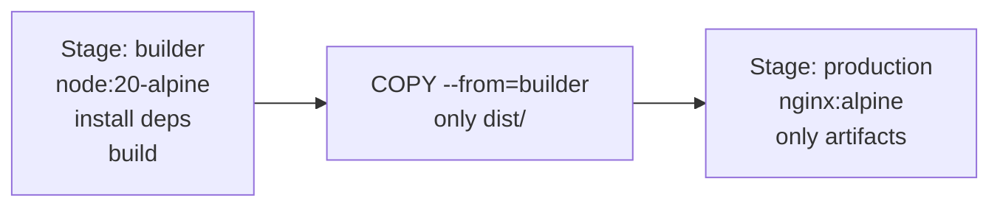

# Level 8: Docker in CI

## The Problem: How to Build a Docker Image Inside CI?

Imagine: your CI pipeline runs inside a container. And you need to build a Docker image — that is, run Docker inside Docker. Sounds like a matryoshka doll, and that's exactly what it is.

There are three approaches to this task, each with its own pros and cons:



---

## Docker-in-Docker (dind)

### How It Works

Docker-in-Docker — literally running a Docker daemon inside a CI job container. Your job becomes both the Docker client and server simultaneously.



Architecture in GitLab CI: the main job container and `docker:dind` as an additional **service** (sidecar).

```yaml
# Most common approach — via service
build-image:
  image: docker:24-cli
  services:
    - docker:24-dind
  variables:
    DOCKER_TLS_CERTDIR: '/certs'
    DOCKER_HOST: 'tcp://docker:2376'
    DOCKER_TLS_VERIFY: '1'
    DOCKER_CERT_PATH: '$DOCKER_TLS_CERTDIR/client'
  script:
    - docker build -t my-app:$CI_COMMIT_SHA .
    - docker push my-app:$CI_COMMIT_SHA
```

### Why Privileged Mode Is Needed

The Docker daemon requires access to the host kernel for managing namespaces, cgroups, and the overlay filesystem. Without `--privileged` at the Runner level, this is impossible.

```toml
# GitLab Runner config.toml — must be explicitly enabled
[[runners]]
  name = "docker-runner"
  executor = "docker"
  [runners.docker]
    privileged = true          # dind won't work without this
    volumes = ["/certs/client"]
```

### TLS Between Client and dind

Starting with Docker 20+, communication between the CLI and dind requires TLS. The `DOCKER_TLS_CERTDIR` variable specifies where to place certificates, and `DOCKER_HOST` is the daemon address.

```yaml
variables:
  # Enable TLS (recommended)
  DOCKER_TLS_CERTDIR: '/certs'
  DOCKER_HOST: 'tcp://docker:2376'
  DOCKER_TLS_VERIFY: '1'
  DOCKER_CERT_PATH: '$DOCKER_TLS_CERTDIR/client'

  # Disable TLS (tests only, insecure)
  # DOCKER_TLS_CERTDIR: ''
  # DOCKER_HOST: 'tcp://docker:2375'
```

---

## Kaniko — Building Without a Docker Daemon

### The Idea

Kaniko is a tool from Google that builds Docker images **without a Docker daemon** and **without privileged mode**. It reads the Dockerfile directly, builds layers in userspace, and pushes to a registry.



### Why It's More Secure

| Aspect | dind | Kaniko |
|---|---|---|
| **Privileged mode** | Required | Not needed |
| **Docker daemon** | Runs inside | Not needed |
| **Host access** | Full (via kernel) | Isolated |
| **First run speed** | Faster | Slightly slower |
| **Layer cache** | Local | In registry (--cache) |

### Basic Usage in GitLab CI

```yaml
build-image:
  image:
    name: gcr.io/kaniko-project/executor:v1.23.0-debug
    entrypoint: ['']
  script:
    - /kaniko/executor
        --context "${CI_PROJECT_DIR}"
        --dockerfile "${CI_PROJECT_DIR}/Dockerfile"
        --destination "${CI_REGISTRY_IMAGE}:${CI_COMMIT_SHORT_SHA}"
        --destination "${CI_REGISTRY_IMAGE}:latest"
  before_script:
    - echo "{\"auths\":{\"${CI_REGISTRY}\":{\"auth\":\"$(printf "%s:%s" "${CI_REGISTRY_USER}" "${CI_REGISTRY_PASSWORD}" | base64 | tr -d '\n')\"}}}" > /kaniko/.docker/config.json
```

### Layer Caching in Kaniko

Kaniko can cache layers directly in the Docker Registry. This significantly speeds up repeated builds.

```yaml
build-image:
  image:
    name: gcr.io/kaniko-project/executor:v1.23.0-debug
    entrypoint: ['']
  script:
    - /kaniko/executor
        --context "${CI_PROJECT_DIR}"
        --dockerfile "${CI_PROJECT_DIR}/Dockerfile"
        --destination "${CI_REGISTRY_IMAGE}:${CI_COMMIT_SHORT_SHA}"
        --cache=true                                    # enable cache
        --cache-repo "${CI_REGISTRY_IMAGE}/cache"       # repo for cache
        --cache-ttl 168h                                # cache TTL (7 days)
        --snapshot-mode=redo                            # fast snapshot mode
```

💡 `--snapshot-mode=redo` — a faster layer comparison algorithm. Recommended for most Dockerfiles.

---

## Multi-stage Builds and Optimization

### What is a Multi-stage Build

A multi-stage build is a Dockerfile with multiple `FROM` sections. Each section is a separate "stage". The final image contains only what you explicitly copied from previous stages.



### Example: Node.js Application

```dockerfile
# ---- Stage 1: builder ----
FROM node:20-alpine AS builder

WORKDIR /app

# Copy only package.json for dependency caching
COPY package*.json ./
RUN npm ci --only=production=false

# Copy source and build
COPY . .
RUN npm run build

# ---- Stage 2: production ----
FROM nginx:alpine AS production

# Copy only the built artifact
COPY --from=builder /app/dist /usr/share/nginx/html
COPY nginx.conf /etc/nginx/nginx.conf

EXPOSE 80
CMD ["nginx", "-g", "daemon off;"]
```

Result: the `builder` image may weigh 800MB (node_modules, build tools), while the final `production` image is 30MB.

### Building a Specific Stage in CI

```yaml
# Build only the needed target
build-image:
  script:
    - docker build
        --target production        # build only production stage
        --tag my-app:latest
        .

# Run tests inside the builder stage
test-in-docker:
  script:
    - docker build
        --target builder           # stop at builder
        --tag my-app:test
        .
    - docker run --rm my-app:test npm test
```

### Dockerfile Layer Cache Optimization

The order of instructions in the Dockerfile is critical for caching:

```dockerfile
# ❌ Bad: COPY . . comes before npm ci
# Any code change invalidates the dependency cache
FROM node:20-alpine AS builder
WORKDIR /app
COPY . .                    # if any file changes...
RUN npm ci                  # ...this layer is rebuilt

# ✅ Good: copy package.json first
FROM node:20-alpine AS builder
WORKDIR /app
COPY package*.json ./       # changes rarely
RUN npm ci                  # this layer is cached unless package.json changes
COPY . .                    # code changes don't break npm ci cache
RUN npm run build
```

### BuildKit and Parallel Builds

BuildKit is the modern Docker build engine, enabled by default since Docker 23+. It can build independent stages in parallel.

```yaml
build-image:
  variables:
    DOCKER_BUILDKIT: '1'          # explicitly enable BuildKit (for older Docker)
  script:
    - docker build
        --build-arg BUILDKIT_INLINE_CACHE=1   # embed cache metadata into the image
        --cache-from my-app:latest             # use existing image as cache
        --tag my-app:${CI_COMMIT_SHA}
        --tag my-app:latest
        .
```

### cache-from — Using Registry as Layer Cache

```yaml
build-with-cache:
  stage: build
  script:
    # Step 1: pull the latest image as cache base
    - docker pull $CI_REGISTRY_IMAGE:latest || true
    # Step 2: build using the pulled image as cache
    - docker build
        --cache-from $CI_REGISTRY_IMAGE:latest
        --tag $CI_REGISTRY_IMAGE:$CI_COMMIT_SHORT_SHA
        --tag $CI_REGISTRY_IMAGE:latest
        .
    # Step 3: push both tags
    - docker push $CI_REGISTRY_IMAGE:$CI_COMMIT_SHORT_SHA
    - docker push $CI_REGISTRY_IMAGE:latest
```

💡 `|| true` after `docker pull` prevents pipeline failure on the first build when the image doesn't exist in the registry yet.

---

## GitLab Container Registry

GitLab provides a built-in Docker Registry for each project. Environment variables are automatically available:

```yaml
variables:
  # Automatically available in every GitLab CI job:
  # CI_REGISTRY          = registry.gitlab.com
  # CI_REGISTRY_IMAGE    = registry.gitlab.com/group/project
  # CI_REGISTRY_USER     = gitlab-ci-token
  # CI_REGISTRY_PASSWORD = $CI_JOB_TOKEN

build-and-push:
  image: docker:24-cli
  services:
    - docker:24-dind
  before_script:
    - docker login -u $CI_REGISTRY_USER -p $CI_REGISTRY_PASSWORD $CI_REGISTRY
  script:
    - docker build -t $CI_REGISTRY_IMAGE:$CI_COMMIT_SHORT_SHA .
    - docker push $CI_REGISTRY_IMAGE:$CI_COMMIT_SHORT_SHA
  after_script:
    - docker logout $CI_REGISTRY
```

### Image Tagging Strategies

```yaml
variables:
  IMAGE_TAG: $CI_REGISTRY_IMAGE:$CI_COMMIT_SHORT_SHA

build:
  script:
    # Tag by commit SHA — for traceability
    - docker build -t $CI_REGISTRY_IMAGE:$CI_COMMIT_SHORT_SHA .

    # Tag by branch — for development environments
    - docker tag $CI_REGISTRY_IMAGE:$CI_COMMIT_SHORT_SHA \
        $CI_REGISTRY_IMAGE:$CI_COMMIT_REF_SLUG

    # Tag latest — only for main branch
    - |
      if [ "$CI_COMMIT_BRANCH" = "main" ]; then
        docker tag $CI_REGISTRY_IMAGE:$CI_COMMIT_SHORT_SHA \
          $CI_REGISTRY_IMAGE:latest
        docker push $CI_REGISTRY_IMAGE:latest
      fi

    - docker push $CI_REGISTRY_IMAGE:$CI_COMMIT_SHORT_SHA
    - docker push $CI_REGISTRY_IMAGE:$CI_COMMIT_REF_SLUG
```

---

## Full Pipeline: build → test → push

```yaml
stages:
  - build
  - test
  - push

variables:
  IMAGE_NAME: $CI_REGISTRY_IMAGE
  BUILD_TAG: $CI_REGISTRY_IMAGE:$CI_COMMIT_SHORT_SHA

# Build with cache
build:
  stage: build
  image: docker:24-cli
  services:
    - docker:24-dind
  variables:
    DOCKER_TLS_CERTDIR: '/certs'
  before_script:
    - docker login -u $CI_REGISTRY_USER -p $CI_REGISTRY_PASSWORD $CI_REGISTRY
  script:
    - docker pull $IMAGE_NAME:latest || true
    - docker build
        --cache-from $IMAGE_NAME:latest
        --target builder
        --tag $IMAGE_NAME:builder
        .
    - docker build
        --cache-from $IMAGE_NAME:latest
        --cache-from $IMAGE_NAME:builder
        --tag $BUILD_TAG
        --tag $IMAGE_NAME:latest
        .

# Tests in the builder container
test:
  stage: test
  image: docker:24-cli
  services:
    - docker:24-dind
  variables:
    DOCKER_TLS_CERTDIR: '/certs'
  before_script:
    - docker login -u $CI_REGISTRY_USER -p $CI_REGISTRY_PASSWORD $CI_REGISTRY
  script:
    - docker pull $IMAGE_NAME:builder
    - docker run --rm $IMAGE_NAME:builder npm test

# Push only for main
push-latest:
  stage: push
  image: docker:24-cli
  services:
    - docker:24-dind
  variables:
    DOCKER_TLS_CERTDIR: '/certs'
  before_script:
    - docker login -u $CI_REGISTRY_USER -p $CI_REGISTRY_PASSWORD $CI_REGISTRY
  script:
    - docker pull $BUILD_TAG
    - docker tag $BUILD_TAG $IMAGE_NAME:latest
    - docker push $IMAGE_NAME:latest
    - docker push $BUILD_TAG
  rules:
    - if: $CI_COMMIT_BRANCH == 'main'
```

---

## GitHub Actions: Equivalent

```yaml
# GitHub Actions — no dind needed, docker is available on the runner
name: Build and Push

on:
  push:
    branches: [main]

jobs:
  build:
    runs-on: ubuntu-latest
    steps:
      - uses: actions/checkout@v4

      - name: Log in to registry
        uses: docker/login-action@v3
        with:
          registry: ghcr.io
          username: ${{ github.actor }}
          password: ${{ secrets.GITHUB_TOKEN }}

      - name: Set up Docker Buildx
        uses: docker/setup-buildx-action@v3

      - name: Build and push
        uses: docker/build-push-action@v5
        with:
          context: .
          push: true
          tags: ghcr.io/${{ github.repository }}:${{ github.sha }}
          cache-from: type=gha          # GitHub Actions cache
          cache-to: type=gha,mode=max
```

💡 In GitHub Actions, Docker is available on the runner by default — no dind or privileged mode needed. Buildx includes BuildKit.

---

## Common Beginner Mistakes

⚠️ **Mistake 1: Not waiting for dind daemon to start**

```yaml
# ❌ dind service starts asynchronously, docker may not be ready yet
build:
  image: docker:24-cli
  services:
    - docker:24-dind
  script:
    - docker build .    # may fail: "Cannot connect to the Docker daemon"
```

```yaml
# ✅ Add a readiness check
build:
  image: docker:24-cli
  services:
    - docker:24-dind
  script:
    - docker info       # connection check (fails with a clear error)
    - docker build .
```

⚠️ **Mistake 2: Using docker:dind without TLS in production**

```yaml
# ❌ Insecure: without encryption, any process on the network can control Docker
variables:
  DOCKER_TLS_CERTDIR: ''         # disable TLS
  DOCKER_HOST: 'tcp://docker:2375'
```

```yaml
# ✅ Always use TLS
variables:
  DOCKER_TLS_CERTDIR: '/certs'
  DOCKER_HOST: 'tcp://docker:2376'
  DOCKER_TLS_VERIFY: '1'
  DOCKER_CERT_PATH: '$DOCKER_TLS_CERTDIR/client'
```

⚠️ **Mistake 3: Copying everything into the Docker image with COPY . .**

```dockerfile
# ❌ Copies node_modules, .git, .env into the image
FROM node:20-alpine
WORKDIR /app
COPY . .              # includes node_modules (500MB!), .git, .env
RUN npm ci
```

```dockerfile
# ✅ Use .dockerignore
# .dockerignore:
# node_modules
# .git
# .env
# coverage
# dist

FROM node:20-alpine
WORKDIR /app
COPY package*.json ./
RUN npm ci
COPY . .              # now only source files
RUN npm run build
```

⚠️ **Mistake 4: Building an image without a tag or only with latest**

```yaml
# ❌ Only latest — no traceability of what exactly is deployed
script:
  - docker build -t my-app:latest .
  - docker push my-app:latest
```

```yaml
# ✅ SHA + latest — traceability + convenience
script:
  - docker build
      -t my-app:$CI_COMMIT_SHORT_SHA
      -t my-app:latest
      .
  - docker push my-app:$CI_COMMIT_SHORT_SHA  # always
  - docker push my-app:latest                 # only for main
```

⚠️ **Mistake 5: Not using multi-stage — pulling build tools into production**

```dockerfile
# ❌ Production image has npm, compiler, tests
FROM node:20-alpine
WORKDIR /app
COPY . .
RUN npm ci && npm run build
# Image: ~600MB, contains all of node and build tools
```

```dockerfile
# ✅ Multi-stage: only nginx + dist in production
FROM node:20-alpine AS builder
WORKDIR /app
COPY package*.json ./
RUN npm ci
COPY . .
RUN npm run build

FROM nginx:alpine
COPY --from=builder /app/dist /usr/share/nginx/html
# Image: ~30MB
```

---

## Summary

- **dind** — the classic approach, requires `privileged: true` on the Runner. Works well but gives the container broad access.
- **Kaniko** — a secure alternative without a daemon and without privileged mode. Recommended for production.
- **Multi-stage builds** — separate the build environment from the production image. The final image should contain only what's needed to run the application.
- **cache-from** — use the previous image as a layer cache. Saves minutes on every pipeline.
- **Tag by SHA** — always be able to link an image to a specific commit.
