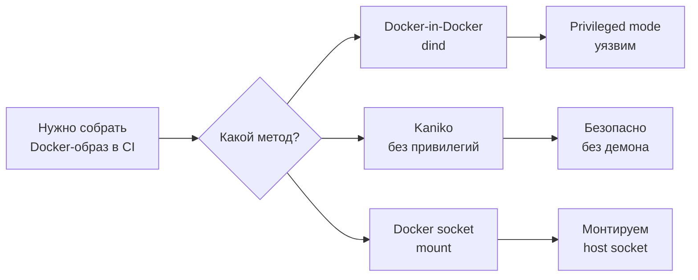
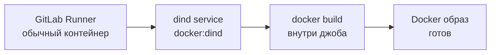
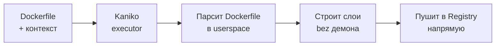
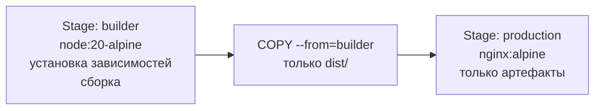

# Уровень 8: Docker в CI

## Проблема: как собрать Docker-образ внутри CI?

Представь: твой CI-пайплайн работает в контейнере. А тебе нужно собрать Docker-образ — то есть запустить Docker внутри Docker. Звучит как матрёшка, и это именно так и есть.

Есть три подхода к этой задаче, каждый со своими плюсами и минусами:



---

## Docker-in-Docker (dind)

### Как это работает

Docker-in-Docker — буквально запуск Docker-демона внутри контейнера CI-джоба. Твой джоб становится и клиентом, и сервером Docker одновременно.



Архитектура в GitLab CI: основной контейнер джоба и `docker:dind` как дополнительный **service** (sidecar).

```yaml
# Самый распространённый способ — через service
build-image:
  image: docker:24-cli
  services:
    - docker:24-dind
  variables:
    DOCKER_TLS_CERTDIR: '/certs'
    DOCKER_HOST: 'tcp://docker:2376'
    DOCKER_TLS_VERIFY: '1'
    DOCKER_CERT_PATH: '$DOCKER_TLS_CERTDIR/client'
  script:
    - docker build -t my-app:$CI_COMMIT_SHA .
    - docker push my-app:$CI_COMMIT_SHA
```

### Почему нужен privileged mode

Docker-демон требует доступа к ядру хоста для управления namespaces, cgroups и overlay-файловой системой. Без `--privileged` на уровне Runner-а это невозможно.

```toml
# config.toml GitLab Runner — нужно включить явно
[[runners]]
  name = "docker-runner"
  executor = "docker"
  [runners.docker]
    privileged = true          # без этого dind не заработает
    volumes = ["/certs/client"]
```

### TLS между клиентом и dind

Начиная с Docker 20+, связь между CLI и dind требует TLS. Переменная `DOCKER_TLS_CERTDIR` указывает, куда положить сертификаты, а `DOCKER_HOST` — адрес демона.

```yaml
variables:
  # Включаем TLS (рекомендуется)
  DOCKER_TLS_CERTDIR: '/certs'
  DOCKER_HOST: 'tcp://docker:2376'
  DOCKER_TLS_VERIFY: '1'
  DOCKER_CERT_PATH: '$DOCKER_TLS_CERTDIR/client'

  # Отключить TLS (только для тестов, небезопасно)
  # DOCKER_TLS_CERTDIR: ''
  # DOCKER_HOST: 'tcp://docker:2375'
```

---

## Kaniko — сборка без Docker-демона

### Идея

Kaniko — инструмент от Google, который собирает Docker-образы **без Docker-демона** и **без privileged mode**. Он читает Dockerfile напрямую, строит слои в userspace и пушит в реестр.



### Почему это безопаснее

| Аспект | dind | Kaniko |
|---|---|---|
| **Privileged mode** | Требуется | Не нужен |
| **Docker-демон** | Запускается внутри | Не нужен |
| **Доступ к хосту** | Полный (через ядро) | Изолированный |
| **Скорость первого запуска** | Быстрее | Чуть медленнее |
| **Кэш слоёв** | Локальный | В реестре (--cache) |

### Базовое использование в GitLab CI

```yaml
build-image:
  image:
    name: gcr.io/kaniko-project/executor:v1.23.0-debug
    entrypoint: ['']
  script:
    - /kaniko/executor
        --context "${CI_PROJECT_DIR}"
        --dockerfile "${CI_PROJECT_DIR}/Dockerfile"
        --destination "${CI_REGISTRY_IMAGE}:${CI_COMMIT_SHORT_SHA}"
        --destination "${CI_REGISTRY_IMAGE}:latest"
  before_script:
    - echo "{\"auths\":{\"${CI_REGISTRY}\":{\"auth\":\"$(printf "%s:%s" "${CI_REGISTRY_USER}" "${CI_REGISTRY_PASSWORD}" | base64 | tr -d '\n')\"}}}" > /kaniko/.docker/config.json
```

### Кэширование слоёв в Kaniko

Kaniko умеет кэшировать слои прямо в Docker Registry. Это существенно ускоряет повторные сборки.

```yaml
build-image:
  image:
    name: gcr.io/kaniko-project/executor:v1.23.0-debug
    entrypoint: ['']
  script:
    - /kaniko/executor
        --context "${CI_PROJECT_DIR}"
        --dockerfile "${CI_PROJECT_DIR}/Dockerfile"
        --destination "${CI_REGISTRY_IMAGE}:${CI_COMMIT_SHORT_SHA}"
        --cache=true                                    # включить кэш
        --cache-repo "${CI_REGISTRY_IMAGE}/cache"       # репо для кэша
        --cache-ttl 168h                                # TTL кэша (7 дней)
        --snapshot-mode=redo                            # быстрый режим снапшотов
```

💡 `--snapshot-mode=redo` — более быстрый алгоритм сравнения слоёв. Рекомендуется для большинства Dockerfile.

---

## Multi-stage builds и оптимизация

### Что такое multi-stage build

Multi-stage build — это Dockerfile с несколькими секциями `FROM`. Каждая секция — отдельный "stage". Финальный образ содержит только то, что ты явно скопировал из предыдущих стадий.



### Пример: Node.js приложение

```dockerfile
# ---- Stage 1: builder ----
FROM node:20-alpine AS builder

WORKDIR /app

# Копируем только package.json для кэширования зависимостей
COPY package*.json ./
RUN npm ci --only=production=false

# Копируем исходники и собираем
COPY . .
RUN npm run build

# ---- Stage 2: production ----
FROM nginx:alpine AS production

# Копируем только собранный артефакт
COPY --from=builder /app/dist /usr/share/nginx/html
COPY nginx.conf /etc/nginx/nginx.conf

EXPOSE 80
CMD ["nginx", "-g", "daemon off;"]
```

Результат: образ `builder` может весить 800MB (node_modules, инструменты сборки), а финальный `production` — 30MB.

### Сборка конкретного stage в CI

```yaml
# Собрать только нужный target
build-image:
  script:
    - docker build
        --target production        # собрать только stage production
        --tag my-app:latest
        .

# Запустить тесты внутри builder-stage
test-in-docker:
  script:
    - docker build
        --target builder           # остановиться на builder
        --tag my-app:test
        .
    - docker run --rm my-app:test npm test
```

### Оптимизация кэша слоёв в Dockerfile

Порядок инструкций в Dockerfile критически важен для кэширования:

```dockerfile
# ❌ Плохо: COPY . . идёт раньше npm ci
# Любое изменение кода инвалидирует кэш зависимостей
FROM node:20-alpine AS builder
WORKDIR /app
COPY . .                    # если изменился любой файл...
RUN npm ci                  # ...этот слой пересоздаётся заново

# ✅ Хорошо: сначала копируем только package.json
FROM node:20-alpine AS builder
WORKDIR /app
COPY package*.json ./       # меняется редко
RUN npm ci                  # этот слой кэшируется, пока package.json не изменился
COPY . .                    # изменение кода не ломает кэш npm ci
RUN npm run build
```

### BuildKit и параллельная сборка

BuildKit — современный движок сборки Docker, включённый по умолчанию с Docker 23+. Он умеет строить независимые stages параллельно.

```yaml
build-image:
  variables:
    DOCKER_BUILDKIT: '1'          # явно включить BuildKit (для старых Docker)
  script:
    - docker build
        --build-arg BUILDKIT_INLINE_CACHE=1   # встроить метаданные кэша в образ
        --cache-from my-app:latest             # использовать существующий образ как кэш
        --tag my-app:${CI_COMMIT_SHA}
        --tag my-app:latest
        .
```

### cache-from — использование Registry как кэша слоёв

```yaml
build-with-cache:
  stage: build
  script:
    # Шаг 1: скачать последний образ как основу кэша
    - docker pull $CI_REGISTRY_IMAGE:latest || true
    # Шаг 2: собрать, используя скачанный образ как кэш
    - docker build
        --cache-from $CI_REGISTRY_IMAGE:latest
        --tag $CI_REGISTRY_IMAGE:$CI_COMMIT_SHORT_SHA
        --tag $CI_REGISTRY_IMAGE:latest
        .
    # Шаг 3: запушить оба тега
    - docker push $CI_REGISTRY_IMAGE:$CI_COMMIT_SHORT_SHA
    - docker push $CI_REGISTRY_IMAGE:latest
```

💡 `|| true` после `docker pull` предотвращает падение пайплайна при первой сборке, когда образа ещё нет в реестре.

---

## GitLab Container Registry

GitLab предоставляет встроенный Docker Registry для каждого проекта. Переменные окружения доступны автоматически:

```yaml
variables:
  # Автоматически доступны в каждом GitLab CI джобе:
  # CI_REGISTRY          = registry.gitlab.com
  # CI_REGISTRY_IMAGE    = registry.gitlab.com/group/project
  # CI_REGISTRY_USER     = gitlab-ci-token
  # CI_REGISTRY_PASSWORD = $CI_JOB_TOKEN

build-and-push:
  image: docker:24-cli
  services:
    - docker:24-dind
  before_script:
    - docker login -u $CI_REGISTRY_USER -p $CI_REGISTRY_PASSWORD $CI_REGISTRY
  script:
    - docker build -t $CI_REGISTRY_IMAGE:$CI_COMMIT_SHORT_SHA .
    - docker push $CI_REGISTRY_IMAGE:$CI_COMMIT_SHORT_SHA
  after_script:
    - docker logout $CI_REGISTRY
```

### Стратегии тегирования образов

```yaml
variables:
  IMAGE_TAG: $CI_REGISTRY_IMAGE:$CI_COMMIT_SHORT_SHA

build:
  script:
    # Тег по SHA коммита — для трассировки
    - docker build -t $CI_REGISTRY_IMAGE:$CI_COMMIT_SHORT_SHA .

    # Тег ветки — для среды разработки
    - docker tag $CI_REGISTRY_IMAGE:$CI_COMMIT_SHORT_SHA \
        $CI_REGISTRY_IMAGE:$CI_COMMIT_REF_SLUG

    # Тег latest — только для main ветки
    - |
      if [ "$CI_COMMIT_BRANCH" = "main" ]; then
        docker tag $CI_REGISTRY_IMAGE:$CI_COMMIT_SHORT_SHA \
          $CI_REGISTRY_IMAGE:latest
        docker push $CI_REGISTRY_IMAGE:latest
      fi

    - docker push $CI_REGISTRY_IMAGE:$CI_COMMIT_SHORT_SHA
    - docker push $CI_REGISTRY_IMAGE:$CI_COMMIT_REF_SLUG
```

---

## Полный пайплайн: build → test → push

```yaml
stages:
  - build
  - test
  - push

variables:
  IMAGE_NAME: $CI_REGISTRY_IMAGE
  BUILD_TAG: $CI_REGISTRY_IMAGE:$CI_COMMIT_SHORT_SHA

# Сборка с кэшем
build:
  stage: build
  image: docker:24-cli
  services:
    - docker:24-dind
  variables:
    DOCKER_TLS_CERTDIR: '/certs'
  before_script:
    - docker login -u $CI_REGISTRY_USER -p $CI_REGISTRY_PASSWORD $CI_REGISTRY
  script:
    - docker pull $IMAGE_NAME:latest || true
    - docker build
        --cache-from $IMAGE_NAME:latest
        --target builder
        --tag $IMAGE_NAME:builder
        .
    - docker build
        --cache-from $IMAGE_NAME:latest
        --cache-from $IMAGE_NAME:builder
        --tag $BUILD_TAG
        --tag $IMAGE_NAME:latest
        .

# Тесты в builder-контейнере
test:
  stage: test
  image: docker:24-cli
  services:
    - docker:24-dind
  variables:
    DOCKER_TLS_CERTDIR: '/certs'
  before_script:
    - docker login -u $CI_REGISTRY_USER -p $CI_REGISTRY_PASSWORD $CI_REGISTRY
  script:
    - docker pull $IMAGE_NAME:builder
    - docker run --rm $IMAGE_NAME:builder npm test

# Push только для main
push-latest:
  stage: push
  image: docker:24-cli
  services:
    - docker:24-dind
  variables:
    DOCKER_TLS_CERTDIR: '/certs'
  before_script:
    - docker login -u $CI_REGISTRY_USER -p $CI_REGISTRY_PASSWORD $CI_REGISTRY
  script:
    - docker pull $BUILD_TAG
    - docker tag $BUILD_TAG $IMAGE_NAME:latest
    - docker push $IMAGE_NAME:latest
    - docker push $BUILD_TAG
  rules:
    - if: $CI_COMMIT_BRANCH == 'main'
```

---

## GitHub Actions: аналог

```yaml
# GitHub Actions — эквивалент dind не нужен, docker доступен на runner-е
name: Build and Push

on:
  push:
    branches: [main]

jobs:
  build:
    runs-on: ubuntu-latest
    steps:
      - uses: actions/checkout@v4

      - name: Log in to registry
        uses: docker/login-action@v3
        with:
          registry: ghcr.io
          username: ${{ github.actor }}
          password: ${{ secrets.GITHUB_TOKEN }}

      - name: Set up Docker Buildx
        uses: docker/setup-buildx-action@v3

      - name: Build and push
        uses: docker/build-push-action@v5
        with:
          context: .
          push: true
          tags: ghcr.io/${{ github.repository }}:${{ github.sha }}
          cache-from: type=gha          # GitHub Actions cache
          cache-to: type=gha,mode=max
```

💡 В GitHub Actions Docker доступен на runner-е изначально — не нужен dind и privileged mode. Buildx включает BuildKit.

---

## Частые ошибки новичков

⚠️ **Ошибка 1: Не ждать запуска dind-демона**

```yaml
# ❌ dind service запускается асинхронно, docker может быть ещё не готов
build:
  image: docker:24-cli
  services:
    - docker:24-dind
  script:
    - docker build .    # может упасть: "Cannot connect to the Docker daemon"
```

```yaml
# ✅ Добавь ожидание готовности
build:
  image: docker:24-cli
  services:
    - docker:24-dind
  script:
    - docker info       # проверка соединения (упадёт с понятной ошибкой)
    - docker build .
```

⚠️ **Ошибка 2: Использовать docker:dind без TLS в продакшене**

```yaml
# ❌ Небезопасно: без шифрования любой процесс в сети может управлять Docker
variables:
  DOCKER_TLS_CERTDIR: ''         # отключаем TLS
  DOCKER_HOST: 'tcp://docker:2375'
```

```yaml
# ✅ Всегда используй TLS
variables:
  DOCKER_TLS_CERTDIR: '/certs'
  DOCKER_HOST: 'tcp://docker:2376'
  DOCKER_TLS_VERIFY: '1'
  DOCKER_CERT_PATH: '$DOCKER_TLS_CERTDIR/client'
```

⚠️ **Ошибка 3: Копировать всё в Docker-образ через COPY . .**

```dockerfile
# ❌ Копируем node_modules, .git, .env в образ
FROM node:20-alpine
WORKDIR /app
COPY . .              # включает node_modules (500MB!), .git, .env
RUN npm ci
```

```dockerfile
# ✅ Используй .dockerignore
# .dockerignore:
# node_modules
# .git
# .env
# coverage
# dist

FROM node:20-alpine
WORKDIR /app
COPY package*.json ./
RUN npm ci
COPY . .              # теперь только исходники
RUN npm run build
```

⚠️ **Ошибка 4: Строить образ без тега или с тегом latest**

```yaml
# ❌ Только latest — нет трассировки, что именно задеплоено
script:
  - docker build -t my-app:latest .
  - docker push my-app:latest
```

```yaml
# ✅ SHA + latest — трассировка + удобство
script:
  - docker build
      -t my-app:$CI_COMMIT_SHORT_SHA
      -t my-app:latest
      .
  - docker push my-app:$CI_COMMIT_SHORT_SHA  # всегда
  - docker push my-app:latest                 # только для main
```

⚠️ **Ошибка 5: Не использовать multi-stage — тянуть build-инструменты в продакшен**

```dockerfile
# ❌ В продакшен-образе есть npm, компилятор, тесты
FROM node:20-alpine
WORKDIR /app
COPY . .
RUN npm ci && npm run build
# Образ: ~600MB, в нём весь node и инструменты сборки
```

```dockerfile
# ✅ Multi-stage: в продакшен только nginx + dist
FROM node:20-alpine AS builder
WORKDIR /app
COPY package*.json ./
RUN npm ci
COPY . .
RUN npm run build

FROM nginx:alpine
COPY --from=builder /app/dist /usr/share/nginx/html
# Образ: ~30MB
```

---

## Итог

- **dind** — классический способ, требует `privileged: true` на Runner. Хорошо работает, но даёт контейнеру широкий доступ.
- **Kaniko** — безопасная альтернатива без демона и без privileged mode. Рекомендуется для production.
- **Multi-stage builds** — разделяй build-окружение и production-образ. Финальный образ должен содержать только то, что нужно для запуска.
- **cache-from** — используй предыдущий образ как кэш слоёв. Экономит минуты на каждом пайплайне.
- **Тегируй по SHA** — всегда имей возможность связать образ с конкретным коммитом.
