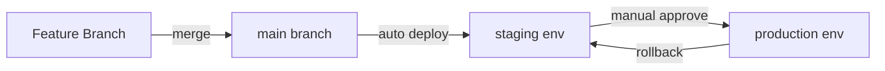
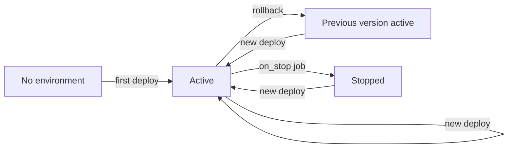
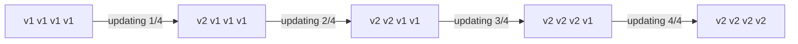
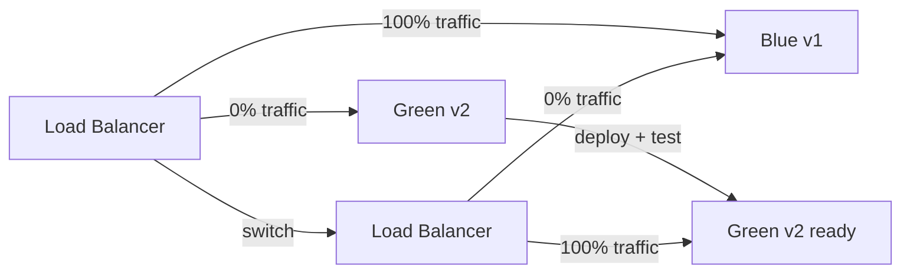
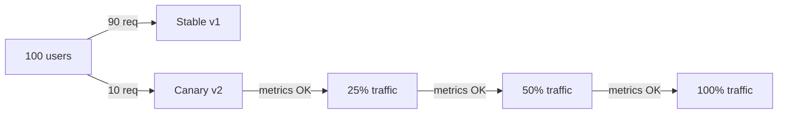
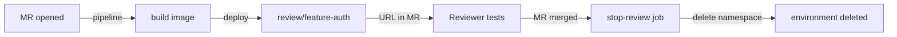

# Level 9: Environments and Deploy

## What is an Environment in CI/CD?

Imagine you're developing a car. Before releasing it on public roads, you put it through several stages:

1. **Testing ground** (dev) — anything can break here, you test hypotheses, accidents are OK
2. **Closed track** (staging) — conditions are as close to real as possible, but no outsiders
3. **Public road** (production) — real people drive here, no errors allowed

In CI/CD, an **environment** is a named deployment target with settings, secrets, and deployment history. GitLab stores the URL, deployment list, current version for each environment, and allows one-click rollback.



---

## Environment in GitLab CI: Basic Syntax

```yaml
deploy-staging:
  stage: deploy
  script:
    - ./deploy.sh staging
  environment:
    name: staging
    url: https://staging.myapp.com
```

What happens on execution:
- GitLab creates (or updates) an environment named `staging`
- A record appears in **Deployments → Environments** with date, commit, and executor
- If `url` is specified — an "Open" button appears in the UI to navigate to the site

### Dynamic Names

For feature branches, it's useful to create environments with a name that includes the branch name:

```yaml
deploy-review:
  stage: deploy
  script:
    - ./deploy.sh review-$CI_COMMIT_REF_SLUG
  environment:
    name: review/$CI_COMMIT_REF_SLUG
    url: https://$CI_COMMIT_REF_SLUG.review.myapp.com
  only:
    - branches
  except:
    - main
```

📌 `CI_COMMIT_REF_SLUG` — the branch name in "slug" format: all characters except a-z, 0-9 replaced with `-`. The branch `feature/user-auth` becomes `feature-user-auth`.

---

## Environment Lifecycle

Each environment goes through states:



### Stopping an Environment: on_stop

For temporary environments (review apps), it's important to be able to remove them. This is done using `on_stop`:

```yaml
deploy-review:
  stage: deploy
  script:
    - kubectl apply -f k8s/review/
  environment:
    name: review/$CI_COMMIT_REF_SLUG
    url: https://$CI_COMMIT_REF_SLUG.review.myapp.com
    on_stop: stop-review    # reference to the "cleaner" job

stop-review:
  stage: deploy
  script:
    - kubectl delete namespace review-$CI_COMMIT_REF_SLUG
  environment:
    name: review/$CI_COMMIT_REF_SLUG
    action: stop           # marks the job as "environment stop"
  when: manual
  variables:
    GIT_STRATEGY: none     # don't clone the repo — branch already deleted
```

✅ GitLab automatically runs `stop-review` when the branch is deleted (if `Auto-stop` is configured in pipeline triggers).

---

## Deploy Strategies

This is the most important part of the level. The choice of strategy determines whether you'll have downtime, how easy it is to roll back, and how many users will be affected by a problem.

### Rolling Deploy — Gradual Update

Application instances are updated one at a time (or in groups). At any moment, some servers run the old version, some — the new one.



**Pros:** no downtime, gradual rollout
**Cons:** two versions run simultaneously — API and DB backward compatibility issues may arise

```yaml
deploy-rolling:
  stage: deploy
  script:
    - |
      for server in $SERVERS; do
        ssh $server "docker pull myapp:$CI_COMMIT_SHA"
        ssh $server "docker stop myapp && docker run -d --name myapp myapp:$CI_COMMIT_SHA"
        sleep 10  # wait for warm-up
        # health check
        curl -f https://$server/health || exit 1
      done
  environment:
    name: production
```

### Blue-Green Deploy — Instant Switch

Two identical environments are maintained: **blue** (current prod) and **green** (new version). After deploy and verification of green — traffic is switched.



**Pros:** instant rollback (switch back to blue), no mixed versions
**Cons:** requires 2x resources, DB migrations are more complex

```yaml
deploy-green:
  stage: deploy
  script:
    - docker tag myapp:$CI_COMMIT_SHA myapp:green
    - docker-compose -f docker-compose.green.yml up -d
    - ./wait-for-healthy.sh green
  environment:
    name: production/green

switch-to-green:
  stage: switch
  script:
    - ./update-nginx.sh green   # change upstream in nginx
    - nginx -s reload
  environment:
    name: production
    url: https://myapp.com
  when: manual                  # manual confirmation before switching
  needs: [deploy-green]
```

### Canary Deploy — Gradual Rollout to Real Users

The new version receives a small percentage of traffic (5-10%). If metrics are normal — the percentage increases.



**Pros:** real-world user testing, minimal risk
**Cons:** more complex to implement, requires monitoring, two versions run simultaneously

```yaml
deploy-canary:
  stage: deploy
  script:
    - kubectl set image deployment/myapp-canary myapp=myapp:$CI_COMMIT_SHA
    - kubectl scale deployment/myapp-canary --replicas=1   # 10% traffic
  environment:
    name: production/canary
  when: manual

promote-canary:
  stage: promote
  script:
    - kubectl set image deployment/myapp myapp=myapp:$CI_COMMIT_SHA
    - kubectl scale deployment/myapp-canary --replicas=0
  environment:
    name: production
  when: manual
  needs: [deploy-canary]
```

---

## Rollback

Fast rollback is not "nice to have" — it's a requirement for any production deploy.

### Rollback via GitLab UI

GitLab stores deployment history for each environment. The "Re-deploy" button in **Environments → Deployments** launches a pipeline with the needed commit.

### Rollback via Pipeline

```yaml
variables:
  APP_IMAGE: myregistry/myapp

deploy:
  stage: deploy
  script:
    - docker pull $APP_IMAGE:$CI_COMMIT_SHA
    - docker tag $APP_IMAGE:$CI_COMMIT_SHA $APP_IMAGE:production
    - ./restart-app.sh
  environment:
    name: production
    url: https://myapp.com

rollback:
  stage: deploy
  script:
    - PREV_TAG=$(docker images $APP_IMAGE --format "{{.Tag}}" | grep -v production | head -2 | tail -1)
    - docker tag $APP_IMAGE:$PREV_TAG $APP_IMAGE:production
    - ./restart-app.sh
  environment:
    name: production
  when: manual
  needs: []   # can run independently
```

### Rollback via Image Tags

Professional approach — store images with multiple tags:

```yaml
build:
  script:
    - docker build -t $APP_IMAGE:$CI_COMMIT_SHA .
    - docker push $APP_IMAGE:$CI_COMMIT_SHA

deploy:
  script:
    # Save previous version before updating
    - docker pull $APP_IMAGE:stable || true
    - docker tag $APP_IMAGE:stable $APP_IMAGE:previous || true
    - docker push $APP_IMAGE:previous || true
    # Deploy the new one
    - docker tag $APP_IMAGE:$CI_COMMIT_SHA $APP_IMAGE:stable
    - docker push $APP_IMAGE:stable
    - ./deploy.sh stable

rollback:
  script:
    - docker pull $APP_IMAGE:previous
    - docker tag $APP_IMAGE:previous $APP_IMAGE:stable
    - docker push $APP_IMAGE:stable
    - ./deploy.sh stable
  when: manual
```

💡 Tag pattern: `sha` (specific commit) → `stable` (current prod) → `previous` (previous prod). Rollback = switch `stable` back to `previous`.

---

## Review Apps — Dynamic Environments for MRs

A Review App is an automatically created environment for each Merge Request. Every developer and reviewer gets a live link to their version of the application.



### Full Review Apps Configuration

```yaml
.review-vars: &review-vars
  KUBE_NAMESPACE: review-$CI_COMMIT_REF_SLUG
  REVIEW_URL: https://$CI_COMMIT_REF_SLUG.review.myapp.com

deploy-review:
  stage: deploy
  variables:
    <<: *review-vars
  script:
    - kubectl create namespace $KUBE_NAMESPACE --dry-run=client -o yaml | kubectl apply -f -
    - envsubst < k8s/review-template.yml | kubectl apply -n $KUBE_NAMESPACE -f -
  environment:
    name: review/$CI_COMMIT_REF_SLUG
    url: $REVIEW_URL
    on_stop: stop-review
    auto_stop_in: 1 week    # auto-delete after a week
  rules:
    - if: '$CI_PIPELINE_SOURCE == "merge_request_event"'

stop-review:
  stage: deploy
  variables:
    <<: *review-vars
    GIT_STRATEGY: none
  script:
    - kubectl delete namespace $KUBE_NAMESPACE --ignore-not-found
  environment:
    name: review/$CI_COMMIT_REF_SLUG
    action: stop
  rules:
    - if: '$CI_PIPELINE_SOURCE == "merge_request_event"'
      when: manual
```

### auto_stop_in — Automatic Deletion

```yaml
environment:
  name: review/$CI_COMMIT_REF_SLUG
  auto_stop_in: 1 day      # one day after last deploy
  auto_stop_in: 1 week     # one week
  auto_stop_in: 30 days    # one month
```

📌 `auto_stop_in` counts from the last deploy, not from environment creation. Each new deploy resets the timer.

---

## Protected Environments

Production environments need protection from accidental deploys.

```yaml
deploy-production:
  stage: deploy
  script:
    - ./deploy.sh production
  environment:
    name: production
    url: https://myapp.com
  rules:
    - if: '$CI_COMMIT_BRANCH == "main"'
      when: manual    # manual only, only from main
  allow_failure: false
```

In the GitLab project settings (Settings → CI/CD → Protected Environments), you can specify which roles can deploy to production. This doesn't replace `when: manual` — it complements it.

---

## Environment Variables in Deployment

Each environment can have its own variables (Settings → CI/CD → Variables):

```yaml
deploy:
  stage: deploy
  script:
    # $DATABASE_URL, $API_KEY — different values for staging and production
    # GitLab substitutes the correct ones based on environment:name
    - echo "Deploying to $CI_ENVIRONMENT_NAME"
    - echo "URL: $CI_ENVIRONMENT_URL"
    - ./deploy.sh --db "$DATABASE_URL" --api-key "$API_KEY"
  environment:
    name: $DEPLOY_ENV     # a variable, allowing job reuse
    url: https://$DEPLOY_ENV.myapp.com
```

Variables tied to an environment in GitLab UI are automatically available only when deploying to that environment — a prod database secret won't leak into a staging pipeline.

---

## Full Pipeline with Environments

Here's what a production-ready pipeline with multiple environments looks like:

```yaml
stages:
  - build
  - test
  - deploy-staging
  - deploy-production

build:
  stage: build
  script:
    - docker build -t $CI_REGISTRY_IMAGE:$CI_COMMIT_SHA .
    - docker push $CI_REGISTRY_IMAGE:$CI_COMMIT_SHA
  artifacts:
    reports:
      dotenv: build.env   # pass IMAGE_TAG to downstream jobs

test:
  stage: test
  needs: [build]
  script:
    - docker run --rm $CI_REGISTRY_IMAGE:$CI_COMMIT_SHA npm test

deploy-staging:
  stage: deploy-staging
  script:
    - docker tag $CI_REGISTRY_IMAGE:$CI_COMMIT_SHA $CI_REGISTRY_IMAGE:staging
    - docker push $CI_REGISTRY_IMAGE:staging
    - ./k8s/deploy.sh staging $CI_COMMIT_SHA
  environment:
    name: staging
    url: https://staging.myapp.com
  rules:
    - if: '$CI_COMMIT_BRANCH == "main"'

deploy-production:
  stage: deploy-production
  script:
    - docker tag $CI_REGISTRY_IMAGE:$CI_COMMIT_SHA $CI_REGISTRY_IMAGE:latest
    - docker push $CI_REGISTRY_IMAGE:latest
    - ./k8s/deploy.sh production $CI_COMMIT_SHA
  environment:
    name: production
    url: https://myapp.com
  rules:
    - if: '$CI_COMMIT_BRANCH == "main"'
      when: manual    # manual confirmation for prod
  needs: [deploy-staging]
```

---

## Common Beginner Mistakes

⚠️ **Mistake 1: Deploying directly to production without staging**

```yaml
# ❌ Pipeline without staging — any error goes straight to prod
deploy:
  script:
    - ./deploy.sh production
  only:
    - main
```

```yaml
# ✅ Staging — mandatory stop before production
deploy-staging:
  script:
    - ./deploy.sh staging
  environment:
    name: staging

deploy-production:
  script:
    - ./deploy.sh production
  environment:
    name: production
  when: manual
  needs: [deploy-staging]
```

⚠️ **Mistake 2: Not specifying `GIT_STRATEGY: none` in stop jobs**

```yaml
# ❌ GitLab tries to clone the deleted branch — job fails
stop-review:
  script:
    - kubectl delete namespace review-$CI_COMMIT_REF_SLUG
  environment:
    action: stop
```

```yaml
# ✅ GIT_STRATEGY: none — don't clone, branch is already gone
stop-review:
  variables:
    GIT_STRATEGY: none
  script:
    - kubectl delete namespace review-$CI_COMMIT_REF_SLUG
  environment:
    action: stop
```

⚠️ **Mistake 3: Rollback without image history**

```yaml
# ❌ No previous tag — nowhere to roll back to
deploy:
  script:
    - docker build -t myapp:latest .
    - docker push myapp:latest
    - deploy myapp:latest
```

```yaml
# ✅ Save previous before deploy
deploy:
  script:
    - docker pull myapp:stable || true
    - docker tag myapp:stable myapp:previous || true
    - docker push myapp:previous || true
    - docker tag myapp:$CI_COMMIT_SHA myapp:stable
    - docker push myapp:stable
    - deploy myapp:stable
```

⚠️ **Mistake 4: Blue-green without automated health checks**

```yaml
# ❌ Switching to green without checking if it works
switch-to-green:
  script:
    - ./update-lb.sh green  # what if green is broken?
```

```yaml
# ✅ Wait for healthy status before switching
switch-to-green:
  script:
    - timeout 60 ./wait-for-healthy.sh green   # max 60 seconds
    - ./update-lb.sh green
    - sleep 30
    - ./smoke-test.sh https://myapp.com        # check after switching
```

---

## Summary

- **Environment** in GitLab — a named deploy target with history, URL, and variables
- **Rolling** — update without downtime, but with temporary version mixing
- **Blue-Green** — instant rollback, but requires 2x resources
- **Canary** — minimal risk via gradual rollout, requires monitoring
- **Review Apps** — automatic environments for each MR, deleted after merge
- **Rollback** — always keep a `previous` image tag or use the button in GitLab UI
- Protect production via `when: manual` and Protected Environments
