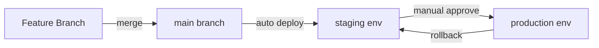
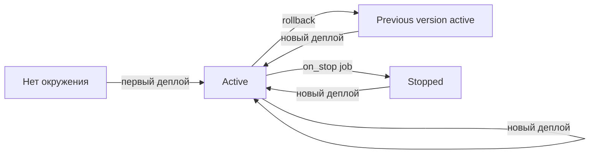
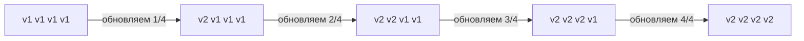
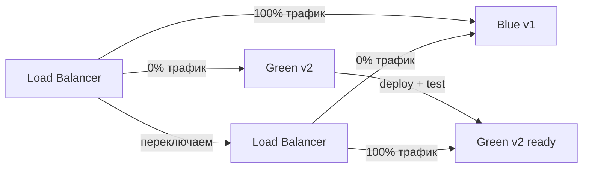
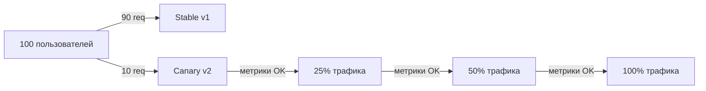
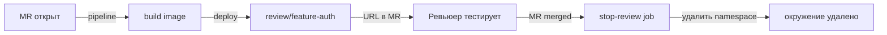

# Уровень 9: Environments и Deploy

## Что такое Environment в CI/CD?

Представь, что ты разрабатываешь автомобиль. Прежде чем выпустить его на дороги общего пользования, ты прогоняешь его через несколько этапов:

1. **Испытательный полигон** (dev) — здесь ломают что угодно, тестируют гипотезы, не боятся аварий
2. **Закрытый трек** (staging) — условия максимально близки к реальным, но посторонних нет
3. **Публичная дорога** (production) — здесь ездят реальные люди, ошибок быть не должно

В CI/CD **environment** — это именованное целевое место деплоя с настройками, секретами и историей развёртываний. GitLab хранит для каждого environment URL, список деплоев, текущую версию и позволяет делать rollback в один клик.



---

## Environment в GitLab CI: базовый синтаксис

```yaml
deploy-staging:
  stage: deploy
  script:
    - ./deploy.sh staging
  environment:
    name: staging
    url: https://staging.myapp.com
```

Что происходит при выполнении:
- GitLab создаёт (или обновляет) environment с именем `staging`
- В разделе **Deployments → Environments** появляется запись с датой, коммитом и исполнителем
- Если указан `url` — в интерфейсе появится кнопка "Open" для перехода на сайт

### Динамические имена

Для feature-веток удобно создавать окружения с именем, включающим имя ветки:

```yaml
deploy-review:
  stage: deploy
  script:
    - ./deploy.sh review-$CI_COMMIT_REF_SLUG
  environment:
    name: review/$CI_COMMIT_REF_SLUG
    url: https://$CI_COMMIT_REF_SLUG.review.myapp.com
  only:
    - branches
  except:
    - main
```

📌 `CI_COMMIT_REF_SLUG` — имя ветки в "slug"-форме: все символы кроме a-z, 0-9, заменены на `-`. Ветка `feature/user-auth` станет `feature-user-auth`.

---

## Жизненный цикл окружений

Каждый environment проходит через состояния:



### Остановка окружения: on_stop

Для временных окружений (review apps) важно уметь их удалять. Для этого используется `on_stop`:

```yaml
deploy-review:
  stage: deploy
  script:
    - kubectl apply -f k8s/review/
  environment:
    name: review/$CI_COMMIT_REF_SLUG
    url: https://$CI_COMMIT_REF_SLUG.review.myapp.com
    on_stop: stop-review    # ссылка на джоб-"уборщик"

stop-review:
  stage: deploy
  script:
    - kubectl delete namespace review-$CI_COMMIT_REF_SLUG
  environment:
    name: review/$CI_COMMIT_REF_SLUG
    action: stop           # помечает джоб как "остановка окружения"
  when: manual
  variables:
    GIT_STRATEGY: none     # не клонировать репо — ветка уже удалена
```

✅ GitLab автоматически запускает `stop-review` при удалении ветки (если настроен `Auto-stop` в pipeline triggers).

---

## Стратегии деплоя

Это самая важная часть уровня. Выбор стратегии определяет, будет ли у тебя downtime, насколько легко откатиться и как много пользователей пострадает при проблеме.

### Rolling Deploy — постепенное обновление

Экземпляры приложения обновляются по одному (или группами). В каждый момент времени часть серверов работает на старой версии, часть — на новой.



**Плюсы:** нет downtime, постепенное распространение  
**Минусы:** одновременно работают две версии — могут быть проблемы с обратной совместимостью API и БД

```yaml
deploy-rolling:
  stage: deploy
  script:
    - |
      for server in $SERVERS; do
        ssh $server "docker pull myapp:$CI_COMMIT_SHA"
        ssh $server "docker stop myapp && docker run -d --name myapp myapp:$CI_COMMIT_SHA"
        sleep 10  # ждём прогрева
        # health check
        curl -f https://$server/health || exit 1
      done
  environment:
    name: production
```

### Blue-Green Deploy — мгновенное переключение

Поддерживаются два идентичных окружения: **blue** (текущий prod) и **green** (новая версия). После деплоя и проверки green — трафик переключается.



**Плюсы:** мгновенный rollback (переключить обратно на blue), нет mixed-версий  
**Минусы:** нужно вдвое больше ресурсов, БД-миграции сложнее

```yaml
deploy-green:
  stage: deploy
  script:
    - docker tag myapp:$CI_COMMIT_SHA myapp:green
    - docker-compose -f docker-compose.green.yml up -d
    - ./wait-for-healthy.sh green
  environment:
    name: production/green

switch-to-green:
  stage: switch
  script:
    - ./update-nginx.sh green   # меняем upstream в nginx
    - nginx -s reload
  environment:
    name: production
    url: https://myapp.com
  when: manual                  # ручное подтверждение перед переключением
  needs: [deploy-green]
```

### Canary Deploy — постепенный выкат на реальных пользователях

Новая версия получает небольшой процент трафика (5-10%). Если метрики в норме — процент увеличивается.



**Плюсы:** реальная проверка на пользователях, минимальный риск  
**Минусы:** сложнее в реализации, нужен мониторинг, работают две версии одновременно

```yaml
deploy-canary:
  stage: deploy
  script:
    - kubectl set image deployment/myapp-canary myapp=myapp:$CI_COMMIT_SHA
    - kubectl scale deployment/myapp-canary --replicas=1   # 10% трафика
  environment:
    name: production/canary
  when: manual

promote-canary:
  stage: promote
  script:
    - kubectl set image deployment/myapp myapp=myapp:$CI_COMMIT_SHA
    - kubectl scale deployment/myapp-canary --replicas=0
  environment:
    name: production
  when: manual
  needs: [deploy-canary]
```

---

## Rollback

Быстрый откат — это не "nice to have", это требование к любому production-деплою.

### Rollback через GitLab UI

GitLab хранит историю деплоев для каждого environment. Кнопка "Re-deploy" в разделе **Environments → Deployments** запускает пайплайн с нужным коммитом.

### Rollback через pipeline

```yaml
variables:
  APP_IMAGE: myregistry/myapp

deploy:
  stage: deploy
  script:
    - docker pull $APP_IMAGE:$CI_COMMIT_SHA
    - docker tag $APP_IMAGE:$CI_COMMIT_SHA $APP_IMAGE:production
    - ./restart-app.sh
  environment:
    name: production
    url: https://myapp.com

rollback:
  stage: deploy
  script:
    - PREV_TAG=$(docker images $APP_IMAGE --format "{{.Tag}}" | grep -v production | head -2 | tail -1)
    - docker tag $APP_IMAGE:$PREV_TAG $APP_IMAGE:production
    - ./restart-app.sh
  environment:
    name: production
  when: manual
  needs: []   # может запускаться независимо
```

### Rollback через теги образов

Профессиональный подход — хранить образы с несколькими тегами:

```yaml
build:
  script:
    - docker build -t $APP_IMAGE:$CI_COMMIT_SHA .
    - docker push $APP_IMAGE:$CI_COMMIT_SHA

deploy:
  script:
    # Сохраняем предыдущую версию перед обновлением
    - docker pull $APP_IMAGE:stable || true
    - docker tag $APP_IMAGE:stable $APP_IMAGE:previous || true
    - docker push $APP_IMAGE:previous || true
    # Деплоим новую
    - docker tag $APP_IMAGE:$CI_COMMIT_SHA $APP_IMAGE:stable
    - docker push $APP_IMAGE:stable
    - ./deploy.sh stable

rollback:
  script:
    - docker pull $APP_IMAGE:previous
    - docker tag $APP_IMAGE:previous $APP_IMAGE:stable
    - docker push $APP_IMAGE:stable
    - ./deploy.sh stable
  when: manual
```

💡 Паттерн тегов: `sha` (конкретный коммит) → `stable` (текущий прод) → `previous` (предыдущий прод). Rollback = переключить `stable` обратно на `previous`.

---

## Review Apps — динамические окружения для MR

Review App — это автоматически создаваемое окружение для каждого Merge Request. Каждый разработчик и ревьюер получает живую ссылку на свою версию приложения.



### Полная конфигурация Review Apps

```yaml
.review-vars: &review-vars
  KUBE_NAMESPACE: review-$CI_COMMIT_REF_SLUG
  REVIEW_URL: https://$CI_COMMIT_REF_SLUG.review.myapp.com

deploy-review:
  stage: deploy
  variables:
    <<: *review-vars
  script:
    - kubectl create namespace $KUBE_NAMESPACE --dry-run=client -o yaml | kubectl apply -f -
    - envsubst < k8s/review-template.yml | kubectl apply -n $KUBE_NAMESPACE -f -
  environment:
    name: review/$CI_COMMIT_REF_SLUG
    url: $REVIEW_URL
    on_stop: stop-review
    auto_stop_in: 1 week    # автоудаление через неделю
  rules:
    - if: '$CI_PIPELINE_SOURCE == "merge_request_event"'

stop-review:
  stage: deploy
  variables:
    <<: *review-vars
    GIT_STRATEGY: none
  script:
    - kubectl delete namespace $KUBE_NAMESPACE --ignore-not-found
  environment:
    name: review/$CI_COMMIT_REF_SLUG
    action: stop
  rules:
    - if: '$CI_PIPELINE_SOURCE == "merge_request_event"'
      when: manual
```

### auto_stop_in — автоматическое удаление

```yaml
environment:
  name: review/$CI_COMMIT_REF_SLUG
  auto_stop_in: 1 day      # через сутки после последнего деплоя
  auto_stop_in: 1 week     # через неделю
  auto_stop_in: 30 days    # через месяц
```

📌 `auto_stop_in` отсчитывается от момента последнего деплоя, не от создания окружения. Каждый новый деплой обновляет таймер.

---

## Protected Environments

Production-окружения нужно защищать от случайных деплоев.

```yaml
deploy-production:
  stage: deploy
  script:
    - ./deploy.sh production
  environment:
    name: production
    url: https://myapp.com
  rules:
    - if: '$CI_COMMIT_BRANCH == "main"'
      when: manual    # только вручную, только из main
  allow_failure: false
```

В настройках GitLab проекта (Settings → CI/CD → Protected Environments) можно указать, какие роли могут деплоить в production. Это не заменяет `when: manual`, а дополняет его.

---

## Переменные окружения в deployment

У каждого environment могут быть свои переменные (Settings → CI/CD → Variables):

```yaml
deploy:
  stage: deploy
  script:
    # $DATABASE_URL, $API_KEY — разные значения для staging и production
    # GitLab подставляет нужные на основе environment:name
    - echo "Deploying to $CI_ENVIRONMENT_NAME"
    - echo "URL: $CI_ENVIRONMENT_URL"
    - ./deploy.sh --db "$DATABASE_URL" --api-key "$API_KEY"
  environment:
    name: $DEPLOY_ENV     # переменная, позволяет переиспользовать джоб
    url: https://$DEPLOY_ENV.myapp.com
```

Переменные, привязанные к environment в GitLab UI, автоматически доступны только при деплое в это окружение — секрет prod-базы не утечёт в staging-пайплайн.

---

## Полный pipeline с environments

Вот как выглядит production-ready пайплайн с несколькими окружениями:

```yaml
stages:
  - build
  - test
  - deploy-staging
  - deploy-production

build:
  stage: build
  script:
    - docker build -t $CI_REGISTRY_IMAGE:$CI_COMMIT_SHA .
    - docker push $CI_REGISTRY_IMAGE:$CI_COMMIT_SHA
  artifacts:
    reports:
      dotenv: build.env   # передаём IMAGE_TAG следующим джобам

test:
  stage: test
  needs: [build]
  script:
    - docker run --rm $CI_REGISTRY_IMAGE:$CI_COMMIT_SHA npm test

deploy-staging:
  stage: deploy-staging
  script:
    - docker tag $CI_REGISTRY_IMAGE:$CI_COMMIT_SHA $CI_REGISTRY_IMAGE:staging
    - docker push $CI_REGISTRY_IMAGE:staging
    - ./k8s/deploy.sh staging $CI_COMMIT_SHA
  environment:
    name: staging
    url: https://staging.myapp.com
  rules:
    - if: '$CI_COMMIT_BRANCH == "main"'

deploy-production:
  stage: deploy-production
  script:
    - docker tag $CI_REGISTRY_IMAGE:$CI_COMMIT_SHA $CI_REGISTRY_IMAGE:latest
    - docker push $CI_REGISTRY_IMAGE:latest
    - ./k8s/deploy.sh production $CI_COMMIT_SHA
  environment:
    name: production
    url: https://myapp.com
  rules:
    - if: '$CI_COMMIT_BRANCH == "main"'
      when: manual    # ручное подтверждение для прода
  needs: [deploy-staging]
```

---

## Частые ошибки новичков

⚠️ **Ошибка 1: Деплой напрямую в production без staging**

```yaml
# ❌ Пайплайн без staging — любая ошибка сразу в prod
deploy:
  script:
    - ./deploy.sh production
  only:
    - main
```

```yaml
# ✅ Staging — обязательная остановка перед production
deploy-staging:
  script:
    - ./deploy.sh staging
  environment:
    name: staging

deploy-production:
  script:
    - ./deploy.sh production
  environment:
    name: production
  when: manual
  needs: [deploy-staging]
```

⚠️ **Ошибка 2: Не указывать `GIT_STRATEGY: none` в stop-джобах**

```yaml
# ❌ GitLab пытается склонировать удалённую ветку — джоб падает
stop-review:
  script:
    - kubectl delete namespace review-$CI_COMMIT_REF_SLUG
  environment:
    action: stop
```

```yaml
# ✅ GIT_STRATEGY: none — не клонируем, ветки уже нет
stop-review:
  variables:
    GIT_STRATEGY: none
  script:
    - kubectl delete namespace review-$CI_COMMIT_REF_SLUG
  environment:
    action: stop
```

⚠️ **Ошибка 3: Rollback без истории образов**

```yaml
# ❌ Нет тега previous — откатиться некуда
deploy:
  script:
    - docker build -t myapp:latest .
    - docker push myapp:latest
    - deploy myapp:latest
```

```yaml
# ✅ Сохраняем previous перед деплоем
deploy:
  script:
    - docker pull myapp:stable || true
    - docker tag myapp:stable myapp:previous || true
    - docker push myapp:previous || true
    - docker tag myapp:$CI_COMMIT_SHA myapp:stable
    - docker push myapp:stable
    - deploy myapp:stable
```

⚠️ **Ошибка 4: Blue-green без автоматической проверки здоровья**

```yaml
# ❌ Сразу переключаемся на green без проверки
switch-to-green:
  script:
    - ./update-lb.sh green  # а вдруг green не работает?
```

```yaml
# ✅ Ждём healthy-статус перед переключением
switch-to-green:
  script:
    - timeout 60 ./wait-for-healthy.sh green   # максимум 60 секунд
    - ./update-lb.sh green
    - sleep 30
    - ./smoke-test.sh https://myapp.com        # проверяем после переключения
```

---

## Итог

- **Environment** в GitLab — это именованное место деплоя с историей, URL и переменными
- **Rolling** — обновление без downtime, но с временным смешиванием версий
- **Blue-Green** — мгновенный rollback, но нужно вдвое больше ресурсов
- **Canary** — минимальный риск через постепенный выкат, требует мониторинга
- **Review Apps** — автоматические окружения для каждого MR, удаляются после merge
- **Rollback** — всегда держи `previous`-тег образа или используй кнопку в GitLab UI
- Защищай production через `when: manual` и Protected Environments
