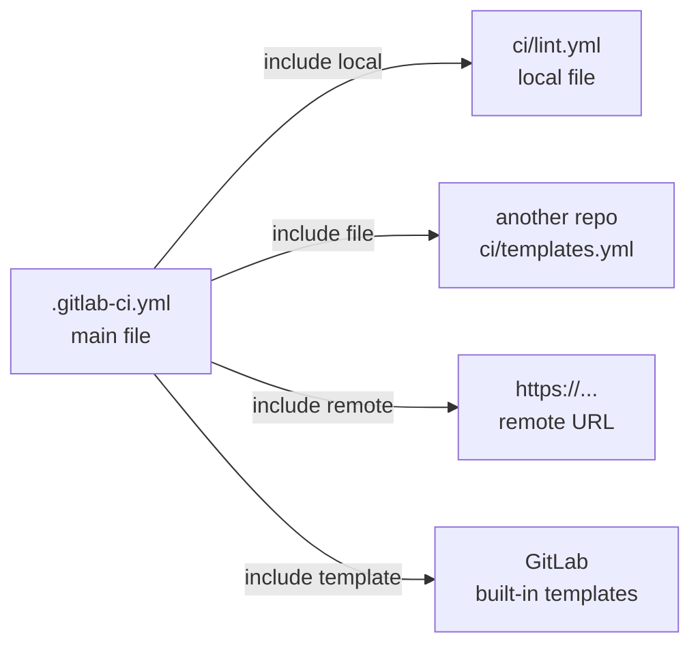
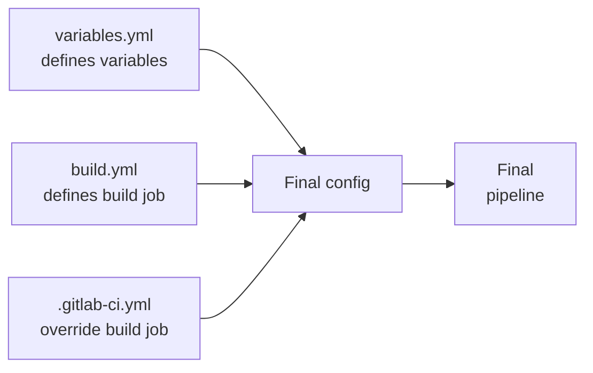
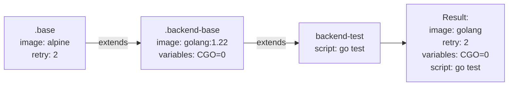
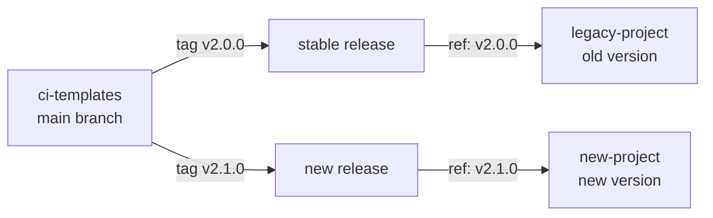

# Level 11: Includes and Templates

## Why Reuse CI Configs?

Imagine you're an architect designing standard apartments. You could draw each apartment plan from scratch — but that's slow and errors will spread across all projects. Much smarter to create a **standard project**: a standard kitchen, standard bathroom, standard wiring. Each apartment connects the modules it needs and adds its own specifics.

In CI/CD it's the same:
- You have 20 microservices — each has the same lint, test, docker build
- Without templates — 20 copies of the same YAML, divergences, technical debt
- With templates — one source of truth, all projects connect what they need

---

## include: Connecting External Configs

`include` allows you to split `.gitlab-ci.yml` into multiple files and connect configs from different sources.



### Four Types of include

#### 1. local — file in the current repository

```yaml
include:
  - local: 'ci/lint.yml'
  - local: 'ci/test.yml'
  - local: 'ci/deploy.yml'
```

💡 Most common type. Good for splitting a large `.gitlab-ci.yml` into logical parts.

#### 2. file — file from another GitLab project

```yaml
include:
  - project: 'company/ci-templates'
    ref: 'v2.1.0'       # tag, branch, or commit SHA
    file: '/templates/nodejs.yml'
  - project: 'company/ci-templates'
    ref: 'v2.1.0'
    file:
      - '/templates/lint.yml'
      - '/templates/security.yml'
```

📌 This is the primary way to create a corporate template library. One `ci-templates` repository — the source of truth for the entire company.

#### 3. remote — file via HTTP/HTTPS URL

```yaml
include:
  - remote: 'https://raw.githubusercontent.com/org/repo/main/ci/template.yml'
```

⚠️ Use with caution: an external URL may become unavailable or change. Better to use `file` from a controlled repository.

#### 4. template — GitLab built-in templates

```yaml
include:
  - template: Auto-DevOps.gitlab-ci.yml
  - template: Security/SAST.gitlab-ci.yml
  - template: Security/Dependency-Scanning.gitlab-ci.yml
  - template: Code-Quality.gitlab-ci.yml
```

✅ Built-in templates are supported by the GitLab team, always up-to-date and tested. For standard tasks (SAST, DAST, code quality) — the first choice.

### Multiple includes in One File

```yaml
include:
  - local: 'ci/variables.yml'
  - project: 'company/ci-templates'
    ref: 'main'
    file: '/jobs/build.yml'
  - template: Security/SAST.gitlab-ci.yml
```

### Merge Order

When GitLab processes `include`, files are **merged** into one config:



📌 **Rule**: if the same field is defined in multiple files — the last definition wins. `.gitlab-ci.yml` is always read last and can override anything.

---

## extends: Job Inheritance

`extends` works like class inheritance in OOP. A base job (template) describes general behavior, specific jobs extend it and add specifics.

```yaml
# Base template (starts with a dot — hidden job)
.base-job:
  image: node:20-alpine
  cache:
    key:
      files:
        - package-lock.json
    paths:
      - node_modules/
  before_script:
    - npm ci

# Specific job inherits the base
lint:
  extends: .base-job
  script:
    - npm run lint

test:
  extends: .base-job
  script:
    - npm test
  artifacts:
    reports:
      junit: junit.xml
```

### How Merging Works

GitLab does a **deep merge** of fields on `extends`:

```yaml
.defaults:
  image: ruby:3.2
  retry: 2
  script:
    - echo "default"
  variables:
    DB_HOST: localhost
    LOG_LEVEL: info

my-job:
  extends: .defaults
  script:
    - echo "my script"  # overrides script completely
  variables:
    DB_HOST: db.prod    # overrides only this key
    # LOG_LEVEL: info   # inherited from .defaults
```

⚠️ **Important**: `script`, `before_script`, `after_script` — are overridden entirely, not merged as lists. Dictionaries (`variables`, `cache`, `artifacts`) — merge key by key.

### Inheritance Chain

```yaml
.base:
  image: alpine
  retry: 2

.backend-base:
  extends: .base
  image: golang:1.22   # overrides image
  variables:
    CGO_ENABLED: '0'

backend-test:
  extends: .backend-base
  script:
    - go test ./...
```



### extends vs anchors (YAML anchors)

GitLab supports YAML anchors (`&` / `*`), but `extends` is significantly better:

```yaml
# ❌ YAML anchor — works but fragile
.job-template: &job-template
  image: node:20
  cache:
    paths:
      - node_modules/

lint:
  <<: *job-template
  script:
    - npm run lint
```

```yaml
# ✅ extends — readable, supports deep merge, visible in CI lint
.node-job:
  image: node:20
  cache:
    paths:
      - node_modules/

lint:
  extends: .node-job
  script:
    - npm run lint
```

| | YAML anchors | extends |
|---|---|---|
| Deep merge of dictionaries | No (shallow) | Yes |
| Works across include | No | Yes |
| Visible in `gitlab-ci lint` | No | Yes |
| Inheritance chain | No | Yes |

---

## !reference: Granular Reuse

`!reference` allows you to take a specific key from another job and insert it into your config. It's more powerful than `extends` when you need to assemble a job from parts of different templates.

```yaml
.setup-db:
  before_script:
    - docker-compose up -d postgres
    - sleep 5

.install-deps:
  before_script:
    - npm ci

integration-test:
  before_script:
    - !reference [.setup-db, before_script]
    - !reference [.install-deps, before_script]
  script:
    - npm run test:integration
```

💡 With `extends` you can only inherit from one parent. `!reference` lets you take `before_script` from one template, `variables` from another — like trait mixins.

### Practical Example: Composition

```yaml
.security-vars:
  variables:
    SCAN_TIMEOUT: '30m'
    SEVERITY_THRESHOLD: HIGH

.docker-setup:
  before_script:
    - docker info
    - echo "$CI_REGISTRY_PASSWORD" | docker login -u "$CI_REGISTRY_USER" --password-stdin $CI_REGISTRY

security-scan:
  variables: !reference [.security-vars, variables]
  before_script: !reference [.docker-setup, before_script]
  script:
    - trivy image $CI_REGISTRY_IMAGE:$CI_COMMIT_SHA
```

---

## Hidden Jobs (Dot Jobs)

Any job starting with `.` (dot) is **hidden** — GitLab doesn't run it as a job, but it's available for `extends` and `!reference`.

```yaml
# This will NOT run as a job in the pipeline
.node-defaults:
  image: node:20-alpine
  cache:
    key:
      files:
        - package-lock.json
    paths:
      - node_modules/
  before_script:
    - npm ci

# This will run
build:
  extends: .node-defaults
  script:
    - npm run build
```

📌 Naming convention:
- `.base-*` — base configs for overriding
- `.tmpl-*` or `.template-*` — explicit templates
- `.rules-*` — reusable rules

---

## Corporate Templates: Architecture

For a company with multiple projects, the correct architecture looks like this:

```mermaid
graph LR
    A[ci-templates repo\nv2.1.0] -->|include file| B[project-alpha\n.gitlab-ci.yml]
    A -->|include file| C[project-beta\n.gitlab-ci.yml]
    A -->|include file| D[project-gamma\n.gitlab-ci.yml]
    A --> E[/templates/nodejs.yml\n/templates/docker.yml\n/templates/deploy.yml]
```

### Template Repository Structure

```
ci-templates/
├── templates/
│   ├── nodejs.yml        # Node.js build and tests
│   ├── python.yml        # Python build and tests
│   ├── docker.yml        # Docker build and push
│   ├── deploy-k8s.yml    # Deploy to Kubernetes
│   └── security.yml      # Security scanning
├── CHANGELOG.md
└── README.md
```

### Example: templates/nodejs.yml

```yaml
# Template file: company/ci-templates/templates/nodejs.yml

.nodejs-install:
  image: node:20-alpine
  cache:
    key:
      files:
        - package-lock.json
    paths:
      - node_modules/
  before_script:
    - npm ci

.nodejs-lint:
  extends: .nodejs-install
  stage: lint
  script:
    - npm run lint

.nodejs-test:
  extends: .nodejs-install
  stage: test
  script:
    - npm test
  artifacts:
    reports:
      junit: junit-results.xml
    when: always
    expire_in: 1 week

.nodejs-build:
  extends: .nodejs-install
  stage: build
  script:
    - npm run build
  artifacts:
    paths:
      - dist/
    expire_in: 1 week
```

### Example: Connecting in a Project

```yaml
# project-alpha/.gitlab-ci.yml

include:
  - project: 'company/ci-templates'
    ref: 'v2.1.0'              # pin the version!
    file: '/templates/nodejs.yml'
  - project: 'company/ci-templates'
    ref: 'v2.1.0'
    file: '/templates/docker.yml'

stages:
  - lint
  - test
  - build
  - deploy

# Use templates directly via extends
lint:
  extends: .nodejs-lint

test:
  extends: .nodejs-test

build:
  extends: .nodejs-build
  variables:
    NODE_ENV: production    # add project specifics

docker-build:
  extends: .docker-build
  variables:
    IMAGE_NAME: 'project-alpha'
```

### Template Versioning



📌 **Always pin the version** via `ref: 'v2.1.0'` (tag), not `ref: 'main'`. Otherwise, template updates could break all project pipelines simultaneously.

---

## include vs Copying YAML

A very common anti-pattern — copying YAML snippets between projects.

```yaml
# ❌ project-alpha/.gitlab-ci.yml — copied from project-beta
build:
  image: node:20-alpine
  cache:
    key:
      files:
        - package-lock.json
    paths:
      - node_modules/
  before_script:
    - npm ci
  script:
    - npm run build
  artifacts:
    paths:
      - dist/
```

After 6 months: in one project the Node version was updated, in another — forgotten. Now you have two `build` jobs that look the same but work differently.

```yaml
# ✅ project-alpha/.gitlab-ci.yml — use a template
include:
  - project: 'company/ci-templates'
    ref: 'v2.1.0'
    file: '/templates/nodejs.yml'

build:
  extends: .nodejs-build    # one source of truth
```

---

## Common Beginner Mistakes

⚠️ **Mistake 1: include without version pinning**

```yaml
# ❌ Next time main updates, all pipelines may break
include:
  - project: 'company/ci-templates'
    ref: 'main'
    file: '/templates/nodejs.yml'
```

```yaml
# ✅ Pin a tag — update consciously
include:
  - project: 'company/ci-templates'
    ref: 'v2.1.0'
    file: '/templates/nodejs.yml'
```

**Why**: with `ref: 'main'`, any push to the template repository immediately affects all projects. This leads to unexpected breakages at inconvenient times.

⚠️ **Mistake 2: Overriding script via extends, expecting append**

```yaml
# ❌ Expectation: .base-job.script + 'npm run extra'
# Reality: script is completely replaced!
.base-job:
  script:
    - npm ci
    - npm run build

my-job:
  extends: .base-job
  script:
    - npm run extra    # npm ci and npm run build are lost!
```

```yaml
# ✅ Use before_script or explicitly duplicate needed commands
.base-job:
  before_script:
    - npm ci

my-job:
  extends: .base-job
  script:
    - npm run build
    - npm run extra    # before_script.npm ci runs before this
```

**Why**: in GitLab, `extends` does deep merge for hashes/dictionaries, but lists (`script`, `before_script`) are overridden entirely.

⚠️ **Mistake 3: Templates without a dot in the name run as jobs**

```yaml
# ❌ 'node-defaults' — this is a real job, it will appear in the pipeline!
node-defaults:
  image: node:20
  cache:
    paths:
      - node_modules/
```

```yaml
# ✅ Dot at the beginning = hidden job, doesn't run
.node-defaults:
  image: node:20
  cache:
    paths:
      - node_modules/
```

**Why**: GitLab will run `node-defaults` as a separate job without script, which immediately fails with an error.

⚠️ **Mistake 4: !reference to a non-existent key**

```yaml
# ❌ .setup has no 'variables' key — pipeline validation error
.setup:
  before_script:
    - docker info

my-job:
  variables: !reference [.setup, variables]  # error!
  script:
    - echo "hello"
```

```yaml
# ✅ Make sure the key exists in the template
.setup:
  before_script:
    - docker info
  variables:
    DOCKER_HOST: tcp://docker:2376

my-job:
  variables: !reference [.setup, variables]
  before_script: !reference [.setup, before_script]
  script:
    - echo "hello"
```

**Why**: `!reference` requires an exact path. If the key is missing, the pipeline won't pass validation.

---

## Summary

- `include: local` — split a large `.gitlab-ci.yml` into logical parts
- `include: file` — foundation of a corporate template library
- `include: template` — GitLab built-in templates for standard tasks (SAST, code quality)
- `extends` — job inheritance, deep merge of dictionaries, list override
- `!reference` — granular reuse of individual keys
- Hidden jobs (`.name`) — templates that don't run
- Pin template versions via tag (`ref: 'v2.1.0'`), not via `main`
