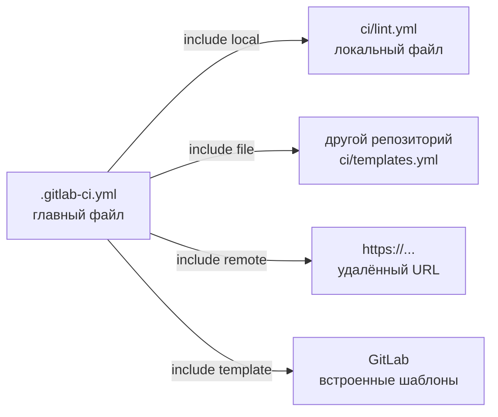
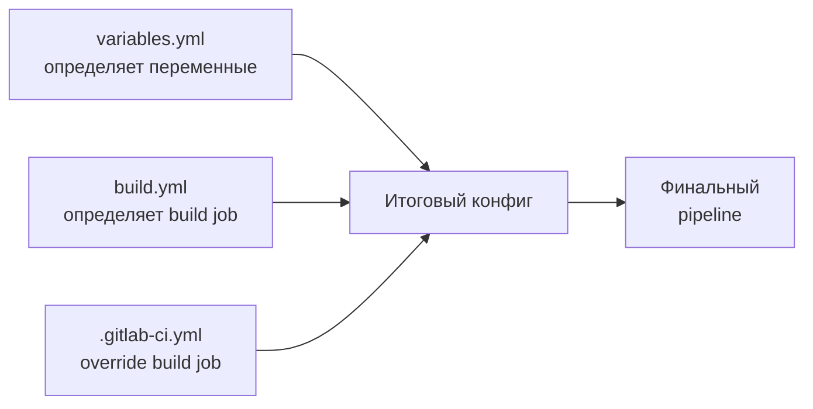
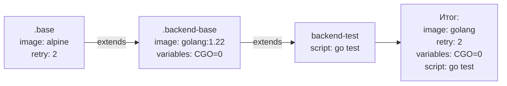
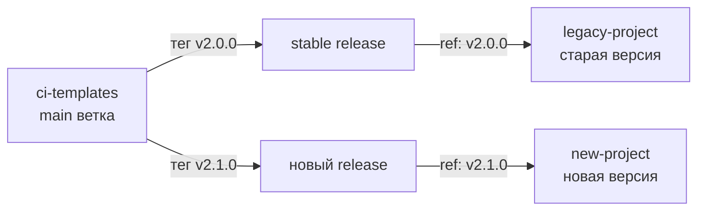

# Уровень 11: Includes и Templates

## Зачем переиспользовать конфиги CI?

Представь, что ты архитектор, который проектирует типовые квартиры. Можно нарисовать план каждой квартиры с нуля — но это долго и ошибки расползутся по всем объектам. Гораздо умнее создать **типовой проект**: стандартная кухня, стандартная ванная, стандартная разводка электрики. Каждая квартира подключает нужные модули и добавляет свою специфику.

В CI/CD то же самое:
- У тебя 20 микросервисов — у каждого одинаковый lint, test, docker build
- Без шаблонов — 20 копий одного и того же YAML, расхождения, технический долг
- С шаблонами — один источник правды, все проекты подключают нужное

---

## include: подключение внешних конфигов

`include` позволяет разбить `.gitlab-ci.yml` на несколько файлов и подключать конфиги из разных источников.



### Четыре типа include

#### 1. local — файл в текущем репозитории

```yaml
include:
  - local: 'ci/lint.yml'
  - local: 'ci/test.yml'
  - local: 'ci/deploy.yml'
```

💡 Наиболее частый тип. Хорошо для разбивки большого `.gitlab-ci.yml` на логические части.

#### 2. file — файл из другого проекта GitLab

```yaml
include:
  - project: 'company/ci-templates'
    ref: 'v2.1.0'       # тег, ветка или commit SHA
    file: '/templates/nodejs.yml'
  - project: 'company/ci-templates'
    ref: 'v2.1.0'
    file:
      - '/templates/lint.yml'
      - '/templates/security.yml'
```

📌 Это основной способ создания корпоративной библиотеки шаблонов. Один репозиторий `ci-templates` — источник правды для всей компании.

#### 3. remote — файл по HTTP/HTTPS URL

```yaml
include:
  - remote: 'https://raw.githubusercontent.com/org/repo/main/ci/template.yml'
```

⚠️ Используй с осторожностью: внешний URL может стать недоступен или измениться. Лучше использовать `file` из контролируемого репозитория.

#### 4. template — встроенные шаблоны GitLab

```yaml
include:
  - template: Auto-DevOps.gitlab-ci.yml
  - template: Security/SAST.gitlab-ci.yml
  - template: Security/Dependency-Scanning.gitlab-ci.yml
  - template: Code-Quality.gitlab-ci.yml
```

✅ Встроенные шаблоны поддерживаются командой GitLab, всегда актуальны и протестированы. Для стандартных задач (SAST, DAST, code quality) — первый выбор.

### Несколько include в одном файле

```yaml
include:
  - local: 'ci/variables.yml'
  - project: 'company/ci-templates'
    ref: 'main'
    file: '/jobs/build.yml'
  - template: Security/SAST.gitlab-ci.yml
```

### Порядок слияния

Когда GitLab обрабатывает `include`, файлы **сливаются** в один конфиг:



📌 **Правило**: если одно и то же поле определено в нескольких файлах — побеждает последнее определение. `.gitlab-ci.yml` всегда читается последним и может переопределить что угодно.

---

## extends: наследование джобов

`extends` работает как наследование классов в ООП. Базовый джоб (шаблон) описывает общее поведение, конкретные джобы его расширяют и добавляют специфику.

```yaml
# Базовый шаблон (начинается с точки — скрытый джоб)
.base-job:
  image: node:20-alpine
  cache:
    key:
      files:
        - package-lock.json
    paths:
      - node_modules/
  before_script:
    - npm ci

# Конкретный джоб наследует базовый
lint:
  extends: .base-job
  script:
    - npm run lint

test:
  extends: .base-job
  script:
    - npm test
  artifacts:
    reports:
      junit: junit.xml
```

### Как происходит слияние

GitLab делает **deep merge** полей при `extends`:

```yaml
.defaults:
  image: ruby:3.2
  retry: 2
  script:
    - echo "default"
  variables:
    DB_HOST: localhost
    LOG_LEVEL: info

my-job:
  extends: .defaults
  script:
    - echo "my script"  # переопределяет script полностью
  variables:
    DB_HOST: db.prod    # переопределяет только этот ключ
    # LOG_LEVEL: info   # наследуется из .defaults
```

⚠️ **Важно**: `script`, `before_script`, `after_script` — переопределяются целиком, не мержатся как списки. Словари (`variables`, `cache`, `artifacts`) — мержатся поключично.

### Цепочка наследования

```yaml
.base:
  image: alpine
  retry: 2

.backend-base:
  extends: .base
  image: golang:1.22   # переопределяет image
  variables:
    CGO_ENABLED: '0'

backend-test:
  extends: .backend-base
  script:
    - go test ./...
```



### extends vs anchors (YAML-якоря)

GitLab поддерживает и YAML-якоря (`&` / `*`), но `extends` значительно лучше:

```yaml
# ❌ YAML-якорь — работает, но хрупко
.job-template: &job-template
  image: node:20
  cache:
    paths:
      - node_modules/

lint:
  <<: *job-template
  script:
    - npm run lint
```

```yaml
# ✅ extends — читаемо, поддерживает deep merge, виден в CI lint
.node-job:
  image: node:20
  cache:
    paths:
      - node_modules/

lint:
  extends: .node-job
  script:
    - npm run lint
```

| | YAML anchors | extends |
|---|---|---|
| Deep merge словарей | Нет (shallow) | Да |
| Работает через include | Нет | Да |
| Виден в `gitlab-ci lint` | Нет | Да |
| Цепочка наследования | Нет | Да |

---

## !reference: точечное переиспользование

`!reference` позволяет взять конкретный ключ из другого джоба и вставить его в свой конфиг. Это мощнее, чем `extends`, когда нужно собрать джоб из частей разных шаблонов.

```yaml
.setup-db:
  before_script:
    - docker-compose up -d postgres
    - sleep 5

.install-deps:
  before_script:
    - npm ci

integration-test:
  before_script:
    - !reference [.setup-db, before_script]
    - !reference [.install-deps, before_script]
  script:
    - npm run test:integration
```

💡 С `extends` можно наследовать только от одного родителя. `!reference` позволяет взять `before_script` из одного шаблона, `variables` из другого — как trait-миксины.

### Практический пример: композиция

```yaml
.security-vars:
  variables:
    SCAN_TIMEOUT: '30m'
    SEVERITY_THRESHOLD: HIGH

.docker-setup:
  before_script:
    - docker info
    - echo "$CI_REGISTRY_PASSWORD" | docker login -u "$CI_REGISTRY_USER" --password-stdin $CI_REGISTRY

security-scan:
  variables: !reference [.security-vars, variables]
  before_script: !reference [.docker-setup, before_script]
  script:
    - trivy image $CI_REGISTRY_IMAGE:$CI_COMMIT_SHA
```

---

## Скрытые джобы (dot jobs)

Любой джоб, начинающийся с `.` (точки), является **скрытым** — GitLab не запускает его как джоб, но он доступен для `extends` и `!reference`.

```yaml
# Это НЕ запустится как джоб в пайплайне
.node-defaults:
  image: node:20-alpine
  cache:
    key:
      files:
        - package-lock.json
    paths:
      - node_modules/
  before_script:
    - npm ci

# Это запустится
build:
  extends: .node-defaults
  script:
    - npm run build
```

📌 Соглашение об именовании:
- `.base-*` — базовые конфиги для переопределения
- `.tmpl-*` или `.template-*` — явные шаблоны
- `.rules-*` — переиспользуемые rules

---

## Корпоративные шаблоны: архитектура

Для компании с несколькими проектами правильная архитектура выглядит так:

```mermaid
graph LR
    A[ci-templates repo\nv2.1.0] -->|include file| B[project-alpha\n.gitlab-ci.yml]
    A -->|include file| C[project-beta\n.gitlab-ci.yml]
    A -->|include file| D[project-gamma\n.gitlab-ci.yml]
    A --> E[/templates/nodejs.yml\n/templates/docker.yml\n/templates/deploy.yml]
```

### Структура репозитория шаблонов

```
ci-templates/
├── templates/
│   ├── nodejs.yml        # Node.js сборка и тесты
│   ├── python.yml        # Python сборка и тесты
│   ├── docker.yml        # Docker build и push
│   ├── deploy-k8s.yml    # Деплой в Kubernetes
│   └── security.yml      # Security scanning
├── CHANGELOG.md
└── README.md
```

### Пример: templates/nodejs.yml

```yaml
# Шаблонный файл: company/ci-templates/templates/nodejs.yml

.nodejs-install:
  image: node:20-alpine
  cache:
    key:
      files:
        - package-lock.json
    paths:
      - node_modules/
  before_script:
    - npm ci

.nodejs-lint:
  extends: .nodejs-install
  stage: lint
  script:
    - npm run lint

.nodejs-test:
  extends: .nodejs-install
  stage: test
  script:
    - npm test
  artifacts:
    reports:
      junit: junit-results.xml
    when: always
    expire_in: 1 week

.nodejs-build:
  extends: .nodejs-install
  stage: build
  script:
    - npm run build
  artifacts:
    paths:
      - dist/
    expire_in: 1 week
```

### Пример: подключение в проекте

```yaml
# project-alpha/.gitlab-ci.yml

include:
  - project: 'company/ci-templates'
    ref: 'v2.1.0'              # фиксируем версию!
    file: '/templates/nodejs.yml'
  - project: 'company/ci-templates'
    ref: 'v2.1.0'
    file: '/templates/docker.yml'

stages:
  - lint
  - test
  - build
  - deploy

# Используем шаблоны напрямую через extends
lint:
  extends: .nodejs-lint

test:
  extends: .nodejs-test

build:
  extends: .nodejs-build
  variables:
    NODE_ENV: production    # добавляем специфику проекта

docker-build:
  extends: .docker-build
  variables:
    IMAGE_NAME: 'project-alpha'
```

### Версионирование шаблонов



📌 **Всегда фиксируй версию** через `ref: 'v2.1.0'` (тег), а не `ref: 'main'`. Иначе обновление шаблонов может сломать пайплайны всех проектов одновременно.

---

## include vs копирование YAML

Очень частый антипаттерн — копировать куски YAML между проектами.

```yaml
# ❌ project-alpha/.gitlab-ci.yml — скопировано из project-beta
build:
  image: node:20-alpine
  cache:
    key:
      files:
        - package-lock.json
    paths:
      - node_modules/
  before_script:
    - npm ci
  script:
    - npm run build
  artifacts:
    paths:
      - dist/
```

Через 6 месяцев: в одном проекте обновили версию Node, в другом — забыли. Теперь у вас два разных `build`, которые выглядят одинаково, но работают по-разному.

```yaml
# ✅ project-alpha/.gitlab-ci.yml — используем шаблон
include:
  - project: 'company/ci-templates'
    ref: 'v2.1.0'
    file: '/templates/nodejs.yml'

build:
  extends: .nodejs-build    # один источник правды
```

---

## Частые ошибки новичков

⚠️ **Ошибка 1: include без фиксации версии**

```yaml
# ❌ При следующем обновлении main могут сломаться все пайплайны
include:
  - project: 'company/ci-templates'
    ref: 'main'
    file: '/templates/nodejs.yml'
```

```yaml
# ✅ Фиксируй тег — обновляй осознанно
include:
  - project: 'company/ci-templates'
    ref: 'v2.1.0'
    file: '/templates/nodejs.yml'
```

**Почему**: при `ref: 'main'` любой push в репозиторий шаблонов немедленно влияет на все проекты. Это неожиданные поломки в неудобный момент.

⚠️ **Ошибка 2: Переопределение script через extends, ожидая append**

```yaml
# ❌ Ожидание: .base-job.script + 'npm run extra'
# Реальность: script полностью заменяется!
.base-job:
  script:
    - npm ci
    - npm run build

my-job:
  extends: .base-job
  script:
    - npm run extra    # npm ci и npm run build потеряны!
```

```yaml
# ✅ Используй before_script или явно дублируй нужные команды
.base-job:
  before_script:
    - npm ci

my-job:
  extends: .base-job
  script:
    - npm run build
    - npm run extra    # before_script.npm ci выполнится до этого
```

**Почему**: в GitLab `extends` делает deep merge для хэшей/словарей, но списки (`script`, `before_script`) переопределяются целиком.

⚠️ **Ошибка 3: Шаблоны без точки в имени запускаются как джобы**

```yaml
# ❌ 'node-defaults' — это реальный джоб, он попадёт в пайплайн!
node-defaults:
  image: node:20
  cache:
    paths:
      - node_modules/
```

```yaml
# ✅ Точка в начале = скрытый джоб, не запускается
.node-defaults:
  image: node:20
  cache:
    paths:
      - node_modules/
```

**Почему**: GitLab запустит `node-defaults` как отдельный джоб без script, который немедленно упадёт с ошибкой.

⚠️ **Ошибка 4: !reference на несуществующий ключ**

```yaml
# ❌ В .setup нет ключа 'variables' — pipeline validation error
.setup:
  before_script:
    - docker info

my-job:
  variables: !reference [.setup, variables]  # ошибка!
  script:
    - echo "hello"
```

```yaml
# ✅ Убедись, что ключ существует в шаблоне
.setup:
  before_script:
    - docker info
  variables:
    DOCKER_HOST: tcp://docker:2376

my-job:
  variables: !reference [.setup, variables]
  before_script: !reference [.setup, before_script]
  script:
    - echo "hello"
```

**Почему**: `!reference` требует точного пути. При отсутствии ключа пайплайн не пройдёт валидацию.

---

## Итог

- `include: local` — разбивай большой `.gitlab-ci.yml` на логические части
- `include: file` — основа корпоративной библиотеки шаблонов
- `include: template` — встроенные шаблоны GitLab для стандартных задач (SAST, code quality)
- `extends` — наследование джобов, deep merge словарей, замена списков
- `!reference` — точечное переиспользование отдельных ключей
- Скрытые джобы (`.name`) — шаблоны, которые не запускаются
- Фиксируй версию шаблонов через тег (`ref: 'v2.1.0'`), не через `main`
