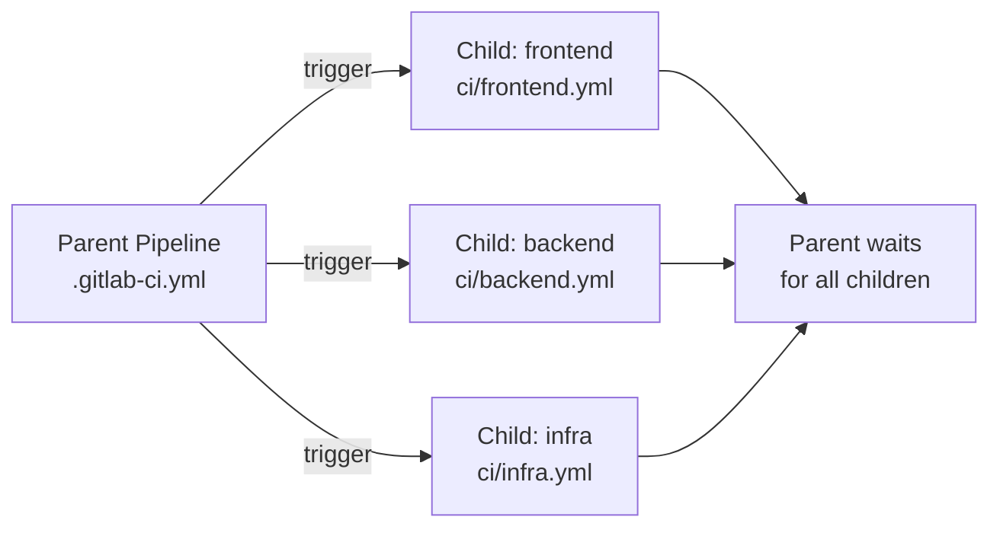
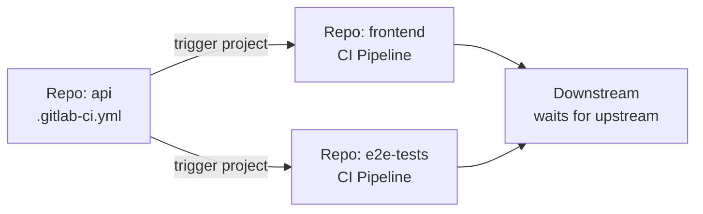
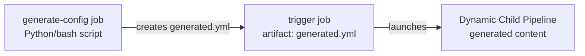
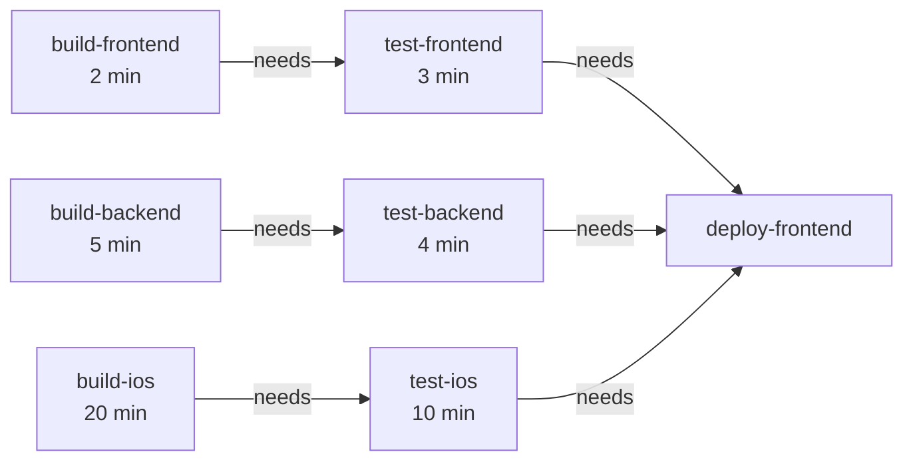
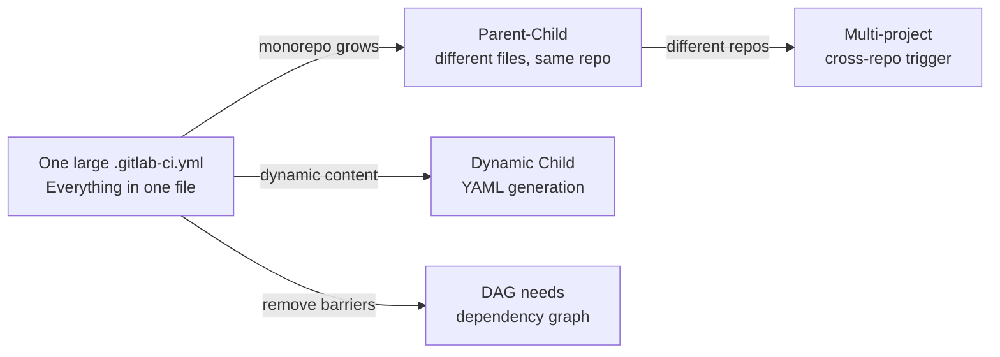

# Level 12: Advanced Pipelines

## What's Wrong with a Regular Pipeline?

Imagine your monorepo contains three independent services: `frontend`, `backend`, `ml-service`. A standard GitLab CI pipeline looks like this:

```
stages: [build, test, deploy]
```

Problem: when only `README.md` in `frontend` is changed, all three services still run. When `ml-service` is changed, frontend waits for its build even though they're unrelated. Pipeline time — 40 minutes instead of a possible 8.

Advanced pipelines solve three classes of problems:
- **Hierarchy**: split one large `.gitlab-ci.yml` into manageable parts
- **Isolation**: run CI only for affected components
- **Parallelism**: remove artificial barriers between stages

---

## Parent-child Pipelines

### Analogy

Imagine a corporation with a head office and subsidiary companies. The head office (parent) decides: "we need an audit". Each subsidiary (child) conducts the audit by its own rules. The head office doesn't know the details — it just waits for the final report.

### How It Works



The parent pipeline launches child pipelines via the `trigger` keyword. Child pipelines live as separate entities in GitLab UI — they have their own history, logs, status.

### Syntax

```yaml
# .gitlab-ci.yml (parent)
stages:
  - triggers

trigger-frontend:
  stage: triggers
  trigger:
    include: ci/frontend.yml    # path to child config
    strategy: depend            # parent waits for child to finish

trigger-backend:
  stage: triggers
  trigger:
    include: ci/backend.yml
    strategy: depend
```

```yaml
# ci/frontend.yml (child)
stages:
  - build
  - test

build-frontend:
  stage: build
  script:
    - cd frontend && npm run build

test-frontend:
  stage: test
  script:
    - cd frontend && npm test
```

📌 `strategy: depend` — key parameter. Without it, the parent considers the job done (not waiting), and the pipeline continues immediately.

### Passing Variables to Child

```yaml
trigger-frontend:
  trigger:
    include: ci/frontend.yml
    strategy: depend
  variables:
    DEPLOY_ENV: production
    BUILD_VERSION: $CI_COMMIT_SHA
```

The child pipeline receives these variables in its jobs alongside standard `$CI_*` variables.

### Conditional Child Launch

```yaml
trigger-frontend:
  trigger:
    include: ci/frontend.yml
    strategy: depend
  rules:
    - changes:
        - frontend/**/*
        - ci/frontend.yml
```

💡 The `trigger` + `rules:changes` combo is the foundation of a smart monorepo: run only what's affected by changes.

---

## Multi-project Pipelines

### When They're Needed

Parent-child pipelines live in **one repository**. If microservices are spread across **different repositories**, you need multi-project pipelines.

### Analogy

A production chain: Factory A produces a component → automatically triggers assembly at Factory B, which uses that component. Different legal entities, different buildings — but the integration is automatic.



### Syntax

```yaml
# In the api repo — triggers a pipeline in another repo
trigger-frontend-tests:
  stage: notify
  trigger:
    project: mygroup/frontend    # full path to the project in GitLab
    branch: main                 # branch (optional)
    strategy: depend
  variables:
    API_VERSION: $CI_COMMIT_TAG
    UPSTREAM_REF: $CI_COMMIT_SHA
```

📌 `project:` accepts the **full namespace**: `group/subgroup/project-name`. This is not a URL, not an SSH link — only a path.

### Accessing Upstream Variables in Downstream

In the downstream pipeline, special variables are automatically available:

```yaml
# In the frontend repo — a job in the downstream pipeline
integration-test:
  script:
    - echo "Triggered by API commit $CI_PIPELINE_TRIGGERED"
    - echo "Upstream ref $CI_PIPELINE_SOURCE"
    # API_VERSION was passed from upstream
    - npm run test:integration -- --api-version=$API_VERSION
```

---

## Dynamic Child Pipelines

### Why

Imagine you need to run tests for each service in the `services/` directory. Today there are 5, tomorrow — 15. Hard-coding each in a static YAML is inconvenient and fragile.

Dynamic child pipelines allow **generating** YAML during pipeline execution.



### Syntax

```yaml
stages:
  - generate
  - trigger

generate-pipeline:
  stage: generate
  image: python:3.11
  script:
    - python scripts/generate_pipeline.py > generated-pipeline.yml
  artifacts:
    paths:
      - generated-pipeline.yml

trigger-dynamic:
  stage: trigger
  trigger:
    include:
      - artifact: generated-pipeline.yml
        job: generate-pipeline       # job that created the artifact
    strategy: depend
```

### Generator Example

```python
# scripts/generate_pipeline.py
import os
import yaml

services = [d for d in os.listdir('services') if os.path.isdir(f'services/{d}')]

jobs = {}
for service in services:
    jobs[f'test-{service}'] = {
        'stage': 'test',
        'script': [f'cd services/{service} && npm test'],
        'rules': [{'changes': [f'services/{service}/**/*']}]
    }

print(yaml.dump({'stages': ['test'], **jobs}))
```

⚠️ The generated YAML must be a valid GitLab CI config. Jobs in the dynamic child can't use `extends` from the parent pipeline — only what's generated.

---

## DAG: Directed Acyclic Graph

### The Problem with Linear Stages

A classic pipeline with stages is a **synchronization barrier**: all jobs in stage N must finish before stage N+1 starts.

```
Stage: build      → Stage: test          → Stage: deploy
build-frontend       test-frontend          deploy-frontend
build-backend        test-backend           deploy-backend
build-ios            test-ios               deploy-ios
```

build-ios takes 20 minutes. Everything else waits. But `test-frontend` could start right after `build-frontend`.

### Solution: needs



With `needs`, the pipeline stops being linear and become a dependency graph. `test-frontend` starts after 2 minutes, not 20.

### Syntax

```yaml
stages:
  - build
  - test
  - deploy

build-frontend:
  stage: build
  script: npm run build:frontend
  artifacts:
    paths: [dist/frontend/]

build-backend:
  stage: build
  script: go build ./...
  artifacts:
    paths: [bin/server]

test-frontend:
  stage: test
  needs:
    - job: build-frontend     # explicit dependency
      artifacts: true         # download artifacts from this job
  script: npm run test:frontend

test-backend:
  stage: test
  needs:
    - job: build-backend
      artifacts: true
  script: go test ./...

deploy:
  stage: deploy
  needs:
    - job: test-frontend
    - job: test-backend
  script: ./deploy.sh
```

### needs vs dependencies

These two keywords solve similar tasks, but differently:

| Keyword | What It Does | Requirements |
|---|---|---|
| `dependencies` | Controls artifact download | Job must be in a previous stage |
| `needs` | Sets execution dependency | Job can be in any stage |

```yaml
# needs allows jumping across stages
test-backend:
  stage: test
  needs:
    - job: build-backend
      artifacts: true    # download artifacts
  # No need to specify dependencies separately — needs: artifacts: true replaces it
```

💡 If `needs` is specified, artifacts are downloaded **only** from the listed jobs (not from the entire previous stage). It's like `dependencies: []` by default, but with explicit exceptions.

### needs: pipeline — Cross-project Dependencies

```yaml
test:
  needs:
    - project: mygroup/api
      job: build-api
      ref: main
      artifacts: true    # download artifacts from another repo
```

---

## Comparing Approaches



| Approach | When to Use |
|---|---|
| **Parent-child** | Monorepo, splitting config into files |
| **Multi-project** | Microservices in different repositories |
| **Dynamic child** | Number of components changes, matrix tasks |
| **DAG (needs)** | Speedup: parallel execution without barriers |

---

## Common Beginner Mistakes

⚠️ **Mistake 1: Forgetting strategy: depend**

```yaml
# ❌ Parent considers trigger-job done immediately after launching child
trigger-backend:
  trigger:
    include: ci/backend.yml
# Next stage in parent starts immediately, not waiting for child!
```

```yaml
# ✅ Parent waits for child pipeline to complete
trigger-backend:
  trigger:
    include: ci/backend.yml
    strategy: depend
```

⚠️ **Mistake 2: needs on a job from a later stage**

```yaml
# ❌ needs cannot reference a job from a later stage
build:
  stage: build
  needs:
    - job: test    # test is in the next stage — not allowed
```

```yaml
# ✅ needs only references jobs from current or previous stages
test:
  stage: test
  needs:
    - job: build   # build is in the previous stage — correct
```

⚠️ **Mistake 3: Dynamic child can't use parent templates**

```yaml
# ❌ In generated-pipeline.yml, can't extends from .gitlab-ci.yml
# In generated-pipeline.yml:
some-job:
  extends: .base-job    # .base-job defined in parent — won't work!
```

```yaml
# ✅ Generate complete jobs without inheriting from parent
# In generated-pipeline.yml:
some-job:
  image: node:20
  script:
    - npm test
```

⚠️ **Mistake 4: Using project: with URL instead of path**

```yaml
# ❌ project accepts a path, not a URL
trigger:
  project: https://gitlab.com/mygroup/frontend   # error!
```

```yaml
# ✅ Only namespace/project-name
trigger:
  project: mygroup/frontend
```

---

## Summary

- **Parent-child** (`trigger: include:`) — splits a monorepo into independent pipelines living in one repo. Combine with `rules:changes` for smart CI.
- **Multi-project** (`trigger: project:`) — launches pipelines in other repositories. Builds dependency chains between microservices.
- **Dynamic child** (`include: artifact:`) — generates YAML on the fly. Use for dynamic number of components or complex matrices.
- **DAG** (`needs:`) — removes barriers between stages, turns the pipeline into a graph. Critical for speed in monorepos.
- `strategy: depend` — always specify with `trigger` if the parent should wait for the result.
