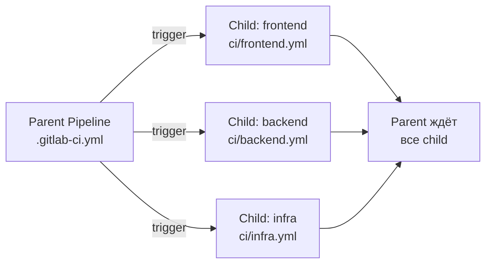
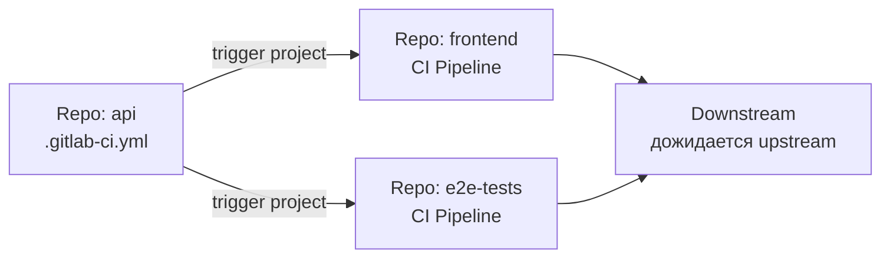
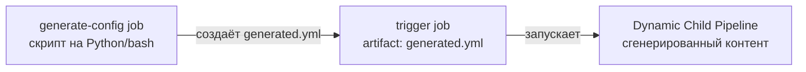
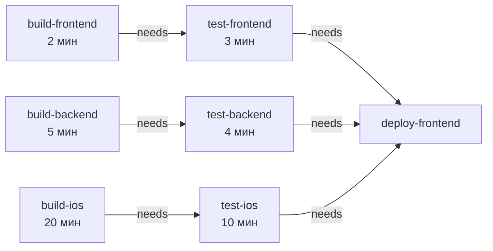
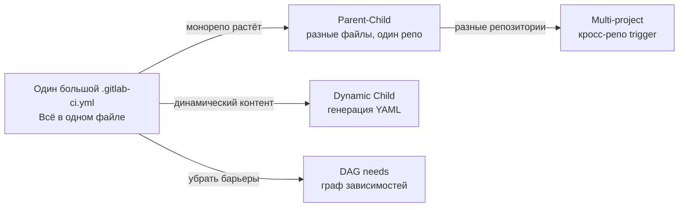

# Уровень 12: Продвинутые пайплайны

## Что не так с обычным пайплайном?

Представь, что твой монорепозиторий содержит три независимых сервиса: `frontend`, `backend`, `ml-service`. Стандартный пайплайн GitLab CI выглядит так:

```
stages: [build, test, deploy]
```

Проблема: при изменении только `README.md` у `frontend` запускаются все три сервиса. При изменении `ml-service` frontend ждёт его сборки, хотя они никак не связаны. Время пайплайна — 40 минут вместо возможных 8.

Продвинутые пайплайны решают три класса проблем:
- **Иерархия**: разбить один большой `.gitlab-ci.yml` на управляемые части
- **Изоляция**: запускать CI только для затронутых компонентов
- **Параллелизм**: убрать искусственные барьеры между стадиями

---

## Parent-child pipelines

### Аналогия

Представь корпорацию с головным офисом и дочерними компаниями. Головной офис (parent) принимает решение: "нужна ревизия". Каждая дочерняя компания (child) проводит ревизию по своим правилам. Головной офис не знает деталей — он просто ждёт финального отчёта.

### Как это работает



Parent pipeline запускает дочерние пайплайны через ключевое слово `trigger`. Дочерние пайплайны живут как отдельные сущности в GitLab UI — у них своя история, логи, статус.

### Синтаксис

```yaml
# .gitlab-ci.yml (parent)
stages:
  - triggers

trigger-frontend:
  stage: triggers
  trigger:
    include: ci/frontend.yml    # путь к дочернему конфигу
    strategy: depend            # parent ждёт завершения child

trigger-backend:
  stage: triggers
  trigger:
    include: ci/backend.yml
    strategy: depend
```

```yaml
# ci/frontend.yml (child)
stages:
  - build
  - test

build-frontend:
  stage: build
  script:
    - cd frontend && npm run build

test-frontend:
  stage: test
  script:
    - cd frontend && npm test
```

📌 `strategy: depend` — ключевой параметр. Без него parent считает джоб запущенным (а не дождавшимся), и пайплайн продолжается немедленно.

### Передача переменных в child

```yaml
trigger-frontend:
  trigger:
    include: ci/frontend.yml
    strategy: depend
  variables:
    DEPLOY_ENV: production
    BUILD_VERSION: $CI_COMMIT_SHA
```

Child pipeline получает эти переменные в своих джобах наравне со стандартными `$CI_*` переменными.

### Условный запуск child

```yaml
trigger-frontend:
  trigger:
    include: ci/frontend.yml
    strategy: depend
  rules:
    - changes:
        - frontend/**/*
        - ci/frontend.yml
```

💡 Связка `trigger` + `rules:changes` — основа умного монорепо: запускаем только то, что затронуто изменениями.

---

## Multi-project pipelines

### Когда нужны

Parent-child pipeline живут в **одном репозитории**. Если микросервисы разложены по **разным репозиториям**, нужны multi-project pipelines.

### Аналогия

Производственная цепочка: завод А производит компонент → автоматически запускает сборку на заводе Б, который этот компонент использует. Разные юридические лица, разные помещения — но интеграция автоматическая.



### Синтаксис

```yaml
# В репозитории api — запускаем пайплайн в другом репо
trigger-frontend-tests:
  stage: notify
  trigger:
    project: mygroup/frontend    # полный путь к проекту в GitLab
    branch: main                 # ветка (опционально)
    strategy: depend
  variables:
    API_VERSION: $CI_COMMIT_TAG
    UPSTREAM_REF: $CI_COMMIT_SHA
```

📌 `project:` принимает **полный namespace**: `group/subgroup/project-name`. Это не URL, не SSH-ссылка — только путь.

### Доступ к upstream переменным в downstream

В downstream pipeline автоматически доступны специальные переменные:

```yaml
# В репозитории frontend — джоб в downstream pipeline
integration-test:
  script:
    - echo "Triggered by API commit $CI_PIPELINE_TRIGGERED"
    - echo "Upstream ref $CI_PIPELINE_SOURCE"
    # API_VERSION передана из upstream
    - npm run test:integration -- --api-version=$API_VERSION
```

---

## Dynamic child pipelines

### Зачем

Представь, что тебе нужно запускать тесты для каждого сервиса в директории `services/`. Сегодня их 5, завтра — 15. Прописывать каждый в статическом YAML — неудобно и хрупко.

Dynamic child pipelines позволяют **генерировать** YAML прямо в процессе выполнения пайплайна.



### Синтаксис

```yaml
stages:
  - generate
  - trigger

generate-pipeline:
  stage: generate
  image: python:3.11
  script:
    - python scripts/generate_pipeline.py > generated-pipeline.yml
  artifacts:
    paths:
      - generated-pipeline.yml

trigger-dynamic:
  stage: trigger
  trigger:
    include:
      - artifact: generated-pipeline.yml
        job: generate-pipeline       # джоб, который создал артефакт
    strategy: depend
```

### Пример генератора

```python
# scripts/generate_pipeline.py
import os
import yaml

services = [d for d in os.listdir('services') if os.path.isdir(f'services/{d}')]

jobs = {}
for service in services:
    jobs[f'test-{service}'] = {
        'stage': 'test',
        'script': [f'cd services/{service} && npm test'],
        'rules': [{'changes': [f'services/{service}/**/*']}]
    }

print(yaml.dump({'stages': ['test'], **jobs}))
```

⚠️ Сгенерированный YAML должен быть валидным GitLab CI конфигом. Джобы в dynamic child не могут использовать `extends` из parent pipeline — только то, что сгенерировано.

---

## DAG: Directed Acyclic Graph

### Проблема линейных stages

Классический пайплайн с stages — это **барьер синхронизации**: все джобы stage N должны завершиться, прежде чем начнётся stage N+1.

```
Stage: build      → Stage: test          → Stage: deploy
build-frontend       test-frontend          deploy-frontend
build-backend        test-backend           deploy-backend
build-ios            test-ios               deploy-ios
```

build-ios занимает 20 минут. Всё остальное ждёт. Хотя `test-frontend` мог бы начаться сразу после `build-frontend`.

### Решение: needs



С `needs` пайплайн перестаёт быть линейным и становится графом зависимостей. `test-frontend` стартует через 2 минуты, не через 20.

### Синтаксис

```yaml
stages:
  - build
  - test
  - deploy

build-frontend:
  stage: build
  script: npm run build:frontend
  artifacts:
    paths: [dist/frontend/]

build-backend:
  stage: build
  script: go build ./...
  artifacts:
    paths: [bin/server]

test-frontend:
  stage: test
  needs:
    - job: build-frontend     # явная зависимость
      artifacts: true         # загружать артефакты этого джоба
  script: npm run test:frontend

test-backend:
  stage: test
  needs:
    - job: build-backend
      artifacts: true
  script: go test ./...

deploy:
  stage: deploy
  needs:
    - job: test-frontend
    - job: test-backend
  script: ./deploy.sh
```

### needs vs dependencies

Эти два ключевых слова решают похожие задачи, но по-разному:

| Ключевое слово | Что делает | Требования |
|---|---|---|
| `dependencies` | Контролирует загрузку артефактов | Джоб должен быть в предыдущей stage |
| `needs` | Устанавливает зависимость выполнения | Джоб может быть в любой stage |

```yaml
# needs позволяет перескочить через stage
test-backend:
  stage: test
  needs:
    - job: build-backend
      artifacts: true    # загрузить артефакты
  # НЕ нужно указывать dependencies отдельно — needs: artifacts: true заменяет это
```

💡 Если указан `needs`, то артефакты загружаются **только** от перечисленных джобов (не от всей предыдущей stage). Это как `dependencies: []` по умолчанию, но с явными исключениями.

### needs: pipeline — межпроектные зависимости

```yaml
test:
  needs:
    - project: mygroup/api
      job: build-api
      ref: main
      artifacts: true    # загрузить артефакты из другого репо
```

---

## Сравнение подходов



| Подход | Когда использовать |
|---|---|
| **Parent-child** | Монорепо, разделение конфига на файлы |
| **Multi-project** | Микросервисы в разных репозиториях |
| **Dynamic child** | Число компонентов меняется, матричные задачи |
| **DAG (needs)** | Ускорение: параллельное выполнение без барьеров |

---

## Частые ошибки новичков

⚠️ **Ошибка 1: Забыть strategy: depend**

```yaml
# ❌ Parent считает trigger-job выполненным сразу после запуска child
trigger-backend:
  trigger:
    include: ci/backend.yml
# Следующий stage в parent стартует немедленно, не дожидаясь child!
```

```yaml
# ✅ Parent ждёт завершения child pipeline
trigger-backend:
  trigger:
    include: ci/backend.yml
    strategy: depend
```

⚠️ **Ошибка 2: needs на джоб из следующей stage**

```yaml
# ❌ needs не может ссылаться на джоб из более поздней stage
build:
  stage: build
  needs:
    - job: test    # test в следующей stage — так нельзя
```

```yaml
# ✅ needs ссылается только на джобы из текущей или предыдущих stages
test:
  stage: test
  needs:
    - job: build   # build в предыдущей stage — правильно
```

⚠️ **Ошибка 3: Dynamic child не может использовать шаблоны parent**

```yaml
# ❌ В generated-pipeline.yml нельзя делать extends из .gitlab-ci.yml
# В generated-pipeline.yml:
some-job:
  extends: .base-job    # .base-job определён в parent — не сработает!
```

```yaml
# ✅ Генерируй полноценные джобы без наследования от parent
# В generated-pipeline.yml:
some-job:
  image: node:20
  script:
    - npm test
```

⚠️ **Ошибка 4: Использовать project: с URL вместо пути**

```yaml
# ❌ project принимает путь, не URL
trigger:
  project: https://gitlab.com/mygroup/frontend   # ошибка!
```

```yaml
# ✅ Только namespace/project-name
trigger:
  project: mygroup/frontend
```

---

## Итог

- **Parent-child** (`trigger: include:`) — делит монорепо на независимые пайплайны, живущие в одном репо. Комбинируй с `rules:changes` для умного CI.
- **Multi-project** (`trigger: project:`) — запускает пайплайны в других репозиториях. Строит цепочки зависимостей между микросервисами.
- **Dynamic child** (`include: artifact:`) — генерирует YAML на лету. Используй для динамического числа компонентов или сложных матриц.
- **DAG** (`needs:`) — убирает барьеры между stages, превращает пайплайн в граф. Критически важен для скорости в монорепо.
- `strategy: depend` — всегда указывай при `trigger`, если parent должен дождаться результата.
