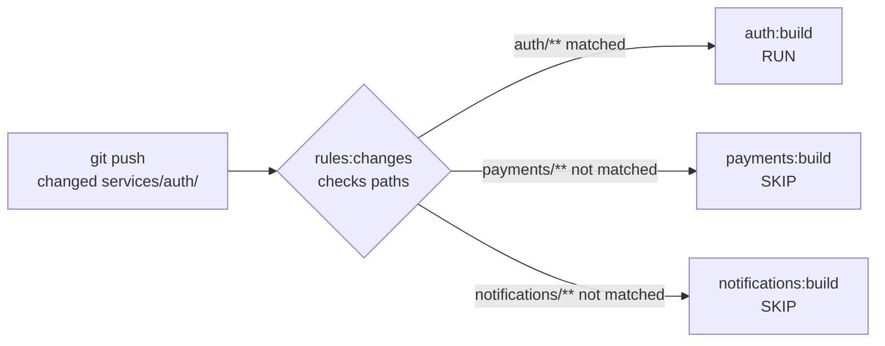
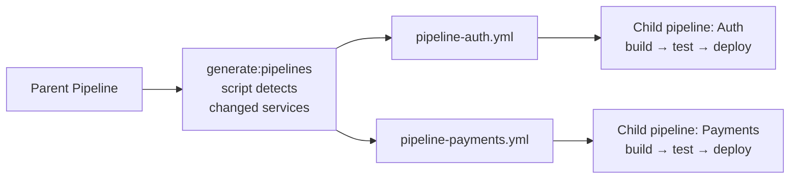
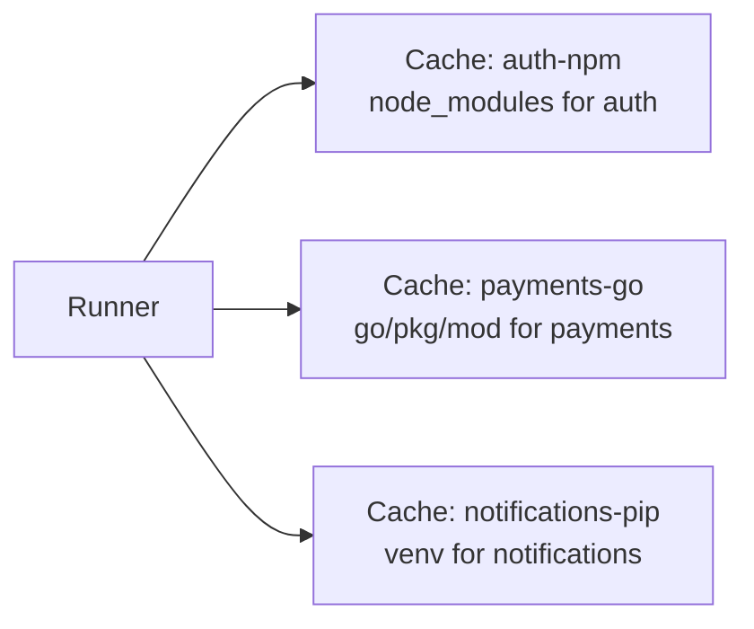
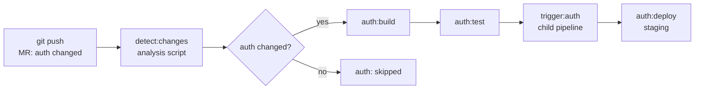

# Level 13: Monorepo CI/CD

## What is a Monorepo and Why Is It Hard for CI/CD?

Imagine a large shopping mall. There are dozens of stores: clothing, electronics, groceries. They're all in one building (one repository), but each has its own schedule, staff, and cash register.

Classic CI/CD approach: if someone sneezes in the electronics store — evacuate the entire mall and check every store. Wasteful and slow.

Smart approach: a sensor system determines exactly which store has the problem and reacts only there. That's Monorepo CI/CD.

**Monorepo** — a repository containing multiple independent services or packages:

```
my-company/
  ├── services/
  │   ├── auth/         # Node.js auth service
  │   ├── payments/     # Go payments service
  │   └── notifications/ # Python notifications service
  ├── packages/
  │   ├── ui-kit/       # Shared component library
  │   └── utils/        # Shared utilities
  └── .gitlab-ci.yml
```

Without smart configuration, every commit will build and test **everything**: auth, payments, and notifications. This can take 30+ minutes even though the developer changed one line in one service.

---

## rules:changes — Run Jobs Only When Needed

### Basic Idea

`rules:changes` lets you specify a list of paths. A job will run **only if** at least one file matching those paths was changed in the pipeline.



### rules:changes Syntax

```yaml
# Simple example: job for the auth service
auth:build:
  stage: build
  script:
    - cd services/auth && docker build -t auth .
  rules:
    - if: $CI_PIPELINE_SOURCE == "merge_request_event"
      changes:
        - services/auth/**/*
        - packages/utils/**/*   # auth depends on utils
```

💡 Key point: `changes` works together with `if`. The job runs only when **both** conditions are met.

### Path Patterns in changes

```yaml
rules:
  - changes:
      - services/auth/**/*        # all files inside services/auth/ (recursive)
      - services/auth/*           # only files in services/auth/ root (not recursive)
      - "**/*.go"                 # any .go files anywhere in the repo
      - packages/utils/src/*.ts   # .ts files in a specific directory
      - docker-compose.yml        # a specific file
      - .gitlab-ci.yml            # if the CI config itself changed
```

📌 `**` means "any number of directories", `*` means "any filename without slashes".

### What Happens If changes Doesn't Match?

By default, the job gets the `skipped` status. It doesn't fail — it's simply skipped in the pipeline.

If you need to change this behavior:

```yaml
auth:build:
  rules:
    - if: $CI_PIPELINE_SOURCE == "merge_request_event"
      changes:
        - services/auth/**/*
    - when: never   # explicitly: in all other cases — don't run
```

### The Default Branch Problem

⚠️ `rules:changes` compares against the previous commit within an MR. On the `main` branch, for the first commit, GitLab compares against an empty tree — **all files are considered "changed"**.

```yaml
auth:build:
  rules:
    # In MR — check changes
    - if: $CI_PIPELINE_SOURCE == "merge_request_event"
      changes:
        - services/auth/**/*
    # On main — always run (protected branch)
    - if: $CI_COMMIT_BRANCH == $CI_DEFAULT_BRANCH
```

### Inter-service Dependencies

The real problem: if `packages/utils` changed, all services that depend on it need to rebuild.

```yaml
.auth-changes: &auth-changes
  changes:
    - services/auth/**/*
    - packages/utils/**/*    # shared dependency
    - packages/ui-kit/**/*   # if auth uses ui-kit

auth:build:
  rules:
    - if: $CI_PIPELINE_SOURCE == "merge_request_event"
      <<: *auth-changes

auth:test:
  needs: [auth:build]
  rules:
    - if: $CI_PIPELINE_SOURCE == "merge_request_event"
      <<: *auth-changes
```

---

## Dynamic Child Pipelines — Generating Pipelines on the Fly

### The Problem with Static Configs

In a large monorepo, a static `.gitlab-ci.yml` quickly becomes a monster: 500+ lines, duplication, hard to maintain. Adding a new service requires editing the CI file.



### How trigger:include Works

```yaml
# Parent pipeline
generate:
  stage: .pre
  script:
    - python3 scripts/generate-pipelines.py
  artifacts:
    paths:
      - generated-pipelines/*.yml

trigger:auth:
  stage: deploy
  needs: [generate]
  trigger:
    include:
      - artifact: generated-pipelines/auth.yml
        job: generate
    strategy: depend   # parent waits for child pipeline
```

### Pipeline Generation Script

```python
# scripts/generate-pipelines.py
import subprocess
import os

# Get list of changed files
result = subprocess.run(
    ['git', 'diff', '--name-only', 'HEAD~1', 'HEAD'],
    capture_output=True, text=True
)
changed_files = result.stdout.strip().split('\n')

# Determine affected services
services = {
    'auth': 'services/auth',
    'payments': 'services/payments',
    'notifications': 'services/notifications',
}

os.makedirs('generated-pipelines', exist_ok=True)

for service, path in services.items():
    affected = any(f.startswith(path) for f in changed_files)

    if affected:
        pipeline = f"""
{service}:build:
  stage: build
  script:
    - cd {path} && docker build -t {service}:$CI_COMMIT_SHA .

{service}:test:
  stage: test
  needs: [{service}:build]
  script:
    - cd {path} && ./run-tests.sh
"""
        with open(f'generated-pipelines/{service}.yml', 'w') as f:
            f.write(pipeline)
```

### Matrix Approach with parallel:matrix

If services are similar, use a matrix:

```yaml
build:service:
  stage: build
  parallel:
    matrix:
      - SERVICE: [auth, payments, notifications]
  script:
    - cd services/$SERVICE && docker build -t $SERVICE:$CI_COMMIT_SHA .
  rules:
    - changes:
        - services/$SERVICE/**/*
```

💡 GitLab automatically creates three jobs: `build:service: [auth]`, `build:service: [payments]`, `build:service: [notifications]`.

### strategy: depend vs strategy: mirror

```yaml
trigger:auth:
  trigger:
    include: generated-pipelines/auth.yml
    strategy: depend   # RECOMMENDED: parent waits and "inherits" child status
    # strategy: mirror  # parent completes immediately with child status
```

📌 `strategy: depend` — the parent pipeline stays "running" until the child pipeline completes. This is important for protected branches — merge won't be allowed until the child pipeline succeeds.

---

## Caching in Monorepos

### The Shared Cache Problem

In a monorepo, multiple services use the same runner. If all jobs write to one cache — conflicts and invalidation occur.

Imagine a shared office fridge: everyone puts their food there without labels. In a week — chaos. Solution: each person has their own shelf with their name.



### Per-service Cache Keys

```yaml
# Cache key = service name + lock file hash
auth:build:
  cache:
    key:
      files:
        - services/auth/package-lock.json
      prefix: auth-npm
    paths:
      - services/auth/node_modules/
    policy: pull-push

payments:build:
  cache:
    key:
      files:
        - services/payments/go.sum
      prefix: payments-go
    paths:
      - .go/pkg/mod/
    policy: pull-push
```

### Cache Policies

```yaml
# Write cache only in build job
build:
  cache:
    key: $CI_COMMIT_REF_SLUG
    policy: pull-push   # read and write

# In test job only read, don't update
test:
  cache:
    key: $CI_COMMIT_REF_SLUG
    policy: pull        # read only

# In deploy job cache not needed
deploy:
  cache: []             # explicitly disable
```

### Cache Key Hierarchy

Good strategy: first look for an exact key, then a fallback.

```yaml
.cache-template:
  cache:
    - key:
        files: [services/auth/package-lock.json]
        prefix: "auth-$CI_COMMIT_REF_SLUG"
      paths: [services/auth/node_modules/]
      policy: pull-push
    # Fallback: if no cache for this branch — take from main
    - key:
        files: [services/auth/package-lock.json]
        prefix: "auth-main"
      paths: [services/auth/node_modules/]
      policy: pull
```

### What to Put in Cache in a Monorepo?

```yaml
# Node.js service
auth:
  cache:
    key:
      files: [services/auth/package-lock.json]
      prefix: auth
    paths:
      - services/auth/node_modules/   # ✅ dependencies
      # DON'T cache:
      # - services/auth/dist/         # ❌ build artifact, not cache
      # - .git/                       # ❌ never cache git

# Go service
payments:
  cache:
    key:
      files: [services/payments/go.sum]
      prefix: payments
    paths:
      - $GOPATH/pkg/mod/   # ✅ Go modules cache
      - .go-build-cache/    # ✅ build cache

# Python service
notifications:
  cache:
    key:
      files: [services/notifications/requirements.txt]
      prefix: notifications
    paths:
      - services/notifications/venv/  # ✅ virtualenv
```

---

## Artifact Optimization in Monorepos

### The Problem: Growing Artifacts

In a monorepo, it's easy to accidentally download all service artifacts into every job. This slows down the pipeline.

```yaml
# ❌ Bad: all jobs download all artifacts
test:auth:
  # Implicitly loads artifacts from ALL previous jobs
  needs: [build:auth, build:payments, build:notifications]
  script: cd services/auth && ./test.sh

# ✅ Good: specify exactly what's needed
test:auth:
  needs:
    - job: build:auth
      artifacts: true   # download only auth artifacts
    - job: build:payments
      artifacts: false  # job needed for execution order, but not its artifacts
  script: cd services/auth && ./test.sh
```

### Global artifacts:exclude

```yaml
build:auth:
  artifacts:
    paths:
      - services/auth/dist/
    exclude:
      - services/auth/dist/**/*.map    # don't need source maps in artifacts
      - services/auth/dist/**/*.test.* # test files not needed
    expire_in: 1 day
```

---

## Complete Monorepo Pipeline Diagram



---

## Key GitLab CI Variables for Monorepos

```yaml
variables:
  # Current branch
  CI_COMMIT_BRANCH: "feature/auth-update"

  # Commit hash — unique tag for Docker images
  CI_COMMIT_SHA: "abc123def456"
  CI_COMMIT_SHORT_SHA: "abc123d"

  # Branch slug (safe for use in cache names/tags)
  CI_COMMIT_REF_SLUG: "feature-auth-update"

  # For image tagging
  IMAGE_TAG: "$CI_REGISTRY_IMAGE/auth:$CI_COMMIT_SHA"
```

---

## Common Mistakes

### ❌ rules:changes without if condition

```yaml
# Problem: without if conditions, "always" is the default
# rules:changes works correctly only in MR pipelines
auth:build:
  rules:
    - changes:
        - services/auth/**/*
# On main branch, first commit — will run everything!
```

```yaml
# ✅ Correct: explicitly specify context
auth:build:
  rules:
    - if: $CI_PIPELINE_SOURCE == "merge_request_event"
      changes:
        - services/auth/**/*
    - if: $CI_COMMIT_BRANCH == $CI_DEFAULT_BRANCH
```

### ❌ One cache key for all services

```yaml
# Problem: auth and payments write to same cache, invalidate each other
all:build:
  cache:
    key: node-modules    # ❌ one name for all
    paths:
      - node_modules/
```

```yaml
# ✅ Correct: unique key for each service
auth:build:
  cache:
    key:
      files: [services/auth/package-lock.json]
      prefix: auth
    paths: [services/auth/node_modules/]

payments:build:
  cache:
    key:
      files: [services/payments/package-lock.json]
      prefix: payments
    paths: [services/payments/node_modules/]
```

### ❌ Not accounting package dependencies

```yaml
# Problem: packages/utils changed, but auth doesn't rebuild
auth:build:
  rules:
    - changes:
        - services/auth/**/*  # ❌ forgot about utils dependency
```

```yaml
# ✅ Correct: add all dependencies
auth:build:
  rules:
    - changes:
        - services/auth/**/*
        - packages/utils/**/*  # ✅ if utils changed — rebuild auth
        - packages/ui-kit/**/* # ✅ if ui-kit changed — also rebuild
```

### ❌ Child pipeline without strategy: depend

```yaml
# Problem: parent pipeline completes immediately,
# MR allows merge before child pipeline finishes
trigger:auth:
  trigger:
    include: generated-pipelines/auth.yml
    # strategy not specified — defaults to "mirror"
```

```yaml
# ✅ Correct: wait for child pipeline to complete
trigger:auth:
  trigger:
    include: generated-pipelines/auth.yml
    strategy: depend  # parent waits for child
```
